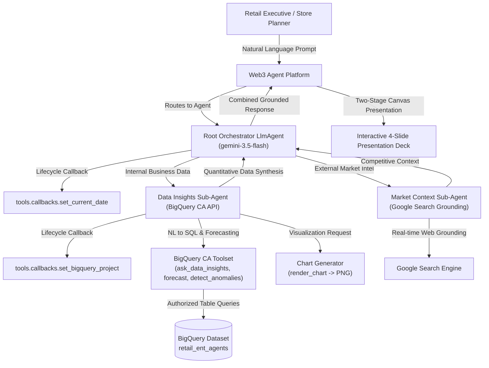
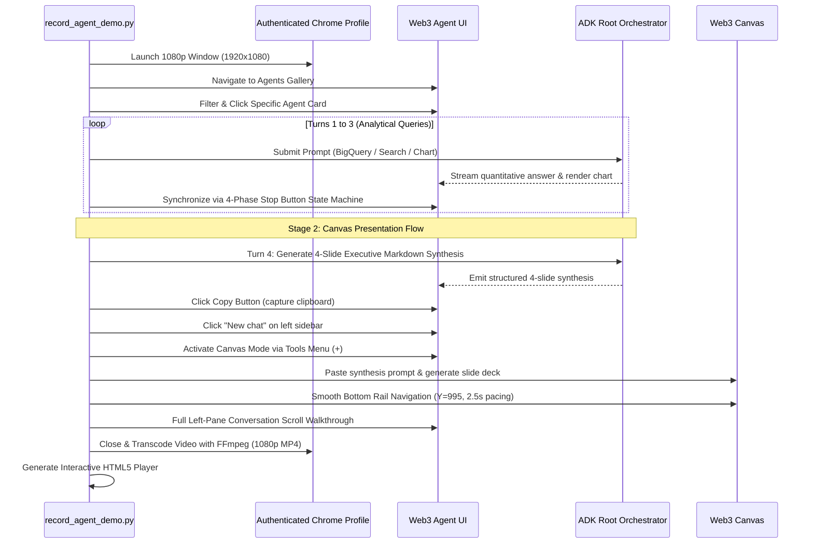

# Retail Enterprise Agents: Platform Architecture (`ARCHITECTURE.md`)

> **Automated Codebase Graph & Architecture Reference**  
> Generated via `graphify` · **725 Nodes** · **711 Edges** across 9 Strategic Retail Domains.

---

## 1. System Overview & Core Philosophy

The **Retail Enterprise Agents** platform is an enterprise-grade AI assistant ecosystem built with the **Google Agent Development Kit (ADK)** for **Web3 Enterprise Intelligence**. It provides retail executives, category managers, store directors, and supply chain analysts with autonomous, natural-language business intelligence grounded in **Google BigQuery data** and **Google Search market intelligence**.



---

## 2. 9 Strategic Domains Footprint Matrix (100 Agents)

All 100 enterprise agents are registered in `_shared/table_registry.yaml` and organized across 9 strategic retail operational domains:

| Domain | Domain ID | Agents Count | Tables Count | Core Domain Scope |
| :--- | :---: | :---: | :---: | :--- |
| **Merchandising** | `merc` | 14 | 56 | Assortment breadth/depth, price matching, clearance markdown depth, vendor rebate allowances, space elasticity, private brand penetration. |
| **Supply Chain & Logistics** | `spch` | 14 | 56 | Vendor OTIF delivery, inventory safety stock, DC throughput, cold chain temperature compliance, inbound freight $/CWT, last mile dispatch. |
| **Store Operations** | `stop` | 11 | 44 | Labor productivity vs. foot traffic, BOPIS curbside SLAs, loss prevention & shrink root causes, planogram visual compliance, till balancing. |
| **E-Commerce & Digital** | `ecom` | 11 | 44 | Cart abandonment funnels, product discovery search conversion, payment gateway fraud, 3P marketplace seller SLAs, web performance vitals. |
| **Marketing & Retail Media** | `mktg` | 10 | 40 | Paid campaign ROAS, CLV & RFM loyalty tiers, Retail Media Network (RMN) sponsored ad yield, customer churn triggers, creator ROI. |
| **Finance, Real Estate & Accounting** | `finc` | 11 | 44 | Four-wall store EBITDA P&L, gross margin bridge, Cash Conversion Cycle (CCC), lease occupancy cost ratios, inventory LCM provisions. |
| **Customer Care & Experience** | `care` | 10 | 40 | Contact center First Contact Resolution (FCR), WISMO order delivery tracking, NLP voice-of-customer sentiment, warranty claims. |
| **Human Resources & Workforce** | `hrwm` | 9 | 36 | Associate turnover & retention, predictive fair scheduling, safety OSHA compliance, store leadership succession bench, eNPS pulse. |
| **Sustainability, ESG & Compliance** | `esgc` | 10 | 40 | Scope 1-3 greenhouse gas emissions, food waste diversion %, sustainable packaging circularity, supplier diversity spend. |
| **TOTALS** | **9 Domains** | **100 Agents** | **400+ Tables** | **Full Enterprise Retail Lifecycle Coverage** |

---

## 3. Logical Agent Topology & Component Contracts

Each agent under `domains/<domain>/agents/<agent_name>/` follows a standardized, modular ADK component shape:

```
domains/<domain>/agents/<agent_name>/
├── README.md                   # Agent overview, why it matters, KPI tables, and verified Q&A showcase
├── root_agent.yaml            # Root orchestrator LlmAgent (gemini-3.5-flash)
├── sub_agents/
│   ├── data_insights.yaml     # BigQuery Conversational Analytics sub-agent
│   └── market_context.yaml    # Google Search grounding sub-agent
├── tools/
│   ├── __init__.py
│   ├── bigquery_ca.py         # Factory: create_toolset(args) -> BigQueryToolset
│   ├── chart_generator.py     # render_chart(query, title) -> PNG chart artifact
│   └── callbacks.py           # Lifecycle hooks: set_current_date, set_bigquery_project
├── data/
│   ├── <table_1>.csv          # Seed BigQuery dataset 1
│   └── <table_2>.csv          # Seed BigQuery dataset 2
├── eval/
│   └── agent.evalset.json     # Semantic eval questions and golden assertions
├── tests/
│   ├── unit/                  # Mocked unit tests (test_callbacks, test_bigquery_ca, test_chart_generator)
│   └── integration/           # End-to-end integration tests hitting live dev BigQuery
└── deployment/
    ├── dev-example.yaml       # Dev configuration template
    └── prod-example.yaml      # Production deployment template
```

### Dynamic Callback Injection Architecture
1. **`tools.callbacks.set_current_date`**:
   - Injects `session.state['temp:current_date']` before every agent turn.
   - Grounding instructions reference `{temp:current_date}` so the LLM dynamically resolves relative dates (*"last month"*, *"Q2 2026"*, *"this week"*) against the true system date rather than guessing.
2. **`tools.callbacks.set_bigquery_project`**:
   - Reads `BIGQUERY_PROJECT_ID` from environment variables and sets `session.state['temp:bq_project_id']`.
   - Table whitelist references in `data_insights.yaml` use `{temp:bq_project_id}.retail_ent_agents.<table_name>`, guaranteeing zero hardcoded GCP project IDs in source control.

---

## 4. Shared Tooling & Scaffolding Pipeline (`_shared/`)

The infrastructure under `_shared/` provides domain-agnostic automation for code generation, data loading, IAM policy provisioning, and automated video recording:

```mermaid
graph TD
    subgraph ScaffoldingPipeline ["1. Scaffolding & Agent Factory"]
        Fragments["_shared/instructions/*.md<br/>• persona_retail_analyst.md<br/>• safety_and_grounding_rules.md<br/>• output_formatting.md"]
        Template["_shared/templates/logical_agent/<br/>• root_agent.yaml<br/>• sub_agents/*.yaml<br/>• tools/*.py<br/>• tests/ & eval/"]
        ScaffoldScript["scaffold_logical_agent.py"]
        
        Fragments -->|Stitched at scaffold-time| ScaffoldScript
        Template -->|Token substitution| ScaffoldScript
        ScaffoldScript -->|Outputs| GeneratedAgent["domains/&lt;domain&gt;/agents/&lt;name&gt;/"]
    end

    subgraph DataPipeline ["2. BigQuery Ingestion & IAM"]
        Registry["_shared/table_registry.yaml<br/>• 9 Domains<br/>• 100 Agents<br/>• 398 Tables"]
        DataLoader["load_agent_data.py"]
        IAMGranter["grant_table_access.py"]
        SeedCSVs["data/*.csv"]
        
        Registry -->|Namespace prefixing: domain_id_agent_id_*| DataLoader
        SeedCSVs --> DataLoader
        DataLoader -->|Loads to| BigQuery[("BigQuery Dataset<br/>retail_ent_agents")]
        Registry --> IAMGranter
        IAMGranter -->|Grants dataViewer IAM| BigQuery
    end

    subgraph VideoDemoPipeline ["3. Demo Automation & Publishing Engine"]
        AgentReadme["domains/.../README.md"]
        PromptParser["prompt_parser.py"]
        DemoRecorder["record_agent_demo.py<br/>(Playwright Engine)"]
        HtmlGen["generate_demo_html.py"]
        
        AgentReadme -->|Extracts 3 Curated Prompts| PromptParser
        PromptParser --> DemoRecorder
        DemoRecorder -->|1080p Video + Canvas Flow| WebM["Raw WebM Stream"]
        WebM -->|FFmpeg libx264| MP4["demos/.../&lt;name&gt;.mp4"]
        DemoRecorder -->|Triggers| HtmlGen
        HtmlGen -->|Generates Player| HTML["demos/.../&lt;name&gt;.html"]
    end
```



### Shared Scripts & Components Reference

| Script / Component | Lines | Role & Key Functions | Inputs & Outputs |
| :--- | :---: | :--- | :--- |
| **`scaffold_logical_agent.py`** | 110 | **Deterministic Agent Factory**: Stitches instructions and substitutes tokens (`__DOMAIN__`, `__LOGICAL_AGENT__`, `__DISPLAY_NAME__`). | **In:** `_shared/templates/` & `_shared/instructions/`<br/>**Out:** `domains/<domain>/agents/<name>/` |
| **`load_agent_data.py`** | 132 | **BigQuery Ingestor**: Loads seed CSVs into `retail_ent_agents` applying standard `<domain_id>_<agent_id>_<stem>` prefixing. | **In:** `_shared/table_registry.yaml`, `data/*.csv`<br/>**Out:** BigQuery physical tables |
| **`grant_table_access.py`** | 61 | **Least-Privilege IAM Provisioner**: Configures table-level `roles/bigquery.dataViewer` permissions strictly for the agent's service account. | **In:** Table names & SA email<br/>**Out:** BigQuery IAM Policy |
| **`prompt_parser.py`** | 67 | **Prompt Extraction Utility**: Dynamically extracts verified smoke test prompts directly from agent `README.md` files. | **In:** Agent `README.md`<br/>**Out:** 3 structured prompt strings |
| **`record_agent_demo.py`** | 787 | **Automated Playwright + Canvas Engine**: Drives Chrome sessions through the full Two-Stage Canvas Presentation Flow, and encodes 1080p MP4s via FFmpeg. | **In:** Agent Name & Gemini Enterprise URL<br/>**Out:** `.mp4` video asset |
| **`generate_demo_html.py`** | 431 | **HTML5 Showcase Generator**: Builds responsive GitHub Pages players with dark-mode styling, video player, and prompt copy buttons. | **In:** Video path & agent metadata<br/>**Out:** `.html` player file |

---

## 5. BigQuery Data Namespace & Isolation Model

All 100 agents share a single BigQuery dataset (`retail_ent_agents`), preventing project clutter while enforcing strict table namespace isolation:

Physical Table Name = <domain_id>_<agent_id>_<logical_stem>

- **Example**:
  - Domain: `merchandising` (`merc`)
  - Agent: `pricing_promotions` (`prpm`)
  - Logical Table: `price_history`
  - $\rightarrow$ Physical BigQuery Table: `merc_prpm_price_history`

### Security & IAM Principle
Each deployed agent Reasoning Engine operates under a dedicated Service Account (`<agent-name>-dev@<project-id>.iam.gserviceaccount.com`) granted `roles/bigquery.dataViewer` **only on its own prefixed tables**. No agent has cross-table read access to another agent's data.

---

## 6. Two-Stage Canvas Demo Recording Flow

Demo videos and interactive web players are generated through a headless Playwright + FFmpeg pipeline:



---

## 7. Graph Query Reference (Python / SQLite)

The generated graph database is stored locally at `graphify-out/graph.sqlite`. You can query the repository graph directly with Python:

```python
import sqlite3

conn = sqlite3.connect("graphify-out/graph.sqlite")

# 1. Query total agent counts per retail domain
for row in conn.execute("SELECT domain, COUNT(*) FROM nodes WHERE type = 'Agent' GROUP BY domain ORDER BY COUNT(*) DESC"):
    print(f"{row[0]}: {row[1]} agents")

# 2. Find all BigQuery tables associated with Store Operations
for row in conn.execute("SELECT name FROM nodes WHERE type = 'BigQueryTable' AND domain = 'store_operations'"):
    print(row[0])

# 3. Trace all sub-agents, tools, and demos for an agent
for row in conn.execute("SELECT source_id, relation_type, target_id FROM edges WHERE source_id LIKE '%labor_productivity%'"):
    print(f"{row[0]} --[{row[1]}]--> {row[2]}")
```
