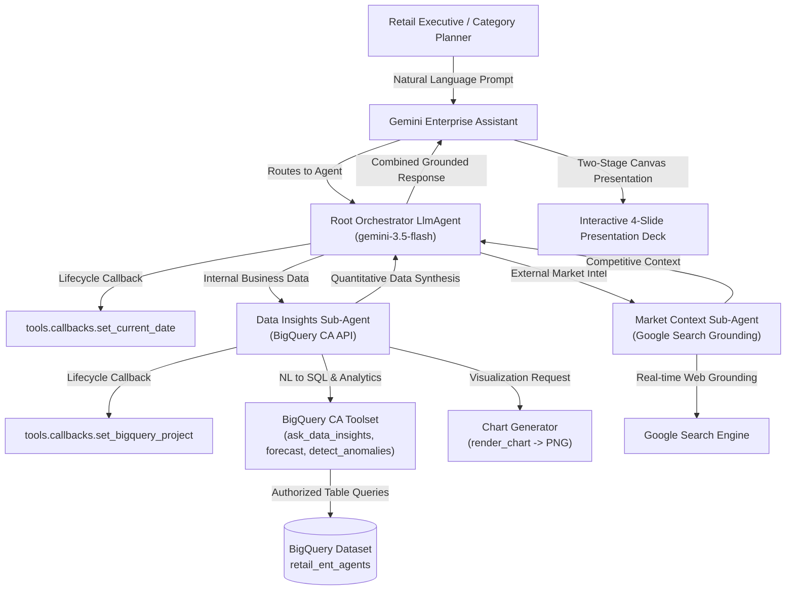

# Retail Enterprise Agents

Google Agent Development Kit (ADK) agents for Gemini Enterprise, organized by retail domain.
Each agent answers business questions by querying BigQuery through the Conversational Analytics
API, supplemented by Google Search grounding for external market context — defined declaratively
in YAML rather than as hand-written orchestration code.

This README covers what the repo is, why it's built the way it is, and how to work in it. The
full architecture rationale (including the decisions this document only summarizes) lives in a
local-only design spec — see [Architecture](#architecture).

---

## What's Built

> 💡 **Tip**: Click on any retail domain accordion below to collapse/expand its deployed agent roster, links, and KPI focus.

<details open>
<summary><b>🛍️ Merchandising (14 of 14 Agents Deployed)</b></summary>
<br/>

> **Domain Scope**: Assortment planning, pricing elasticity, promotional cadence, markdowns, vendor rebates, competitor intel, space planning, private brand, seasonal transitions, category strategy, size/pack optimization, SKU lifecycle, trade spend, and localized assortment.

| No. | Gemini Enterprise Agent | Demo | Focus of Agent |
| :--- | :--- | :---: | :--- |
| 1 | [Assortment Planning](domains/merchandising/agents/assortment_planning/README.md) | <a href="https://rajanm.github.io/retail-enterprise-agents/demos/gemini-enterprise/merchandising/assortment_planning.html" target="_blank" rel="noopener noreferrer">🎬 Demo</a> | Product mix, category/SKU performance, assortment width vs. plan |
| 2 | [Pricing & Promotions](domains/merchandising/agents/pricing_promotions/README.md) | <a href="https://rajanm.github.io/retail-enterprise-agents/demos/gemini-enterprise/merchandising/pricing_promotions.html" target="_blank" rel="noopener noreferrer">🎬 Demo</a> | Price elasticity, promo effectiveness, markdown cadence |
| 3 | [Sell-Through & Inventory Health](domains/merchandising/agents/sell_through_inventory_health/README.md) | <a href="https://rajanm.github.io/retail-enterprise-agents/demos/gemini-enterprise/merchandising/sell_through_inventory_health.html" target="_blank" rel="noopener noreferrer">🎬 Demo</a> | Store-level sell-through rates, stock turn, aging inventory breakdown, weeks of supply, markdown triggers |
| 4 | [Vendor Negotiation & Rebates](domains/merchandising/agents/vendor_negotiation_rebates/README.md) | <a href="https://rajanm.github.io/retail-enterprise-agents/demos/gemini-enterprise/merchandising/vendor_negotiation_rebates.html" target="_blank" rel="noopener noreferrer">🎬 Demo</a> | Volume rebate agreement thresholds, YTD spend rebate tier progress, co-op marketing fund commitments/claims, vendor payment terms, net rebate realization % |
| 5 | [Markdown & Clearance Optimization](domains/merchandising/agents/markdown_clearance_optimization/README.md) | <a href="https://rajanm.github.io/retail-enterprise-agents/demos/gemini-enterprise/merchandising/markdown_clearance_optimization.html" target="_blank" rel="noopener noreferrer">🎬 Demo</a> | End-of-season clearance discount depth, clearance sell-through %, markdown budget spend, salvage recovery |
| 6 | [Price Matching & Competitor Intel](domains/merchandising/agents/price_matching_competitor_intel/README.md) | <a href="https://rajanm.github.io/retail-enterprise-agents/demos/gemini-enterprise/merchandising/price_matching_competitor_intel.html" target="_blank" rel="noopener noreferrer">🎬 Demo</a> | Competitor price gap %, market price index parity (100 baseline), POS price match claims, competitor stock alerts |
| 7 | [Space Planning & Micro-Merchandising](domains/merchandising/agents/space_planning_micro_merch/README.md) | <a href="https://rajanm.github.io/retail-enterprise-agents/demos/gemini-enterprise/merchandising/space_planning_micro_merch.html" target="_blank" rel="noopener noreferrer">🎬 Demo</a> | Linear shelf space elasticity, planogram compliance %, fixture capacity utilization, eye-level shelf share |
| 8 | [Private Brand Development](domains/merchandising/agents/private_brand_development/README.md) | <a href="https://rajanm.github.io/retail-enterprise-agents/demos/gemini-enterprise/merchandising/private_brand_development.html" target="_blank" rel="noopener noreferrer">🎬 Demo</a> | Private label volume penetration %, gross margin premium over national brands (bps), co-packer COGS variance |
| 9 | [Seasonal Transition Planning](domains/merchandising/agents/seasonal_transition_planning/README.md) | <a href="https://rajanm.github.io/retail-enterprise-agents/demos/gemini-enterprise/merchandising/seasonal_transition_planning.html" target="_blank" rel="noopener noreferrer">🎬 Demo</a> | Planned sell-in vs actual sell-through curves, transition milestone adherence, weather demand indexing, salvage risk |
| 10 | [Category Growth Strategy](domains/merchandising/agents/category_growth_strategy/README.md) | <a href="https://rajanm.github.io/retail-enterprise-agents/demos/gemini-enterprise/merchandising/category_growth_strategy.html" target="_blank" rel="noopener noreferrer">🎬 Demo</a> | Chain market share vs TAM, YoY share change (bps), category roles (Destination/Routine), whitespace growth opportunities |
| 11 | [Size & Case Pack Optimization](domains/merchandising/agents/size_pack_optimization/README.md) | <a href="https://rajanm.github.io/retail-enterprise-agents/demos/gemini-enterprise/merchandising/size_pack_optimization.html" target="_blank" rel="noopener noreferrer">🎬 Demo</a> | Broken size run stockouts %, regional body size curve skews, master case pack replenishment multiple alignment |
| 12 | [Item Lifecycle & SKU Rationalization](domains/merchandising/agents/item_lifecycle_rationalization/README.md) | <a href="https://rajanm.github.io/retail-enterprise-agents/demos/gemini-enterprise/merchandising/item_lifecycle_rationalization.html" target="_blank" rel="noopener noreferrer">🎬 Demo</a> | New item launch velocity curves (wks 1-12), SKU cannibalization rates %, tail delisting triggers, liquidation recovery |
| 13 | [Trade Spend & Allowance Effectiveness](domains/merchandising/agents/trade_spend_effectiveness/README.md) | <a href="https://rajanm.github.io/retail-enterprise-agents/demos/gemini-enterprise/merchandising/trade_spend_effectiveness.html" target="_blank" rel="noopener noreferrer">🎬 Demo</a> | Vendor trade promotion net ROI (%), POS scan allowance audit variances, incremental volume lift %, cannibalization costs |
| 14 | [Localized Assortment Clustering](domains/merchandising/agents/localized_curation_clustering/README.md) | <a href="https://rajanm.github.io/retail-enterprise-agents/demos/gemini-enterprise/merchandising/localized_curation_clustering.html" target="_blank" rel="noopener noreferrer">🎬 Demo</a> | Demographic store clustering, local artisan vendor revenue share %, regional taste affinity index, cluster assortment rules |

</details>

<details open>
<summary><b>🚚 Supply Chain & Logistics (14 of 14 Agents Deployed)</b></summary>
<br/>

> **Domain Scope**: Vendor OTIF delivery, inventory planning & forecasting, carrier freight performance, DC throughput & dock turn, returns & reverse logistics, inbound freight, last-mile routing, cold chain compliance, dynamic safety stock, supplier disruption risk, cross-dock scheduling, customs/tariffs, DC robotics, and sustainable packaging optimization.

| No. | Gemini Enterprise Agent | Demo | Focus of Agent |
| :--- | :--- | :---: | :--- |
| 1 | [Vendor Performance](domains/supply_chain/agents/vendor_performance/README.md) | <a href="https://rajanm.github.io/retail-enterprise-agents/demos/gemini-enterprise/supply_chain/vendor_performance.html" target="_blank" rel="noopener noreferrer">🎬 Demo</a> | OTIF delivery, vendor scorecards |
| 2 | [Inventory Planning](domains/supply_chain/agents/inventory_planning/README.md) | <a href="https://rajanm.github.io/retail-enterprise-agents/demos/gemini-enterprise/supply_chain/inventory_planning.html" target="_blank" rel="noopener noreferrer">🎬 Demo</a> | Network-wide inventory position across stores and warehouses, live demand forecasting |
| 3 | [Logistics Operations](domains/supply_chain/agents/logistics_operations/README.md) | <a href="https://rajanm.github.io/retail-enterprise-agents/demos/gemini-enterprise/supply_chain/logistics_operations.html" target="_blank" rel="noopener noreferrer">🎬 Demo</a> | Carrier performance, transit lane performance, shipment tracking, logistics exceptions |
| 4 | [Warehouse & DC Operations](domains/supply_chain/agents/warehouse_dc_operations/README.md) | <a href="https://rajanm.github.io/retail-enterprise-agents/demos/gemini-enterprise/supply_chain/warehouse_dc_operations.html" target="_blank" rel="noopener noreferrer">🎬 Demo</a> | Daily DC inbound/outbound shipment throughput, dock turn times, dock-to-stock hours, pick/pack accuracy %, storage pallet capacity utilization |
| 5 | [Returns & Reverse Logistics](domains/supply_chain/agents/returns_reverse_logistics/README.md) | <a href="https://rajanm.github.io/retail-enterprise-agents/demos/gemini-enterprise/supply_chain/returns_reverse_logistics.html" target="_blank" rel="noopener noreferrer">🎬 Demo</a> | Store/channel return rates (%), return reason breakdowns, restock turnaround days, reverse disposition value recovery |
| 6 | [Inbound Freight Optimization](domains/supply_chain/agents/inbound_freight_optimization/README.md) | <a href="https://rajanm.github.io/retail-enterprise-agents/demos/gemini-enterprise/supply_chain/inbound_freight_optimization.html" target="_blank" rel="noopener noreferrer">🎬 Demo</a> | Inbound freight cost per hundredweight ($/CWT), ocean container dwell days, demurrage penalty avoidance, inbound on-time transit rate |
| 7 | [Last-Mile Delivery & Dispatch](domains/supply_chain/agents/last_mile_delivery_dispatch/README.md) | <a href="https://rajanm.github.io/retail-enterprise-agents/demos/gemini-enterprise/supply_chain/last_mile_delivery_dispatch.html" target="_blank" rel="noopener noreferrer">🎬 Demo</a> | Cost per delivery drop ($), 2-hour delivery window SLA adherence %, route stop density (stops/hr), fleet telematics efficiency index |
| 8 | [Cold Chain Temperature Compliance](domains/supply_chain/agents/cold_chain_temperature_compliance/README.md) | <a href="https://rajanm.github.io/retail-enterprise-agents/demos/gemini-enterprise/supply_chain/cold_chain_temperature_compliance.html" target="_blank" rel="noopener noreferrer">🎬 Demo</a> | Reefer temperature excursion rate (%), perishable spoilage dollar losses, remaining shelf life (RSL) at DC receipt, IoT cold sensor uptime |
| 9 | [Multi-Echelon Safety Stock](domains/supply_chain/agents/multi_echelon_safety_stock/README.md) | <a href="https://rajanm.github.io/retail-enterprise-agents/demos/gemini-enterprise/supply_chain/multi_echelon_safety_stock.html" target="_blank" rel="noopener noreferrer">🎬 Demo</a> | Network inventory holding costs, multi-echelon order fulfillment SLA %, lead time volatility buffer days, DC vs store stock balancing ratio |
| 10 | [Supplier Risk & Resilience](domains/supply_chain/agents/supplier_risk_resilience/README.md) | <a href="https://rajanm.github.io/retail-enterprise-agents/demos/gemini-enterprise/supply_chain/supplier_risk_resilience.html" target="_blank" rel="noopener noreferrer">🎬 Demo</a> | High-risk supplier spend share (%), single-source dependency purchase spend, Altman Z-Score financial solvency ratings, disruption buffer coverage |
| 11 | [Cross-Dock & Flow-Through Velocity](domains/supply_chain/agents/cross_dock_flow_through/README.md) | <a href="https://rajanm.github.io/retail-enterprise-agents/demos/gemini-enterprise/supply_chain/cross_dock_flow_through.html" target="_blank" rel="noopener noreferrer">🎬 Demo</a> | Trailer-to-trailer cross-dock dwell turn time (<4 hrs), pre-distribution direct store allocation accuracy %, yard staging dwell congestion |
| 12 | [Customs & Import Tariff Compliance](domains/supply_chain/agents/customs_import_tariff_compliance/README.md) | <a href="https://rajanm.github.io/retail-enterprise-agents/demos/gemini-enterprise/supply_chain/customs_import_tariff_compliance.html" target="_blank" rel="noopener noreferrer">🎬 Demo</a> | HTS classification audit accuracy %, average CBP customs inspection hold hours, duty drawback recovery $, Section 301 effective tariff rate % |
| 13 | [DC Automation & Robotics KPIs](domains/supply_chain/agents/dc_automation_robotics_kpis/README.md) | <a href="https://rajanm.github.io/retail-enterprise-agents/demos/gemini-enterprise/supply_chain/dc_automation_robotics_kpis.html" target="_blank" rel="noopener noreferrer">🎬 Demo</a> | ASRS crane & AMR system uptime %, robotic picking units per hour (UPH) vs manual baseline, MTBF hours, automated sortation error rate |
| 14 | [Packaging & Dunnage Optimization](domains/supply_chain/agents/packaging_dunnage_optimization/README.md) | <a href="https://rajanm.github.io/retail-enterprise-agents/demos/gemini-enterprise/supply_chain/packaging_dunnage_optimization.html" target="_blank" rel="noopener noreferrer">🎬 Demo</a> | Master carton cube utilization %, carrier dimensional weight (DIM) surcharge penalties $, parcel packaging damage rate %, void-fill material costs |

</details>

<details open>
<summary><b>🏬 Store Operations (11 of 11 Agents Deployed)</b></summary>
<br/>

> **Domain Scope**: Associate labor productivity vs. foot traffic, BOPIS omnichannel fulfillment, store shrink & loss prevention, planogram visual compliance, facility energy audits, POS queue bottlenecks, register till cash reconciliations, in-store returns desk velocity, workplace safety incidents, curbside pickup SLAs, and store manager audit execution.

| No. | Gemini Enterprise Agent | Demo | Focus of Agent |
| :--- | :--- | :---: | :--- |
| 1 | [Labor Productivity](domains/store_operations/agents/labor_productivity/README.md) | <a href="https://rajanm.github.io/retail-enterprise-agents/demos/gemini-enterprise/store_operations/labor_productivity.html" target="_blank" rel="noopener noreferrer">🎬 Demo</a> | Staffing alignment vs. foot traffic, overtime variance, labor cost budgets |
| 2 | [Store Fulfillment & Execution](domains/store_operations/agents/store_fulfillment_execution/README.md) | <a href="https://rajanm.github.io/retail-enterprise-agents/demos/gemini-enterprise/store_operations/store_fulfillment_execution.html" target="_blank" rel="noopener noreferrer">🎬 Demo</a> | BOPIS fulfillment SLAs, curbside pickup wait times, pick/pack accuracy %, fulfillment queue bottlenecks |
| 3 | [Loss Prevention & Shrinkage](domains/store_operations/agents/loss_prevention_shrinkage/README.md) | <a href="https://rajanm.github.io/retail-enterprise-agents/demos/gemini-enterprise/store_operations/loss_prevention_shrinkage.html" target="_blank" rel="noopener noreferrer">🎬 Demo</a> | Monthly store shrinkage rates (%), shrink dollars by cause (theft, damage, admin error, unknown loss), high-risk category losses, register audit exception alerts |
| 4 | [Planogram & Visual Merchandising Compliance](domains/store_operations/agents/visual_merchandising_compliance/README.md) | <a href="https://rajanm.github.io/retail-enterprise-agents/demos/gemini-enterprise/store_operations/visual_merchandising_compliance.html" target="_blank" rel="noopener noreferrer">🎬 Demo</a> | Planogram compliance score %, promotional signage installation speed, endcap display audit pass %, fixture space utilization |
| 5 | [Store Energy & Facilities Maintenance](domains/store_operations/agents/energy_facilities_maintenance/README.md) | <a href="https://rajanm.github.io/retail-enterprise-agents/demos/gemini-enterprise/store_operations/energy_facilities_maintenance.html" target="_blank" rel="noopener noreferrer">🎬 Demo</a> | Electricity intensity (kWh/sq.ft), refrigeration temperature excursion alarms, HVAC work order MTTR, facility maintenance budget variance |
| 6 | [POS & Checkout Queue Analytics](domains/store_operations/agents/pos_checkout_queue_analytics/README.md) | <a href="https://rajanm.github.io/retail-enterprise-agents/demos/gemini-enterprise/store_operations/pos_checkout_queue_analytics.html" target="_blank" rel="noopener noreferrer">🎬 Demo</a> | Peak checkout queue wait time (sec), self-checkout (SCO) intervention rate %, cashier scan speed (items/min - IPM), lane throughput |
| 7 | [Store Cash Management & Till Balancing](domains/store_operations/agents/store_cash_management_tills/README.md) | <a href="https://rajanm.github.io/retail-enterprise-agents/demos/gemini-enterprise/store_operations/store_cash_management_tills.html" target="_blank" rel="noopener noreferrer">🎬 Demo</a> | Cash drawer over/short discrepancy $, cashier cash variance frequency %, armored car deposit reconciliation, counterfeit bill alerts |
| 8 | [In-Store Omnichannel Returns & BORIS](domains/store_operations/agents/omnichannel_returns_in_store/README.md) | <a href="https://rajanm.github.io/retail-enterprise-agents/demos/gemini-enterprise/store_operations/omnichannel_returns_in_store.html" target="_blank" rel="noopener noreferrer">🎬 Demo</a> | BORIS handling time (mins), same-day shelf restock %, return fraud risk flags, return-to-salvage liquidation recovery rate |
| 9 | [Store Safety & Incident Management](domains/store_operations/agents/store_safety_incident_management/README.md) | <a href="https://rajanm.github.io/retail-enterprise-agents/demos/gemini-enterprise/store_operations/store_safety_incident_management.html" target="_blank" rel="noopener noreferrer">🎬 Demo</a> | Customer slip/fall incident frequency, OSHA recordables, hazard correction closure speed (hours), general liability claim dollars |
| 10 | [Curbside Pickup Speed & Accuracy](domains/store_operations/agents/curbside_pickup_speed_accuracy/README.md) | <a href="https://rajanm.github.io/retail-enterprise-agents/demos/gemini-enterprise/store_operations/curbside_pickup_speed_accuracy.html" target="_blank" rel="noopener noreferrer">🎬 Demo</a> | Arrival-to-trunk delivery dwell time (<3 mins), order substitution approval %, runner dispatch transit time, parking bay turnover |
| 11 | [Store Manager Operational Audits](domains/store_operations/agents/store_manager_operational_audit/README.md) | <a href="https://rajanm.github.io/retail-enterprise-agents/demos/gemini-enterprise/store_operations/store_manager_operational_audit.html" target="_blank" rel="noopener noreferrer">🎬 Demo</a> | 360 operational audit score %, backroom safety/clutter index, shelf price tag scan accuracy %, public health inspection compliance |

</details>

<details open>
<summary><b>🛒 E-Commerce & Digital (11 of 11 Agents Deployed)</b></summary>
<br/>

> **Domain Scope**: Digital funnel & cart abandonment, site search merchandising & zero-results, payment gateway fraud, 3P marketplace seller SLAs, mobile app vitals, web performance/Core Web Vitals, PDP conversion optimization, subscription recurring churn, promotional coupon abuse, B2B wholesale ordering, and SEO/accessibility audits.

| No. | Gemini Enterprise Agent | Demo | Focus of Agent |
| :--- | :--- | :---: | :--- |
| 1 | [Cart & Checkout Analytics](domains/e_commerce/agents/cart_checkout_analytics/README.md) | <a href="https://rajanm.github.io/retail-enterprise-agents/demos/gemini-enterprise/e_commerce/cart_checkout_analytics.html" target="_blank" rel="noopener noreferrer">🎬 Demo</a> | Digital funnel conversion rates, checkout stage cart abandonment %, payment gateway decline rates, promo validation errors |
| 2 | [Product Discovery & Analytics](domains/e_commerce/agents/search_merchandising_personalization/README.md) | <a href="https://rajanm.github.io/retail-enterprise-agents/demos/gemini-enterprise/e_commerce/search_merchandising_personalization.html" target="_blank" rel="noopener noreferrer">🎬 Demo</a> | Digital funnel site search conversion %, zero-result query rates, recommendation carousel CTR %, personalized revenue lift |
| 3 | [Payment Gateway & Fraud Risk](domains/e_commerce/agents/payment_gateway_fraud_risk/README.md) | <a href="https://rajanm.github.io/retail-enterprise-agents/demos/gemini-enterprise/e_commerce/payment_gateway_fraud_risk.html" target="_blank" rel="noopener noreferrer">🎬 Demo</a> | Payment gateway authorization rates %, chargeback dispute win rates, 3D Secure friction drop-offs, fraud scoring false positives |
| 4 | [3P Marketplace Seller Performance](domains/e_commerce/agents/marketplace_seller_performance/README.md) | <a href="https://rajanm.github.io/retail-enterprise-agents/demos/gemini-enterprise/e_commerce/marketplace_seller_performance.html" target="_blank" rel="noopener noreferrer">🎬 Demo</a> | Marketplace 3P seller defect rates (target <1%), commission net revenues, catalog sync latency, seller fulfillment SLAs |
| 5 | [Mobile App Conversion & Engagement](domains/e_commerce/agents/mobile_app_conversion_retention/README.md) | <a href="https://rajanm.github.io/retail-enterprise-agents/demos/gemini-enterprise/e_commerce/mobile_app_conversion_retention.html" target="_blank" rel="noopener noreferrer">🎬 Demo</a> | Native mobile app DAU/MAU, push notification conversion rates, in-app crash-free session metrics (99.9%) |
| 6 | [Digital Web Performance & Vitals](domains/e_commerce/agents/digital_site_performance_vitals/README.md) | <a href="https://rajanm.github.io/retail-enterprise-agents/demos/gemini-enterprise/e_commerce/digital_site_performance_vitals.html" target="_blank" rel="noopener noreferrer">🎬 Demo</a> | Core Web Vitals (LCP, INP, CLS), page speed impact on bounce rate, CDN cache hit ratios, API 5xx error spikes |
| 7 | [PDP Optimization & Media Engagement](domains/e_commerce/agents/product_detail_page_optimization/README.md) | <a href="https://rajanm.github.io/retail-enterprise-agents/demos/gemini-enterprise/e_commerce/product_detail_page_optimization.html" target="_blank" rel="noopener noreferrer">🎬 Demo</a> | Product detail page (PDP) add-to-cart rates, rich media/video interactions, size-guide usage, customer review sentiment |
| 8 | [Subscription & Recurring Orders](domains/e_commerce/agents/subscription_recurring_orders/README.md) | <a href="https://rajanm.github.io/retail-enterprise-agents/demos/gemini-enterprise/e_commerce/subscription_recurring_orders.html" target="_blank" rel="noopener noreferrer">🎬 Demo</a> | Subscribe & Save recurring revenue (MRR), monthly subscriber churn, skip/pause retention strategies, subscriber lifetime value |
| 9 | [Digital Promo & Coupon Abuse](domains/e_commerce/agents/digital_promotions_coupon_abuse/README.md) | <a href="https://rajanm.github.io/retail-enterprise-agents/demos/gemini-enterprise/e_commerce/digital_promotions_coupon_abuse.html" target="_blank" rel="noopener noreferrer">🎬 Demo</a> | Coupon stacking exploits, bot/scraper promotional traffic, unauthorized affiliate coupon claims, digital margin leaks |
| 10 | [B2B Wholesale Portal Analytics](domains/e_commerce/agents/b2b_wholesale_portal_analytics/README.md) | <a href="https://rajanm.github.io/retail-enterprise-agents/demos/gemini-enterprise/e_commerce/b2b_wholesale_portal_analytics.html" target="_blank" rel="noopener noreferrer">🎬 Demo</a> | B2B corporate customer quote-to-order cycle time, credit limit utilization, bulk volume tier pricing uptake |
| 11 | [SEO Health & Web Accessibility](domains/e_commerce/agents/web_accessibility_seo_health/README.md) | <a href="https://rajanm.github.io/retail-enterprise-agents/demos/gemini-enterprise/e_commerce/web_accessibility_seo_health.html" target="_blank" rel="noopener noreferrer">🎬 Demo</a> | Organic SERP impressions/clicks, schema product rich snippets, technical SEO crawl errors, WCAG accessibility compliance scores |

</details>

<details open>
<summary><b>📣 Marketing & Retail Media (10 of 10 Agents Deployed)</b></summary>
<br/>

> **Domain Scope**: Paid campaign ROAS, customer lifetime value & loyalty tier migration, Retail Media Network (RMN) sponsored ad yield, churn win-back triggers, CRM/email/SMS attribution, creator/influencer ROI, CAC payback velocity, omnichannel CDP unification, local geotargeting, and brand sentiment tracking.

| No. | Gemini Enterprise Agent | Demo | Focus of Agent |
| :--- | :--- | :---: | :--- |
| 1 | [Campaign Performance & ROI](domains/marketing/agents/campaign_performance_roi/README.md) | <a href="https://rajanm.github.io/retail-enterprise-agents/demos/gemini-enterprise/marketing/campaign_performance_roi.html" target="_blank" rel="noopener noreferrer">🎬 Demo</a> | Campaign ROAS, channel attribution, CAC targets vs. actuals, conversion lift |
| 2 | [Customer Lifecycle & Loyalty](domains/marketing/agents/customer_lifecycle_loyalty/README.md) | <a href="https://rajanm.github.io/retail-enterprise-agents/demos/gemini-enterprise/marketing/customer_lifecycle_loyalty.html" target="_blank" rel="noopener noreferrer">🎬 Demo</a> | Customer Lifetime Value (CLV), RFM segment migration, loyalty tier redemptions, churn risk |
| 3 | [Retail Media Network & Sponsored Ad Yield](domains/marketing/agents/retail_media_network_monetization/README.md) | <a href="https://rajanm.github.io/retail-enterprise-agents/demos/gemini-enterprise/marketing/retail_media_network_monetization.html" target="_blank" rel="noopener noreferrer">🎬 Demo</a> | Retail Media ad revenue $, sponsored product search auction yields (CPC/eCPM), advertiser ROAS delivery reports |
| 4 | [Churn Prediction & Win-Back Triggers](domains/marketing/agents/customer_churn_winback_analytics/README.md) | <a href="https://rajanm.github.io/retail-enterprise-agents/demos/gemini-enterprise/marketing/customer_churn_winback_analytics.html" target="_blank" rel="noopener noreferrer">🎬 Demo</a> | 30/60/90-day churn probability scores, category lapse intervals, win-back promo margin costs vs. reactivation lift |
| 5 | [CRM, Email & SMS Campaign Orchestration](domains/marketing/agents/email_sms_crm_orchestration/README.md) | <a href="https://rajanm.github.io/retail-enterprise-agents/demos/gemini-enterprise/marketing/email_sms_crm_orchestration.html" target="_blank" rel="noopener noreferrer">🎬 Demo</a> | Revenue per email/SMS send ($), automated cart/browse abandon journeys, unsubscribe rates, domain deliverability health |
| 6 | [Influencer & Creator Campaign ROI](domains/marketing/agents/influencer_creator_campaign_roi/README.md) | <a href="https://rajanm.github.io/retail-enterprise-agents/demos/gemini-enterprise/marketing/influencer_creator_campaign_roi.html" target="_blank" rel="noopener noreferrer">🎬 Demo</a> | Influencer effective cost per acquisition (eCPA), creator affiliate promo code sales $, earned media value (EMV) |
| 7 | [CAC Payback Velocity & Unit Economics](domains/marketing/agents/customer_acquisition_cost_cac/README.md) | <a href="https://rajanm.github.io/retail-enterprise-agents/demos/gemini-enterprise/marketing/customer_acquisition_cost_cac.html" target="_blank" rel="noopener noreferrer">🎬 Demo</a> | Blended vs. paid CAC by acquisition channel, CAC payback horizon (months), first-to-second order acceleration velocity |
| 8 | [Omnichannel CDP & Customer Identity](domains/marketing/agents/omnichannel_customer_cdp_insights/README.md) | <a href="https://rajanm.github.io/retail-enterprise-agents/demos/gemini-enterprise/marketing/omnichannel_customer_cdp_insights.html" target="_blank" rel="noopener noreferrer">🎬 Demo</a> | Customer identity resolution match rates %, omnichannel shopper 3x spending multiplier vs. single-channel, cross-shopping journeys |
| 9 | [Geotargeted & Local Store Marketing](domains/marketing/agents/geotargeted_local_marketing/README.md) | <a href="https://rajanm.github.io/retail-enterprise-agents/demos/gemini-enterprise/marketing/geotargeted_local_marketing.html" target="_blank" rel="noopener noreferrer">🎬 Demo</a> | Store radius digital geotargeting, physical store foot-traffic lift from mobile ads, localized weather-triggered promotions |
| 10 | [Brand Health & Social Sentiment](domains/marketing/agents/brand_health_social_sentiment/README.md) | <a href="https://rajanm.github.io/retail-enterprise-agents/demos/gemini-enterprise/marketing/brand_health_social_sentiment.html" target="_blank" rel="noopener noreferrer">🎬 Demo</a> | Net Brand Sentiment Score (NBSS), social listening Share of Voice (SOV) vs. competitors, crisis response sentiment recovery |

</details>

<details open>
<summary><b>📊 Finance, Real Estate & Accounting (11 of 11 Agents Deployed)</b></summary>
<br/>

> **Domain Scope**: Gross margin bridge & COGS analysis, store-level P&L and EBITDA variance, working capital & cash conversion cycle, retail store lease portfolio liabilities, remodel CapEx ROI, inventory LCM valuation reserves, vendor audit recovery claims, multi-state sales tax nexus, FP&A variance budgets, gift card breakage liability, and FX landed cost exposure.

| No. | Gemini Enterprise Agent | Demo | Focus of Agent |
| :--- | :--- | :---: | :--- |
| 1 | [Gross Margin & Profitability](domains/finance/agents/gross_margin_profitability/README.md) | <a href="https://rajanm.github.io/retail-enterprise-agents/demos/gemini-enterprise/finance/gross_margin_profitability.html" target="_blank" rel="noopener noreferrer">🎬 Demo</a> | Gross margin rates (%), dollar margins, COGS variance, markdown discount erosion |
| 2 | [Store P&L & Operating Costs](domains/finance/agents/store_pnl_operating_costs/README.md) | <a href="https://rajanm.github.io/retail-enterprise-agents/demos/gemini-enterprise/finance/store_pnl_operating_costs.html" target="_blank" rel="noopener noreferrer">🎬 Demo</a> | Store-level P&L, net sales, gross profit, EBITDA, labor/rent/utilities OpEx variance, profitability targets |
| 3 | [Working Capital & Cash Flow](domains/finance/agents/working_capital_cashflow/README.md) | <a href="https://rajanm.github.io/retail-enterprise-agents/demos/gemini-enterprise/finance/working_capital_cashflow.html" target="_blank" rel="noopener noreferrer">🎬 Demo</a> | Cash Conversion Cycle (CCC), Days Sales Outstanding (DSO), Days Payable Outstanding (DPO), AR/AP aging, liquidity forecasts |
| 4 | [Store Real Estate & Lease Management](domains/finance/agents/store_real_estate_lease_mgmt/README.md) | <a href="https://rajanm.github.io/retail-enterprise-agents/demos/gemini-enterprise/finance/store_real_estate_lease_mgmt.html" target="_blank" rel="noopener noreferrer">🎬 Demo</a> | Store lease terms, occupancy cost ratios (% of sales), percentage rent breakpoints, co-tenancy clause violations |
| 5 | [CAPEX & Store Remodel ROI](domains/finance/agents/capex_store_remodel_roi/README.md) | <a href="https://rajanm.github.io/retail-enterprise-agents/demos/gemini-enterprise/finance/capex_store_remodel_roi.html" target="_blank" rel="noopener noreferrer">🎬 Demo</a> | Store remodel CapEx budget variance, Internal Rate of Return (IRR %), post-remodel sales lift vs. un-remodeled control stores |
| 6 | [Inventory Valuation & LCM Provisions](domains/finance/agents/inventory_valuation_provisions/README.md) | <a href="https://rajanm.github.io/retail-enterprise-agents/demos/gemini-enterprise/finance/inventory_valuation_provisions.html" target="_blank" rel="noopener noreferrer">🎬 Demo</a> | Lower of Cost or Market (LCM) reserves, inventory write-down schedules, shrink financial accruals |
| 7 | [Vendor Recovery Audit & Overpayments](domains/finance/agents/vendor_recovery_audit_compliance/README.md) | <a href="https://rajanm.github.io/retail-enterprise-agents/demos/gemini-enterprise/finance/vendor_recovery_audit_compliance.html" target="_blank" rel="noopener noreferrer">🎬 Demo</a> | Duplicate invoice payments, vendor compliance chargebacks, post-audit overpayment recovery claims |
| 8 | [Sales Tax Nexus & Jurisdictional Filings](domains/finance/agents/sales_tax_nexus_compliance/README.md) | <a href="https://rajanm.github.io/retail-enterprise-agents/demos/gemini-enterprise/finance/sales_tax_nexus_compliance.html" target="_blank" rel="noopener noreferrer">🎬 Demo</a> | State/local economic nexus thresholds, sales tax audit liability provisions, resale exemption certificates |
| 9 | [FP&A Corporate Budget & Variance](domains/finance/agents/corporate_budget_variance_fpna/README.md) | <a href="https://rajanm.github.io/retail-enterprise-agents/demos/gemini-enterprise/finance/corporate_budget_variance_fpna.html" target="_blank" rel="noopener noreferrer">🎬 Demo</a> | Corporate cost center SG&A variance vs. budget, rolling EBITDA forecasts, headcount run rates |
| 10 | [Gift Card Breakage & Liability Accounting](domains/finance/agents/gift_card_breakage_liability/README.md) | <a href="https://rajanm.github.io/retail-enterprise-agents/demos/gemini-enterprise/finance/gift_card_breakage_liability.html" target="_blank" rel="noopener noreferrer">🎬 Demo</a> | Unredeemed gift card outstanding liabilities, historical redemption decay curves, GAAP/IFRS breakage income |
| 11 | [FX Hedging & Landed Cost Exposure](domains/finance/agents/foreign_exchange_landed_costs/README.md) | <a href="https://rajanm.github.io/retail-enterprise-agents/demos/gemini-enterprise/finance/foreign_exchange_landed_costs.html" target="_blank" rel="noopener noreferrer">🎬 Demo</a> | FX currency exposure on global purchase orders, landed cost variance, forward hedging contract coverage |

</details>

<details open>
<summary><b>🎧 Customer Care & Experience (10 of 10 Agents Deployed)</b></summary>
<br/>

> **Domain Scope**: Contact center FCR and AHT queues, WISMO order tracking and deflection, voice of customer NLP topic sentiment, extended warranty claims and vendor recoveries, AI bot containment and escalation handoffs, VIP clientele concierge SLAs, out-of-policy returns appeals and concessions, social media support response times, store associate POS helpdesk resolution, and damaged goods freight claims.

| No. | Gemini Enterprise Agent | Demo | Focus of Agent |
| :--- | :--- | :---: | :--- |
| 1 | [Contact Center Performance & FCR](domains/customer_care/agents/contact_center_agent_performance/README.md) | <a href="https://rajanm.github.io/retail-enterprise-agents/demos/gemini-enterprise/customer_care/contact_center_agent_performance.html" target="_blank" rel="noopener noreferrer">🎬 Demo</a> | Contact center First Contact Resolution (FCR %), Average Handle Time (AHT), agent queue adherence, CSAT survey scores |
| 2 | [WISMO & Order Inquiries](domains/customer_care/agents/wismo_order_tracking_resolution/README.md) | <a href="https://rajanm.github.io/retail-enterprise-agents/demos/gemini-enterprise/customer_care/wismo_order_tracking_resolution.html" target="_blank" rel="noopener noreferrer">🎬 Demo</a> | Where Is My Order (WISMO) inquiry resolution, carrier tracking delays, automated deflection %, appeasement credits |
| 3 | [Voice of Customer & NLP Sentiment](domains/customer_care/agents/voice_of_customer_sentiment_nlp/README.md) | <a href="https://rajanm.github.io/retail-enterprise-agents/demos/gemini-enterprise/customer_care/voice_of_customer_sentiment_nlp.html" target="_blank" rel="noopener noreferrer">🎬 Demo</a> | NLP feedback sentiment analysis, NPS score driver extraction, product defect signals, channel sentiment trends |
| 4 | [Product Warranty & Claims](domains/customer_care/agents/product_warranty_claims_repair/README.md) | <a href="https://rajanm.github.io/retail-enterprise-agents/demos/gemini-enterprise/customer_care/product_warranty_claims_repair.html" target="_blank" rel="noopener noreferrer">🎬 Demo</a> | Extended warranty attachment rates %, manufacturer warranty claim processing, repair turnaround times, replacement cost recovery |
| 5 | [AI Bot Containment & Escalations](domains/customer_care/agents/ai_chatbot_deflection_handoff/README.md) | <a href="https://rajanm.github.io/retail-enterprise-agents/demos/gemini-enterprise/customer_care/ai_chatbot_deflection_handoff.html" target="_blank" rel="noopener noreferrer">🎬 Demo</a> | Conversational AI containment rates (>65%), intent recognition accuracy, negative sentiment escalation handoffs to human agents |
| 6 | [VIP & High-CLV Concierge](domains/customer_care/agents/vip_clientele_concierge_support/README.md) | <a href="https://rajanm.github.io/retail-enterprise-agents/demos/gemini-enterprise/customer_care/vip_clientele_concierge_support.html" target="_blank" rel="noopener noreferrer">🎬 Demo</a> | High-CLV customer inquiry response SLAs (<5 mins), concierge-assisted sales conversions, dedicated agent appointment completion |
| 7 | [Return Exceptions & Appeals](domains/customer_care/agents/returns_appeals_exception_desk/README.md) | <a href="https://rajanm.github.io/retail-enterprise-agents/demos/gemini-enterprise/customer_care/returns_appeals_exception_desk.html" target="_blank" rel="noopener noreferrer">🎬 Demo</a> | Disputed out-of-policy return approvals, appeasement concession costs, serial returner policy abuse flags, dispute settlement rates |
| 8 | [Social Support & Public Sentiment](domains/customer_care/agents/omnichannel_social_support_desk/README.md) | <a href="https://rajanm.github.io/retail-enterprise-agents/demos/gemini-enterprise/customer_care/omnichannel_social_support_desk.html" target="_blank" rel="noopener noreferrer">🎬 Demo</a> | Public social media complaint response SLAs (<15 mins), public-to-private escalation rates, brand sentiment shifts, social commerce DM conversion |
| 9 | [Store Helpdesk & POS Support](domains/customer_care/agents/store_associate_support_hotline/README.md) | <a href="https://rajanm.github.io/retail-enterprise-agents/demos/gemini-enterprise/customer_care/store_associate_support_hotline.html" target="_blank" rel="noopener noreferrer">🎬 Demo</a> | Store associate POS register outage resolution MTTR, hardware/scanner ticket volume, recurring store software bug pain points |
| 10 | [Damaged Goods Claims & Recovery](domains/customer_care/agents/damaged_goods_claims_resolution/README.md) | <a href="https://rajanm.github.io/retail-enterprise-agents/demos/gemini-enterprise/customer_care/damaged_goods_claims_resolution.html" target="_blank" rel="noopener noreferrer">🎬 Demo</a> | Damaged-in-transit claims cycle time, carrier liability reimbursement $, customer replacement order dispatch velocity |

</details>

<details open>
<summary><b>🌱 Sustainability, ESG & Compliance (10 of 10 Agents Deployed)</b></summary>
<br/>

> **Domain Scope**: Scope 1-3 GHG carbon emissions, grocery food waste diversion and donation, sustainable PCR packaging and plastic reduction, supplier ethical labor compliance audits (Sedex SMETA), product safety recall quarantine speed, renewable energy PPA adoption, facility water conservation intensity, chemical RSL testing, diverse supplier procurement spend, and EPR take-back circularity.

| No. | Gemini Enterprise Agent | Demo | Focus of Agent |
| :--- | :--- | :---: | :--- |
| 1 | [Carbon Footprint & Scope Emissions](domains/sustainability_compliance/agents/carbon_footprint_scope_emissions/README.md) | <a href="https://rajanm.github.io/retail-enterprise-agents/demos/gemini-enterprise/sustainability_compliance/carbon_footprint_scope_emissions.html" target="_blank" rel="noopener noreferrer">🎬 Demo</a> | Scope 1-3 GHG carbon emissions, store/fleet fossil fuel combustion, supply chain logistics footprint, net zero trajectory |
| 2 | [Food Waste Reduction & Diversion](domains/sustainability_compliance/agents/food_waste_spoilage_reduction/README.md) | <a href="https://rajanm.github.io/retail-enterprise-agents/demos/gemini-enterprise/sustainability_compliance/food_waste_spoilage_reduction.html" target="_blank" rel="noopener noreferrer">🎬 Demo</a> | Perishable grocery spoilage rates, dynamic markdown rescue revenue, food bank donation weight (lbs), composting diversion |
| 3 | [Sustainable Packaging & Circularity](domains/sustainability_compliance/agents/sustainable_packaging_circularity/README.md) | <a href="https://rajanm.github.io/retail-enterprise-agents/demos/gemini-enterprise/sustainability_compliance/sustainable_packaging_circularity.html" target="_blank" rel="noopener noreferrer">🎬 Demo</a> | Post-consumer recycled (PCR %) content in packaging, single-use plastic elimination, curbside recyclable packaging compliance |
| 4 | [Ethical Sourcing & Labor Audits](domains/sustainability_compliance/agents/ethical_sourcing_labor_audits/README.md) | <a href="https://rajanm.github.io/retail-enterprise-agents/demos/gemini-enterprise/sustainability_compliance/ethical_sourcing_labor_audits.html" target="_blank" rel="noopener noreferrer">🎬 Demo</a> | Supplier factory social compliance audit scores (Sedex SMETA), child/forced labor zero-tolerance flags, fair wage verification |
| 5 | [Product Safety & Recall Execution](domains/sustainability_compliance/agents/product_safety_recall_readiness/README.md) | <a href="https://rajanm.github.io/retail-enterprise-agents/demos/gemini-enterprise/sustainability_compliance/product_safety_recall_readiness.html" target="_blank" rel="noopener noreferrer">🎬 Demo</a> | CPSC/FDA regulatory recall quarantine execution time, store inventory lock velocity, customer notification delivery % |
| 6 | [Renewable Energy & Grid Transition](domains/sustainability_compliance/agents/energy_renewable_grid_transition/README.md) | <a href="https://rajanm.github.io/retail-enterprise-agents/demos/gemini-enterprise/sustainability_compliance/energy_renewable_grid_transition.html" target="_blank" rel="noopener noreferrer">🎬 Demo</a> | Store and DC electricity consumption (kWh), on-site solar generation, green power purchase agreement (PPA) share % |
| 7 | [Water Conservation & Facility Audits](domains/sustainability_compliance/agents/water_conservation_facility_audit/README.md) | <a href="https://rajanm.github.io/retail-enterprise-agents/demos/gemini-enterprise/sustainability_compliance/water_conservation_facility_audit.html" target="_blank" rel="noopener noreferrer">🎬 Demo</a> | Facility water consumption intensity, cooling tower water recycling %, low-flow fixture efficiency, watershed stress index |
| 8 | [Restricted Substances (RSL) & Chemical Safety](domains/sustainability_compliance/agents/chemical_restricted_substances_rsl/README.md) | <a href="https://rajanm.github.io/retail-enterprise-agents/demos/gemini-enterprise/sustainability_compliance/chemical_restricted_substances_rsl.html" target="_blank" rel="noopener noreferrer">🎬 Demo</a> | Restricted Substance List (RSL) lab test pass rates, Prop 65 / REACH compliance, hazardous chemical phase-out schedules |
| 9 | [Supplier Diversity & Equity Spend](domains/sustainability_compliance/agents/dei_supplier_diversity_spend/README.md) | <a href="https://rajanm.github.io/retail-enterprise-agents/demos/gemini-enterprise/sustainability_compliance/dei_supplier_diversity_spend.html" target="_blank" rel="noopener noreferrer">🎬 Demo</a> | Diverse supplier procurement spend (MBE/WBE/SDVOB/LGBTQE/DBE), diversity spend % of category budget, tier-1 vs. tier-2 spend |
| 10 | [Extended Producer Responsibility (EPR) & Resale](domains/sustainability_compliance/agents/extended_producer_responsibility_epr/README.md) | <a href="https://rajanm.github.io/retail-enterprise-agents/demos/gemini-enterprise/sustainability_compliance/extended_producer_responsibility_epr.html" target="_blank" rel="noopener noreferrer">🎬 Demo</a> | EPR regulatory packaging fee liability, textile/electronics take-back collection volume, certified pre-owned resale revenue |

</details>

<details open>
<summary><b>👥 Human Resources & Workforce (9 of 9 Agents Deployed)</b></summary>
<br/>

> **Domain Scope**: Associate retention & turnover, fair scheduling & predictability compliance, training certification tracking, workplace safety incidents / OSHA compliance, store leadership bench succession, peak seasonal hiring velocity, eNPS associate sentiment pulse, labor union CBA compliance, and frontline wage market benchmarks.

| No. | Gemini Enterprise Agent | Demo | Focus of Agent |
| :--- | :--- | :---: | :--- |
| 1 | [Store Associate Turnover & Retention](domains/human_resources/agents/store_associate_turnover_retention/README.md) | <a href="https://rajanm.github.io/retail-enterprise-agents/demos/gemini-enterprise/human_resources/store_associate_turnover_retention.html" target="_blank" rel="noopener noreferrer">🎬 Demo</a> | 90-day new hire retention cohorts, annualized turnover %, exit interview sentiment themes by store district |
| 2 | [Scheduling Fairness & Predictive Hours](domains/human_resources/agents/workforce_scheduling_fairness/README.md) | <a href="https://rajanm.github.io/retail-enterprise-agents/demos/gemini-enterprise/human_resources/workforce_scheduling_fairness.html" target="_blank" rel="noopener noreferrer">🎬 Demo</a> | 14-day schedule lead time, fair workweek / clopening penalty avoidance, shift swap fulfillment % |
| 3 | [Training & Onboarding Compliance](domains/human_resources/agents/training_onboarding_compliance/README.md) | <a href="https://rajanm.github.io/retail-enterprise-agents/demos/gemini-enterprise/human_resources/training_onboarding_compliance.html" target="_blank" rel="noopener noreferrer">🎬 Demo</a> | Food safety/equipment certification compliance (100%), LMS course completion speeds, time-to-productivity days |
| 4 | [Workplace Safety & Workers' Comp](domains/human_resources/agents/workplace_safety_workers_comp/README.md) | <a href="https://rajanm.github.io/retail-enterprise-agents/demos/gemini-enterprise/human_resources/workplace_safety_workers_comp.html" target="_blank" rel="noopener noreferrer">🎬 Demo</a> | OSHA TRIR / DART rates, lost workday cases, workers' comp claims $, safety audit scores |
| 5 | [Store Leadership Bench & Succession](domains/human_resources/agents/store_manager_bench_succession/README.md) | <a href="https://rajanm.github.io/retail-enterprise-agents/demos/gemini-enterprise/human_resources/store_manager_bench_succession.html" target="_blank" rel="noopener noreferrer">🎬 Demo</a> | Assistant Store Manager promotion readiness ratings, store manager vacancy duration (days), internal promotion rate % |
| 6 | [Seasonal Hiring & Peak Readiness](domains/human_resources/agents/seasonal_hiring_peak_readiness/README.md) | <a href="https://rajanm.github.io/retail-enterprise-agents/demos/gemini-enterprise/human_resources/seasonal_hiring_peak_readiness.html" target="_blank" rel="noopener noreferrer">🎬 Demo</a> | Holiday hiring target vs. actual headcount, background check turnaround days, seasonal funnel conversion % |
| 7 | [Associate Pulse & eNPS Analytics](domains/human_resources/agents/associate_engagement_pulse_enps/README.md) | <a href="https://rajanm.github.io/retail-enterprise-agents/demos/gemini-enterprise/human_resources/associate_engagement_pulse_enps.html" target="_blank" rel="noopener noreferrer">🎬 Demo</a> | Employee Net Promoter Score (eNPS), department sentiment indexes, manager feedback scores, associate flight risk indicators |
| 8 | [Labor Union & CBA Compliance](domains/human_resources/agents/labor_union_compliance_cba/README.md) | <a href="https://rajanm.github.io/retail-enterprise-agents/demos/gemini-enterprise/human_resources/labor_union_compliance_cba.html" target="_blank" rel="noopener noreferrer">🎬 Demo</a> | Collective bargaining agreement (CBA) grievance logs, grievance resolution SLAs, seniority shift bidding compliance |
| 9 | [Frontline Wage & Market Benchmarks](domains/human_resources/agents/frontline_wage_market_benchmarks/README.md) | <a href="https://rajanm.github.io/retail-enterprise-agents/demos/gemini-enterprise/human_resources/frontline_wage_market_benchmarks.html" target="_blank" rel="noopener noreferrer">🎬 Demo</a> | Competitive hourly wage benchmarks by metro area, minimum wage statutory increase budget impacts, store wage compression indexes |

</details>

All one hundred agents are fully deployed to Vertex AI Agent Engine across multi-region infrastructure (`us-central1`, `us-east4`), registered with Gemini Enterprise, and running on `gemini-3.5-flash` with global inference.

---

## Architecture

> 📐 **Comprehensive Architecture Reference**: For complete codebase topology (726 nodes, 711 edges), BigQuery data lineages, `_shared/` automation pipelines, and SQLite query recipes, see [`ARCHITECTURE.md`](ARCHITECTURE.md).



### 3-Tier Enterprise Architecture:

- **Domain Layer (9 Strategic Domains)** — ownership and business boundaries (`merchandising`, `supply_chain`, `store_operations`, `e_commerce`, `marketing`, `finance`, `customer_care`, `human_resources`, `sustainability_compliance`).
- **Logical Agent Layer (100 Agents)** — the unit of deployment. Each agent is packaged, deployed to Vertex AI Agent Engine (`us-central1` or `us-east4` per `_shared/table_registry.yaml`), and registered independently in Gemini Enterprise.
- **Sub-Agent Execution Layer** — a thin orchestrator `LlmAgent` delegates between **Data Insights** (BigQuery NL-to-SQL + CA API) and **Market Context** (Google Search grounding).

Every logical agent is generated from the shared template (`_shared/templates/logical_agent/`) by `_shared/scripts/scaffold_logical_agent.py`, guaranteeing structural and behavioral consistency across all 100 agents.

### Models, Agents, Runtimes and Apps

This repo distinguishes between the models and infrastructure used to *build* the agents and the
models and infrastructure the agents actually *run* on — these are deliberately not the same:

| Layer | Technology | Role |
| :--- | :--- | :--- |
| Design and implementation | Claude Sonnet 5, Gemini 3.5 | AI coding assistants used to design this architecture and implement the agents, scaffolding, and supporting tooling — development-time only, not part of the running system |
| Agent inference | Gemini 3.5 Flash (global endpoint) | The model each deployed agent calls at runtime to reason, route between sub-agents, and generate responses |
| Agent framework | Google Agent Development Kit (ADK) | Materializes each logical agent's YAML configuration into a running multi-agent program |
| Agent runtime | Vertex AI Agent Engine (us-central1, us-east4) | Hosts each deployed agent as a managed, independently scalable service in us-central1 or us-east4 |
| Business-facing UI | Gemini Enterprise | Where end users discover and converse with a registered agent |

---

## Why YAML, and What ADK Provides

ADK's declarative **YAML Agent Config** is the core bet this repo makes: an agent — its model,
instructions, sub-agents, and tools — is data, not a Python program that constructs objects. A
few capabilities that fall out of that, used throughout this repo:

- **Built-in tools referenced by name, no wiring code.** `google_search` for market grounding,
  and BigQuery's `ask_data_insights` (Conversational Analytics — natural-language Q&A over named
  tables), `forecast` (`AI.FORECAST`/TimesFM 2.0), `analyze_contribution`, and `detect_anomalies`
  are all part of ADK's `BigQueryToolset` and drop into a `tools:` list with a name and, where
  needed, arguments — no client-library boilerplate in the common case.
- **Custom tools stay one factory function away.** Not everything fits a declarative arg list —
  `BigQueryToolset` needs a live credentials object, which YAML can't express. ADK's answer is a
  small Python factory function (`tools/bigquery_ca.py`) referenced from YAML by dotted path;
  everything else (instructions, sub-agent wiring, routing) stays pure YAML.
- **The `adk` CLI is the whole local dev loop.** `adk run <agent-folder>` and `adk web
  <agents-dir>` load a YAML-defined agent with zero extra scaffolding — the same `root_agent.yaml`
  that gets deployed is what you run locally.
- **`adk deploy agent_engine` and `agents-cli publish gemini-enterprise`** take that same
  artifact from a laptop to a hosted, registered agent — no separate build step translates YAML
  into something deployable.

None of this is unique to being "AI-generated" — it's what ADK is designed to do. The rest of
this repo is mostly about the parts ADK leaves to you: where instructions live, how data access
is scoped, and how many agents share one BigQuery dataset without colliding.

---

## Design Decisions

| Decision | Rationale |
| :--- | :--- |
| **Multi-region ADK deployment (`us-central1`, `us-east4`) with global model inference** | Agent Engine hosting containers are deployed to `us-central1` or `us-east4` as governed by `_shared/table_registry.yaml` (SSOT), while model inference routes to Vertex AI's `global` endpoint (`GOOGLE_CLOUD_LOCATION=global`), reducing turn latency by ~30% while scaling capacity across regions. |
| Shared instructions composed at **scaffold time**, not runtime | ADK's YAML has no cross-file include. A runtime loader would work but couples every agent's behavior to one shared file at request time. Baking shared persona/safety text into each agent when it's generated keeps agents self-contained; updating the shared text only affects agents scaffolded afterward — a deliberate trade-off over silent behavior drift in already-deployed agents. |
| **IAM is the real access boundary**, not tool configuration | `ask_data_insights` takes `table_references` from the model at call time — there's no static allowlist in the tool itself. Each agent's actual data scoping comes from its own service account's table-level BigQuery IAM (`_shared/scripts/grant_table_access.py`), not from anything in YAML. |
| **One shared BigQuery dataset** (`retail_ent_agents`), not one per agent | Collisions are prevented structurally: every domain and agent has a fixed 4-letter id (`_shared/table_registry.yaml`), and every table is physically named `<domain_id>_<agent_id>_<table>`. Two agents can use the same logical table name without colliding, and a shared dataset is simpler to operate than N datasets. |
| **Environment fingerprints never committed** — injected at runtime instead | Real GCP project ids, service account emails, and resource names are read from env vars via `before_agent_callback`s (`temp:bq_project_id`) or gitignored deployment files, not hardcoded in YAML. Established after an earlier commit accidentally included a real project id — see git history. |
| Charts via a **custom tool**, not `ask_data_insights` | ADK's Conversational Analytics integration sends a hardcoded instruction forbidding chart generation, with no override. A plain tool function that queries BigQuery, renders with `matplotlib`, and saves via `tool_context.save_artifact()` is the only path to a chart — confirmed to render in the real Gemini Enterprise chat UI. |
| Forecasting calls **`AI.FORECAST` live**, not a precomputed table | ADK's built-in `forecast` tool takes a historical time-series table or query and returns a genuine model-generated forecast. Agents needing this own a real historical table, not a table of pre-baked "future" numbers — and their evals judge forecasts qualitatively ("demand is rising"), never against an exact predicted value. |
| Deploys and registrations are **manual and confirmed**, never scripted end-to-end | IAM/service-account creation, `adk deploy agent_engine`, and `agents-cli publish gemini-enterprise` all require a human running the command, on purpose — this repo doesn't wire CI to deploy or register agents autonomously. |

---

## Trade-offs

**What this approach buys you:**

- A new agent is a generator invocation plus filling in a handful of `# TODO(scaffold):`
  markers, not a bespoke build — subsequent agents take a fraction of the first's effort.
- Business logic (instructions, routing, authorized tables) is readable YAML a non-engineer can
  review, separate from the Python that only exists where YAML genuinely can't reach (tool
  factories, callbacks).
- Table-level IAM plus a structural naming registry means adding an agent can't silently expose
  another agent's data, even though they share one dataset.

**What it costs:**

- YAML Agent Config is still an ADK feature under active development — several classes used here
  (`AgentConfig`, `LlmAgentConfig`) are already marked deprecated upstream in favor of a
  reflection-based loader that doesn't exist yet in the pinned `google-adk` version. This repo
  will need to track that migration.
- Scaffold-time composition means a shared-instruction fix doesn't retroactively reach agents
  already generated — re-scaffolding (or a manual patch) is a real, recurring maintenance action,
  not a one-line config change.
- `ask_data_insights` has no built-in table allowlist, so correct data scoping depends on IAM
  being set up correctly for every agent — a misconfigured service account is a silent data-leak
  risk that YAML review alone won't catch.
- One shared dataset is operationally simpler but means every agent's tables live under one
  BigQuery IAM/quota surface; a noisy-neighbor query-cost or quota problem in one agent is a
  shared-dataset problem, not an isolated one.

---

## Project Structure

```
retail-enterprise-agents/
  domains/
    <domain>/
      agents/
        <logical_agent>/
          root_agent.yaml            # orchestrator LlmAgent — the deployed/registered unit
          sub_agents/
            data_insights.yaml        # BigQuery Conversational Analytics sub-agent
            market_context.yaml       # Google Search grounding sub-agent
          tools/                      # Python: bigquery_ca.py, callbacks.py, chart_generator.py
          eval/*.evalset.json          # ADK semantic/quality evals
          tests/{unit,integration}/    # mocked vs. real-BigQuery tests
          data/*.csv                   # one seed CSV per BigQuery table this agent needs
          deployment/{dev,prod}-example.yaml   # committed placeholders
          deployment/{dev,prod}.yaml            # real values, gitignored like .env
  demos/
    gemini-enterprise/
      <domain>/
        <agent_name>.mp4             # 1080p Full HD demo video recordings
  _shared/
    templates/logical_agent/    # scaffold skeleton, copied+token-substituted per new agent
    instructions/*.md            # shared persona/safety/formatting fragments (scaffold-time only)
    table_registry.yaml          # domain_id/agent_id registry for the shared BigQuery dataset
    scripts/                     # scaffold, load seed data, grant table IAM, prompt parsing, demo recorder
  tests/tooling/                 # tests for the _shared/scripts tooling itself
```

---

## Getting Started

One-time machine setup, in the order it actually needs to happen:

1. **Install prerequisites**, if you don't already have them:
   - **Git**
   - **Python 3.10+**
   - [`uv`](https://docs.astral.sh/uv/getting-started/installation/) — the Python package/env manager this repo standardizes on (`uv run --frozen` recommended)
   - [Google Cloud CLI](https://cloud.google.com/sdk/docs/install) (`gcloud`, which bundles `bq`). Ensure `gcloud` is exported in `$PATH` (e.g. `export PATH=$PATH:$HOME/google-cloud-sdk/bin`).
   - **FFmpeg** (required for `record_agent_demo.py` 1080p MP4 transcoding — `sudo apt-get install ffmpeg` or `brew install ffmpeg`)
   - **Google Chrome** (required for Playwright demo video capture with authenticated Gemini Enterprise sessions)
   - **Node.js 18+ and `npm`** (only needed for step 4, restoring this repo's agent skills)

2. **Clone the repo and `cd` into it.**

3. **Sync Python dependencies.** This also installs the `adk` CLI, since `google-adk` is a declared project dependency — no separate ADK install step exists or is needed.

   ```bash
   uv sync
   uv run --frozen adk --help   # verify: should print ADK's subcommands (run, web, eval, deploy, ...)
   ```

4. **Restore this repo's agent skills.** `.agents/skills/` is gitignored (machine-local), but the exact skill set is pinned in the committed `skills-lock.json` and reproducible from it:

   ```bash
   npx skills experimental_install
   ```

5. **Install the `agents-cli` tool (`>= 1.2.1`)** — used for `agents-cli publish gemini-enterprise` (registering a deployed agent with Gemini Enterprise):

   ```bash
   uv tool install "google-agents-cli>=1.2.1"
   agents-cli --version   # verify
   ```

6. **Authenticate with Google Cloud & Enable Required APIs** — two separate credentials for two separate purposes, both needed:

   ```bash
   gcloud auth login                            # your own identity, for gcloud/bq CLI commands
   gcloud auth application-default login        # Application Default Credentials -- what the
                                                 # agents' own code (google.auth.default()),
                                                 # `uv run adk run`, and tests/integration use
   gcloud config set project <YOUR_DEV_PROJECT_ID>   # ask a maintainer for the dev project id

   # One-time API enablement on the project:
   gcloud services enable \
       geminidataanalytics.googleapis.com \
       aiplatform.googleapis.com \
       discoveryengine.googleapis.com \
       bigquery.googleapis.com \
       --project <YOUR_DEV_PROJECT_ID>
   ```

After these six steps, `uv run --frozen pytest tests/tooling -v` and `uv run --frozen adk run domains/<domain>/agents/<agent>` both work locally. See [Commands Reference](#commands-reference) below for the day-to-day command reference once you're set up.

---

## Commands Reference

| Task | Command |
| :--- | :--- |
| Install/sync dependencies | `uv sync` |
| Run the tooling test suite | `uv run --frozen pytest tests/tooling -v` |
| Run a local agent | `uv run --frozen adk run domains/<domain>/agents/<agent>` |
| Browse all agents in a domain | `uv run --frozen adk web domains/<domain>/agents` |
| Scaffold a new logical agent | `uv run --frozen python _shared/scripts/scaffold_logical_agent.py --domain <domain> --name <snake_case_name> --display-name "<Human Readable Name>"` |
| Load an agent's seed data into BigQuery | `uv run --frozen python _shared/scripts/load_agent_data.py --domain <domain> --name <agent> --project <dev_project_id> --dataset retail_ent_agents` |
| Grant an agent's service account table-level access | `uv run --frozen python _shared/scripts/grant_table_access.py --project <dev_project_id> --dataset retail_ent_agents --service-account <sa_email> --table <table> [--table <table> ...]` |
| Record an agent interactive demo video | `uv run --frozen python _shared/scripts/record_agent_demo.py --domain <domain> --name <agent> --speed normal --format mp4` |
| Record all agent demos in a domain | `uv run --frozen python _shared/scripts/record_agent_demo.py --domain <domain> --all` |
| Generate architecture AST & SQLite graph | `uv run --frozen python _shared/scripts/graphify.py` |

After scaffolding, fill in the `# TODO(scaffold):` markers in `root_agent.yaml` and
`sub_agents/data_insights.yaml` (routing guidance and authorized BigQuery tables), register the
new agent in `_shared/table_registry.yaml`, and add its seed data under `data/`. See
`_shared/README.md` for the full walkthrough.

---

## 🎬 Interactive Demo Video Recordings

The repository includes automated multi-turn video recordings of deployed agents in Gemini Enterprise, stored under `demos/gemini-enterprise/<domain>/<agent_name>.mp4`. Recordings are captured using **Playwright** browser automation with native 100% zoom enforcement, left-sidebar Agents gallery discovery, Stop-to-Action streaming response synchronization, a **Two-Stage Canvas Executive Presentation** workflow with bottom thumbnail rail navigation ($Y=995$), smooth conversation scroll inspection, and **FFmpeg** 1080p MP4 transcoding.

For full recording pipeline documentation, CLI flags, and environment setup, see [`_shared/README.md`](_shared/README.md#recording-agent-demos-playwright--ffmpeg-pipeline).

---

## Further Reading & Installed Agent Skills

This repository has **111 agent skills** pinned in [`skills-lock.json`](skills-lock.json) and reproducible via `npx skills experimental_install`:

<details open>
<summary><b>📦 Source: <code>derailed-dash/dazbo-agent-skills</code> (6 skills)</b></summary>
<br/>

| Skill Name | Path |
| :--- | :--- |
| `convert-to-devto` | `skills/convert-to-devto/SKILL.md` |
| `create-md-from-browsermcp-snapshot` | `skills/create-md-from-browsermcp-snapshot/SKILL.md` |
| `deploy-skills-in-antigravity` | `skills/deploy-skills-in-antigravity/SKILL.md` |
| `install-gemini-code-review-action` | `skills/install-gemini-code-review-action/SKILL.md` |
| `maintaining-core-documentation` | `skills/maintaining-core-documentation/SKILL.md` |
| `secrets-with-git-crypt` | `skills/secrets-with-git-crypt/SKILL.md` |

</details>

<details open>
<summary><b>📦 Source: <code>google/skills</code> (90 skills)</b></summary>
<br/>

| Skill Name | Path |
| :--- | :--- |
| `agent-platform-alert-configuration` | `skills/cloud/agent-platform-alert-configuration/SKILL.md` |
| `agent-platform-deploy` | `skills/cloud/agent-platform-deploy/SKILL.md` |
| `agent-platform-endpoint-management` | `skills/cloud/agent-platform-endpoint-management/SKILL.md` |
| `agent-platform-eval-flywheel` | `skills/cloud/agent-platform-eval-flywheel/SKILL.md` |
| `agent-platform-inference` | `skills/cloud/agent-platform-inference/SKILL.md` |
| `agent-platform-migrate-from-ai-studio` | `skills/cloud/agent-platform-migrate-from-ai-studio/SKILL.md` |
| `agent-platform-model-registry` | `skills/cloud/agent-platform-model-registry/SKILL.md` |
| `agent-platform-prompt-management` | `skills/cloud/agent-platform-prompt-management/SKILL.md` |
| `agent-platform-rag-engine-management` | `skills/cloud/agent-platform-rag-engine-management/SKILL.md` |
| `agent-platform-skill-registry` | `skills/cloud/agent-platform-skill-registry/SKILL.md` |
| `agent-platform-tuning` | `skills/cloud/agent-platform-tuning/SKILL.md` |
| `agent-platform-tuning-management` | `skills/cloud/agent-platform-tuning-management/SKILL.md` |
| `alloydb-basics` | `skills/cloud/alloydb-basics/SKILL.md` |
| `bigquery-ai-ml` | `skills/cloud/bigquery-ai-ml/SKILL.md` |
| `bigquery-basics` | `skills/cloud/bigquery-basics/SKILL.md` |
| `bigquery-bigframes` | `skills/cloud/bigquery-bigframes/SKILL.md` |
| `bigtable-basics` | `skills/cloud/bigtable-basics/SKILL.md` |
| `cloud-logging-query-generation` | `skills/cloud/cloud-logging-query-generation/SKILL.md` |
| `cloud-monitoring-metric-selection` | `skills/cloud/cloud-monitoring-metric-selection/SKILL.md` |
| `cloud-run-basics` | `skills/cloud/cloud-run-basics/SKILL.md` |
| `cloud-sql-basics` | `skills/cloud/cloud-sql-basics/SKILL.md` |
| `data-manager-api-audience-ingestion` | `skills/ads/data-manager-api-audience-ingestion/SKILL.md` |
| `data-manager-api-event-ingestion` | `skills/ads/data-manager-api-event-ingestion/SKILL.md` |
| `data-manager-api-setup` | `skills/ads/data-manager-api-setup/SKILL.md` |
| `datalineage-bigquery-asset-impact-analysis` | `skills/cloud/datalineage-bigquery-asset-impact-analysis/SKILL.md` |
| `datalineage-summary` | `skills/cloud/datalineage-summary/SKILL.md` |
| `detection-engineering-coverage-evaluation` | `skills/cloud/detection-engineering-coverage-evaluation/SKILL.md` |
| `firebase-basics` | `skills/cloud/firebase-basics/SKILL.md` |
| `gcloud` | `skills/cloud/gcloud/SKILL.md` |
| `gemini-agents-api` | `skills/cloud/gemini-agents-api/SKILL.md` |
| `gemini-api` | `skills/cloud/gemini-api/SKILL.md` |
| `gemini-interactions-api` | `skills/cloud/gemini-interactions-api/SKILL.md` |
| `gemini-live-api` | `skills/cloud/gemini-live-api/SKILL.md` |
| `gke-ai-troubleshooting-handle-disruption-gpu-tpu` | `skills/cloud/gke-ai-troubleshooting-handle-disruption-gpu-tpu/SKILL.md` |
| `gke-app-onboarding` | `skills/cloud/gke-app-onboarding/SKILL.md` |
| `gke-backup-dr` | `skills/cloud/gke-backup-dr/SKILL.md` |
| `gke-basics` | `skills/cloud/gke-basics/SKILL.md` |
| `gke-batch-hpc` | `skills/cloud/gke-batch-hpc/SKILL.md` |
| `gke-cluster-autoscaler` | `skills/cloud/gke-cluster-autoscaler/SKILL.md` |
| `gke-cluster-creation` | `skills/cloud/gke-cluster-creation/SKILL.md` |
| `gke-compute-classes` | `skills/cloud/gke-compute-classes/SKILL.md` |
| `gke-cost-analysis` | `skills/cloud/gke-cost-analysis/SKILL.md` |
| `gke-cost-optimization` | `skills/cloud/gke-cost-optimization/SKILL.md` |
| `gke-golden-path` | `skills/cloud/gke-golden-path/SKILL.md` |
| `gke-inference` | `skills/cloud/gke-inference/SKILL.md` |
| `gke-multitenancy` | `skills/cloud/gke-multitenancy/SKILL.md` |
| `gke-networking` | `skills/cloud/gke-networking/SKILL.md` |
| `gke-observability` | `skills/cloud/gke-observability/SKILL.md` |
| `gke-platform-security` | `skills/cloud/gke-platform-security/SKILL.md` |
| `gke-productionize` | `skills/cloud/gke-productionize/SKILL.md` |
| `gke-reliability` | `skills/cloud/gke-reliability/SKILL.md` |
| `gke-service-networking` | `skills/cloud/gke-service-networking/SKILL.md` |
| `gke-storage` | `skills/cloud/gke-storage/SKILL.md` |
| `gke-upgrades` | `skills/cloud/gke-upgrades/SKILL.md` |
| `gke-workload-scaling` | `skills/cloud/gke-workload-scaling/SKILL.md` |
| `gke-workload-security` | `skills/cloud/gke-workload-security/SKILL.md` |
| `google-ads-api-account-diagnostics` | `skills/ads/google-ads-api-account-diagnostics/SKILL.md` |
| `google-ads-api-mcp-setup` | `skills/ads/google-ads-api-mcp-setup/SKILL.md` |
| `google-ads-api-quickstart` | `skills/ads/google-ads-api-quickstart/SKILL.md` |
| `google-agents-cli-onboarding` | `skills/cloud/google-agents-cli-onboarding/SKILL.md` |
| `google-analytics-admin-api-basics` | `skills/analytics/google-analytics-admin-api-basics/SKILL.md` |
| `google-analytics-data-api-basics` | `skills/analytics/google-analytics-data-api-basics/SKILL.md` |
| `google-cloud-global-frontend-configuration` | `skills/cloud/google-cloud-global-frontend-configuration/SKILL.md` |
| `google-cloud-networking-observability` | `skills/cloud/google-cloud-networking-observability/SKILL.md` |
| `google-cloud-recipe-auth` | `skills/cloud/google-cloud-recipe-auth/SKILL.md` |
| `google-cloud-recipe-foundation-builder` | `skills/cloud/google-cloud-recipe-foundation-builder/SKILL.md` |
| `google-cloud-recipe-onboarding` | `skills/cloud/google-cloud-recipe-onboarding/SKILL.md` |
| `google-cloud-solution-agentic-ai-bidirectional-streaming` | `skills/cloud/google-cloud-solution-agentic-ai-bidirectional-streaming/SKILL.md` |
| `google-cloud-solution-agentic-ai-borderless-data-lakehouse` | `skills/cloud/google-cloud-solution-agentic-ai-borderless-data-lakehouse/SKILL.md` |
| `google-cloud-solution-agentic-ai-data-science-workflow` | `skills/cloud/google-cloud-solution-agentic-ai-data-science-workflow/SKILL.md` |
| `google-cloud-solution-agentic-analytics-spark-knowledge-catalog` | `skills/cloud/google-cloud-solution-agentic-analytics-spark-knowledge-catalog/SKILL.md` |
| `google-cloud-solution-architecture` | `skills/cloud/google-cloud-solution-architecture/SKILL.md` |
| `google-cloud-solution-build-deploy-agents` | `skills/cloud/google-cloud-solution-build-deploy-agents/SKILL.md` |
| `google-cloud-solution-guided-gke-ai-migration` | `skills/cloud/google-cloud-solution-guided-gke-ai-migration/SKILL.md` |
| `google-cloud-solution-n-tier-serverless-web-app` | `skills/cloud/google-cloud-solution-n-tier-serverless-web-app/SKILL.md` |
| `google-cloud-solution-rag-enterprise-search-gke-sqldb` | `skills/cloud/google-cloud-solution-rag-enterprise-search-gke-sqldb/SKILL.md` |
| `google-cloud-storage-basics` | `skills/cloud/google-cloud-storage-basics/SKILL.md` |
| `google-cloud-waf-cost-optimization` | `skills/cloud/google-cloud-waf-cost-optimization/SKILL.md` |
| `google-cloud-waf-operational-excellence` | `skills/cloud/google-cloud-waf-operational-excellence/SKILL.md` |
| `google-cloud-waf-performance-optimization` | `skills/cloud/google-cloud-waf-performance-optimization/SKILL.md` |
| `google-cloud-waf-reliability` | `skills/cloud/google-cloud-waf-reliability/SKILL.md` |
| `google-cloud-waf-security` | `skills/cloud/google-cloud-waf-security/SKILL.md` |
| `google-cloud-waf-sustainability` | `skills/cloud/google-cloud-waf-sustainability/SKILL.md` |
| `google-mobile-ads-android-migrate-to-next-gen` | `skills/ads/google-mobile-ads-android-migrate-to-next-gen/SKILL.md` |
| `google-mobile-ads-banner` | `skills/ads/google-mobile-ads-banner/SKILL.md` |
| `google-mobile-ads-get-started` | `skills/ads/google-mobile-ads-get-started/SKILL.md` |
| `google-mobile-ads-interstitial` | `skills/ads/google-mobile-ads-interstitial/SKILL.md` |
| `google-mobile-ads-rewarded` | `skills/ads/google-mobile-ads-rewarded/SKILL.md` |
| `ima-sdk-basics` | `skills/ads/ima-sdk-basics/SKILL.md` |
| `workload-manager-basics` | `skills/cloud/workload-manager-basics/SKILL.md` |

</details>

<details open>
<summary><b>📦 Source: <code>obra/superpowers</code> (14 skills)</b></summary>
<br/>

| Skill Name | Path |
| :--- | :--- |
| `brainstorming` | `skills/brainstorming/SKILL.md` |
| `dispatching-parallel-agents` | `skills/dispatching-parallel-agents/SKILL.md` |
| `executing-plans` | `skills/executing-plans/SKILL.md` |
| `finishing-a-development-branch` | `skills/finishing-a-development-branch/SKILL.md` |
| `receiving-code-review` | `skills/receiving-code-review/SKILL.md` |
| `requesting-code-review` | `skills/requesting-code-review/SKILL.md` |
| `subagent-driven-development` | `skills/subagent-driven-development/SKILL.md` |
| `systematic-debugging` | `skills/systematic-debugging/SKILL.md` |
| `test-driven-development` | `skills/test-driven-development/SKILL.md` |
| `using-git-worktrees` | `skills/using-git-worktrees/SKILL.md` |
| `using-superpowers` | `skills/using-superpowers/SKILL.md` |
| `verification-before-completion` | `skills/verification-before-completion/SKILL.md` |
| `writing-plans` | `skills/writing-plans/SKILL.md` |
| `writing-skills` | `skills/writing-skills/SKILL.md` |

</details>

<details open>
<summary><b>📦 Source: <code>vercel-labs/skills</code> (1 skill)</b></summary>
<br/>

| Skill Name | Path |
| :--- | :--- |
| `find-skills` | `skills/find-skills/SKILL.md` |

</details>

---
## License

Licensed under the [Apache License, Version 2.0](LICENSE).
