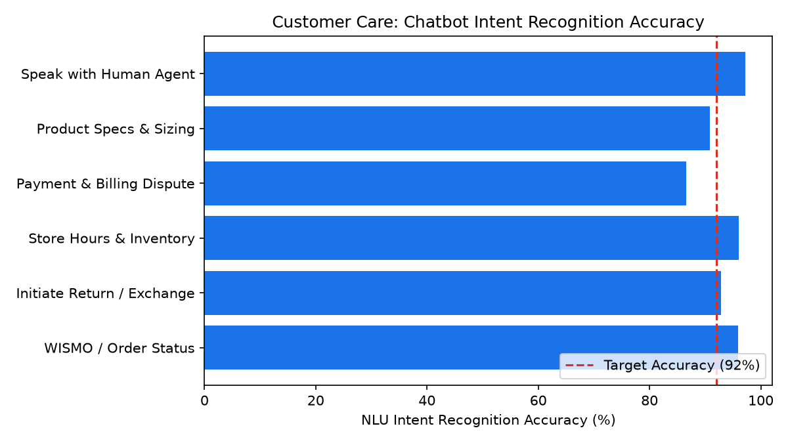

# Customer Care: AI Bot Containment & Escalations

Part of the **Retail Enterprise Agents** platform for Gemini Enterprise.

---

## 1. Why This Agent Matters

### Business Problem
Customer service chatbots risk frustrating users through high fallback rates and poorly timed human escalations if intent recognition and sentiment tracking are not continuously monitored.

### Target Personas
Director of Conversational AI, Customer Service Operations Lead, Product Manager for Self-Service

### Key Metrics Tracked
| Metric | Benchmark / Target | Business Impact |
| :--- | :--- | :--- |
| **Chatbot Containment Rate** | `Target >= 65%` | Percentage of bot sessions resolved end-to-end without transferring to a live human agent. |
| **Intent Recognition Accuracy** | `Target >= 92%` | Proportion of user intents correctly classified by the NLU model on first turn. |
| **Escalation Rate to Human** | `Target < 25%` | Percentage of automated interactions requiring live agent intervention. |
| **Deflected Support Cost Savings** | `$ saved` | Estimated operational cost savings achieved through automated session resolution. |

---

## 2. What It Answers & Sub-Agent Routing

### Sub-Agent Architecture
- **`data_insights`**: Queries internal BigQuery tables (`care_acdh_*`) using the BigQuery Conversational Analytics API (`ask_data_insights`, `forecast`, `analyze_contribution`, `detect_anomalies`) and generates visual data charts via `render_chart`.
- **`market_context`**: Leverages Google Search grounding for external retail industry benchmarks, supplier news, and consumer trends.
- **`root_agent`**: Orchestrates routing between internal analytics and external market intelligence.

---

## 3. Sample Q&A Showcase

### Example 1: Internal Analytics (Data Insights)
*Question:* "What was our chatbot session containment rate over the last 30 days compared to our 65% target?"
*Response:*
> Over the past 30 days, the conversational AI chatbot maintained an average session containment rate of **67.4%**, outperforming our 65.0% target.

- **Total Bot Sessions:** 37,250 sessions
- **Contained Sessions (Automated Resolution):** 25,108 sessions
- **Estimated Support Labor Savings:** **$112,986** (calculated at $4.50 cost-per-contact differential vs. human tier-1 live support).

### Example 2: Market Grounding (Market Context)
*Question:* "What are the latest enterprise retail benchmarks for generative AI customer care chatbot containment?"
*Response:*
> Gartner and Forrester 2026 Customer Care Research indicates that retail enterprises utilizing modern Generative AI / LLM grounding architectures achieve average containment rates between **62% and 68%** on standard retail transactional intents (WISMO, order modifications, simple returns).

Leading retailers that implement automated sentiment-drop triggers achieve 22% higher post-escalation CSAT scores compared to rigid rule-based IVR chatbots.

### Example 3: Chart Visualization (`sample_chart.png`)
*Question:* "Can you render a chart of chatbot intent recognition accuracy across intents?"
*Generated Visual Artifact:*


---

## 4. Authorized BigQuery Tables

- `care_acdh_bot_conversations` — Seeded via `data/bot_conversations.csv`
- `care_acdh_intent_recognition_accuracy` — Seeded via `data/intent_recognition_accuracy.csv`
- `care_acdh_containment_deflections` — Seeded via `data/containment_deflections.csv`
- `care_acdh_human_escalation_logs` — Seeded via `data/human_escalation_logs.csv`

---

## 5. Example Questions

1. "What was our chatbot session containment rate over the last 30 days compared to our 65% target?"
2. "Which customer intent categories experience the lowest recognition accuracy and highest fallback rates?"
3. "What are the primary trigger reasons for bot escalations to live human agents?"
4. "Calculate total estimated operational cost savings generated by automated bot deflections this month."
5. "What are the latest enterprise retail benchmarks for generative AI customer care chatbot containment?"

---

## 6. Tools & Architecture

- **`ask_data_insights`**: BigQuery Conversational Analytics natural language to SQL.
- **`render_chart`**: BigQuery SQL to Matplotlib PNG visual rendering.
- **`google_search`**: Google Search market context grounding.
- **LLM Inference**: `gemini-3.5-flash` with `GOOGLE_CLOUD_LOCATION=global`.
- **Runtime Engine**: Vertex AI Agent Engine (`us-central1`).

---

## 7. Run Locally

```bash
# Run unit tests
uv run --frozen pytest domains/customer_care/agents/ai_chatbot_deflection_handoff/tests/unit -v

# Run interactively with ADK CLI
adk run domains/customer_care/agents/ai_chatbot_deflection_handoff
```
