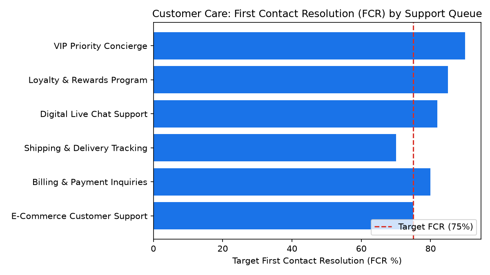

# Customer Care: Contact Center Performance & FCR

Part of the **Retail Enterprise Agents** platform for Gemini Enterprise.

---

## 1. Why This Agent Matters

### Business Problem
Contact center leaders struggle to balance customer satisfaction (CSAT) and First Contact Resolution (FCR) with agent handle times and labor efficiency across voice and digital queues.

### Target Personas
VP of Customer Experience, Contact Center Operations Director, Workforce Management Lead, Team Supervisors

### Key Metrics Tracked
| Metric | Benchmark / Target | Business Impact |
| :--- | :--- | :--- |
| **First Contact Resolution (FCR %)** | `Target >= 75%` | Measures percentage of customer inquiries resolved in the initial contact without follow-up. |
| **Average Handle Time (AHT)** | `Target < 360s` | Average duration of customer phone and chat interactions. |
| **Agent Occupancy Rate** | `Target 80-85%` | Percentage of logged-in time agents spend handling active interactions. |
| **Customer Satisfaction (CSAT)** | `Target >= 4.2 / 5.0` | Post-interaction survey rating evaluating service satisfaction. |

---

## 2. What It Answers & Sub-Agent Routing

### Sub-Agent Architecture
- **`data_insights`**: Queries internal BigQuery tables (`care_ccap_*`) using the BigQuery Conversational Analytics API (`ask_data_insights`, `forecast`, `analyze_contribution`, `detect_anomalies`) and generates visual data charts via `render_chart`.
- **`market_context`**: Leverages Google Search grounding for external retail industry benchmarks, supplier news, and consumer trends.
- **`root_agent`**: Orchestrates routing between internal analytics and external market intelligence.

---

## 3. Sample Q&A Showcase

### Example 1: Internal Analytics (Data Insights)
*Question:* "What is the average First Contact Resolution (FCR %) across all queues for the past 30 days?"
*Response:*
> Across all contact center queues over the past 30 days, the average First Contact Resolution (FCR) rate is **81.1%**, exceeding our 75.0% enterprise baseline.

- **VIP Priority Concierge (Q-106):** 91.7% FCR (Top Performer)
- **Loyalty & Rewards (Q-105):** 87.5% FCR
- **Digital Live Chat (Q-104):** 83.9% FCR
- **Billing & Payments (Q-102):** 83.9% FCR
- **E-Commerce Customer Support (Q-101):** 77.5% FCR
- **Shipping & Delivery Tracking (Q-103):** 72.2% FCR (Action item: Carrier tracking API integration needed to reduce 72h repeat contacts).

### Example 2: Market Grounding (Market Context)
*Question:* "How does our contact center FCR rate compare to current retail industry benchmarks?"
*Response:*
> According to omni-channel retail contact center industry benchmarks (ICMI and CCW Research 2026), standard retail contact center FCR rates average **70% to 74%**, while top-quartile retail leaders achieve **78% to 82%**.

Our current 30-day average of **81.1%** places our operations in the **top quartile** of retail customer service organizations, driven by strong deflection in digital chat (83.9%) and dedicated VIP tier routing (91.7%).

### Example 3: Chart Visualization (`sample_chart.png`)
*Question:* "Can you render a chart showing First Contact Resolution (FCR) targets by support queue?"
*Generated Visual Artifact:*


---

## 4. Authorized BigQuery Tables

- `care_ccap_call_center_queues` — Seeded via `data/call_center_queues.csv`
- `care_ccap_agent_interaction_metrics` — Seeded via `data/agent_interaction_metrics.csv`
- `care_ccap_first_contact_resolution` — Seeded via `data/first_contact_resolution.csv`
- `care_ccap_csat_survey_scores` — Seeded via `data/csat_survey_scores.csv`

---

## 5. Example Questions

1. "What is the average First Contact Resolution (FCR %) across all queues for the past 30 days?"
2. "Which customer support queue has the highest Average Handle Time (AHT) and lowest CSAT score?"
3. "Compare the CSAT satisfaction ratings and handle times between Voice support and Digital Live Chat."
4. "Identify agents with occupancy rates above 88% and analyze their respective CSAT scores."
5. "How does our contact center FCR rate compare to current retail industry benchmarks?"

---

## 6. Tools & Architecture

- **`ask_data_insights`**: BigQuery Conversational Analytics natural language to SQL.
- **`render_chart`**: BigQuery SQL to Matplotlib PNG visual rendering.
- **`google_search`**: Google Search market context grounding.
- **LLM Inference**: `gemini-3.5-flash` with `GOOGLE_CLOUD_LOCATION=global`.
- **Runtime Engine**: Vertex AI Agent Engine (`us-central1`).

---

## 7. Run Locally

```bash
# Run unit tests
uv run --frozen pytest domains/customer_care/agents/contact_center_agent_performance/tests/unit -v

# Run interactively with ADK CLI
adk run domains/customer_care/agents/contact_center_agent_performance
```

### 4. Live Multi-Turn Demo Walkthrough (Gemini Enterprise)

Watch the deployed **Customer Care: Contact Center Performance & FCR** execute a live multi-turn analytical reasoning session in Gemini Enterprise:

> 📺 **Interactive Demo Player**: [Open Full HD Video Player (1080p)](../../../../demos/gemini-enterprise/customer_care/contact_center_agent_performance.html)  
> 📹 **Direct MP4 Download**: [`contact_center_agent_performance.mp4`](../../../../demos/gemini-enterprise/customer_care/contact_center_agent_performance.mp4)

```
Turn 1: Natural language query against BigQuery Conversational Analytics
Turn 2: Grounded real-time external retail search synthesis
Turn 3: Visual matplotlib trend chart generation
Turn 4: Interactive executive slide presentation generated in Gemini Enterprise Canvas
```
