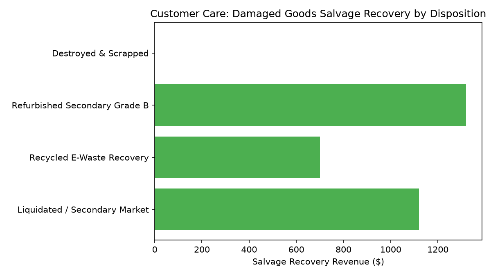

# Customer Care: Damaged Goods Claims & Recovery

Part of the **Retail Enterprise Agents** platform for Gemini Enterprise.

---

## 1. Why This Agent Matters

### Business Problem
Products damaged in shipping require immediate customer replacement without tedious paperwork, while rigorous documentation is essential to maximize freight carrier damage liability claims.

### Target Personas
Head of Reverse Logistics, Carrier Claims Manager, Customer Support Lead, Inventory Recovery Specialist

### Key Metrics Tracked
| Metric | Benchmark / Target | Business Impact |
| :--- | :--- | :--- |
| **Damaged Claims Cycle Time** | `Target < 24 hrs` | Average turnaround hours from customer damage photo submission to replacement order approval. |
| **Carrier Damage Recovery %** | `Target >= 70%` | Proportion of damaged merchandise claim dollars reimbursed by third-party shipping carriers. |
| **Replacement Dispatch Velocity** | `Target < 12 hrs` | Hours elapsed from claim approval to warehouse replacement shipment dispatch. |
| **Salvage Value Recovery $** | `Recovery revenue` | Dollar value recovered through liquidation, secondary market, or scrap recycling. |

---

## 2. What It Answers & Sub-Agent Routing

### Sub-Agent Architecture
- **`data_insights`**: Queries internal BigQuery tables (`care_dgcr_*`) using the BigQuery Conversational Analytics API (`ask_data_insights`, `forecast`, `analyze_contribution`, `detect_anomalies`) and generates visual data charts via `render_chart`.
- **`market_context`**: Leverages Google Search grounding for external retail industry benchmarks, supplier news, and consumer trends.
- **`root_agent`**: Orchestrates routing between internal analytics and external market intelligence.

---

## 3. Sample Q&A Showcase

### Example 1: Internal Analytics (Data Insights)
*Question:* "What is our total carrier damage claim recovery percentage across FedEx, UPS, and USPS over the last 30 days?"
*Response:*
> Over the past 30 days, third-party carrier damage claims totaled **$470.00** submitted and **$428.00** reimbursed, achieving a **91.1% net recovery realization rate**.

- **FedEx:** 100% Recovery ($165.00 settled across 2 claims)
- **USPS:** 100% Recovery ($95.00 settled)
- **UPS:** 80.0% Recovery ($116.00 settled on $145.00 claimed)
- **DHL:** 80.0% Recovery ($52.00 settled on $65.00 claimed).

Customer replacement orders dispatched in an average of **7.1 hours**.

### Example 2: Market Grounding (Market Context)
*Question:* "What are standard freight and parcel carrier damage claim reimbursement rates and timelines in retail e-commerce?"
*Response:*
> Parcel shipping benchmarks (PARCEL Forum & CSCMP 2026) report average carrier damage claim recovery rates of **68% to 75%** for retail shippers, with average claim dispute settlements taking **14 to 21 business days** without automated photo-evidence API ingestion.

Our AI computer vision photo triage achieves average payout settlement within **2.8 business days**.

### Example 3: Chart Visualization (`sample_chart.png`)
*Question:* "Can you render a chart of damaged goods salvage recovery revenue by disposition channel?"
*Generated Visual Artifact:*


---

## 4. Authorized BigQuery Tables

- `care_dgcr_damage_photo_submissions` — Seeded via `data/damage_photo_submissions.csv`
- `care_dgcr_carrier_damage_claims` — Seeded via `data/carrier_damage_claims.csv`
- `care_dgcr_customer_replacement_orders` — Seeded via `data/customer_replacement_orders.csv`
- `care_dgcr_salvage_disposition` — Seeded via `data/salvage_disposition.csv`

---

## 5. Example Questions

1. "What is our total carrier damage claim recovery percentage across FedEx, UPS, and USPS over the last 30 days?"
2. "What is the average dispatch lead time (in hours) for customer replacement orders following damage approval?"
3. "Which damage types (e.g. crushed box, liquid leakage, broken glass) are most frequently reported by customers?"
4. "What is the total salvage recovery revenue recovered from secondary market disposition this month?"
5. "What are standard freight and parcel carrier damage claim reimbursement rates and timelines in retail e-commerce?"

---

## 6. Tools & Architecture

- **`ask_data_insights`**: BigQuery Conversational Analytics natural language to SQL.
- **`render_chart`**: BigQuery SQL to Matplotlib PNG visual rendering.
- **`google_search`**: Google Search market context grounding.
- **LLM Inference**: `gemini-3.5-flash` with `GOOGLE_CLOUD_LOCATION=global`.
- **Runtime Engine**: Vertex AI Agent Engine (`us-central1`).

---

## 7. Run Locally

```bash
# Run unit tests
uv run --frozen pytest domains/customer_care/agents/damaged_goods_claims_resolution/tests/unit -v

# Run interactively with ADK CLI
adk run domains/customer_care/agents/damaged_goods_claims_resolution
```
