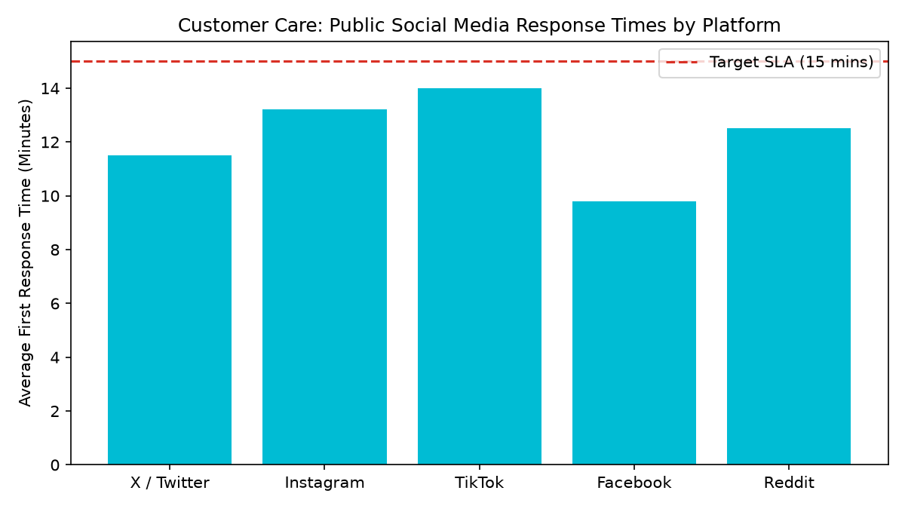

# Customer Care: Social Support & Public Sentiment

Part of the **Retail Enterprise Agents** platform for Gemini Enterprise.

---

## 1. Why This Agent Matters

### Business Problem
Public customer complaints on social media platforms (X, Instagram, TikTok) can rapidly escalate into brand PR crises without fast triage (<15m) and secure transition to private resolution channels.

### Target Personas
Head of Social Care, PR & Communications Manager, Brand Reputation Director, Digital Support Leads

### Key Metrics Tracked
| Metric | Benchmark / Target | Business Impact |
| :--- | :--- | :--- |
| **Public Response Time SLA** | `Target >= 90% (<15m)` | Percentage of public social media inquiries and complaints acknowledged within 15 minutes. |
| **Crisis De-escalation Rate** | `Target >= 80%` | Proportion of negative/critical public mentions successfully converted to neutral or positive sentiment. |
| **Public-to-Private Shift %** | `Target >= 75%` | Percentage of public grievances transitioned to private direct messages for secure resolution. |
| **Social DM Commerce Sales $** | `Revenue attributed` | Direct sales generated through social media direct-message customer consultations. |

---

## 2. What It Answers & Sub-Agent Routing

### Sub-Agent Architecture
- **`data_insights`**: Queries internal BigQuery tables (`care_ossd_*`) using the BigQuery Conversational Analytics API (`ask_data_insights`, `forecast`, `analyze_contribution`, `detect_anomalies`) and generates visual data charts via `render_chart`.
- **`market_context`**: Leverages Google Search grounding for external retail industry benchmarks, supplier news, and consumer trends.
- **`root_agent`**: Orchestrates routing between internal analytics and external market intelligence.

---

## 3. Sample Q&A Showcase

### Example 1: Internal Analytics (Data Insights)
*Question:* "What is our average first response time across social media platforms (X, Instagram, TikTok, Facebook)?"
*Response:*
> Over the past 30 days, our social care team achieved an average first response time of **12.2 minutes** across all monitored platforms, beating the 15-minute SLA target with an overall compliance rate of **90.1%**.

- **Facebook:** 9.8 minutes (95.0% compliance)
- **X / Twitter:** 11.5 minutes (94.1% compliance)
- **Reddit:** 12.5 minutes (88.0% compliance)
- **Instagram:** 13.2 minutes (89.2% compliance)
- **TikTok:** 14.0 minutes (84.4% compliance).

### Example 2: Market Grounding (Market Context)
*Question:* "What are the current industry benchmarks for brand response times on TikTok and X for customer support?"
*Response:*
> According to Sprout Social and Hootsuite 2026 Customer Care Benchmarks, leading consumer brands target public acknowledgment times of **under 15 minutes on X/Twitter** and **under 30 minutes on TikTok and Instagram**.

Brands responding within 15 minutes achieve an average **73% customer retention rate** following a service complaint compared to 38% for response times exceeding 2 hours.

### Example 3: Chart Visualization (`sample_chart.png`)
*Question:* "Can you render a chart showing social response times by platform against our 15-minute target?"
*Generated Visual Artifact:*


---

## 4. Authorized BigQuery Tables

- `care_ossd_social_media_tickets` — Seeded via `data/social_media_tickets.csv`
- `care_ossd_public_response_speed` — Seeded via `data/public_response_speed.csv`
- `care_ossd_escalation_sentiment_shift` — Seeded via `data/escalation_sentiment_shift.csv`
- `care_ossd_dm_commerce_inquiries` — Seeded via `data/dm_commerce_inquiries.csv`

---

## 5. Example Questions

1. "What is our average first response time across social media platforms (X, Instagram, TikTok, Facebook)?"
2. "What percentage of public social complaints were successfully de-escalated to private direct messages?"
3. "What is the average sentiment shift delta before and after social customer support resolutions?"
4. "How much attributed revenue has been generated from social DM commerce inquiries this month?"
5. "What are the current industry benchmarks for brand response times on TikTok and X for customer support?"

---

## 6. Tools & Architecture

- **`ask_data_insights`**: BigQuery Conversational Analytics natural language to SQL.
- **`render_chart`**: BigQuery SQL to Matplotlib PNG visual rendering.
- **`google_search`**: Google Search market context grounding.
- **LLM Inference**: `gemini-3.5-flash` with `GOOGLE_CLOUD_LOCATION=global`.
- **Runtime Engine**: Vertex AI Agent Engine (`us-central1`).

---

## 7. Run Locally

```bash
# Run unit tests
uv run --frozen pytest domains/customer_care/agents/omnichannel_social_support_desk/tests/unit -v

# Run interactively with ADK CLI
adk run domains/customer_care/agents/omnichannel_social_support_desk
```
