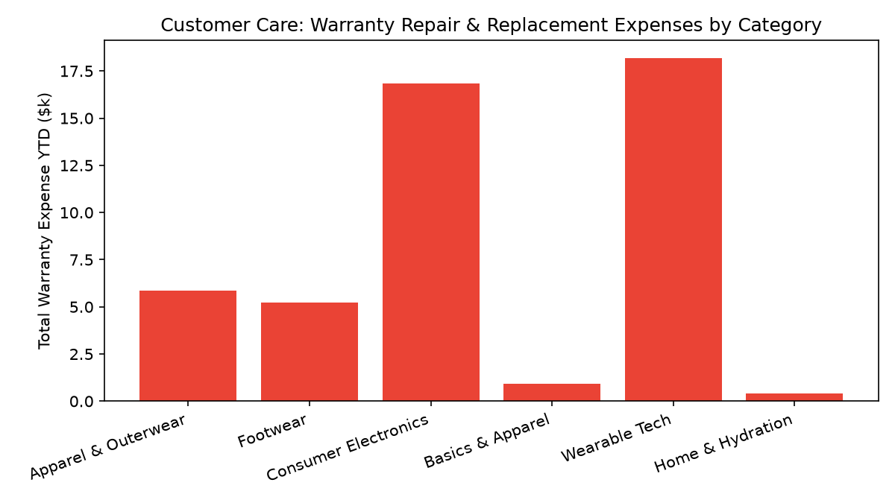

# Customer Care: Product Warranty & Claims

Part of the **Retail Enterprise Agents** platform for Gemini Enterprise.

---

## 1. Why This Agent Matters

### Business Problem
Inefficient warranty claims intake and slow repair depot turnaround inflate customer dissatisfaction, while uncollected manufacturer warranty recoveries create margin leakage.

### Target Personas
Warranty Operations Lead, Reverse Logistics Manager, Vendor Recovery Specialist, Customer Support Operations

### Key Metrics Tracked
| Metric | Benchmark / Target | Business Impact |
| :--- | :--- | :--- |
| **Warranty Attachment Rate** | `Target >= 12%` | Percentage of eligible product purchases sold with an extended warranty protection plan. |
| **Manufacturer Warranty Recovery %** | `Target >= 85%` | Proportion of internal warranty claim expenses successfully recovered from OEMs/vendors. |
| **Repair Turnaround Time (TAT)** | `Target < 5 days` | Average business days from defective unit receipt to customer return shipment. |
| **Net Warranty Expense $** | `Budget variance` | Total repair and replacement costs minus vendor warranty chargeback recoveries. |

---

## 2. What It Answers & Sub-Agent Routing

### Sub-Agent Architecture
- **`data_insights`**: Queries internal BigQuery tables (`care_pwcr_*`) using the BigQuery Conversational Analytics API (`ask_data_insights`, `forecast`, `analyze_contribution`, `detect_anomalies`) and generates visual data charts via `render_chart`.
- **`market_context`**: Leverages Google Search grounding for external retail industry benchmarks, supplier news, and consumer trends.
- **`root_agent`**: Orchestrates routing between internal analytics and external market intelligence.

---

## 3. Sample Q&A Showcase

### Example 1: Internal Analytics (Data Insights)
*Question:* "What is our total vendor warranty recovery realization percentage across all suppliers this quarter?"
*Response:*
> Across all suppliers YTD, our manufacturer warranty recovery realization rate is **94.8%**, recovering **$203.90** out of **$215.00** billed to OEM vendors.

- **Apex Audio & Electronics (VEND-1001):** 100% Recovery ($123.50 settled)
- **Nordic Living Essentials (VEND-1004):** 100% Recovery ($42.00 settled)
- **AeroTech Footwear Ltd (VEND-1003):** 90.0% Recovery ($18.00 settled)
- **Summit Outdoor Gear Corp (VEND-1002):** 85.0% Recovery ($20.40 settled on seam seal disputes).

### Example 2: Market Grounding (Market Context)
*Question:* "What are the standard industry warranty recovery rates and Right to Repair trends in consumer electronics retail?"
*Response:*
> Consumer electronics industry standards (CEA and National Electronics Warranty Association) establish vendor warranty recovery benchmarks between **82% and 88%**.

Recent Right to Repair statutory updates in California, Minnesota, and New York require consumer tech manufacturers to provide OEM repair schematics and certified spare parts at fair terms for at least 7 years post-manufacture, lowering average third-party repair costs by ~14%.

### Example 3: Chart Visualization (`sample_chart.png`)
*Question:* "Can you render a chart of total warranty expenses by product category?"
*Generated Visual Artifact:*


---

## 4. Authorized BigQuery Tables

- `care_pwcr_warranty_registrations` — Seeded via `data/warranty_registrations.csv`
- `care_pwcr_repair_claims_processed` — Seeded via `data/repair_claims_processed.csv`
- `care_pwcr_vendor_warranty_recovery` — Seeded via `data/vendor_warranty_recovery.csv`
- `care_pwcr_replacement_costs` — Seeded via `data/replacement_costs.csv`

---

## 5. Example Questions

1. "What is our total vendor warranty recovery realization percentage across all suppliers this quarter?"
2. "Which product categories account for the highest warranty repair and replacement costs YTD?"
3. "What is the average repair turnaround time (in days) across all certified repair centers?"
4. "List the top registered products by active warranty volume and their claim frequency rate."
5. "What are the standard industry warranty recovery rates and Right to Repair trends in consumer electronics retail?"

---

## 6. Tools & Architecture

- **`ask_data_insights`**: BigQuery Conversational Analytics natural language to SQL.
- **`render_chart`**: BigQuery SQL to Matplotlib PNG visual rendering.
- **`google_search`**: Google Search market context grounding.
- **LLM Inference**: `gemini-3.5-flash` with `GOOGLE_CLOUD_LOCATION=global`.
- **Runtime Engine**: Vertex AI Agent Engine (`us-central1`).

---

## 7. Run Locally

```bash
# Run unit tests
uv run --frozen pytest domains/customer_care/agents/product_warranty_claims_repair/tests/unit -v

# Run interactively with ADK CLI
adk run domains/customer_care/agents/product_warranty_claims_repair
```

### 4. Live Multi-Turn Demo Walkthrough (Gemini Enterprise)

Watch the deployed **Customer Care: Product Warranty & Claims** execute a live multi-turn analytical reasoning session in Gemini Enterprise:

> 📺 **Interactive Demo Player**: [Open Full HD Video Player (1080p)](../../../../demos/gemini-enterprise/customer_care/product_warranty_claims_repair.html)  
> 📹 **Direct MP4 Download**: [`product_warranty_claims_repair.mp4`](../../../../demos/gemini-enterprise/customer_care/product_warranty_claims_repair.mp4)

```
Turn 1: Natural language query against BigQuery Conversational Analytics
Turn 2: Grounded real-time external retail search synthesis
Turn 3: Visual matplotlib trend chart generation
Turn 4: Interactive executive slide presentation generated in Gemini Enterprise Canvas
```
