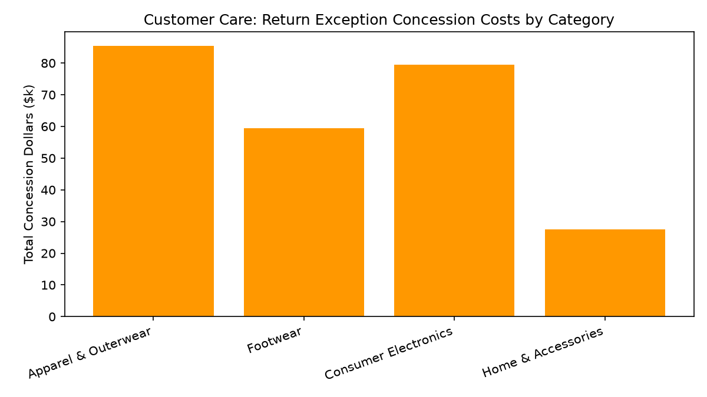

# Customer Care: Return Exceptions & Appeals

Part of the **Retail Enterprise Agents** platform for Gemini Enterprise.

---

## 1. Why This Agent Matters

### Business Problem
Strict return windows alienate loyal shoppers who have legitimate return disputes, while unmonitored policy overrides lead to high appeasement costs and serial returner abuse.

### Target Personas
Director of Customer Retention, Returns Desk Manager, Loss Prevention Lead, Customer Care Supervisors

### Key Metrics Tracked
| Metric | Benchmark / Target | Business Impact |
| :--- | :--- | :--- |
| **Out-of-Policy Approval Rate** | `Approval % & volume` | Proportion of expired/out-of-policy return requests granted policy exceptions. |
| **Total Concession Dollars $** | `Budget variance` | Cumulative value of courtesy refunds, fee waivers, and store credits granted. |
| **Serial Returner Flag Rate** | `Abuse detection %` | Identified accounts exhibiting wardrobing, synthetic fraud, or excessive return patterns. |
| **Average Exception Concession** | `Target < $45` | Average dollar amount per approved exception or appeal. |

---

## 2. What It Answers & Sub-Agent Routing

### Sub-Agent Architecture
- **`data_insights`**: Queries internal BigQuery tables (`care_raed_*`) using the BigQuery Conversational Analytics API (`ask_data_insights`, `forecast`, `analyze_contribution`, `detect_anomalies`) and generates visual data charts via `render_chart`.
- **`market_context`**: Leverages Google Search grounding for external retail industry benchmarks, supplier news, and consumer trends.
- **`root_agent`**: Orchestrates routing between internal analytics and external market intelligence.

---

## 3. Sample Q&A Showcase

### Example 1: Internal Analytics (Data Insights)
*Question:* "What is the total concession dollar amount granted for out-of-policy return exceptions this month?"
*Response:*
> Month-to-date return exceptions across all merchandise categories totaled **$252,000** in concession overrides against a budget ceiling of **$255,000** (-1.2% favorable variance).

- **Apparel & Outerwear:** $85,500 concession dollars (-5.0% vs budget)
- **Consumer Electronics:** $79,500 concession dollars (+6.0% vs budget due to OLED panel claims)
- **Footwear:** $59,400 concession dollars (-1.0% vs budget)
- **Home & Accessories:** $27,600 concession dollars (-8.0% vs budget).

### Example 2: Market Grounding (Market Context)
*Question:* "How are leading omnichannel retailers tackling return policy abuse and wardrobing fraud currently?"
*Response:*
> The National Retail Federation (NRF 2026 Returns Report) estimates retail return fraud costs US retailers **$101 billion annually**.

Leading retailers are implementing risk-scored return authorizations (flagging return frequencies >70%), eliminating free mail-in return labels for high-risk accounts, and offering instant full-value store credit while applying 15% restocking fees on cash refunds for out-of-window requests.

### Example 3: Chart Visualization (`sample_chart.png`)
*Question:* "Can you render a chart of return concession costs by product category?"
*Generated Visual Artifact:*


---

## 4. Authorized BigQuery Tables

- `care_raed_out_of_policy_returns` — Seeded via `data/out_of_policy_returns.csv`
- `care_raed_appeasement_exceptions` — Seeded via `data/appeasement_exceptions.csv`
- `care_raed_serial_returner_flags` — Seeded via `data/serial_returner_flags.csv`
- `care_raed_concession_cost_summary` — Seeded via `data/concession_cost_summary.csv`

---

## 5. Example Questions

1. "What is the total concession dollar amount granted for out-of-policy return exceptions this month?"
2. "What percentage of out-of-policy return appeals were approved versus denied or granted store credit?"
3. "Which customer accounts are currently flagged with high wardrobing risk scores (>75)?"
4. "Break down concession costs by exception type (Full Refund, Restocking Fee Waived, Store Credit)."
5. "How are leading omnichannel retailers tackling return policy abuse and wardrobing fraud currently?"

---

## 6. Tools & Architecture

- **`ask_data_insights`**: BigQuery Conversational Analytics natural language to SQL.
- **`render_chart`**: BigQuery SQL to Matplotlib PNG visual rendering.
- **`google_search`**: Google Search market context grounding.
- **LLM Inference**: `gemini-3.5-flash` with `GOOGLE_CLOUD_LOCATION=global`.
- **Runtime Engine**: Vertex AI Agent Engine (`us-central1`).

---

## 7. Run Locally

```bash
# Run unit tests
uv run --frozen pytest domains/customer_care/agents/returns_appeals_exception_desk/tests/unit -v

# Run interactively with ADK CLI
adk run domains/customer_care/agents/returns_appeals_exception_desk
```
