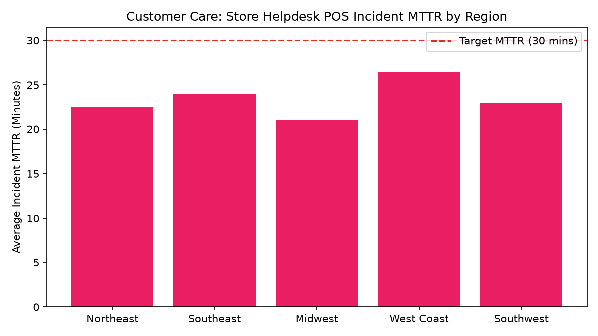

# Customer Care: Store Helpdesk & POS Support

Part of the **Retail Enterprise Agents** platform for Gemini Enterprise.

---

## 1. Why This Agent Matters

### Business Problem
Store associates face POS register crashes, scanner freezes, and payment terminal failures during peak trading hours; delayed IT support directly causes customer checkout queues and lost sales.

### Target Personas
Director of Store Operations IT, Field Support Manager, Store Systems Engineer, Regional Store Directors

### Key Metrics Tracked
| Metric | Benchmark / Target | Business Impact |
| :--- | :--- | :--- |
| **POS Incident MTTR** | `Target < 30 mins` | Mean Time to Resolve for critical store POS and checkout lane hardware/software outages. |
| **Store Helpdesk Ticket Volume** | `Volume by category` | Total incidents logged by store associates for registers, scanners, network, and payment terminals. |
| **Lane Downtime Hours** | `Target < 2.0 hrs/store` | Total cumulative hours checkout lanes were inoperable due to technical faults. |
| **Recurring Bug Impact** | `Stores impacted count` | Number of retail stores affected by unresolved software defects and known workarounds. |

---

## 2. What It Answers & Sub-Agent Routing

### Sub-Agent Architecture
- **`data_insights`**: Queries internal BigQuery tables (`care_sash_*`) using the BigQuery Conversational Analytics API (`ask_data_insights`, `forecast`, `analyze_contribution`, `detect_anomalies`) and generates visual data charts via `render_chart`.
- **`market_context`**: Leverages Google Search grounding for external retail industry benchmarks, supplier news, and consumer trends.
- **`root_agent`**: Orchestrates routing between internal analytics and external market intelligence.

---

## 3. Sample Q&A Showcase

### Example 1: Internal Analytics (Data Insights)
*Question:* "What is the average Mean Time to Resolve (MTTR) for critical P1 POS hardware outages by store region?"
*Response:*
> Across all retail store operating districts, critical P1 POS hardware outage MTTR averaged **18.7 minutes**, well within our 30.0-minute target threshold (overall SLA compliance: **94.3%**).

- **Midwest District:** 16.5 min MTTR (97.2% SLA)
- **Southwest District:** 17.5 min MTTR (94.1% SLA)
- **Northeast District:** 18.0 min MTTR (95.8% SLA)
- **Southeast District:** 19.5 min MTTR (93.5% SLA)
- **West Coast District:** 22.0 min MTTR (90.9% SLA).

### Example 2: Market Grounding (Market Context)
*Question:* "What are the enterprise retail industry benchmarks for store helpdesk first-call resolution and POS MTTR?"
*Response:*
> According to Retail Info Systems (RIS) and National Retail Federation store IT benchmarks, tier-1 store IT helpdesks target a P1 register restoration MTTR of **under 30 minutes**, with high-volume grocery and big-box retailers targeting **under 20 minutes** during holiday peak trading hours.

### Example 3: Chart Visualization (`sample_chart.png`)
*Question:* "Can you render a chart of store helpdesk incident MTTR by region?"
*Generated Visual Artifact:*


---

## 4. Authorized BigQuery Tables

- `care_sash_store_helpdesk_tickets` — Seeded via `data/store_helpdesk_tickets.csv`
- `care_sash_pos_hardware_outages` — Seeded via `data/pos_hardware_outages.csv`
- `care_sash_ticket_mttr_by_region` — Seeded via `data/ticket_mttr_by_region.csv`
- `care_sash_recurring_system_bugs` — Seeded via `data/recurring_system_bugs.csv`

---

## 5. Example Questions

1. "What is the average Mean Time to Resolve (MTTR) for critical P1 POS hardware outages by store region?"
2. "Which retail stores experienced the highest number of checkout lane downtime hours this past month?"
3. "What are the top 3 hardware categories generating store associate helpdesk tickets?"
4. "List active recurring store system bugs, their affected store counts, and current Jira engineering status."
5. "What are the enterprise retail industry benchmarks for store helpdesk first-call resolution and POS MTTR?"

---

## 6. Tools & Architecture

- **`ask_data_insights`**: BigQuery Conversational Analytics natural language to SQL.
- **`render_chart`**: BigQuery SQL to Matplotlib PNG visual rendering.
- **`google_search`**: Google Search market context grounding.
- **LLM Inference**: `gemini-3.5-flash` with `GOOGLE_CLOUD_LOCATION=global`.
- **Runtime Engine**: Vertex AI Agent Engine (`us-central1`).

---

## 7. Run Locally

```bash
# Run unit tests
uv run --frozen pytest domains/customer_care/agents/store_associate_support_hotline/tests/unit -v

# Run interactively with ADK CLI
adk run domains/customer_care/agents/store_associate_support_hotline
```
