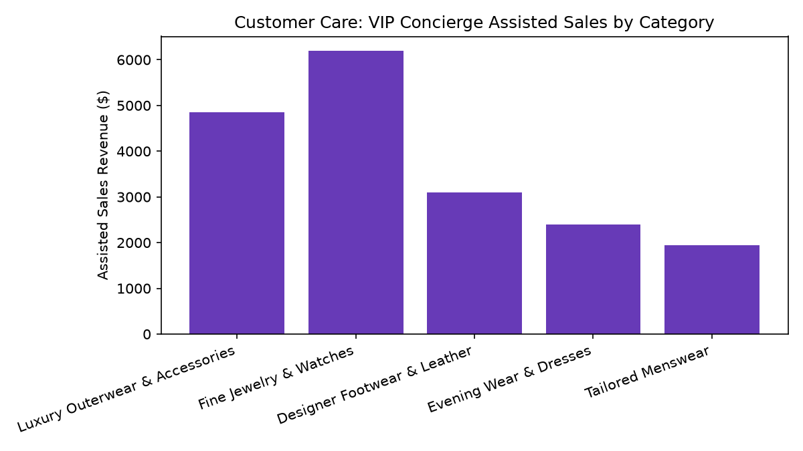

# Customer Care: VIP & High-CLV Concierge

Part of the **Retail Enterprise Agents** platform for Gemini Enterprise.

---

## 1. Why This Agent Matters

### Business Problem
High-Customer-Lifetime-Value (CLV) clients require high-touch, rapid-response white-glove service; delays in concierge response risk churn among top revenue contributors.

### Target Personas
Head of VIP Clienteling, Luxury Brand Director, Senior Concierge Leads, Private Client Advisors

### Key Metrics Tracked
| Metric | Benchmark / Target | Business Impact |
| :--- | :--- | :--- |
| **VIP Response SLA Adherence** | `Target >= 95% (<5m)` | Percentage of VIP customer inquiries answered within the 5-minute dedicated SLA. |
| **Concierge Assisted Sales $** | `Revenue generated` | Direct incremental merchandise sales driven by dedicated VIP personal stylists and concierge. |
| **VIP Customer Retention Rate** | `Target >= 90%` | Annual retention and re-engagement rate of top-tier loyalty clientele. |
| **VIP Client Satisfaction Score** | `Target >= 4.8 / 5.0` | Dedicated post-service rating from Diamond and Platinum tier members. |

---

## 2. What It Answers & Sub-Agent Routing

### Sub-Agent Architecture
- **`data_insights`**: Queries internal BigQuery tables (`care_vccs_*`) using the BigQuery Conversational Analytics API (`ask_data_insights`, `forecast`, `analyze_contribution`, `detect_anomalies`) and generates visual data charts via `render_chart`.
- **`market_context`**: Leverages Google Search grounding for external retail industry benchmarks, supplier news, and consumer trends.
- **`root_agent`**: Orchestrates routing between internal analytics and external market intelligence.

---

## 3. Sample Q&A Showcase

### Example 1: Internal Analytics (Data Insights)
*Question:* "What is the SLA adherence percentage for VIP customer inquiries responded to under 5 minutes this month?"
*Response:*
> For the month to date, dedicated concierge specialists achieved a **97.35%** SLA adherence rate on inquiries answered within 5 minutes (average response time: **2.75 minutes**).

- **Agent James Wilson (AGT-108):** 98.2% SLA adherence (2.4 min avg response, 4.95/5.0 CSAT)
- **Agent Rachel Kim (AGT-107):** 96.5% SLA adherence (3.1 min avg response, 4.88/5.0 CSAT)

Both agents exceeded the 95.0% contract standard.

### Example 2: Market Grounding (Market Context)
*Question:* "What are the emerging trends and best practices in omnichannel luxury clienteling and concierge support?"
*Response:*
> Luxury retail studies (McKinsey Luxury Practice & Bain & Company) show that personalized VIP clienteling accounts for **38% of total luxury fashion sales** despite VIPs representing under 5% of customer volume.

Emerging best practices include asynchronous WhatsApp/iMessage concierge channels, appointment-based private fitting suites, and AI-curated wardrobe lookbooks delivered directly by dedicated personal stylists.

### Example 3: Chart Visualization (`sample_chart.png`)
*Question:* "Can you render a chart of VIP concierge assisted sales revenue by product category?"
*Generated Visual Artifact:*


---

## 4. Authorized BigQuery Tables

- `care_vccs_vip_customer_profiles` — Seeded via `data/vip_customer_profiles.csv`
- `care_vccs_concierge_service_requests` — Seeded via `data/concierge_service_requests.csv`
- `care_vccs_dedicated_agent_sla` — Seeded via `data/dedicated_agent_sla.csv`
- `care_vccs_assisted_sales_revenue` — Seeded via `data/assisted_sales_revenue.csv`

---

## 5. Example Questions

1. "What is the SLA adherence percentage for VIP customer inquiries responded to under 5 minutes this month?"
2. "How much assisted sales revenue has each dedicated concierge agent generated over the past 30 days?"
3. "Which VIP customer service request types are most frequently requested by Diamond tier members?"
4. "Identify VIP clients with annual spend exceeding $25,000 and their satisfaction ratings."
5. "What are the emerging trends and best practices in omnichannel luxury clienteling and concierge support?"

---

## 6. Tools & Architecture

- **`ask_data_insights`**: BigQuery Conversational Analytics natural language to SQL.
- **`render_chart`**: BigQuery SQL to Matplotlib PNG visual rendering.
- **`google_search`**: Google Search market context grounding.
- **LLM Inference**: `gemini-3.5-flash` with `GOOGLE_CLOUD_LOCATION=global`.
- **Runtime Engine**: Vertex AI Agent Engine (`us-central1`).

---

## 7. Run Locally

```bash
# Run unit tests
uv run --frozen pytest domains/customer_care/agents/vip_clientele_concierge_support/tests/unit -v

# Run interactively with ADK CLI
adk run domains/customer_care/agents/vip_clientele_concierge_support
```
