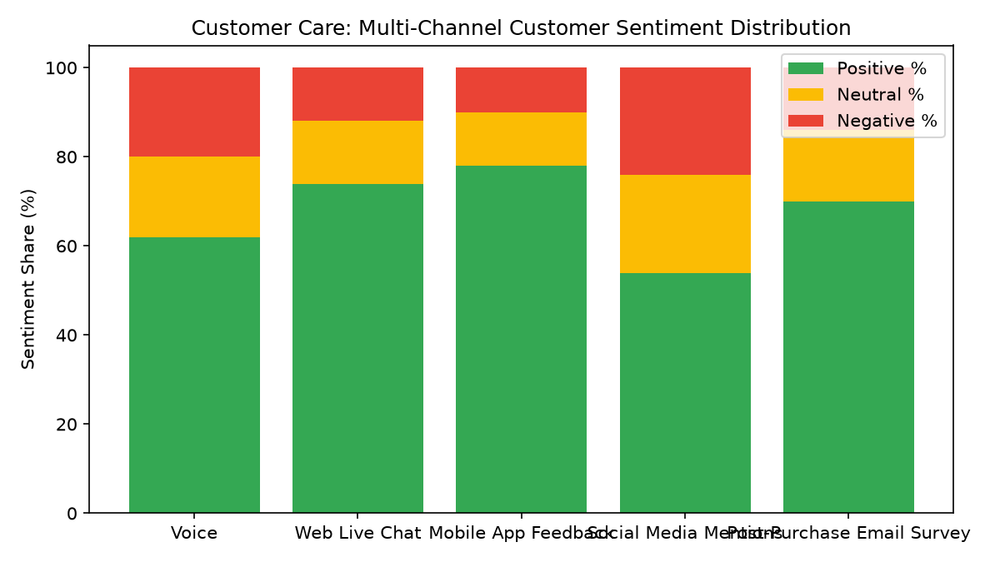

# Customer Care: Voice of Customer & NLP Sentiment

Part of the **Retail Enterprise Agents** platform for Gemini Enterprise.

---

## 1. Why This Agent Matters

### Business Problem
Retailers lack real-time visibility into unstructured customer feedback across call transcripts, chat logs, and surveys, leading to slow discovery of emerging product quality defects and negative sentiment drivers.

### Target Personas
Chief Customer Officer, Director of Customer Insights, Quality Assurance Lead, Category Merchandisers

### Key Metrics Tracked
| Metric | Benchmark / Target | Business Impact |
| :--- | :--- | :--- |
| **Net Promoter Score (NPS)** | `Target >= +50` | Relationship and transactional customer loyalty metric (-100 to +100). |
| **Net Sentiment Score** | `Scale -1.0 to +1.0` | NLP polarity score computed across feedback transcripts and chat interactions. |
| **Complaint Topic Clustering** | `Pareto breakdown` | Distribution of customer feedback mentions by categorized pain point. |
| **Early Defect Signal Rate** | `Alert threshold > 15%` | Automated detection of sudden spikes in product quality complaint volume. |

---

## 2. What It Answers & Sub-Agent Routing

### Sub-Agent Architecture
- **`data_insights`**: Queries internal BigQuery tables (`care_vocs_*`) using the BigQuery Conversational Analytics API (`ask_data_insights`, `forecast`, `analyze_contribution`, `detect_anomalies`) and generates visual data charts via `render_chart`.
- **`market_context`**: Leverages Google Search grounding for external retail industry benchmarks, supplier news, and consumer trends.
- **`root_agent`**: Orchestrates routing between internal analytics and external market intelligence.

---

## 3. Sample Q&A Showcase

### Example 1: Internal Analytics (Data Insights)
*Question:* "What are the top 3 customer complaint topics by mention volume in customer feedback over the past 30 days?"
*Response:*
> Based on NLP topic extraction across customer transcripts and surveys, the top complaint drivers are:

1. **Apparel Sizing Consistency (TOP-101):** 185 mentions | Net Sentiment: **-0.42** (110 detractors vs 35 promoters). Key issue: Size M running small in outerwear.
2. **Product Durability & Fabric Quality (TOP-106):** 160 mentions | Net Sentiment: **-0.35** (95 detractors). Key issue: Seam stitching unraveling after initial wash.
3. **Website Search & Filter Latency (TOP-105):** 140 mentions | Net Sentiment: **+0.15** (Mild friction).

By contrast, **Customer Support Courtesy (TOP-104)** scored a high **+0.72** net sentiment score.

### Example 2: Market Grounding (Market Context)
*Question:* "What are the current consumer sentiment trends regarding retail apparel sizing consistency in the wider market?"
*Response:*
> Market research from Coresight and Vogue Business indicates that inconsistent apparel sizing accounts for **52% of all e-commerce fashion returns** industry-wide in 2026.

Retailers adopting 3D body-scanning widgets and customer photo review galleries are seeing an average 18% reduction in size-related return rates.

### Example 3: Chart Visualization (`sample_chart.png`)
*Question:* "Can you render a chart showing the customer sentiment distribution across interaction channels?"
*Generated Visual Artifact:*


---

## 4. Authorized BigQuery Tables

- `care_vocs_customer_feedback_transcripts` — Seeded via `data/customer_feedback_transcripts.csv`
- `care_vocs_nps_sentiment_topics` — Seeded via `data/nps_sentiment_topics.csv`
- `care_vocs_product_defect_signals` — Seeded via `data/product_defect_signals.csv`
- `care_vocs_channel_sentiment_trends` — Seeded via `data/channel_sentiment_trends.csv`

---

## 5. Example Questions

1. "What are the top 3 customer complaint topics by mention volume in customer feedback over the past 30 days?"
2. "Which SKUs currently exhibit active product defect alerts and significant negative sentiment spikes?"
3. "What is the average Net Promoter Score (NPS) across each customer interaction channel?"
4. "Show the daily trend of positive vs. negative feedback sentiment over the last month."
5. "What are the current consumer sentiment trends regarding retail apparel sizing consistency in the wider market?"

---

## 6. Tools & Architecture

- **`ask_data_insights`**: BigQuery Conversational Analytics natural language to SQL.
- **`render_chart`**: BigQuery SQL to Matplotlib PNG visual rendering.
- **`google_search`**: Google Search market context grounding.
- **LLM Inference**: `gemini-3.5-flash` with `GOOGLE_CLOUD_LOCATION=global`.
- **Runtime Engine**: Vertex AI Agent Engine (`us-central1`).

---

## 7. Run Locally

```bash
# Run unit tests
uv run --frozen pytest domains/customer_care/agents/voice_of_customer_sentiment_nlp/tests/unit -v

# Run interactively with ADK CLI
adk run domains/customer_care/agents/voice_of_customer_sentiment_nlp
```

### 4. Live Multi-Turn Demo Walkthrough (Gemini Enterprise)

Watch the deployed **Customer Care: Voice of Customer & NLP Sentiment** execute a live multi-turn analytical reasoning session in Gemini Enterprise:

> 📺 **Interactive Demo Player**: [Open Full HD Video Player (1080p)](../../../../demos/gemini-enterprise/customer_care/voice_of_customer_sentiment_nlp.html)  
> 📹 **Direct MP4 Download**: [`voice_of_customer_sentiment_nlp.mp4`](../../../../demos/gemini-enterprise/customer_care/voice_of_customer_sentiment_nlp.mp4)

```
Turn 1: Natural language query against BigQuery Conversational Analytics
Turn 2: Grounded real-time external retail search synthesis
Turn 3: Visual matplotlib trend chart generation
Turn 4: Interactive executive slide presentation generated in Gemini Enterprise Canvas
```
