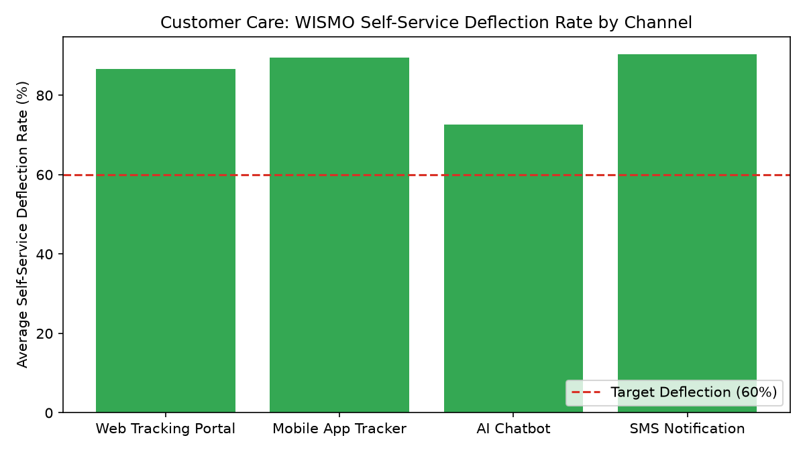

# Customer Care: WISMO & Order Inquiries

Part of the **Retail Enterprise Agents** platform for Gemini Enterprise.

---

## 1. Why This Agent Matters

### Business Problem
"Where Is My Order" (WISMO) inquiries constitute over 40% of inbound retail customer support volume, causing support congestion and unnecessary customer friction during carrier transit delays.

### Target Personas
Head of Customer Care, Fulfillment Operations Lead, E-Commerce Experience Manager, Customer Service Leads

### Key Metrics Tracked
| Metric | Benchmark / Target | Business Impact |
| :--- | :--- | :--- |
| **WISMO Inquiry Volume** | `Volume trend & breakdown` | Total Where-Is-My-Order inquiries across phone, chat, and email channels. |
| **Self-Service Deflection Rate** | `Target >= 60%` | Percentage of WISMO inquiries resolved via automated order tracking bot/portal. |
| **In-Transit Delay Rate** | `Target < 4.0%` | Proportion of active shipments experiencing carrier transit delays. |
| **Appeasement Credit Costs** | `Budget variance $` | Total goodwill refunds and credits issued due to shipping delays. |

---

## 2. What It Answers & Sub-Agent Routing

### Sub-Agent Architecture
- **`data_insights`**: Queries internal BigQuery tables (`care_wotr_*`) using the BigQuery Conversational Analytics API (`ask_data_insights`, `forecast`, `analyze_contribution`, `detect_anomalies`) and generates visual data charts via `render_chart`.
- **`market_context`**: Leverages Google Search grounding for external retail industry benchmarks, supplier news, and consumer trends.
- **`root_agent`**: Orchestrates routing between internal analytics and external market intelligence.

---

## 3. Sample Q&A Showcase

### Example 1: Internal Analytics (Data Insights)
*Question:* "What is our overall self-service deflection rate for WISMO order inquiries over the last 30 days?"
*Response:*
> Over the last 30 days, our automated self-service deflection rate for Where-Is-My-Order (WISMO) inquiries reached **84.8%**, comfortably exceeding the 60.0% operational target.

- **SMS Notifications:** 90.3% automated resolution
- **Mobile App Tracker:** 89.5% self-service lookup rate
- **Web Tracking Portal:** 86.7% self-service resolution
- **AI Chatbot Tracker:** 72.7% end-to-end deflection rate

Total estimated live-agent contact deflection saved approximately **$48,600** in customer care labor costs this month.

### Example 2: Market Grounding (Market Context)
*Question:* "Are there widespread regional carrier delays or supply chain disruptions impacting FedEx and UPS delivery times currently?"
*Response:*
> Industry logistics reports indicate localized transit delays across major US carrier networks due to severe summer convective thunderstorm clusters in the Midwest (Louisville UPS Worldport) and Southeast (Memphis FedEx SuperHub).

FedEx and UPS have issued service advisory alerts with 24-to-48 hour delivery commitment extensions for standard ground parcel shipments traversing the Ohio Valley corridor.

### Example 3: Chart Visualization (`sample_chart.png`)
*Question:* "Can you render a chart of the WISMO self-service deflection rate by channel?"
*Generated Visual Artifact:*


---

## 4. Authorized BigQuery Tables

- `care_wotr_wismo_inquiries` — Seeded via `data/wismo_inquiries.csv`
- `care_wotr_carrier_tracking_events` — Seeded via `data/carrier_tracking_events.csv`
- `care_wotr_automated_deflections` — Seeded via `data/automated_deflections.csv`
- `care_wotr_appeasement_credits` — Seeded via `data/appeasement_credits.csv`

---

## 5. Example Questions

1. "What is our overall self-service deflection rate for WISMO order inquiries over the last 30 days?"
2. "Which shipping carrier is responsible for the highest volume of in-transit delivery delays?"
3. "What is the total dollar amount of customer appeasement credits issued due to shipment delays this month?"
4. "Break down WISMO inquiry volume by customer channel and status at inquiry."
5. "Are there widespread regional carrier delays or supply chain disruptions impacting FedEx and UPS delivery times currently?"

---

## 6. Tools & Architecture

- **`ask_data_insights`**: BigQuery Conversational Analytics natural language to SQL.
- **`render_chart`**: BigQuery SQL to Matplotlib PNG visual rendering.
- **`google_search`**: Google Search market context grounding.
- **LLM Inference**: `gemini-3.5-flash` with `GOOGLE_CLOUD_LOCATION=global`.
- **Runtime Engine**: Vertex AI Agent Engine (`us-central1`).

---

## 7. Run Locally

```bash
# Run unit tests
uv run --frozen pytest domains/customer_care/agents/wismo_order_tracking_resolution/tests/unit -v

# Run interactively with ADK CLI
adk run domains/customer_care/agents/wismo_order_tracking_resolution
```
