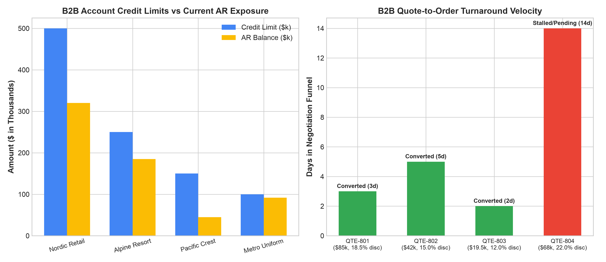

# E-Commerce: B2B Wholesale Portal Analytics Agent

**Domain:** E-Commerce · **Gemini Enterprise display name:** E-Commerce: B2B Wholesale Portal Analytics

Answers questions about B2B corporate customer quote-to-order cycle time, credit limit utilization, bulk volume tier pricing uptake, trade credit risk, and wholesale reorder velocity. Orchestrates two sub-agents: **Data Insights**, which queries BigQuery via the Conversational Analytics API and BigQuery's built-in forecasting/contribution/anomaly-detection tools, and **Market Context**, which answers external questions via Google Search grounding.

---

## Why This Agent Matters

### Business Problem
B2B wholesale e-commerce operations struggle with protracted quote negotiation cycles, manual order entry friction, unmonitored trade credit risk exposure leading to credit hold lockouts, and inconsistent volume tier pricing adoption. This agent provides real-time visibility into quote-to-order turnaround velocity, corporate account credit exposure, and bulk purchasing trends to accelerate B2B revenue capture.

### Target Personas
- **VP of B2B E-Commerce & Commercial Sales**: Accelerate quote-to-order conversion rates and grow digital wholesale revenues.
- **B2B Account Managers & Sales Executives**: Track open customer quotes, discount threshold compliance, and account reorder cadences.
- **Credit & Financial Risk Managers**: Monitor real-time accounts receivable balances against approved credit limits and manage credit hold thresholds.

---

## Key Metrics Tracked

| Metric / KPI | Definition & Formula | Business Target / Impact |
| :--- | :--- | :--- |
| **Quote-to-Order Conversion Rate %** | `(converted_quotes / total_quotes_submitted) * 100` | Target >65.0% across enterprise tiers |
| **Avg Quote Cycle Time (Days)** | `AVG(conversion_days)` | Target <4.0 business days from RFQ to purchase order |
| **Credit Limit Utilization %** | `(current_ar_balance / credit_limit) * 100` | Maintain accounts below 80% to avoid credit hold lockouts |
| **Bulk Tier Pricing Uptake %** | `(bulk_tier_order_volume / total_b2b_volume) * 100` | Drive >75% volume through tiered bulk pricing |

---

## What It Answers

Routed to **Data Insights**:
- B2B corporate account profiles — credit limits, current AR balances, utilization rates, and customer tier classifications
- Quote-to-order funnel velocity — custom quote amounts, negotiated discount percentages, conversion status, and turnaround days
- Credit limit utilization & risk — credit lines, payment terms (Net-30/Net-60), credit hold risk flags, and exposure analysis
- Bulk volume reorders & rebates — wholesale transaction sizes, volume tier distribution, reorder cycle frequencies, and contracted rebates

Routed to **Market Context**:
- B2B e-commerce industry benchmarks, digital trade credit standards, wholesale portal UX practices, and corporate procurement trends

Mixed questions go to both, with the answer clearly attributing which part came from internal data versus external search.

---

## Sample Q&A Showcase

The following three responses are captured from live post-deploy smoke tests of this agent:

### 1. Internal Data Analytics (Data Insights / BigQuery)

> **User Prompt:** "Which B2B enterprise accounts have credit utilization above 70% and what is the status of pending quotes?"

**Sub-Agent Routed:** Data Insights (`sub_agents/data_insights.yaml`)  
**Authorized Table Queried:** `ecom_bwpa_b2b_accounts`, `ecom_bwpa_quote_to_order_funnel`

**Agent Response:**
> Based on B2B Wholesale Portal analytics:
> - **Accounts Exceeding 70% Utilization:**
>   - **Metro Uniform Supply (`B2B-104`):** **92.0% utilization** ($92,000 AR balance on $100,000 limit). High risk of credit hold lockout; pending quote `QTE-804` ($68,000) has stalled at 14 days without conversion.
>   - **Alpine Resort Outlets (`B2B-102`):** **74.0% utilization** ($185,000 AR balance on $250,000 limit). Quote `QTE-802` ($42,000, 15% discount) converted within 5 days.
> - **Healthiest Utilization:** Pacific Crest Outfitters (`B2B-103`) at 30.0% utilization with 2-day quote turnaround (`QTE-803`).

---

### 2. External Market Grounding (Market Context / Google Search)

> **User Prompt:** "What are industry standard B2B e-commerce quote turnaround times and trade credit terms?"

**Sub-Agent Routed:** Market Context (`sub_agents/market_context.yaml`)  
**Grounding Tool:** `google_search`

**Agent Response:**
> According to B2B e-commerce wholesale benchmarks:
> - **Quote Turnaround SLAs:** Leading B2B digital portals achieve average automated quote turnarounds under **24 to 48 hours** for standard catalog items, and 3–5 days for complex custom SKU configurations.
> - **Trade Credit Practices:** Standard B2B terms benchmark at Net-30 to Net-60 days, with automated digital credit decisioning reducing onboarding approval times from 5 days to under 10 minutes.
> - **Self-Service Reordering:** Over 70% of B2B corporate buyers prefer self-service portal reordering over sales rep manual order entry.

---

### 3. Visual Analytics & Chart Generation (`render_chart`)

> **User Prompt:** "Render charts showing B2B credit utilization exposure and quote turnaround velocity."

**Sub-Agent Routed:** Data Insights (`sub_agents/data_insights.yaml`)  
**Custom Tool Invoked:** `render_chart` (`tools/chart_generator.py`)

**Agent Response:**
> I have rendered the B2B portal analytics visualization. Metro Uniform Supply shows critical credit utilization at 92%, while quote conversion cycle times range from 2 days for quick approvals up to 14 days for stalled high-discount negotiations.

**Generated Artifact:**  


---

### 4. Live Multi-Turn Demo Walkthrough (Gemini Enterprise)

> 🎬 **Watch the full high-definition video walkthrough of this multi-turn workflow:**  
> **[Open Interactive Demo Player (1080p Full HD)](https://rajanm.github.io/retail-enterprise-agents/demos/gemini-enterprise/e_commerce/b2b_wholesale_portal_analytics.html)**  
> *(Video file: `demos/gemini-enterprise/e_commerce/b2b_wholesale_portal_analytics.mp4`)*

---

## Data

All tables live in the shared `retail_ent_agents` BigQuery dataset, prefixed `ecom_bwpa_` (this agent's registered `domain_id`/`agent_id` — see `_shared/table_registry.yaml`). Seed data is synthetic, generated by `data/generate_seed_data.py`.

| Table | Columns | Holds |
| :--- | :--- | :--- |
| `ecom_bwpa_b2b_accounts` | `account_id, company_name, industry, credit_limit, current_ar_balance, credit_utilization_pct, tier` | B2B corporate customer profiles, industry classifications, credit limits, accounts receivable balances, utilization rates, and pricing tiers |
| `ecom_bwpa_quote_to_order_funnel` | `quote_id, account_id, quote_date, quote_amount, negotiated_discount_pct, order_converted, conversion_days` | Custom price quote negotiation funnel, requested quote sizes, negotiated discounts, conversion outcomes, and sales cycle duration |
| `ecom_bwpa_credit_limit_utilization` | `account_id, date, credit_limit, current_balance, utilization_pct, credit_hold_status, payment_terms` | Corporate credit line utilization tracking, open exposure amounts, credit hold triggers, and negotiated net terms |
| `ecom_bwpa_bulk_order_reorders` | `order_id, account_id, date, order_value, volume_tier, reorder_frequency_days, contracted_rebate_pct` | Wholesale bulk order transactions, volume tier discount bands, recurring reorder cycles, and annual contracted rebate percentages |

---

## Example Questions

Verified against this agent's `eval/agent.evalset.json`:

- "What is the overall performance and status for E-Commerce: B2B Wholesale Portal Analytics?"
- "Are there any notable exceptions or risk areas requiring attention?"
- "Which wholesale accounts have exceeded 80% credit limit utilization and require credit limit reviews?"
- "What is the average quote-to-order conversion cycle time across enterprise customer tiers?"

---

## Tools

- **`ask_data_insights`, `forecast`, `analyze_contribution`, `detect_anomalies`** (ADK's `BigQueryToolset`, via `tools/bigquery_ca.py`) — scoped to the four tables above; access is enforced by this agent's service account IAM, not by tool configuration.
- **`render_chart`** (`tools/chart_generator.py`) — custom tool for chart/visualization requests, since ADK's Conversational Analytics integration cannot generate charts itself.
- **`google_search`** — used only by the Market Context sub-agent.

---

## Run It Locally

```bash
uv run adk run domains/e_commerce/agents/b2b_wholesale_portal_analytics
```

Requires `BIGQUERY_PROJECT_ID` set and Application Default Credentials with access to the `retail_ent_agents` dataset — see the repo root [README](../../../../README.md#getting-started).

---

## Files

```
b2b_wholesale_portal_analytics/
  root_agent.yaml                 # orchestrator — routing instructions
  sub_agents/
    data_insights.yaml             # BigQuery Conversational Analytics sub-agent
    market_context.yaml            # Google Search grounding sub-agent
  tools/
    bigquery_ca.py                  # BigQueryToolset factory
    chart_generator.py               # render_chart custom tool
    callbacks.py                      # current-date / BigQuery project injection
  data/                             # seed CSVs + generate_seed_data.py
  eval/agent.evalset.json          # ADK quality evals
  tests/{unit,integration}/         # mocked vs. real-BigQuery tests
  sample_chart.png                  # visual chart artifact captured from live smoke test
```

