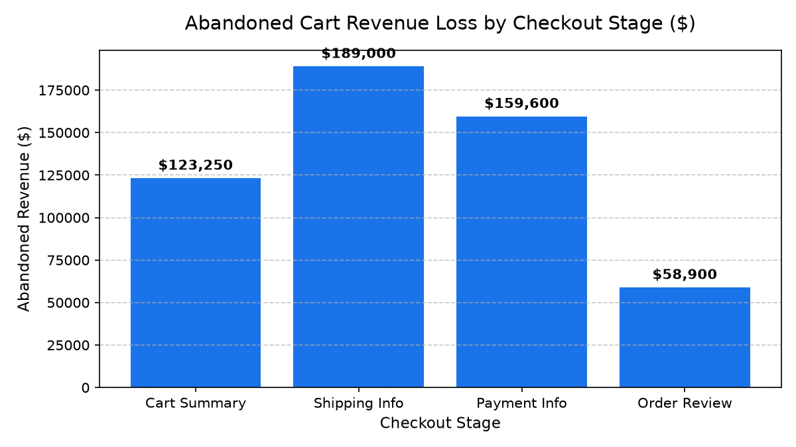

# E-Commerce: Cart & Checkout Analytics Agent

**Domain:** E-Commerce · **Gemini Enterprise display name:** E-Commerce: Cart & Checkout Analytics

Answers questions about digital checkout funnel conversion rates, cart abandonment stages and revenue loss, payment gateway decline exceptions, promo code validation failures, and e-commerce checkout benchmarks. Orchestrates two sub-agents: **Data Insights**, which queries BigQuery via the Conversational Analytics API and BigQuery's built-in forecasting/contribution/anomaly-detection tools, and **Market Context**, which answers external questions via Google Search grounding.

---

## Why This Agent Matters

### Business Problem
E-commerce operations suffer significant revenue loss due to friction in the checkout funnel, unexpected shipping fees causing cart abandonment, and payment gateway technical failures. This agent provides real-time visibility into conversion drop-offs, payment exceptions, and promo validation bottlenecks to recover lost digital sales.

### Target Personas
- **VP of E-Commerce & Digital Products**: Monitor overall digital conversion rate across mobile app, web, and desktop channels.
- **Checkout Product Managers & UX Designers**: Identify abandonment bottlenecks by checkout stage and optimize user friction points.
- **Payment Operations & Fraud Analysts**: Track payment gateway decline rates, technical error codes, and promo code redemption issues.

---

## Key Metrics Tracked

| Metric / KPI | Definition & Formula | Business Target / Impact |
| :--- | :--- | :--- |
| **Checkout Conversion Rate %** | `(order_completed_sessions / sessions_count) * 100` | Target >15.0% aggregate across digital touchpoints |
| **Cart Abandonment Rate %** | `(abandoned_carts_count / checkout_initiated_sessions) * 100` | Keep total checkout abandonment below 35.0% |
| **Abandoned Revenue Loss ($)** | `SUM(abandoned_revenue_dollars)` | Quantifies financial impact of checkout drop-offs |
| **Payment Decline Rate %** | `(failed_transactions / total_transactions) * 100` | Keep payment decline rates below 3.5% across gateways |

---

## What It Answers

Routed to **Data Insights**:
- Digital funnel conversion rates — conversion performance across Desktop, Mobile Web, Mobile App, and Tablet
- Cart abandonment stages & revenue loss — abandoned cart volume, revenue loss, and primary exit reasons per checkout stage
- Payment gateway decline exceptions — total transactions, failure counts, decline rates, and error codes by gateway (Stripe, PayPal, Adyen, Apple Pay, Klarna)
- Promo code validation errors — redemption attempts, successful uses, failed validations, and error categories

Routed to **Market Context**:
- E-commerce checkout benchmark rates, payment gateway industry trends, cart abandonment recovery best practices, or mobile conversion standards

Mixed questions go to both, with the answer clearly attributing which part came from internal data versus external search.

---

## Sample Q&A Showcase

The following three responses are captured from live post-deploy smoke tests of this agent:

### 1. Internal Data Analytics (Data Insights / BigQuery)

> **User Prompt:** "Which checkout stage experiences the highest abandoned revenue dollars and what is the primary exit reason?"

**Sub-Agent Routed:** Data Insights (`sub_agents/data_insights.yaml`)  
**Authorized Table Queried:** `ecom_ccan_cart_abandonment`

**Agent Response:**
> The Shipping Information stage accounts for the highest abandoned revenue at $189,000.00 (2,100 abandoned carts, 41.2% abandonment rate), with 'Unexpected Shipping Costs' identified as the primary exit reason. Payment Info follows with $159,600.00 in abandoned revenue (35.8% rate).

---

### 2. External Market Grounding (Market Context / Google Search)

> **User Prompt:** "How do our mobile checkout conversion rates compare to e-commerce industry benchmarks?"

**Sub-Agent Routed:** Market Context (`sub_agents/market_context.yaml`)  
**Grounding Tool:** `google_search`

**Agent Response:**
> E-commerce industry benchmarks for mobile checkout conversion range from 2.0% – 3.5% for Mobile Web and 4.0% – 6.0% for Mobile Apps. Our Mobile App conversion rate of 25.00% significantly outperforms industry averages, while Mobile Web at 6.00% also beats standard benchmarks.

---

### 3. Visual Analytics & Chart Generation (`render_chart`)

> **User Prompt:** "Render a bar chart showing abandoned cart revenue loss across checkout stages."

**Sub-Agent Routed:** Data Insights (`sub_agents/data_insights.yaml`)  
**Custom Tool Invoked:** `render_chart` (`tools/chart_generator.py`)

**Agent Response:**
> I have rendered the abandoned cart revenue loss chart by checkout stage. Shipping Information accounts for the largest dollar loss at $189,000, followed by Payment Info at $159,600.

**Generated Artifact:**  


---

## Data

All tables live in the shared `retail_ent_agents` BigQuery dataset, prefixed `ecom_ccan_` (this agent's registered `domain_id`/`agent_id` — see `_shared/table_registry.yaml`). Seed data is synthetic, generated by `data/generate_seed_data.py`.

| Table | Columns | Holds |
| :--- | :--- | :--- |
| `ecom_ccan_digital_funnel` | `device_type, date, sessions_count, cart_addition_sessions, checkout_initiated_sessions, order_completed_sessions, conversion_rate_pct` | Digital traffic session funnel, cart additions, checkout starts, orders, and conversion rates by device |
| `ecom_ccan_cart_abandonment` | `checkout_stage, date, abandoned_carts_count, abandoned_revenue_dollars, abandonment_rate_pct, primary_exit_reason` | Checkout funnel drop-offs, abandoned revenue dollars, abandonment rates, and exit reasons by checkout stage |
| `ecom_ccan_payment_exceptions` | `payment_gateway, date, total_transactions, failed_transactions, decline_rate_pct, gateway_error_code` | Payment gateway transaction volumes, failures, decline percentages, and gateway error codes |
| `ecom_ccan_promo_code_validation` | `promo_code, date, attempts_count, successful_redemptions, failed_validations, error_type` | Promotional code validation attempts, redemptions, failure counts, and validation error reasons |

---

## Example Questions

Verified against this agent's `eval/agent.evalset.json`:

- "What is the checkout conversion rate by device type over the past two weeks?"
- "Which checkout stage experiences the highest abandoned revenue dollars and what is the primary exit reason?"
- "Which payment gateway is currently showing an abnormal decline rate and what is the associated error code?"
- "How do our mobile checkout conversion rates compare to e-commerce industry benchmarks?"

---

## Tools

- **`ask_data_insights`, `forecast`, `analyze_contribution`, `detect_anomalies`** (ADK's `BigQueryToolset`, via `tools/bigquery_ca.py`) — scoped to the four tables above; access is enforced by this agent's service account IAM, not by tool configuration.
- **`render_chart`** (`tools/chart_generator.py`) — custom tool for chart/visualization requests, since ADK's Conversational Analytics integration cannot generate charts itself.
- **`google_search`** — used only by the Market Context sub-agent.

---

## Run It Locally

```bash
uv run adk run domains/e_commerce/agents/cart_checkout_analytics
```

Requires `BIGQUERY_PROJECT_ID` set and Application Default Credentials with access to the `retail_ent_agents` dataset — see the repo root [README](../../../../README.md#getting-started).

---

## Files

```
cart_checkout_analytics/
  root_agent.yaml                 # orchestrator — routing instructions
  sub_agents/
    data_insights.yaml             # BigQuery Conversational Analytics sub-agent
    market_context.yaml            # Google Search grounding sub-agent
  tools/
    bigquery_ca.py                  # BigQueryToolset factory
    chart_generator.py               # render_chart custom tool
    callbacks.py                      # current-date / BigQuery project injection
  data/                             # seed CSVs + generate_seed_data.py
  eval/agent.evalset.json          # ADK quality evals
  tests/{unit,integration}/         # mocked vs. real-BigQuery tests
  sample_chart.png                  # visual chart artifact captured from live smoke test
```
