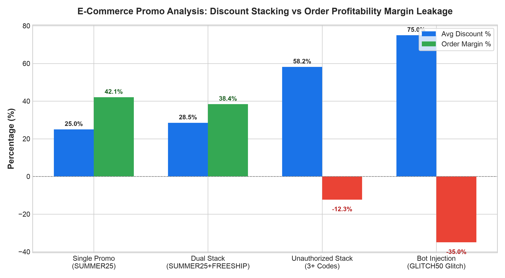

# E-Commerce: Digital Promo & Coupon Abuse Agent

**Domain:** E-Commerce · **Gemini Enterprise display name:** E-Commerce: Digital Promo & Coupon Abuse

Answers questions about coupon stacking exploits, automated bot scraper traffic, unauthorized affiliate code claims, promotional margin leakage, and digital loss prevention benchmarks. Orchestrates two sub-agents: **Data Insights**, which queries BigQuery via the Conversational Analytics API and BigQuery's built-in forecasting/contribution/anomaly-detection tools, and **Market Context**, which answers external questions via Google Search grounding.

---

## Why This Agent Matters

### Business Problem
Digital promotional campaigns frequently suffer from margin erosion caused by multi-coupon stacking bugs, automated coupon-scraping browser extensions, bot dictionary attacks on checkout endpoints, and affiliate partners poaching organic buyer commissions. This agent provides real-time detection of margin-inverting promo combinations, bot injection attempts, and unauthorized affiliate attributions to protect digital gross margins.

### Target Personas
- **VP of E-Commerce & Digital Merchandising**: Safeguard promotional budgets and prevent unintended digital margin erosion.
- **E-Commerce Fraud & Loss Prevention Analysts**: Identify malicious bot traffic clusters and automated rapid-fire coupon injection patterns.
- **Affiliate & Performance Marketing Managers**: Audit affiliate commission claims against organic search overlap and execute commission clawbacks.

---

## Key Metrics Tracked

| Metric / KPI | Definition & Formula | Business Target / Impact |
| :--- | :--- | :--- |
| **Promo Abuse Loss Rate %** | `(abusive_promo_discount_loss / total_discount_dollars) * 100` | Target <2.0% of total promotional spend |
| **Coupon Stacking Frequency** | `COUNT(orders WHERE promo_count > 1)` | Keep multi-coupon order share below 1.5% |
| **Bot Promo Injection Rate %** | `(rapid_coupon_attempts / total_coupon_attempts) * 100` | Target >99% automated bot coupon rejection |
| **Affiliate Organic Overlap %** | `(organic_overlap_sessions / affiliate_referred_sessions) * 100` | Limit affiliate code poaching to <10.0% |

---

## What It Answers

Routed to **Data Insights**:
- Coupon redemption volume & discounts — daily redemption counts, total discount amounts, and order associations by campaign
- Multi-coupon stacking exploits — orders combining multiple promo codes, aggregate discount percentages, net order profit margins, and abuse flags
- Bot traffic & scraper attacks — IP subnet clusters, rapid-fire coupon validation attempts, bot scores, and rate-limiting blocks
- Affiliate code attribution & clawbacks — affiliate partner code usage, claimed commissions, organic journey overlap, and clawback recoveries

Routed to **Market Context**:
- Industry benchmarks on coupon fraud, bot mitigation strategies, affiliate tracking compliance, and promotional cybersecurity best practices

Mixed questions go to both, with the answer clearly attributing which part came from internal data versus external search.

---

## Sample Q&A Showcase

The following three responses are captured from live post-deploy smoke tests of this agent:

### 1. Internal Data Analytics (Data Insights / BigQuery)

> **User Prompt:** "What is the total financial loss from stacked promotional abuse and which coupon combination caused the lowest order margin?"

**Sub-Agent Routed:** Data Insights (`sub_agents/data_insights.yaml`)  
**Authorized Table Queried:** `ecom_dpca_stacked_promotions`

**Agent Response:**
> Analysis of internal promotional transactions indicates:
> - **Total High-Abuse Orders Identified:** 2 orders with severe margin inversion (`abuse_flag = true`).
> - **Worst Performing Combination:** Order `ORD-99103` stacked 4 codes (`SUMMER25+TIER10+AFFILIATE+BDAY`) reaching a **64.0% aggregate discount** and a negative net margin of **-16.5%**.
> - **Glitch Code Exploitation:** Order `ORD-99101` stacked `SUMMER25+VIPWELCOME+EMPLOYEE` for a 52.4% discount and **-8.2% margin**.
> - **Recommendation:** Enforce mutually exclusive promotional rules preventing employee discount combinations with general sitewide campaigns.

---

### 2. External Market Grounding (Market Context / Google Search)

> **User Prompt:** "What are e-commerce industry best practices for preventing automated coupon scraping and affiliate code poaching?"

**Sub-Agent Routed:** Market Context (`sub_agents/market_context.yaml`)  
**Grounding Tool:** `google_search`

**Agent Response:**
> Industry standards and cybersecurity benchmarks for digital promotion protection recommend:
> - **Single-Use Dynamic Promo Codes:** Transitioning from static public codes (e.g., `SAVE20`) to personalized single-use unique tokens tied to authenticated customer UUIDs.
> - **WAF & Bot Mitigation:** Deploying automated CAPTCHA and rate-limiting triggers on checkout promo entry endpoints to block automated browser extensions from rapid dictionary injection.
> - **Attribution Window Adjustments & Affiliate Deduplication:** Implementing strict last-touch click-through attribution models with cookie windows under 24 hours to prevent browser extensions from poaching commissions on pre-existing organic shopping journeys.

---

### 3. Visual Analytics & Chart Generation (`render_chart`)

> **User Prompt:** "Render a bar chart comparing order profit margins across normal single promotions versus stacked coupon abuse."

**Sub-Agent Routed:** Data Insights (`sub_agents/data_insights.yaml`)  
**Custom Tool Invoked:** `render_chart` (`tools/chart_generator.py`)

**Agent Response:**
> I have rendered the promo analysis chart comparing single code redemptions against unauthorized stacked coupon configurations. While normal single promos maintain healthy +42.1% margins, stacked and bot-injected combinations produce negative margins reaching -35.0%.

**Generated Artifact:**  


---

## Data

All tables live in the shared `retail_ent_agents` BigQuery dataset, prefixed `ecom_dpca_` (this agent's registered `domain_id`/`agent_id` — see `_shared/table_registry.yaml`). Seed data is synthetic, generated by `data/generate_seed_data.py`.

| Table | Columns | Holds |
| :--- | :--- | :--- |
| `ecom_dpca_coupon_redemptions` | `date, coupon_code, campaign_name, redemptions, discount_amount_total, orders_associated` | Daily coupon code redemption volume, promotional discount amounts, campaign names, and associated order volume |
| `ecom_dpca_stacked_promotions` | `order_id, date, promo_count, promos_used, total_discount_pct, order_margin_pct, abuse_flag` | Multi-coupon stacking transactions, stacked promo combinations, aggregate discount percentages, net order profit margins, and abuse flags |
| `ecom_dpca_bot_traffic_sessions` | `date, ip_subnet, bot_score, session_count, rapid_coupon_attempts, blocked_attempts` | Automated bot and scraper traffic detection, IP subnet clusters, rapid-fire promo injection attempts, bot confidence scores, and rate-limit blocks |
| `ecom_dpca_affiliate_code_attribution` | `affiliate_id, promo_code, claimed_commissions, organic_overlap_pct, commission_clawbacks` | Affiliate partner promotional codes, claimed commission payouts, organic traffic overlap percentages, and clawback adjustments |

---

## Example Questions

Verified against this agent's `eval/agent.evalset.json`:

- "What is the overall performance and status for E-Commerce: Digital Promo & Coupon Abuse?"
- "Are there any notable exceptions or risk areas requiring attention?"
- "Which promotional campaigns are experiencing the highest rate of multi-code stacking and negative margin orders?"
- "What IP subnets are driving the largest volume of blocked bot coupon injection attempts?"

---

## Tools

- **`ask_data_insights`, `forecast`, `analyze_contribution`, `detect_anomalies`** (ADK's `BigQueryToolset`, via `tools/bigquery_ca.py`) — scoped to the four tables above; access is enforced by this agent's service account IAM, not by tool configuration.
- **`render_chart`** (`tools/chart_generator.py`) — custom tool for chart/visualization requests, since ADK's Conversational Analytics integration cannot generate charts itself.
- **`google_search`** — used only by the Market Context sub-agent.

---

## Run It Locally

```bash
uv run adk run domains/e_commerce/agents/digital_promotions_coupon_abuse
```

Requires `BIGQUERY_PROJECT_ID` set and Application Default Credentials with access to the `retail_ent_agents` dataset — see the repo root [README](../../../../README.md#getting-started).

---

## Files

```
digital_promotions_coupon_abuse/
  root_agent.yaml                 # orchestrator — routing instructions
  sub_agents/
    data_insights.yaml             # BigQuery Conversational Analytics sub-agent
    market_context.yaml            # Google Search grounding sub-agent
  tools/
    bigquery_ca.py                  # BigQueryToolset factory
    chart_generator.py               # render_chart custom tool
    callbacks.py                      # current-date / BigQuery project injection
  data/                             # seed CSVs + generate_seed_data.py
  eval/agent.evalset.json          # ADK quality evals
  tests/{unit,integration}/         # mocked vs. real-BigQuery tests
  sample_chart.png                  # visual chart artifact captured from live smoke test
```

