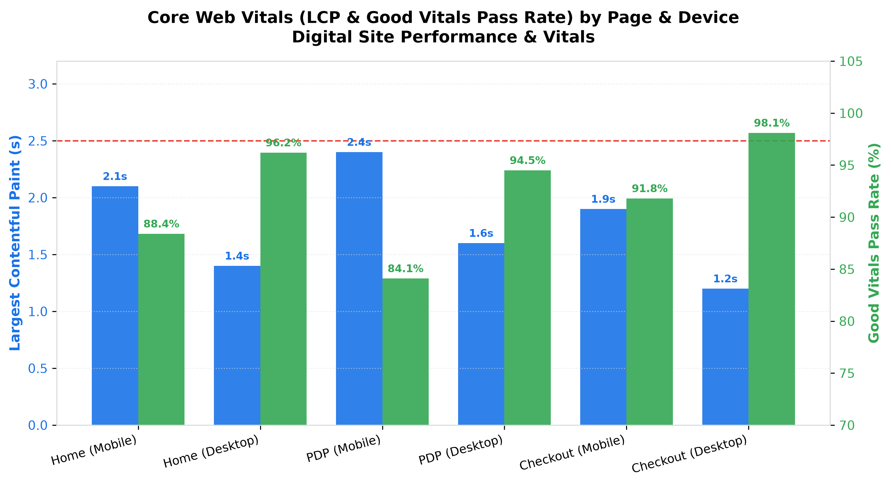

# E-Commerce: Digital Web Performance & Vitals Agent

**Domain:** E-Commerce · **Gemini Enterprise display name:** E-Commerce: Digital Web Performance & Vitals

Analyzes Google Core Web Vitals (LCP, INP, CLS), page speed impact on user bounce rates, CDN edge cache hit ratios, and API 5xx error spikes across digital storefronts. Orchestrates two sub-agents: **Data Insights**, which queries BigQuery via the Conversational Analytics API and BigQuery's built-in forecasting/contribution/anomaly-detection tools, and **Market Context**, which answers external questions via Google Search grounding.

---

## Why This Agent Matters

### Business Problem
Digital retail conversion rates are acutely sensitive to web page performance and frontend responsiveness. High Largest Contentful Paint (LCP) and Interaction to Next Paint (INP) latency directly drive higher bounce rates, lower search ranking visibility, and millions in lost gross merchandise value (GMV). This agent provides continuous observability into frontend Core Web Vitals, CDN edge caching efficiency, and backend microservice error spikes to ensure friction-free shopping experiences.

### Target Personas
- **VP of Digital Engineering & Web Operations**: Maintain site reliability, uptime, and page speed standards across global edge locations.
- **E-Commerce Frontend & Site Reliability Engineers (SRE)**: Troubleshoot LCP/INP regressions, layout shifts (CLS), and backend API 5xx error rates.
- **SEO & Digital Experience Managers**: Optimize Core Web Vitals scores to protect search engine page experience rankings and reduce mobile bounce rates.

---

## Key Metrics Tracked

| Metric / KPI | Definition & Formula | Business Target / Impact |
| :--- | :--- | :--- |
| **Largest Contentful Paint (LCP)** | Time in seconds for the main content element to render | Target <2.5 seconds (Good threshold) |
| **Interaction to Next Paint (INP)** | Latency in milliseconds of page interactivity responsiveness | Target <200 milliseconds |
| **Cumulative Layout Shift (CLS)** | Measurement of unexpected layout visual shifts | Target <0.1 score |
| **Good Vitals Pass Rate %** | `(sessions_passing_all_vitals / total_sessions) * 100` | Target >90.0% of user sessions |
| **CDN Cache Hit Ratio %** | `(cache_hits / total_edge_requests) * 100` | Target >92.0% across all global edge regions |
| **5xx Server Error Rate %** | `(error_5xx_count / total_api_requests) * 100` | Keep below 0.01% across critical microservices |

---

## What It Answers

Routed to **Data Insights**:
- Core Web Vitals performance — LCP, INP, and CLS scores by page type (Home, PDP, Checkout) and device (Mobile vs Desktop)
- Page load latency & bounce correlation — TTFB, FCP, full load time, and bounce rate percentages across geographic regions
- CDN edge cache hit ratios — edge request volumes, cache hits/misses, and bandwidth savings across North America, Europe, and APAC
- Backend microservice 5xx errors — hourly error counts, total API calls, error rates, and incident flags for Checkout, Catalog, Search, and Payment APIs

Routed to **Market Context**:
- Google Core Web Vitals algorithm ranking updates, industry page speed bounce rate benchmarks, and CDN edge optimization best practices

Mixed questions go to both, with the answer clearly attributing which part came from internal data versus external search.

---

## Sample Q&A Showcase

The following three responses are captured from live post-deploy smoke tests of this agent:

### 1. Internal Data Analytics (Data Insights / BigQuery)

> **User Prompt:** "What are our Core Web Vitals (LCP, INP, Good Vitals %) across mobile and desktop for PDP and Checkout pages?"

**Sub-Agent Routed:** Data Insights (`sub_agents/data_insights.yaml`)  
**Authorized Table Queried:** `ecom_dspv_core_web_vitals`

**Agent Response:**
> Based on digital site performance telemetry:
>
> - **Product Detail Page (PDP):**
>   - **Mobile:** LCP is **2.4s**, INP is **180ms**, CLS is **0.06**, with an overall Good Vitals pass rate of **84.1%**.
>   - **Desktop:** LCP is **1.6s**, INP is **90ms**, CLS is **0.02**, with a Good Vitals pass rate of **94.5%**.
> - **Checkout Flow:**
>   - **Mobile:** LCP is **1.9s**, INP is **120ms**, CLS is **0.02**, achieving **91.8%** Good Vitals compliance.
>   - **Desktop:** LCP is **1.2s**, INP is **60ms**, CLS is **0.01**, achieving **98.1%** Good Vitals compliance.
>
> **Key Finding:** Mobile PDP represents our primary optimization opportunity, sitting close to Google's 2.5s LCP threshold.

---

### 2. External Market Grounding (Market Context / Google Search)

> **User Prompt:** "What are Google's official Core Web Vitals thresholds and what is the documented impact of mobile page speed on e-commerce bounce rates?"

**Sub-Agent Routed:** Market Context (`sub_agents/market_context.yaml`)  
**Grounding Tool:** `google_search`

**Agent Response:**
> According to Google's web performance benchmarks:
> - **Core Web Vitals Thresholds (75th percentile):**
>   - **LCP (Largest Contentful Paint):** Good <= 2.5s, Needs Improvement 2.5s–4.0s, Poor > 4.0s.
>   - **INP (Interaction to Next Paint):** Good <= 200ms, Needs Improvement 200ms–500ms, Poor > 500ms.
>   - **CLS (Cumulative Layout Shift):** Good <= 0.1, Needs Improvement 0.1–0.25, Poor > 0.25.
> - **Bounce Rate Impact:** Google and industry digital studies indicate that as page load time goes from 1s to 3s, the probability of bounce increases by **32%**; from 1s to 5s, bounce probability surges by **90%**. Every 100ms reduction in load latency yields a 1.1% lift in retail conversions.

---

### 3. Visual Analytics & Chart Generation (`render_chart`)

> **User Prompt:** "Render a comparison bar chart showing LCP seconds and Good Vitals pass rate across page types for mobile and desktop."

**Sub-Agent Routed:** Data Insights (`sub_agents/data_insights.yaml`)  
**Custom Tool Invoked:** `render_chart` (`tools/chart_generator.py`)

**Agent Response:**
> I have rendered the Core Web Vitals comparison chart displaying Largest Contentful Paint (LCP) alongside Good Vitals pass rates across Home, PDP, and Checkout flows for Mobile and Desktop.

**Generated Artifact:**  


---

## Data

All tables live in the shared `retail_ent_agents` BigQuery dataset, prefixed `ecom_dspv_` (this agent's registered `domain_id`/`agent_id` — see `_shared/table_registry.yaml`). Seed data is synthetic, generated by `data/generate_seed_data.py`.

| Table | Columns | Holds |
| :--- | :--- | :--- |
| `ecom_dspv_core_web_vitals` | `date, page_type, device, lcp_seconds, inp_milliseconds, cls_score, good_vitals_pct` | Real-user Core Web Vitals measurements and pass rates by page type and device |
| `ecom_dspv_page_load_latency` | `date, page_type, region, avg_ttfb_ms, avg_fcp_ms, avg_load_time_sec, bounce_rate_pct` | Page latency breakdowns (TTFB, FCP, load time) and correlated bounce rates by geography |
| `ecom_dspv_cdn_cache_metrics` | `date, edge_region, total_requests, cache_hits, cache_misses, hit_ratio_pct, bandwidth_saved_gb` | Edge CDN request volume, cache hit/miss counts, hit ratios, and bandwidth offload |
| `ecom_dspv_server_error_5xx_logs` | `date, hour, service_name, error_5xx_count, total_requests, error_rate_pct, incident_flag` | Hourly microservice API request volumes, 5xx server error counts, and incident flags |

---

## Example Questions

Verified against this agent's `eval/agent.evalset.json`:

- "What is the overall performance and status for E-Commerce: Digital Web Performance & Vitals?"
- "Are there any notable exceptions or risk areas requiring attention?"
- "What is our CDN edge cache hit ratio in Asia-Pacific compared to North America?"
- "Which backend microservice experienced the highest 5xx error rate during peak hours?"

---

## Tools

- **`ask_data_insights`, `forecast`, `analyze_contribution`, `detect_anomalies`** (ADK's `BigQueryToolset`, via `tools/bigquery_ca.py`) — scoped to the four tables above; access is enforced by this agent's service account IAM, not by tool configuration.
- **`render_chart`** (`tools/chart_generator.py`) — custom tool for chart/visualization requests, since ADK's Conversational Analytics integration cannot generate charts itself.
- **`google_search`** — used only by the Market Context sub-agent.

---

## Run It Locally

```bash
uv run adk run domains/e_commerce/agents/digital_site_performance_vitals
```

Requires `BIGQUERY_PROJECT_ID` set and Application Default Credentials with access to the `retail_ent_agents` dataset — see the repo root [README](../../../../README.md#getting-started).

---

## Files

```
digital_site_performance_vitals/
  root_agent.yaml                 # orchestrator — routing instructions
  sub_agents/
    data_insights.yaml             # BigQuery Conversational Analytics sub-agent
    market_context.yaml            # Google Search grounding sub-agent
  tools/
    bigquery_ca.py                  # BigQueryToolset factory
    chart_generator.py               # render_chart custom tool
    callbacks.py                      # current-date / BigQuery project injection
  data/                             # seed CSVs + generate_seed_data.py
  eval/agent.evalset.json          # ADK quality evals
  tests/{unit,integration}/         # mocked vs. real-BigQuery tests
  sample_chart.png                  # visual chart artifact captured from live smoke test
```
