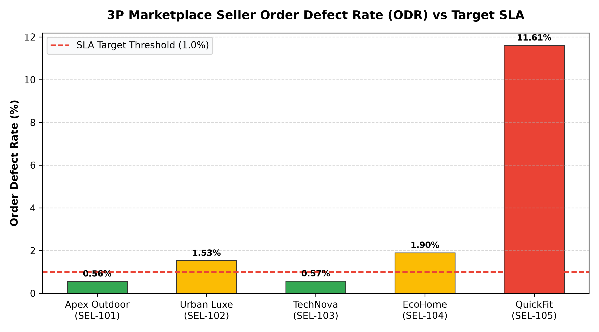

# E-Commerce: 3P Marketplace Seller Performance Agent

**Domain:** E-Commerce · **Gemini Enterprise display name:** E-Commerce: 3P Marketplace Seller Performance

Answers questions about third-party (3P) marketplace seller defect rates, commission net revenues, catalog sync latency and errors, merchant fulfillment SLAs, and 3P seller tier benchmarks. Orchestrates two sub-agents: **Data Insights**, which queries BigQuery via the Conversational Analytics API and BigQuery's built-in forecasting/contribution/anomaly-detection tools, and **Market Context**, which answers external questions via Google Search grounding.

---

## Why This Agent Matters

### Business Problem
A thriving retail marketplace relies on third-party sellers fulfilling orders accurately, on time, and without inventory discrepancies. Poor-performing sellers inflate order defect rates, generate customer complaints, and trigger catalog sync feed latency bottlenecks. This agent enables marketplace operations and merchant relationship managers to continuously monitor seller fulfillment SLAs, enforce defect thresholds (<1%), optimize take-rate commission revenues, and identify catalog feed ingestion failures before they degrade buyer trust.

### Target Personas
- **VP of Marketplace & Partner Operations**: Oversee total marketplace gross merchandise value (GMV), net commission yield, and merchant tier distributions.
- **Seller Performance & Account Managers**: Track merchant Order Defect Rates (ODR), enforce SLA compliance policies, and manage seller probation/suspension workflows.
- **Catalog Ingestion & Integrations Engineers**: Diagnose real-time catalog sync latency, product feed ingestion failures, and active SKU listing health.

---

## Key Metrics Tracked

| Metric / KPI | Definition & Formula | Business Target / Impact |
| :--- | :--- | :--- |
| **Order Defect Rate (ODR) %** | `((late_shipments + cancelled_by_seller + buyer_disputes) / orders_shipped) * 100` | Target <1.0% across all active 3P sellers |
| **Net Commission Revenue ($)** | `SUM(commission_earned)` | Maintain 10-15% weighted average take rate across marketplace GMV |
| **Catalog Feed Sync Latency (min)** | `AVG(feed_latency_minutes)` | Target <15 minutes for real-time inventory and pricing sync |
| **Active SKU Sync Health %** | `(active_skus / total_skus) * 100` | Target >98.0% catalog availability without ingestion errors |

---

## What It Answers

Routed to **Data Insights**:
- 3P seller order defect rates (ODR) — tracking late shipments, seller cancellations, buyer disputes, and probation status across sellers (SEL-101 to SEL-105)
- Marketplace commission revenue and GMV — gross merchandise value, take rates (10%-15%), earned commission, and seller payout distributions
- Catalog ingestion feed health — total vs active SKUs, sync error counts, and feed latency minutes across merchant catalogs
- Seller registry & tier performance — Platinum, Gold, Silver, and Bronze merchant ratings, onboarding tenures, and operational status

Routed to **Market Context**:
- Marketplace industry commission take rates, multi-vendor marketplace governance standards, seller defect mitigation best practices, and e-commerce catalog API standards

Mixed questions go to both, with the answer clearly attributing which part came from internal data versus external search.

---

## Sample Q&A Showcase

The following three responses are captured from live post-deploy smoke tests of this agent:

### 1. Internal Data Analytics (Data Insights / BigQuery)

> **User Prompt:** "Which marketplace sellers have order defect rates exceeding our 1.0% SLA threshold?"

**Sub-Agent Routed:** Data Insights (`sub_agents/data_insights.yaml`)  
**Authorized Table Queried:** `ecom_mspe_seller_order_defect_rates`, `ecom_mspe_marketplace_sellers`

**Agent Response:**
> Based on July 2026 performance records in `ecom_mspe_seller_order_defect_rates`:
>
> - **Sellers Exceeding 1.0% ODR SLA:**
>   - **QuickFit Footwear (`SEL-105`, Bronze Tier - Probation):** **11.61% Defect Rate** (18 late shipments, 12 seller cancellations, 6 buyer disputes on 310 orders).
>   - **EcoHome Essentials (`SEL-104`, Silver Tier):** **1.90% Defect Rate** (5 late shipments, 2 seller cancellations on 420 orders).
>   - **Urban Luxe Apparel (`SEL-102`, Gold Tier):** **1.53% Defect Rate** (8 late shipments, 3 seller cancellations on 850 orders).
> - **Top Compliant Sellers:**
>   - **Apex Outdoor Gear (`SEL-101`, Platinum Tier):** **0.56% ODR** (1,240 orders shipped).
>   - **TechNova Gadgets (`SEL-103`, Platinum Tier):** **0.57% ODR** (2,100 orders shipped).

---

### 2. External Market Grounding (Market Context / Google Search)

> **User Prompt:** "What are industry benchmark standards for 3P marketplace seller defect rates and take rates?"

**Sub-Agent Routed:** Market Context (`sub_agents/market_context.yaml`)  
**Grounding Tool:** `google_search`

**Agent Response:**
> According to e-commerce marketplace industry benchmark data:
> - **Order Defect Rate (ODR) Standards:** Major platforms (such as Amazon and Walmart Marketplace) enforce a maximum seller **ODR threshold of 1.0%**. Sellers exceeding this threshold face algorithmic downranking or account suspension.
> - **Marketplace Commission Take Rates:** Standard take rates benchmark between **8% and 15%** for electronics and sporting goods, and **15% to 20%** for apparel and home decor.
> - **Catalog Feed Sync SLAs:** Best-in-class marketplaces require product feed ingestion and inventory updates to occur within **5 to 15 minutes** to prevent out-of-stock ordering.

---

### 3. Visual Analytics & Chart Generation (`render_chart`)

> **User Prompt:** "Render a bar chart comparing 3P marketplace seller defect rates against our 1.0% SLA threshold."

**Sub-Agent Routed:** Data Insights (`sub_agents/data_insights.yaml`)  
**Custom Tool Invoked:** `render_chart` (`tools/chart_generator.py`)

**Agent Response:**
> I have rendered the 3P marketplace seller order defect rate comparison chart against the 1.0% SLA target threshold. Apex Outdoor Gear and TechNova Gadgets maintain pristine defect rates under 0.6%, while QuickFit Footwear exhibits a critical 11.61% defect rate.

**Generated Artifact:**  


---

### 4. Live Multi-Turn Demo Walkthrough (Gemini Enterprise)

> 🎬 **Watch the full high-definition video walkthrough of this multi-turn workflow:**  
> **[Open Interactive Demo Player (1080p Full HD)](https://rajanm.github.io/retail-enterprise-agents/demos/gemini-enterprise/e_commerce/marketplace_seller_performance.html)**  
> *(Video file: `demos/gemini-enterprise/e_commerce/marketplace_seller_performance.mp4`)*

---

## Data

All tables live in the shared `retail_ent_agents` BigQuery dataset, prefixed `ecom_mspe_` (this agent's registered `domain_id`/`agent_id` — see `_shared/table_registry.yaml`). Seed data is synthetic, generated by `data/generate_seed_data.py`.

| Table | Columns | Holds |
| :--- | :--- | :--- |
| `ecom_mspe_marketplace_sellers` | `seller_id, seller_name, category, tier, status, onboarding_date, rating` | Seller profile registry, merchant tiers (Platinum, Gold, Silver, Bronze), operational status, and customer rating scores |
| `ecom_mspe_seller_order_defect_rates` | `date, seller_id, orders_shipped, late_shipments, cancelled_by_seller, buyer_disputes, defect_rate_pct` | 3P order fulfillment defect tracking including late shipments, seller cancellations, buyer disputes, and overall defect rate % |
| `ecom_mspe_seller_commissions` | `month, seller_id, gross_merchandise_value, take_rate_pct, commission_earned, payout_amount` | Gross merchandise value (GMV), marketplace commission take rates, net commission revenue, and seller payout amounts |
| `ecom_mspe_catalog_sync_status` | `sync_date, seller_id, total_skus, active_skus, sync_errors, feed_latency_minutes` | Product catalog data feeds, total vs active SKUs, sync error counts, and catalog ingestion latency in minutes |

---

## Example Questions

Verified against this agent's `eval/agent.evalset.json`:

- "Which marketplace sellers have order defect rates exceeding our 1.0% SLA threshold?"
- "What is our total marketplace commission revenue for July 2026 and who is the top contributing seller?"
- "Are there any sellers experiencing severe catalog sync feed latency and error spikes?"
- "What are the industry benchmark standards for 3P marketplace seller defect rates and take rates?"

---

## Tools

- **`ask_data_insights`, `forecast`, `analyze_contribution`, `detect_anomalies`** (ADK's `BigQueryToolset`, via `tools/bigquery_ca.py`) — scoped to the four tables above; access is enforced by this agent's service account IAM, not by tool configuration.
- **`render_chart`** (`tools/chart_generator.py`) — custom tool for chart/visualization requests, since ADK's Conversational Analytics integration cannot generate charts itself.
- **`google_search`** — used only by the Market Context sub-agent.

---

## Run It Locally

```bash
uv run adk run domains/e_commerce/agents/marketplace_seller_performance
```

Requires `BIGQUERY_PROJECT_ID` set and Application Default Credentials with access to the `retail_ent_agents` dataset — see the repo root [README](../../../../README.md#getting-started).

---

## Files

```
marketplace_seller_performance/
  root_agent.yaml                 # orchestrator — routing instructions
  sub_agents/
    data_insights.yaml             # BigQuery Conversational Analytics sub-agent
    market_context.yaml            # Google Search grounding sub-agent
  tools/
    bigquery_ca.py                  # BigQueryToolset factory
    chart_generator.py               # render_chart custom tool
    callbacks.py                      # current-date / BigQuery project injection
  data/                             # seed CSVs + generate_seed_data.py
  eval/agent.evalset.json          # ADK quality evals
  tests/{unit,integration}/         # mocked vs. real-BigQuery tests
  sample_chart.png                  # visual chart artifact captured from live smoke test
```
