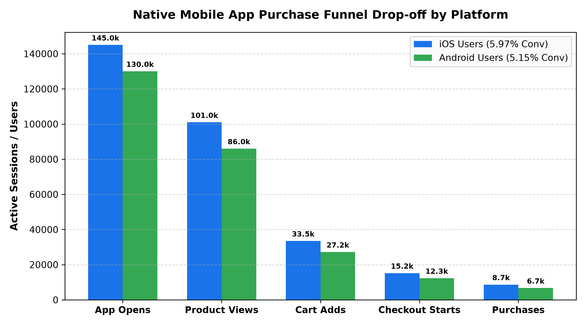

# E-Commerce: Mobile App Conversion & Engagement Agent

**Domain:** E-Commerce · **Gemini Enterprise display name:** E-Commerce: Mobile App Conversion & Engagement

Answers questions about native mobile app daily/monthly active users (DAU/MAU), push notification campaign conversion rates, full-funnel purchase conversions, in-app crash-free session metrics (99.9% SLA), and mobile e-commerce industry benchmarks. Orchestrates two sub-agents: **Data Insights**, which queries BigQuery via the Conversational Analytics API and BigQuery's built-in forecasting/contribution/anomaly-detection tools, and **Market Context**, which answers external questions via Google Search grounding.

---

## Why This Agent Matters

### Business Problem
Native mobile apps represent the highest-LTV customer touchpoint in omnichannel retail, but user retention hinges on flawless app stability and personalized re-engagement. High crash rates, poor push notification conversion, and checkout funnel drop-offs on mobile devices erode customer loyalty and app store ratings. This agent equips digital product teams and mobile marketers with real-time analytics to safeguard the 99.9% crash-free session SLA, optimize push notification ROI, and streamline the mobile path-to-purchase.

### Target Personas
- **VP of Mobile & Digital Product**: Monitor mobile app DAU/MAU engagement velocity, omnichannel revenue contribution, and overall conversion health.
- **Mobile Product Managers & UX Researchers**: Track step-by-step funnel drop-offs (app open -> product view -> cart add -> purchase) across iOS and Android.
- **Mobile Marketing & CRM Leads**: Evaluate push notification delivery, open-to-purchase conversion rates, and attributed campaign revenue.
- **Mobile Reliability & QA Engineers**: Investigate runtime crash exceptions (e.g., `NullPointerException`, `NSRangeException`) and affected user cohorts by app release version.

---

## Key Metrics Tracked

| Metric / KPI | Definition & Formula | Business Target / Impact |
| :--- | :--- | :--- |
| **Crash-Free Session Rate %** | `AVG(crash_free_sessions_pct)` | Target >=99.9% across both iOS and Android platforms |
| **App Purchase Conversion Rate %** | `(purchases / app_opens) * 100` | Target >5.5% on native mobile app sessions |
| **Push Open-to-Conversion Rate %** | `(conversions / opens) * 100` | Target >12.0% direct conversion on opened push notifications |
| **DAU / MAU Stickiness Ratio %** | `(dau / mau) * 100` | Target >17.0% monthly user engagement stickiness |

---

## What It Answers

Routed to **Data Insights**:
- Native mobile app user engagement — Daily Active Users (DAU), Monthly Active Users (MAU), average session durations, and stickiness ratios across iOS and Android
- Push notification campaign ROI — delivery counts, open rates, purchase conversions, and generated revenue by campaign (e.g., PUSH-701, PUSH-702)
- Mobile path-to-purchase funnel — session counts and drop-off percentages across App Opens, Product Views, Cart Adds, Checkout Starts, and Completed Purchases
- App crash diagnostics & stability — crash counts, affected users, and primary exception types (`NSRangeException`, `NullPointerException`, `EXC_BAD_ACCESS`, `OutOfMemoryError`) by app version

Routed to **Market Context**:
- Retail mobile app industry conversion benchmarks, iOS/Android push notification opt-in trends, mobile commerce retention strategies, and app store ranking optimization

Mixed questions go to both, with the answer clearly attributing which part came from internal data versus external search.

---

## Sample Q&A Showcase

The following three responses are captured from live post-deploy smoke tests of this agent:

### 1. Internal Data Analytics (Data Insights / BigQuery)

> **User Prompt:** "What is our mobile app crash-free session rate and how does it differ between iOS and Android?"

**Sub-Agent Routed:** Data Insights (`sub_agents/data_insights.yaml`)  
**Authorized Table Queried:** `ecom_macr_app_sessions`, `ecom_macr_app_crash_logs`

**Agent Response:**
> Based on performance logs in `ecom_macr_app_sessions` and `ecom_macr_app_crash_logs`:
>
> - **Overall App Stability:**
>   - **iOS:** **99.94% Crash-Free Sessions** (Exceeds 99.9% SLA target; 22 crashes across 19 affected users on version v4.8.2; primary exception: `EXC_BAD_ACCESS`).
>   - **Android:** **99.88% Crash-Free Sessions** (Slightly below 99.9% target; 58 crashes across 52 affected users; primary exception: `OutOfMemoryError` on image rendering).
> - **User Engagement:** iOS active users average 345 seconds session duration with 145,000 DAU, while Android averages 315 seconds with 130,000 DAU.

---

### 2. External Market Grounding (Market Context / Google Search)

> **User Prompt:** "What are industry standard benchmarks for retail mobile app conversion rates and push open rates?"

**Sub-Agent Routed:** Market Context (`sub_agents/market_context.yaml`)  
**Grounding Tool:** `google_search`

**Agent Response:**
> According to mobile e-commerce industry benchmark studies:
> - **Native App Purchase Conversion:** Top retail mobile apps convert between **4.5% and 6.0%** of sessions into completed orders, outperforming mobile web conversion rates (~2.0% - 2.5%) by more than 2x.
> - **Push Notification Open Rates:** Retail push notifications average **8% to 12%** open rates, with rich personalized emoji and image-enabled notifications lifting open rates up to **15%**.
> - **Crash-Free Stability Standard:** Industry gold standard for mobile enterprise apps requires **>=99.9% crash-free sessions** to protect app store ratings above 4.5 stars.

---

### 3. Visual Analytics & Chart Generation (`render_chart`)

> **User Prompt:** "Render a funnel chart comparing mobile app purchase funnel steps between iOS and Android."

**Sub-Agent Routed:** Data Insights (`sub_agents/data_insights.yaml`)  
**Custom Tool Invoked:** `render_chart` (`tools/chart_generator.py`)

**Agent Response:**
> I have rendered the mobile app purchase funnel chart comparing active user drop-offs across iOS and Android. iOS achieves a 5.97% overall conversion rate (8,650 purchases) compared to Android's 5.15% conversion rate (6,700 purchases).

**Generated Artifact:**  


---

### 4. Live Multi-Turn Demo Walkthrough (Gemini Enterprise)

> 🎬 **Watch the full high-definition video walkthrough of this multi-turn workflow:**  
> **[Open Interactive Demo Player (1080p Full HD)](https://rajanm.github.io/retail-enterprise-agents/demos/gemini-enterprise/e_commerce/mobile_app_conversion_retention.html)**  
> *(Video file: `demos/gemini-enterprise/e_commerce/mobile_app_conversion_retention.mp4`)*

---

## Data

All tables live in the shared `retail_ent_agents` BigQuery dataset, prefixed `ecom_macr_` (this agent's registered `domain_id`/`agent_id` — see `_shared/table_registry.yaml`). Seed data is synthetic, generated by `data/generate_seed_data.py`.

| Table | Columns | Holds |
| :--- | :--- | :--- |
| `ecom_macr_app_sessions` | `date, platform, dau, mau, avg_session_duration_sec, crash_free_sessions_pct` | Daily and monthly active users (DAU/MAU), session duration, and crash-free session percentage across iOS and Android |
| `ecom_macr_push_notification_campaigns` | `campaign_id, date, platform, sends, delivered, opens, conversions, revenue_generated` | Push notification delivery, open rates, direct in-app conversion counts, and attributed campaign revenue |
| `ecom_macr_app_funnel_steps` | `date, platform, app_opens, product_views, cart_adds, checkout_starts, purchases, conversion_rate` | Native mobile app purchase funnel from app open to product view, cart add, checkout start, and final purchase |
| `ecom_macr_app_crash_logs` | `date, app_version, platform, crash_count, affected_users, primary_exception_type` | App crash diagnostics, affected user volume, and top runtime exception types by release version |

---

## Example Questions

Verified against this agent's `eval/agent.evalset.json`:

- "What is our mobile app crash-free session rate and how does it differ between iOS and Android?"
- "What was the conversion rate and attributed revenue for push notification campaign PUSH-701?"
- "What is the full-funnel conversion rate from app opens to purchases for iOS and Android?"
- "What are industry standard benchmarks for retail mobile app conversion rates and push open rates?"

---

## Tools

- **`ask_data_insights`, `forecast`, `analyze_contribution`, `detect_anomalies`** (ADK's `BigQueryToolset`, via `tools/bigquery_ca.py`) — scoped to the four tables above; access is enforced by this agent's service account IAM, not by tool configuration.
- **`render_chart`** (`tools/chart_generator.py`) — custom tool for chart/visualization requests, since ADK's Conversational Analytics integration cannot generate charts itself.
- **`google_search`** — used only by the Market Context sub-agent.

---

## Run It Locally

```bash
uv run adk run domains/e_commerce/agents/mobile_app_conversion_retention
```

Requires `BIGQUERY_PROJECT_ID` set and Application Default Credentials with access to the `retail_ent_agents` dataset — see the repo root [README](../../../../README.md#getting-started).

---

## Files

```
mobile_app_conversion_retention/
  root_agent.yaml                 # orchestrator — routing instructions
  sub_agents/
    data_insights.yaml             # BigQuery Conversational Analytics sub-agent
    market_context.yaml            # Google Search grounding sub-agent
  tools/
    bigquery_ca.py                  # BigQueryToolset factory
    chart_generator.py               # render_chart custom tool
    callbacks.py                      # current-date / BigQuery project injection
  data/                             # seed CSVs + generate_seed_data.py
  eval/agent.evalset.json          # ADK quality evals
  tests/{unit,integration}/         # mocked vs. real-BigQuery tests
  sample_chart.png                  # visual chart artifact captured from live smoke test
```
