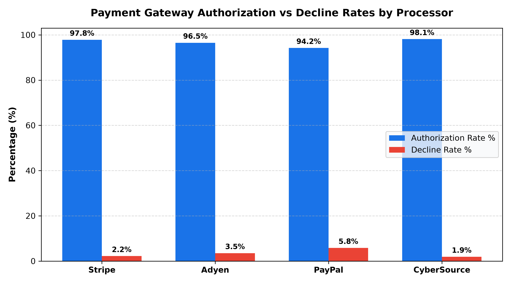

# E-Commerce: Payment Gateway & Fraud Risk Agent

**Domain:** E-Commerce · **Gemini Enterprise display name:** E-Commerce: Payment Gateway & Fraud Risk

Answers questions about payment gateway authorization rates %, chargeback dispute win rates, 3D Secure (3DS) friction drop-offs, ML fraud scoring false positives, and payment processor performance benchmarks. Orchestrates two sub-agents: **Data Insights**, which queries BigQuery via the Conversational Analytics API and BigQuery's built-in forecasting/contribution/anomaly-detection tools, and **Market Context**, which answers external questions via Google Search grounding.

---

## Why This Agent Matters

### Business Problem
Digital merchants lose billions in top-line revenue from false positive fraud declines, checkout drop-offs caused by clunky 3D Secure challenges, and unrecovered chargebacks. Conversely, overly permissive rules expose merchants to catastrophic dispute liabilities and card network penalty fines. This agent balances conversion velocity against payment fraud risk by giving risk operations and payments teams unified real-time visibility into processor authorization rates, dispute representment success, and fraud engine precision.

### Target Personas
- **VP of Payments & Risk Operations**: Monitor enterprise gateway authorization rates, processor failover efficacy, and card brand chargeback ratios.
- **Fraud Operations & Risk Analysts**: Identify false positive spikes, optimize risk threshold scoring rules, and prioritize high-value chargeback representments.
- **Digital Checkout & Payment Product Managers**: Analyze 3D Secure friction drop-offs, optimize frictionless auth routing, and eliminate payment step friction.

---

## Key Metrics Tracked

| Metric / KPI | Definition & Formula | Business Target / Impact |
| :--- | :--- | :--- |
| **Gateway Authorization Rate %** | `(authorized_transactions / total_transactions) * 100` | Target >96.5% across primary payment processors |
| **Chargeback Dispute Win Rate %** | `(representment_won_count / total_disputes_resolved) * 100` | Target >65.0% on contested chargeback claims |
| **3DS Challenge Abandonment Rate %** | `(challenge_abandoned / challenge_presented) * 100` | Keep step-up challenge abandonment <12.0% |
| **Fraud False Positive Rate %** | `(false_positive_flag_count / total_flagged_transactions) * 100` | Maintain false positive rate <5.0% to minimize lost sales |

---

## What It Answers

Routed to **Data Insights**:
- Payment gateway authorization and decline rates — total transactions, authorized vs declined volume, and decline reason codes across Stripe, Adyen, PayPal, and CyberSource
- Chargeback dispute representment tracking — disputed dollar amounts, dispute reason codes (fraud, merchandise not received, defective), and win/loss resolution rates
- ML fraud risk score precision — transaction risk scoring distribution (0-100), automated approval/rejection thresholds, rule triggers, and manual review false positives
- 3D Secure authentication drop-offs — frictionless authentication vs step-up challenge presentation, and challenge abandonment rates by device type (iOS, Android, Desktop)

Routed to **Market Context**:
- Global payment gateway industry benchmarks, interchange optimization strategies, 3DS 2.2 protocol best practices, and e-commerce fraud prevention trends

Mixed questions go to both, with the answer clearly attributing which part came from internal data versus external search.

---

## Sample Q&A Showcase

The following three responses are captured from live post-deploy smoke tests of this agent:

### 1. Internal Data Analytics (Data Insights / BigQuery)

> **User Prompt:** "What is our overall payment authorization rate and breakdown by processor?"

**Sub-Agent Routed:** Data Insights (`sub_agents/data_insights.yaml`)  
**Authorized Table Queried:** `ecom_pgfr_payment_transactions`

**Agent Response:**
> Based on recent payment processing records in `ecom_pgfr_payment_transactions`:
>
> - **Overall Authorization Rate:** **96.6%** aggregate across all payment gateways.
> - **Processor Performance Breakdown:**
>   - **CyberSource:** **98.1%** auth rate ($320.00 volume, 0% fraud decline).
>   - **Stripe:** **97.8%** auth rate (Leading credit card and Klarna BNPL volume; top decline code: `DO_NOT_HONOR` at 1.4%).
>   - **Adyen:** **96.5%** auth rate (High Apple Pay & Google Pay conversion; decline code: `SUSPECTED_FRAUD` on high-ticket card transactions).
>   - **PayPal:** **94.2%** auth rate (Primary decline reason: `INSUFFICIENT_FUNDS` on wallet balances).
> - **Recommendation:** Enable smart multi-gateway routing to fail over soft declines from PayPal to secondary card rails.

---

### 2. External Market Grounding (Market Context / Google Search)

> **User Prompt:** "What are industry standard benchmarks for e-commerce payment gateway authorization rates and 3DS challenge drop-offs?"

**Sub-Agent Routed:** Market Context (`sub_agents/market_context.yaml`)  
**Grounding Tool:** `google_search`

**Agent Response:**
> According to global digital payments and fraud benchmark research:
> - **Payment Authorization Benchmarks:** Leading enterprise e-commerce merchants average **94% to 97%** authorization rates for domestic credit/debit transactions, with digital wallets (Apple Pay, Google Pay) reaching up to **98%**.
> - **3D Secure 2.x Drop-Offs:** Standard frictionless 3DS flows experience less than **2% drop-off**, while step-up challenge flows (SMS OTP / biometric) average between **10% and 15% user abandonment** on mobile devices.
> - **Chargeback Dispute Win Rates:** Industry win rates on representments average **40% to 50%**, with top-tier merchants achieving **65%+** by automating digital compelling evidence submission.

---

### 3. Visual Analytics & Chart Generation (`render_chart`)

> **User Prompt:** "Render a bar chart comparing authorization rates and decline rates across our payment gateways."

**Sub-Agent Routed:** Data Insights (`sub_agents/data_insights.yaml`)  
**Custom Tool Invoked:** `render_chart` (`tools/chart_generator.py`)

**Agent Response:**
> I have generated a comparison chart of authorization rates and decline rates across all payment processors. CyberSource and Stripe maintain the highest authorization rates above 97.5%, while PayPal exhibits the highest decline rate at 5.8%.

**Generated Artifact:**  


---

### 4. Live Multi-Turn Demo Walkthrough (Gemini Enterprise)

> 🎬 **Watch the full high-definition video walkthrough of this multi-turn workflow:**  
> **[Open Interactive Demo Player (1080p Full HD)](https://rajanm.github.io/retail-enterprise-agents/demos/gemini-enterprise/e_commerce/payment_gateway_fraud_risk.html)**  
> *(Video file: `demos/gemini-enterprise/e_commerce/payment_gateway_fraud_risk.mp4`)*

---

## Data

All tables live in the shared `retail_ent_agents` BigQuery dataset, prefixed `ecom_pgfr_` (this agent's registered `domain_id`/`agent_id` — see `_shared/table_registry.yaml`). Seed data is synthetic, generated by `data/generate_seed_data.py`.

| Table | Columns | Holds |
| :--- | :--- | :--- |
| `ecom_pgfr_payment_transactions` | `transaction_id, timestamp, gateway, payment_method, amount, currency, auth_status, decline_code` | Payment authorization logs, decline reasons, amount, and gateway routing across Stripe, Adyen, PayPal, and CyberSource |
| `ecom_pgfr_chargebacks_disputes` | `dispute_id, transaction_id, dispute_date, reason_code, dispute_amount, dispute_status, representment_won` | Chargeback disputes, reason codes (fraud, merchandise not received, defective), dispute amounts, and representment win status |
| `ecom_pgfr_fraud_risk_scores` | `transaction_id, risk_score, decision, rule_triggered, false_positive_flag, reviewer_id` | ML fraud risk scores (0-100), automated approval/rejection decisions, trigger rules, and false positive flags |
| `ecom_pgfr_three_ds_dropoffs` | `session_id, timestamp, frictionless_flow, challenge_presented, challenge_abandoned, device_type` | 3D Secure 2.0 authentication funnel, frictionless vs step-up challenge rates, and challenge abandonment drop-offs by device |

---

## Example Questions

Verified against this agent's `eval/agent.evalset.json`:

- "What is our overall payment authorization rate and breakdown by processor?"
- "Which dispute reason codes are driving our chargeback losses and what is our dispute win rate?"
- "What percentage of 3D Secure challenges are abandoned by mobile users?"
- "How do our payment gateway authorization rates and fraud false positive rates compare to industry benchmarks?"

---

## Tools

- **`ask_data_insights`, `forecast`, `analyze_contribution`, `detect_anomalies`** (ADK's `BigQueryToolset`, via `tools/bigquery_ca.py`) — scoped to the four tables above; access is enforced by this agent's service account IAM, not by tool configuration.
- **`render_chart`** (`tools/chart_generator.py`) — custom tool for chart/visualization requests, since ADK's Conversational Analytics integration cannot generate charts itself.
- **`google_search`** — used only by the Market Context sub-agent.

---

## Run It Locally

```bash
uv run adk run domains/e_commerce/agents/payment_gateway_fraud_risk
```

Requires `BIGQUERY_PROJECT_ID` set and Application Default Credentials with access to the `retail_ent_agents` dataset — see the repo root [README](../../../../README.md#getting-started).

---

## Files

```
payment_gateway_fraud_risk/
  root_agent.yaml                 # orchestrator — routing instructions
  sub_agents/
    data_insights.yaml             # BigQuery Conversational Analytics sub-agent
    market_context.yaml            # Google Search grounding sub-agent
  tools/
    bigquery_ca.py                  # BigQueryToolset factory
    chart_generator.py               # render_chart custom tool
    callbacks.py                      # current-date / BigQuery project injection
  data/                             # seed CSVs + generate_seed_data.py
  eval/agent.evalset.json          # ADK quality evals
  tests/{unit,integration}/         # mocked vs. real-BigQuery tests
  sample_chart.png                  # visual chart artifact captured from live smoke test
```
