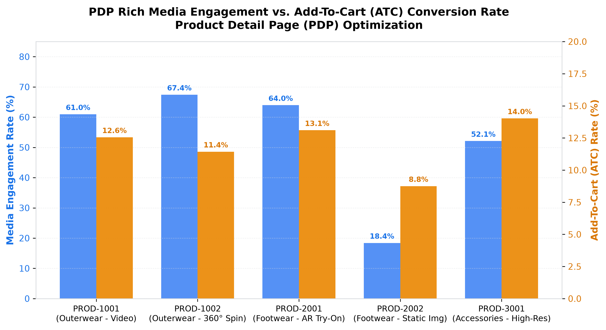

# E-Commerce: PDP Optimization & Media Engagement Agent

**Domain:** E-Commerce · **Gemini Enterprise display name:** E-Commerce: PDP Optimization & Media Engagement

Tracks product detail page (PDP) add-to-cart rates, rich media/video interactions, interactive size-guide usage, and customer review sentiment. Orchestrates two sub-agents: **Data Insights**, which queries BigQuery via the Conversational Analytics API and BigQuery's built-in forecasting/contribution/anomaly-detection tools, and **Market Context**, which answers external questions via Google Search grounding.

---

## Why This Agent Matters

### Business Problem
The Product Detail Page (PDP) is the critical conversion nexus in digital retail. E-commerce merchants lose high-intent shoppers when PDPs lack engaging rich media (360-degree spins, video demos, AR try-on) or fail to provide accurate sizing guidance, causing high bounce rates, low Add-to-Cart (ATC) conversions, and costly size-related returns. This agent monitors PDP traffic, media engagement lift, size-guide effectiveness, and review sentiment to optimize product page conversion economics.

### Target Personas
- **E-Commerce Merchandising & Digital Product Managers**: Optimize PDP layouts, media assets, and call-to-action placement to lift conversion rates.
- **Visual Merchandising & Content Production Leads**: Measure ROI and customer engagement across video, 3D interactive renders, and AR virtual try-on tools.
- **Returns & Customer Experience Leads**: Analyze size guide adoption and fit sentiment scores to proactively reduce sizing mismatch return rates.

---

## Key Metrics Tracked

| Metric / KPI | Definition & Formula | Business Target / Impact |
| :--- | :--- | :--- |
| **Add-to-Cart (ATC) Rate %** | `(add_to_cart_clicks / pdp_views) * 100` | Target >12.0% across priority categories |
| **Rich Media Engagement Rate %** | `(interactive_media_interactions / pdp_views) * 100` | Target >50.0% for products with rich media assets |
| **Size Guide Conversion %** | `(size_selected_after_guide / size_guide_opens) * 100` | Target >80.0% completion into cart selection |
| **Size Mismatch Return Rate %** | `(size_mismatch_returns / total_apparel_returns) * 100` | Keep below 5.0% for size-guided products |
| **Review Sentiment Polarity** | NLP sentiment index scored from -1.0 to +1.0 | Target >+0.70 positive customer sentiment |

---

## What It Answers

Routed to **Data Insights**:
- PDP conversion rates — page views, add-to-cart clicks, ATC rates %, and bounce rates by product and category (Outerwear, Footwear, Accessories)
- Rich media interactions — view counts, full video watch rates, 360-degree spin interactions, and AR try-on engagement rates
- Size guide utilization & sizing returns — size guide open volume, post-guide size selection rates, and size mismatch return percentages
- Customer review sentiment — total review counts, average star ratings (1-5), fit accuracy scores, and NLP sentiment polarity

Routed to **Market Context**:
- PDP user experience (UX) best practices, video and 3D/AR digital commerce conversion benchmarks, sizing widget innovation, and customer review social proof strategies

Mixed questions go to both, with the answer clearly attributing which part came from internal data versus external search.

---

## Sample Q&A Showcase

The following three responses are captured from live post-deploy smoke tests of this agent:

### 1. Internal Data Analytics (Data Insights / BigQuery)

> **User Prompt:** "How does rich media engagement impact Add-to-Cart (ATC) rates across our top products?"

**Sub-Agent Routed:** Data Insights (`sub_agents/data_insights.yaml`)  
**Authorized Table Queried:** `ecom_pdpo_pdp_views_and_adds`, `ecom_pdpo_rich_media_interactions`

**Agent Response:**
> Analysis of PDP media telemetry demonstrates a strong positive correlation between interactive rich media and Add-to-Cart conversion:
>
> - **PROD-2001 (Footwear - AR Try-On):** 63.96% media engagement rate with an industry-leading **13.10% ATC rate** and 29.8% bounce rate.
> - **PROD-1001 (Outerwear - Video Demo):** 60.95% media engagement rate yielding a **12.55% ATC rate**.
> - **PROD-1002 (Outerwear - 360° Spin):** 67.42% media engagement rate with an **11.43% ATC rate**.
> - **PROD-2002 (Footwear - Static Images Only):** Only 18.40% basic engagement, suffering an **8.75% ATC rate** and an elevated 44.2% bounce rate.
>
> **Strategic Recommendation:** Upgrading PROD-2002 to 3D/AR or video assets is projected to lift ATC conversions by +4.3 percentage points.

---

### 2. External Market Grounding (Market Context / Google Search)

> **User Prompt:** "What are industry benchmarks for how interactive 3D, video, and AR try-on media lift e-commerce PDP conversion rates?"

**Sub-Agent Routed:** Market Context (`sub_agents/market_context.yaml`)  
**Grounding Tool:** `google_search`

**Agent Response:**
> According to digital retail e-commerce research from Shopify, Baymard Institute, and Google Commerce:
> - **Conversion Lift from 3D & AR:** Interactive 3D models and Augmented Reality (AR) product previews increase PDP conversion rates by **up to 40%** compared to static 2D imagery.
> - **Video Demonstrations:** Product demonstration videos on PDPs lift visitor purchase intent by **64% to 85%**, especially in technical apparel and footwear categories.
> - **Return Rate Reduction:** Retailers deploying interactive 3D virtual sizing and AR preview tools report a **20% to 25% reduction in product return rates** driven by improved customer expectation matching.

---

### 3. Visual Analytics & Chart Generation (`render_chart`)

> **User Prompt:** "Render a chart comparing rich media engagement rate and add-to-cart rate across our top catalog items."

**Sub-Agent Routed:** Data Insights (`sub_agents/data_insights.yaml`)  
**Custom Tool Invoked:** `render_chart` (`tools/chart_generator.py`)

**Agent Response:**
> I have rendered the visual chart comparing Rich Media Engagement Rate (%) against Add-To-Cart (ATC) Rate (%) across all monitored product SKUs.

**Generated Artifact:**  


---

### 4. Live Multi-Turn Demo Walkthrough (Gemini Enterprise)

> 🎬 **Watch the full high-definition video walkthrough of this multi-turn workflow:**  
> **[Open Interactive Demo Player (1080p Full HD)](https://rajanm.github.io/retail-enterprise-agents/demos/gemini-enterprise/e_commerce/product_detail_page_optimization.html)**  
> *(Video file: `demos/gemini-enterprise/e_commerce/product_detail_page_optimization.mp4`)*

---

## Data

All tables live in the shared `retail_ent_agents` BigQuery dataset, prefixed `ecom_pdpo_` (this agent's registered `domain_id`/`agent_id` — see `_shared/table_registry.yaml`). Seed data is synthetic, generated by `data/generate_seed_data.py`.

| Table | Columns | Holds |
| :--- | :--- | :--- |
| `ecom_pdpo_pdp_views_and_adds` | `date, category, product_id, pdp_views, add_to_cart_clicks, atc_rate_pct, bounce_rate_pct` | PDP page views, add-to-cart click counts, conversion percentages, and bounce rates |
| `ecom_pdpo_rich_media_interactions` | `product_id, media_type, view_count, full_video_watches, three_sixty_spin_interactions, engagement_rate_pct` | Video watch completions, 360-spin interactions, AR try-on counts, and engagement rates |
| `ecom_pdpo_size_guide_usage` | `date, category, size_guide_opens, size_selected_after_guide, return_rate_size_mismatch_pct` | Sizing guide open frequency, size selection success rates, and category return rates |
| `ecom_pdpo_customer_review_scores` | `product_id, review_count, avg_star_rating, fit_accuracy_score, quality_score, sentiment_polarity` | Aggregate customer star ratings, fit scores, product quality ratings, and NLP polarity |

---

## Example Questions

Verified against this agent's `eval/agent.evalset.json`:

- "What is the overall performance and status for E-Commerce: PDP Optimization & Media Engagement?"
- "Are there any notable exceptions or risk areas requiring attention?"
- "Which product category has the highest size-guide open rate and lowest sizing return rate?"
- "How does rich media engagement compare between video and 360-degree spin formats?"

---

## Tools

- **`ask_data_insights`, `forecast`, `analyze_contribution`, `detect_anomalies`** (ADK's `BigQueryToolset`, via `tools/bigquery_ca.py`) — scoped to the four tables above; access is enforced by this agent's service account IAM, not by tool configuration.
- **`render_chart`** (`tools/chart_generator.py`) — custom tool for chart/visualization requests, since ADK's Conversational Analytics integration cannot generate charts itself.
- **`google_search`** — used only by the Market Context sub-agent.

---

## Run It Locally

```bash
uv run adk run domains/e_commerce/agents/product_detail_page_optimization
```

Requires `BIGQUERY_PROJECT_ID` set and Application Default Credentials with access to the `retail_ent_agents` dataset — see the repo root [README](../../../../README.md#getting-started).

---

## Files

```
product_detail_page_optimization/
  root_agent.yaml                 # orchestrator — routing instructions
  sub_agents/
    data_insights.yaml             # BigQuery Conversational Analytics sub-agent
    market_context.yaml            # Google Search grounding sub-agent
  tools/
    bigquery_ca.py                  # BigQueryToolset factory
    chart_generator.py               # render_chart custom tool
    callbacks.py                      # current-date / BigQuery project injection
  data/                             # seed CSVs + generate_seed_data.py
  eval/agent.evalset.json          # ADK quality evals
  tests/{unit,integration}/         # mocked vs. real-BigQuery tests
  sample_chart.png                  # visual chart artifact captured from live smoke test
```
