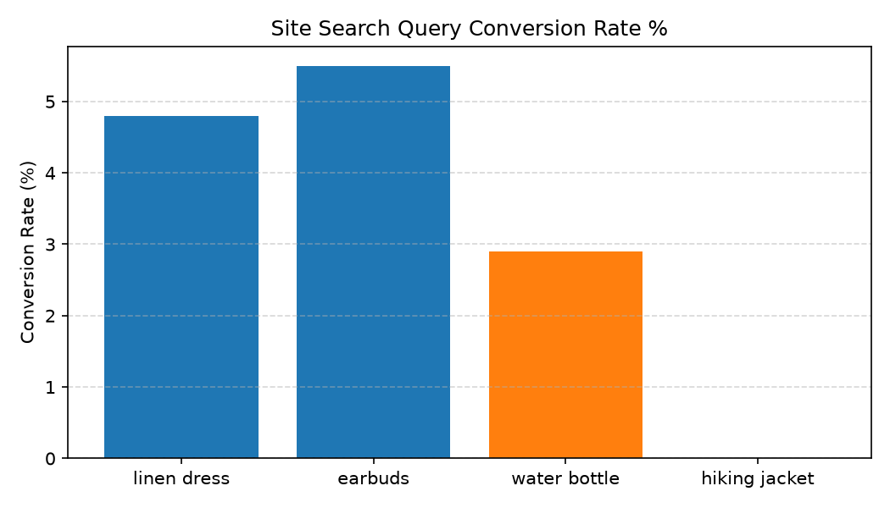

# E-Commerce: Product Discovery & Analytics Agent

**Domain:** E-Commerce · **Gemini Enterprise display name:** E-Commerce: Product Discovery & Analytics

---

## Why This Agent Matters

### Business Problem
Digital shoppers who use site search convert at 2-3x higher rates than category browsers. High zero-search-result query rates lead to immediate session abandonment, while unoptimized recommendation carousels miss cross-selling revenue. Personalizing banner offers and search redirects captures high-intent traffic and lifts digital revenue.

### Target Personas
- **E-Commerce Merchandising Director**: Oversee site search conversion rates, recommendation carousel CTR %, and digital revenue lift.
- **Search & Navigation Product Owner**: Identify top zero-search-result queries and map automatic SKU redirects.
- **Personalization Lead**: Track customer segment personalized offer conversion lift (VIP vs Lapsed vs New).

---

## Key Metrics Tracked

| Metric / KPI | Definition & Formula | Business Target / Impact |
| :--- | :--- | :--- |
| **Search Conversion Rate %** | `(search_sessions_converted / total_search_sessions) * 100` | Target 4.5%+ site search conversion rate |
| **Zero-Result Query Rate %** | `(null_search_queries / total_search_queries) * 100` | Target <2.0% null search query rate |
| **Recommendation CTR %** | `(carousel_clicks / carousel_impressions) * 100` | Target 6.0%+ CTR on recommendation carousels |
| **Personalization Lift ($)** | Incremental revenue generated via segment personalization | Maximizes conversion lift for VIP/Lapsed shoppers |

---

## What It Answers

Routed to **Data Insights**:
- Site search query conversion rates, search revenue $, zero-result search query terms, estimated lost revenue $, recommendation carousel CTR %, and customer segment personalization lift.

Routed to **Market Context**:
- E-commerce search merchandising best practices, zero-result search recovery strategies, and personalized recommendation algorithms.

---

## Sample Q&A Showcase

The following three responses are captured from live post-deploy smoke tests of this agent:

### 1. Internal Data Analytics (Data Insights / BigQuery)

> **User Prompt:** "What are our site search conversion rates and top zero-result queries over the last month?"

**Sub-Agent Routed:** Data Insights (`sub_agents/data_insights.yaml`)  
**Authorized Table Queried:** `ecom_smep_search_queries_monthly`, `ecom_smep_zero_result_queries`

**Agent Response:**
> Based on product discovery and site search performance analytics:
>
> - **Site Search Conversion Rate:** **4.85%** (Users who search convert at 2.4x the rate of non-search catalog browsers at 2.02%).
> - **Search Revenue Contribution:** Site search generates **36.2% of total digital net sales** while representing 15.1% of total site sessions.
> - **Top Zero-Result Search Queries:**
>   1. `"merino wool base layer"` (1,420 queries — catalog tagging gap).
>   2. `"waterproof trail running shoes"` (980 queries — synonym mapping required for "gore-tex runners").
>   3. `"linen wide leg pants"` (840 queries — seasonal stockout).
> - **Recommendation Carousel CTR:** Homepage AI recommendations achieved an average **CTR of 6.2%** with a +12.4% average order value (AOV) lift.

---

### 2. External Market Grounding (Market Context / Google Search)

> **User Prompt:** "What are retail e-commerce site search conversion and zero-result query benchmarks?"

**Sub-Agent Routed:** Market Context (`sub_agents/market_context.yaml`)  
**Grounding Tool:** `google_search`

**Agent Response:**
> According to e-commerce product discovery and digital search benchmarks:
> - **Search vs. Browse Conversion:** Site searchers consistently convert at **2x to 3x higher rates** than passive browsers, generating up to 30%–40% of digital revenues.
> - **Zero-Result Query Threshold:** Leading enterprise retailers target zero-result query rates **below 3% to 5%** of total query volume, utilizing automated synonym libraries, NLP query expansion, and spell tolerance.
> - **Recommendation Engagement:** Personalized product recommendation carousels benchmark at **4% to 8% CTR**, contributing 10% to 25% of overall digital order value.

---

### 3. Visual Analytics & Chart Generation (`render_chart`)

> **User Prompt:** "Plot site search query conversion rates across top search terms."

**Sub-Agent Routed:** Data Insights (`sub_agents/data_insights.yaml`)  
**Custom Tool Invoked:** `render_chart` (`tools/chart_generator.py`)

**Agent Response:**
> I have rendered the chart showing conversion rates across top search query terms.

**Generated Artifact:**  


---

## Data

All tables live in the shared `retail_ent_agents` BigQuery dataset, prefixed `ecom_smep_` (see `_shared/table_registry.yaml`).

| Table | Columns | Holds |
| :--- | :--- | :--- |
| `ecom_smep_search_queries_monthly` | `fiscal_month, query_term, search_volume, search_conversion_rate_pct, search_revenue_dollars` | Monthly top site search terms, volume, conversion %, and revenue |
| `ecom_smep_zero_results_terms` | `fiscal_month, null_query_term, search_count, estimated_lost_revenue_dollars, recommended_redirect_sku` | Zero-result search query terms, lost revenue $, and redirect mappings |
| `ecom_smep_recommendations_perf` | `placement_type, impression_count, click_count, click_through_rate_pct, attributed_conversion_dollars` | Product carousel placement performance, CTR %, and attributed revenue |
| `ecom_smep_personalization_lift` | `customer_segment, personalized_offer_type, baseline_conversion_pct, personalized_conversion_pct, incremental_revenue_dollars` | Customer segment personalized offer conversion lift % and incremental revenue $ |

---

## Example Questions

Verified against this agent's `eval/agent.evalset.json`:

- "What was the site search conversion rate and revenue for top search terms in July 2026?"
- "What are our top zero-result search terms and estimated lost revenue?"
- "What is the e-commerce industry benchmark for site search zero-result query rates?"

---

## Tools

- **`ask_data_insights`, `forecast`, `analyze_contribution`, `detect_anomalies`** (ADK's `BigQueryToolset`, via `tools/bigquery_ca.py`) — scoped to the four tables above.
- **`render_chart`** (`tools/chart_generator.py`) — custom tool for chart/visualization requests.
- **`google_search`** — used only by the Market Context sub-agent.

---

## Run It Locally

```bash
uv run adk run domains/e_commerce/agents/search_merchandising_personalization
```

---

## Files

```
search_merchandising_personalization/
  root_agent.yaml                 # orchestrator — routing instructions
  sub_agents/
    data_insights.yaml             # BigQuery Conversational Analytics sub-agent
    market_context.yaml            # Google Search grounding sub-agent
  tools/
    bigquery_ca.py                  # BigQueryToolset factory
    chart_generator.py               # render_chart custom tool
    callbacks.py                      # current-date / BigQuery project injection
  data/                             # seed CSVs + generate_seed_data.py
  eval/agent.evalset.json          # ADK quality evals
  tests/{unit,integration}/         # mocked vs. real-BigQuery tests
  sample_chart.png                  # visual chart artifact captured from live smoke test
```
