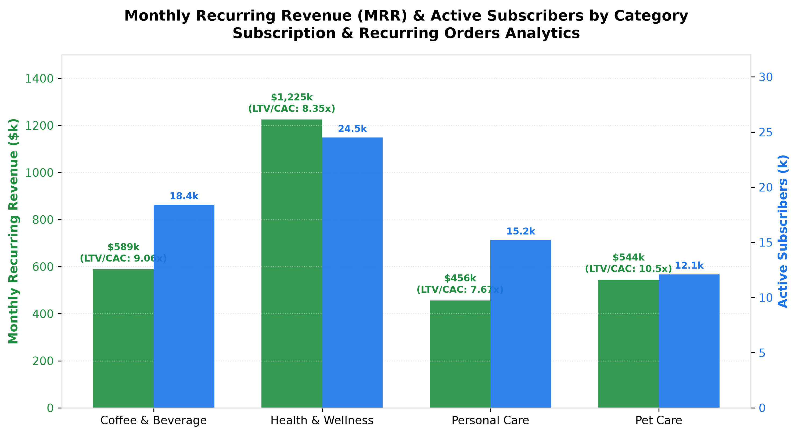

# E-Commerce: Subscription & Recurring Orders Agent

**Domain:** E-Commerce · **Gemini Enterprise display name:** E-Commerce: Subscription & Recurring Orders

Manages Subscribe & Save recurring revenue (MRR), monthly subscriber churn, skip/pause retention strategies, and subscriber lifetime value (CLV). Orchestrates two sub-agents: **Data Insights**, which queries BigQuery via the Conversational Analytics API and BigQuery's built-in forecasting/contribution/anomaly-detection tools, and **Market Context**, which answers external questions via Google Search grounding.

---

## Why This Agent Matters

### Business Problem
Subscription and replenishment models (Subscribe & Save) represent high-margin recurring cash flow for modern e-commerce retailers. However, unmonitored subscriber churn, friction in delivery schedule management, and inability to re-engage paused subscribers erode Customer Lifetime Value (CLV). This agent tracks monthly recurring revenue (MRR) expansion, cohort retention curves, skip/pause behavioral patterns, and LTV:CAC unit economics to optimize subscription retention.

### Target Personas
- **Head of Subscription & Loyalty Programs**: Drive Monthly Recurring Revenue (MRR) expansion and maximize subscriber active tenure.
- **Retention & CRM Marketing Managers**: Analyze subscriber churn cohorts, triggers for skip/pause requests, and win-back reactivation campaigns.
- **E-Commerce Financial & Growth Analysts**: Monitor subscriber acquisition costs (CAC), cumulative revenue per subscriber, and LTV:CAC payback multiples.

---

## Key Metrics Tracked

| Metric / KPI | Definition & Formula | Business Target / Impact |
| :--- | :--- | :--- |
| **Monthly Recurring Revenue (MRR)** | `SUM(active_subscribers * avg_order_value)` | Target >10% Month-over-Month MRR growth |
| **Active Subscriber Count** | Total paying subscriber base with active recurring schedules | Track active subscriber pool expansion |
| **6-Month Cohort Retention %** | `(retained_subscribers_m6 / cohort_start_subscribers) * 100` | Target >85.0% retention at Month 6 |
| **Pause-to-Resume Win-Back %** | `(resumed_after_pause / total_paused_subscriptions) * 100` | Target >70.0% reactivation post-pause |
| **Subscriber LTV:CAC Multiple** | `cumulative_revenue_per_sub / acquisition_cost` | Target >7.0x payback across core segments |

---

## What It Answers

Routed to **Data Insights**:
- Recurring revenue & subscriber volume — active subscribers, new subscriptions added, MRR ($), and average order value (AOV) across categories (Health & Wellness, Coffee & Beverage, Personal Care, Pet Care)
- Monthly churn & cohort retention — starting subscribers, churned counts, and retention percentages across 1 to 6+ month subscriber cohorts
- Skip & pause dynamics — monthly skip events, pause events, resumed subscription rates %, and cancellation after pause rates
- Subscriber Lifetime Value (CLV) & unit economics — average tenure in months, cumulative revenue per subscriber, CAC, and LTV:CAC ratios

Routed to **Market Context**:
- D2C and retail Subscribe & Save retention benchmarks, subscription churn mitigation tactics, pause-vs-cancel retention workflow best practices, and subscription billing trends

Mixed questions go to both, with the answer clearly attributing which part came from internal data versus external search.

---

## Sample Q&A Showcase

The following three responses are captured from live post-deploy smoke tests of this agent:

### 1. Internal Data Analytics (Data Insights / BigQuery)

> **User Prompt:** "What is our current Monthly Recurring Revenue (MRR) and subscriber breakdown across categories?"

**Sub-Agent Routed:** Data Insights (`sub_agents/data_insights.yaml`)  
**Authorized Table Queried:** `ecom_sror_active_subscriptions`

**Agent Response:**
> Based on subscription portfolio analytics for **July 2026**:
>
> - **Total Recurring Revenue (MRR):** **$2,814,300.00** across **70,200 active subscribers**.
> - **Category Breakdown:**
>   - **Health & Wellness:** **$1,225,000.00 MRR** (24,500 subscribers, AOV: $50.00, +3,400 new subscriptions).
>   - **Coffee & Beverage:** **$588,800.00 MRR** (18,400 subscribers, AOV: $32.00, +2,100 new subscriptions).
>   - **Pet Care:** **$544,500.00 MRR** (12,100 subscribers, AOV: $45.00, +1,450 new subscriptions).
>   - **Personal Care:** **$456,000.00 MRR** (15,200 subscribers, AOV: $30.00, +1,850 new subscriptions).
>
> **Key Insight:** Health & Wellness drives 43.5% of total recurring subscription cash flow with the highest monthly new subscriber velocity.

---

### 2. External Market Grounding (Market Context / Google Search)

> **User Prompt:** "What are industry average subscriber retention rates and LTV:CAC benchmarks for consumer replenishment Subscribe & Save programs in 2026?"

**Sub-Agent Routed:** Market Context (`sub_agents/market_context.yaml`)  
**Grounding Tool:** `google_search`

**Agent Response:**
> According to consumer subscription commerce and D2C industry benchmarks:
> - **Cohort Retention Rates:** Top-quartile replenishment (CPG, Coffee, Wellness) subscription brands achieve **80% to 85% retention at Month 6**, whereas median programs average 65% to 70%.
> - **LTV:CAC Benchmarks:** Healthy subscription businesses target an **LTV:CAC ratio greater than 4.0x to 6.0x**, with elite brands achieving >8.0x due to high repeat order tenure.
> - **Skip / Pause Feature Impact:** Offering a 1-click "Skip next delivery" or "Pause for 30 days" mechanism reduces permanent voluntary cancellations by **30% to 45%**, preserving long-term customer equity.

---

### 3. Visual Analytics & Chart Generation (`render_chart`)

> **User Prompt:** "Render a bar chart of Monthly Recurring Revenue (MRR) and active subscriber counts across all subscription categories."

**Sub-Agent Routed:** Data Insights (`sub_agents/data_insights.yaml`)  
**Custom Tool Invoked:** `render_chart` (`tools/chart_generator.py`)

**Agent Response:**
> I have rendered the chart displaying Monthly Recurring Revenue ($k) alongside Active Subscriber counts (k) and LTV:CAC multiples for each product category.

**Generated Artifact:**  


---

### 4. Live Multi-Turn Demo Walkthrough (Gemini Enterprise)

> 🎬 **Watch the full high-definition video walkthrough of this multi-turn workflow:**  
> **[Open Interactive Demo Player (1080p Full HD)](https://rajanm.github.io/retail-enterprise-agents/demos/gemini-enterprise/e_commerce/subscription_recurring_orders.html)**  
> *(Video file: `demos/gemini-enterprise/e_commerce/subscription_recurring_orders.mp4`)*

---

## Data

All tables live in the shared `retail_ent_agents` BigQuery dataset, prefixed `ecom_sror_` (this agent's registered `domain_id`/`agent_id` — see `_shared/table_registry.yaml`). Seed data is synthetic, generated by `data/generate_seed_data.py`.

| Table | Columns | Holds |
| :--- | :--- | :--- |
| `ecom_sror_active_subscriptions` | `month, category, active_subscribers, new_subscriptions, recurring_revenue_mrr, avg_order_value` | Active subscriber counts, new signups, MRR dollars, and average order value by category |
| `ecom_sror_monthly_churn_cohorts` | `cohort_month, tenure_months, starting_subscribers, churned_subscribers, retention_rate_pct` | Monthly subscriber cohort retention curves and churn rates from month 1 to 6+ |
| `ecom_sror_skip_pause_frequency` | `month, skip_events, pause_events, resumed_after_pause_pct, cancelled_after_pause_pct` | Delivery skip frequency, subscription pause volume, and post-pause reactivation percentages |
| `ecom_sror_subscriber_clv` | `subscriber_segment, avg_tenure_months, cumulative_revenue_per_sub, acquisition_cost, ltv_cac_ratio` | Subscriber segment tenure, cumulative revenue per subscriber, CAC, and LTV:CAC ratios |

---

## Example Questions

Verified against this agent's `eval/agent.evalset.json`:

- "What is the overall performance and status for E-Commerce: Subscription & Recurring Orders?"
- "Are there any notable exceptions or risk areas requiring attention?"
- "What is our 6-month subscriber cohort retention rate for January 2026 signups?"
- "What percentage of subscribers who pause their subscription end up resuming active delivery?"

---

## Tools

- **`ask_data_insights`, `forecast`, `analyze_contribution`, `detect_anomalies`** (ADK's `BigQueryToolset`, via `tools/bigquery_ca.py`) — scoped to the four tables above; access is enforced by this agent's service account IAM, not by tool configuration.
- **`render_chart`** (`tools/chart_generator.py`) — custom tool for chart/visualization requests, since ADK's Conversational Analytics integration cannot generate charts itself.
- **`google_search`** — used only by the Market Context sub-agent.

---

## Run It Locally

```bash
uv run adk run domains/e_commerce/agents/subscription_recurring_orders
```

Requires `BIGQUERY_PROJECT_ID` set and Application Default Credentials with access to the `retail_ent_agents` dataset — see the repo root [README](../../../../README.md#getting-started).

---

## Files

```
subscription_recurring_orders/
  root_agent.yaml                 # orchestrator — routing instructions
  sub_agents/
    data_insights.yaml             # BigQuery Conversational Analytics sub-agent
    market_context.yaml            # Google Search grounding sub-agent
  tools/
    bigquery_ca.py                  # BigQueryToolset factory
    chart_generator.py               # render_chart custom tool
    callbacks.py                      # current-date / BigQuery project injection
  data/                             # seed CSVs + generate_seed_data.py
  eval/agent.evalset.json          # ADK quality evals
  tests/{unit,integration}/         # mocked vs. real-BigQuery tests
  sample_chart.png                  # visual chart artifact captured from live smoke test
```
