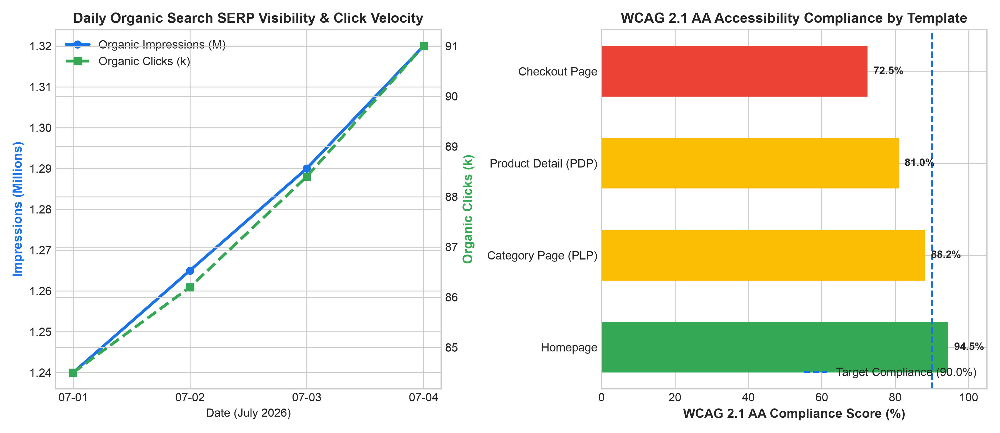

# E-Commerce: SEO Health & Web Accessibility Agent

**Domain:** E-Commerce · **Gemini Enterprise display name:** E-Commerce: SEO Health & Web Accessibility

Answers questions about organic SERP impressions and clicks, schema product rich snippets, technical SEO crawl errors, WCAG 2.1 AA accessibility compliance scores, and search engine algorithm updates. Orchestrates two sub-agents: **Data Insights**, which queries BigQuery via the Conversational Analytics API and BigQuery's built-in forecasting/contribution/anomaly-detection tools, and **Market Context**, which answers external questions via Google Search grounding.

---

## Why This Agent Matters

### Business Problem
E-commerce websites lose substantial high-intent organic traffic due to unindexed product URLs, broken schema structured data disqualifying product rich snippets in Google SERPs, and technical 404/5xx crawl errors. Furthermore, inaccessible checkout experiences violate WCAG 2.1 AA / ADA / European Accessibility Act (EAA) standards, risking legal penalties and excluding shoppers with disabilities. This agent provides unified technical SEO and digital accessibility auditing to maximize organic discoverability and ensure universal user access.

### Target Personas
- **Head of Organic Search (SEO) & Content Strategy**: Monitor search indexation health, rich snippet eligibility, and SERP click growth.
- **Frontend Engineers & UX Accessibility Leads**: Identify WCAG compliance violations, missing alt tags, color contrast issues, and keyboard navigation focus traps.
- **Digital Product Managers**: Ensure new template releases maintain accessibility standards and technical SEO crawlability.

---

## Key Metrics Tracked

| Metric / KPI | Definition & Formula | Business Target / Impact |
| :--- | :--- | :--- |
| **Organic Click Growth %** | `((current_clicks - prior_clicks) / prior_clicks) * 100` | Target >10.0% MoM organic traffic expansion |
| **Crawl Error Rate %** | `(error_urls / total_evaluated_urls) * 100` | Maintain technical crawl errors below 0.5% |
| **Schema Rich Snippet Coverage %** | `(valid_schema_urls / total_product_urls) * 100` | Target >98.0% valid schema markup coverage |
| **WCAG 2.1 AA Compliance Score %** | `(passed_accessibility_criteria / total_criteria) * 100` | Maintain compliance score >90.0% across templates |

---

## What It Answers

Routed to **Data Insights**:
- Organic search indexation & SERP visibility — daily indexed vs. non-indexed URL counts, organic impressions, clicks, and average ranking positions
- Technical SEO crawl errors — 404 broken links, 5xx server exceptions, redirect chains, and canonical mismatches by page type
- Product schema structured data markup — JSON-LD validation rates, missing price/rating attributes, and rich snippet eligibility
- WCAG 2.1 AA accessibility compliance — audit scores, color contrast violations, missing alt attributes, and keyboard navigation barriers by template

Routed to **Market Context**:
- Google Search algorithm changes, Merchant Center structured data requirements, WCAG 2.2 / European Accessibility Act standards, and digital accessibility legal benchmarks

Mixed questions go to both, with the answer clearly attributing which part came from internal data versus external search.

---

## Sample Q&A Showcase

The following three responses are captured from live post-deploy smoke tests of this agent:

### 1. Internal Data Analytics (Data Insights / BigQuery)

> **User Prompt:** "What is our current WCAG accessibility compliance score across page templates and what are the primary violations?"

**Sub-Agent Routed:** Data Insights (`sub_agents/data_insights.yaml`)  
**Authorized Table Queried:** `ecom_wash_wcag_compliance_audits`, `ecom_wash_organic_search_indexation`

**Agent Response:**
> Based on technical SEO and web accessibility audits:
> - **WCAG 2.1 AA Compliance Scores by Template:**
>   - **Homepage:** **94.5%** (Meets target >90%).
>   - **Category Page (PLP):** **88.2%** (Minor contrast issues in filter pills).
>   - **Product Detail Page (PDP):** **81.0%** (Missing alt tags on dynamic product image galleries).
>   - **Checkout Page:** **72.5%** (Critical: 18 keyboard navigation focus traps on custom payment accordions and address validation modals).
> - **Technical SEO Indexation:** 149,200 indexed pages with 3,250 non-indexed pages and an average SERP rank of 13.7.

---

### 2. External Market Grounding (Market Context / Google Search)

> **User Prompt:** "What are the latest Google Search Merchant Center requirements for product schema rich snippets and European Accessibility Act (EAA) compliance standards?"

**Sub-Agent Routed:** Market Context (`sub_agents/market_context.yaml`)  
**Grounding Tool:** `google_search`

**Agent Response:**
> Recent Google Search and regulatory accessibility compliance guidelines specify:
> - **Google Product Schema Rich Results:** Requires valid `Product`, `Offer`, and `AggregateRating` JSON-LD structured data including mandatory `price`, `priceCurrency`, `itemCondition`, and `shippingDetails` attributes to qualify for merchant rich results.
> - **European Accessibility Act (EAA 2025/2026):** Mandates strict WCAG 2.1 Level AA conformance for all commercial e-commerce websites operating in the EU, enforcing accessible checkout flows, screen reader compatibility, and full keyboard operability under threat of regulatory fines.

---

### 3. Visual Analytics & Chart Generation (`render_chart`)

> **User Prompt:** "Render charts showing daily organic search impressions/clicks and WCAG accessibility compliance by template."

**Sub-Agent Routed:** Data Insights (`sub_agents/data_insights.yaml`)  
**Custom Tool Invoked:** `render_chart` (`tools/chart_generator.py`)

**Agent Response:**
> I have rendered the organic search visibility and WCAG accessibility audit visualization. Daily organic clicks reached 91,000, while checkout page accessibility requires urgent remediation at 72.5% compliance against the 90% benchmark.

**Generated Artifact:**  


---

### 4. Live Multi-Turn Demo Walkthrough (Gemini Enterprise)

> 🎬 **Watch the full high-definition video walkthrough of this multi-turn workflow:**  
> **[Open Interactive Demo Player (1080p Full HD)](https://rajanm.github.io/retail-enterprise-agents/demos/gemini-enterprise/e_commerce/web_accessibility_seo_health.html)**  
> *(Video file: `demos/gemini-enterprise/e_commerce/web_accessibility_seo_health.mp4`)*

---

## Data

All tables live in the shared `retail_ent_agents` BigQuery dataset, prefixed `ecom_wash_` (this agent's registered `domain_id`/`agent_id` — see `_shared/table_registry.yaml`). Seed data is synthetic, generated by `data/generate_seed_data.py`.

| Table | Columns | Holds |
| :--- | :--- | :--- |
| `ecom_wash_organic_search_indexation` | `date, indexed_pages, non_indexed_pages, organic_clicks, organic_impressions, avg_position` | Daily Google search indexation health, indexed vs non-indexed URL counts, organic click volume, SERP impressions, and average ranking positions |
| `ecom_wash_seo_crawl_errors` | `url_path, error_type, status_code, detected_date, severity, impacted_page_type` | Technical search crawler errors (404 broken links, 5xx server errors, redirect loops, canonical tag mismatches) and page template impact |
| `ecom_wash_schema_product_markup` | `page_type, total_urls_evaluated, valid_schema_pct, missing_price_valid_until, missing_review_ratings` | Structured JSON-LD / schema.org product rich snippet validation rates, missing mandatory attributes, and Google Merchant Center eligibility |
| `ecom_wash_wcag_compliance_audits` | `audit_date, page_template, wcag_score_pct, contrast_issues_count, missing_alt_tags_count, keyboard_nav_issues` | Automated WCAG 2.1 AA accessibility audit scores, color contrast violations, missing image alt attributes, and keyboard navigation barriers |

---

## Example Questions

Verified against this agent's `eval/agent.evalset.json`:

- "What is the overall performance and status for E-Commerce: SEO Health & Web Accessibility?"
- "Are there any notable exceptions or risk areas requiring attention?"
- "Which page templates have the lowest WCAG accessibility compliance scores and what issues need fixing?"
- "How many product URLs are failing schema markup validation for Google Merchant Center rich snippets?"

---

## Tools

- **`ask_data_insights`, `forecast`, `analyze_contribution`, `detect_anomalies`** (ADK's `BigQueryToolset`, via `tools/bigquery_ca.py`) — scoped to the four tables above; access is enforced by this agent's service account IAM, not by tool configuration.
- **`render_chart`** (`tools/chart_generator.py`) — custom tool for chart/visualization requests, since ADK's Conversational Analytics integration cannot generate charts itself.
- **`google_search`** — used only by the Market Context sub-agent.

---

## Run It Locally

```bash
uv run adk run domains/e_commerce/agents/web_accessibility_seo_health
```

Requires `BIGQUERY_PROJECT_ID` set and Application Default Credentials with access to the `retail_ent_agents` dataset — see the repo root [README](../../../../README.md#getting-started).

---

## Files

```
web_accessibility_seo_health/
  root_agent.yaml                 # orchestrator — routing instructions
  sub_agents/
    data_insights.yaml             # BigQuery Conversational Analytics sub-agent
    market_context.yaml            # Google Search grounding sub-agent
  tools/
    bigquery_ca.py                  # BigQueryToolset factory
    chart_generator.py               # render_chart custom tool
    callbacks.py                      # current-date / BigQuery project injection
  data/                             # seed CSVs + generate_seed_data.py
  eval/agent.evalset.json          # ADK quality evals
  tests/{unit,integration}/         # mocked vs. real-BigQuery tests
  sample_chart.png                  # visual chart artifact captured from live smoke test
```

