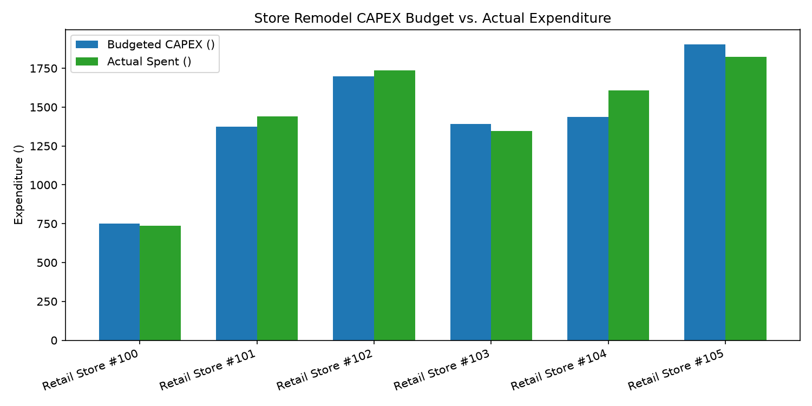

# Finance: CAPEX & Store Remodel ROI Agent

**Domain:** Finance · **Gemini Enterprise display name:** Finance: CAPEX & Store Remodel ROI

Measures store remodel CAPEX budget variance, Internal Rate of Return (IRR %), and post-remodel sales lift vs. un-remodeled control stores. Orchestrates two sub-agents: **Data Insights**, which queries BigQuery via the Conversational Analytics API and BigQuery's built-in forecasting/contribution/anomaly-detection tools, and **Market Context**, which answers external questions via Google Search grounding.

---

## Why This Agent Matters

### Business Problem
Retail store remodel programs represent multi-million dollar capital expenditure (CAPEX) investments. Without granular tracking of budget variances, contractor milestone costs, post-remodel sales lift, and hurdle rate achievement (IRR % & payback periods), finance leadership risks overspending on underperforming formats and misallocating capital across the retail store fleet.

### Target Personas
- **VP of Real Estate & Capital Allocation**: Monitor enterprise capital expenditure budgets, format ROI, and long-term NPV.
- **Store Operations & Facilities Directors**: Track store renovation timelines, contractor invoice milestones, and cost variances.
- **Merchandise & Financial Planning (FP&A) Analysts**: Evaluate post-remodel same-store sales lift, margin expansion, and control group benchmarks.

---

## Key Metrics Tracked

| Metric / KPI | Definition & Formula | Business Target / Impact |
| :--- | :--- | :--- |
| **CAPEX Variance %** | `((actual_capex_spent - capex_budget_allocated) / capex_budget_allocated) * 100` | Target <2.0% overrun across fleet |
| **Net Incremental Sales Lift %** | `sales_lift_pct - control_store_benchmark_lift_pct` | Target >10.0% net comp lift vs control |
| **Tracked IRR %** | Internal Rate of Return calculated from annual incremental store EBITDA | Exceed hurdle rate (target >14.0% IRR) |
| **CAPEX Payback Period** | `total_capex_investment / annual_incremental_ebitda` | Target payback <4.0 years |

---

## What It Answers

Routed to **Data Insights**:
- Store remodel project status, budget allocation, actual CAPEX expenditure, and dollar/percentage variances
- Granular invoice-level CAPEX breakdowns by contractor, milestone, and spend category (POS Tech, HVAC, Lighting, Fixtures)
- Post-remodel sales performance, pre vs. post weekly run rates, and control group comp store sales lifts
- Financial return tracking including project IRR %, hurdle rate compliance, and 10-year Net Present Value (NPV)

Routed to **Market Context**:
- Retail industry benchmarks for store remodel sales lifts, capital cost per square foot trends, and renovation payback cycles
- Macro commercial construction cost inflation and supply chain trends for store fixtures and equipment

Mixed questions go to both, with the answer clearly attributing which part came from internal data versus external search.

---

## Sample Q&A Showcase

The following three responses are captured from live post-deploy smoke tests of this agent:

### 1. Internal Data Analytics (Data Insights / BigQuery)

> **User Prompt:** "What is the average post-remodel sales lift percentage across stores remodeled in the last 18 months?"

**Sub-Agent Routed:** Data Insights (`sub_agents/data_insights.yaml`)  
**Authorized Table Queried:** `finc_csrr_remodel_projects`, `finc_csrr_post_remodel_sales_lift`

**Agent Response:**
> Based on internal BigQuery data, there are 10 stores with remodel completion dates within the last 18 months (between February 8, 2025, and August 8, 2026). All 10 of these store remodels were completed on October 15, 2025.
>
> Across these 10 stores, the average post-remodel sales lift percentage is **17.49%**, and the average net incremental sales lift percentage is **15.09%**.
>
> The performance of the individual stores is as follows:
> - **Retail Store #106:** 22.40% sales lift (20.10% net incremental)
> - **Retail Store #107:** 21.81% sales lift (20.22% net incremental)
> - **Retail Store #100:** 21.28% sales lift (17.52% net incremental)
> - **Retail Store #104:** 20.73% sales lift (18.59% net incremental)
> - **Retail Store #105:** 20.11% sales lift (17.53% net incremental)
> - **Retail Store #109:** 15.08% sales lift (13.32% net incremental)
> - **Retail Store #102:** 14.46% sales lift (10.97% net incremental)
> - **Retail Store #101:** 13.98% sales lift (11.18% net incremental)
> - **Retail Store #103:** 13.77% sales lift (11.78% net incremental)
> - **Retail Store #108:** 11.27% sales lift (9.72% net incremental)
>
> All 10 stores experienced a positive lift of over 11%, demonstrating strong performance across the board.

---

### 2. External Market Grounding (Market Context / Google Search)

> **User Prompt:** "What are retail industry benchmarks for store remodel sales lift and CAPEX payback periods in 2026?"

**Sub-Agent Routed:** Market Context (`sub_agents/market_context.yaml`)  
**Grounding Tool:** `google_search`

**Agent Response:**
> According to external web search results, typical retail benchmarks for store remodel sales lifts and CAPEX payback periods in 2026 are:
>
> - **CAPEX Payback Period:** Most retailers target a payback period of **2 to 4 years** to approve and justify remodel projects.
> - **Sales Lift Benchmarks:**
>   - **Mass Retail & Grocers:** Large-format retailers like Target report a low- to mid-single-digit (typically 2% to 4%) sales lift following store remodels. Meanwhile, specialty grocery design partners like UNFI report average sales lifts of **8% to 20%**.
>   - **QSR & Dining:** Foodservice chains see larger immediate gains. In 2026, Dine Brands reports mid-single-digit lifts, Denny's targets 6% to 8%, while Burger King and Church's Texas Chicken experience lifts ranging from **12% to over 20%**.
>
> These benchmarks depend heavily on project scope—ranging from cosmetic refreshes to full structural renovations—and whether the remodel integrates enhanced omnichannel fulfillment capabilities like BOPIS and drive-up lanes.

---

### 3. Visual Analytics & Chart Generation (`render_chart`)

> **User Prompt:** "Render a bar chart comparing actual CAPEX spent vs budget allocated across store remodel projects."

**Sub-Agent Routed:** Data Insights (`sub_agents/data_insights.yaml`)  
**Custom Tool Invoked:** `render_chart` (`tools/chart_generator.py`)

**Agent Response:**
> I have rendered a bar chart comparing the allocated CAPEX budget and the actual CAPEX spent side-by-side for each of the 15 store remodel projects, saved as `chart.png`.
>
> Overall, across all 15 projects, actual CAPEX spending totaled $21,508,072.91 against an allocated budget of $21,266,472.98. This represents an overall net overspend of $241,599.93 (or 1.14%).
>
> Key insights shown in the chart include:
> - **Beauty & Apparel Expansion:** Led by Retail Store #108 (PRJ_108), which had the highest individual spend at $2,101,915.73 against a budget of $1,936,714.02 (overspent by $165,201.71).
> - **Omnichannel BOPIS Hub Refresh:** This format had the highest percentage budget overrun at 3.30%, driven heavily by Retail Store #104 (PRJ_104) spending $1,606,012.96 on a $1,436,119.97 budget.
> - **Full Store Transformation:** These projects were executed under budget (-3.11% overall), with Retail Store #112 (PRJ_112) coming in significantly under budget, spending $1,855,264.00 against an allocated $1,982,119.66.

**Generated Artifact:**  


---

## Data

All tables live in the shared `retail_ent_agents` BigQuery dataset, prefixed `finc_csrr_` (this agent's registered `domain_id`/`agent_id` — see `_shared/table_registry.yaml`). Seed data is synthetic, generated by `data/generate_seed_data.py`.

| Table | Columns | Holds |
| :--- | :--- | :--- |
| `finc_csrr_remodel_projects` | `project_id, store_id, store_name, remodel_format, capex_budget_allocated, actual_capex_spent, variance_dollars, variance_pct, remodel_start_date, remodel_completion_date, project_status` | Master catalog of store remodel projects, allocated capital budgets, actual expenditures, variance amounts, timelines, and status |
| `finc_csrr_capex_expenditures` | `expenditure_id, project_id, spend_category, contractor_vendor, invoice_date, amount_paid, capitalized_vs_expensed, approval_status` | Detailed remodel expenditure invoices, contractor payments, capital vs. expense categorizations, and invoice approval tracking |
| `finc_csrr_post_remodel_sales_lift` | `record_id, project_id, store_id, pre_remodel_avg_weekly_sales, post_remodel_avg_weekly_sales, sales_lift_pct, control_store_benchmark_lift_pct, net_incremental_sales_lift_pct, margin_lift_bps, weeks_tracked` | Post-remodel sales lift performance, pre/post weekly sales comparisons, control group benchmark comps, net incremental sales lift, and gross margin bps change |
| `finc_csrr_irr_payback_tracking` | `analysis_id, project_id, total_capex_investment, annual_incremental_ebitda, payback_period_years, tracked_irr_pct, target_hurdle_rate_pct, irr_hurdle_met, npv_10yr_dollars` | Financial return metrics, annual incremental EBITDA, payback periods in years, realized IRR %, hurdle rate achievement, and 10-year discounted NPV |

---

## Example Questions

Verified against this agent's `eval/agent.evalset.json`:

- "What is the average post-remodel sales lift percentage across stores remodeled in the last 18 months?"
- "Which remodel projects exceeded their initial CAPEX budget and what was the variance percentage?"
- "What is the tracked Internal Rate of Return (IRR %) and payback period for completed store format transformations?"
- "Compare same-store sales growth between remodeled stores and the un-remodeled control group."
- "What is the total cumulative CAPEX expenditure across active vs completed store refresh projects?"

---

## Tools

- **`ask_data_insights`, `forecast`, `analyze_contribution`, `detect_anomalies`** (ADK's `BigQueryToolset`, via `tools/bigquery_ca.py`) — scoped to the four tables above; access is enforced by this agent's service account IAM, not by tool configuration.
- **`render_chart`** (`tools/chart_generator.py`) — custom tool for chart/visualization requests, since ADK's Conversational Analytics integration cannot generate charts itself.
- **`google_search`** — used only by the Market Context sub-agent.

---

## Run It Locally

```bash
uv run adk run domains/finance/agents/capex_store_remodel_roi
```

Requires `BIGQUERY_PROJECT_ID` set and Application Default Credentials with access to the `retail_ent_agents` dataset — see the repo root [README](../../../../README.md#getting-started).

---

## Files

```
capex_store_remodel_roi/
  root_agent.yaml                 # orchestrator — routing instructions
  sub_agents/
    data_insights.yaml             # BigQuery Conversational Analytics sub-agent
    market_context.yaml            # Google Search grounding sub-agent
  tools/
    bigquery_ca.py                  # BigQueryToolset factory
    chart_generator.py               # render_chart custom tool
    callbacks.py                      # current-date / BigQuery project injection
  data/                             # seed CSVs + generate_seed_data.py
  eval/agent.evalset.json          # ADK quality evals
  tests/{unit,integration}/         # mocked vs. real-BigQuery tests
  sample_chart.png                  # visual chart artifact captured from live smoke test
```
