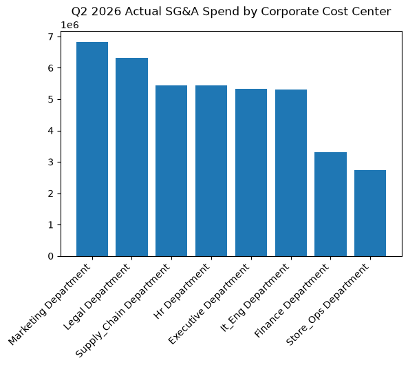

# Finance: FP&A Corporate Budget & Variance Agent

**Domain:** Finance · **Gemini Enterprise display name:** Finance: FP&A Corporate Budget & Variance

Answers questions about corporate cost center SG&A budget vs. actual variance, rolling 12-month consolidated EBITDA forecasts, departmental headcount run rates, corporate overhead run rates, and retail corporate expense benchmarks. Orchestrates two sub-agents: **Data Insights**, which queries BigQuery via the Conversational Analytics API and BigQuery's built-in forecasting/contribution/anomaly-detection tools, and **Market Context**, which answers external questions via Google Search grounding.

---

## Why This Agent Matters

### Business Problem
Unmonitored corporate overhead and SG&A budget overruns directly compress retail operating profit and erode EBITDA margins. Without continuous cost center variance tracking and rolling EBITDA forecast visibility, corporate finance leadership cannot proactively curb departmental overspending or adjust headcount run rates before annual operating targets are compromised.

### Target Personas
- **Chief Financial Officer (CFO)**: Evaluates consolidated rolling EBITDA forecasts and full-year corporate overhead run rates against board operating plans.
- **VP of Financial Planning & Analysis (FP&A)**: Monitors quarterly SG&A budget vs. actual variances across corporate departments (Legal, Marketing, IT, HR, Supply Chain).
- **Cost Center Budget Owners / Functional VPs**: Track departmental labor run rates, open requisitions, T&E, and consulting expenditures against quarterly caps.

---

## Key Metrics Tracked

| Metric / KPI | Definition & Formula | Business Target / Impact |
| :--- | :--- | :--- |
| **SG&A Budget Variance ($ / %)** | `actual_spent_amount - budgeted_amount` (and `(variance / budget) * 100`) | Target <=0% (Favorable / within budget) |
| **Rolling EBITDA Forecast ($ / %)** | `gross_profit_forecast - sga_opex_forecast` (and `(ebitda / revenue) * 100`) | Target >=12% EBITDA margin vs. board plan |
| **Headcount Run Rate Variance** | `actual_active_fte - approved_fte_headcount` | Target 0 unapproved FTE variances |
| **Corporate Overhead % of Sales** | `(total_corporate_sga / total_revenue) * 100` | Benchmark between 15% - 25% of revenue |

---

## What It Answers

Routed to **Data Insights**:
- Corporate cost center SG&A budget vs. actual variances by functional area (Salaries & Wages, Cloud IT, Professional Services, Marketing, T&E)
- Rolling 12-month consolidated EBITDA forecasts and vintage comparisons against annual operating plan targets
- Departmental headcount run rates, active FTEs vs. approved headcount, and monthly payroll run rates
- Discretionary spend tracking (T&E, consulting, professional services) against quarterly budget allocations

Routed to **Market Context**:
- Retail industry SG&A overhead benchmarks as a percentage of revenue
- Macroeconomic corporate budgeting trends, executive compensation, and tech/cloud cost benchmarks
- Competitor EBITDA margin trends and public corporate overhead disclosure comparisons

Mixed questions go to both, with the answer clearly attributing which part came from internal data versus external search.

---

## Sample Q&A Showcase

The following three responses are captured from live post-deploy smoke tests of this agent:

### 1. Internal Data Analytics (Data Insights / BigQuery)

> **User Prompt:** "What is the SG&A OpEx budget vs actual variance by corporate cost center for Q2 2026?"

**Sub-Agent Routed:** Data Insights (`sub_agents/data_insights.yaml`)  
**Authorized Table Queried:** `finc_cbvf_budget_vs_actual_opex`, `finc_cbvf_corporate_cost_centers`

**Agent Response:**
> For Q2 2026, total corporate SG&A OpEx was $40,708,565.32 against a budget of $38,554,430.17, representing an unfavorable overall overrun (actual spent minus budget) of $2,154,135.15.
>
> The breakdown by corporate cost center (Budget, Actual, Variance) is as follows:
> - **Legal Department**: Budget $5,707,458.24 | Actual $6,315,820.84 | Variance $608,362.60
> - **Marketing Department**: Budget $6,317,005.49 | Actual $6,828,922.39 | Variance $511,916.90
> - **HR Department**: Budget $5,041,460.89 | Actual $5,428,950.00 | Variance $387,489.11
> - **IT_Eng Department**: Budget $5,059,578.50 | Actual $5,309,526.72 | Variance $249,948.22
> - **Executive Department**: Budget $5,121,901.15 | Actual $5,332,138.88 | Variance $210,237.73
> - **Finance Department**: Budget $3,239,243.32 | Actual $3,317,876.01 | Variance $78,632.69
> - **Supply_Chain Department**: Budget $5,376,683.47 | Actual $5,445,463.32 | Variance $68,779.85
> - **Store_Ops Department**: Budget $2,691,099.11 | Actual $2,729,867.16 | Variance $38,768.05
>
> Every corporate cost center exceeded its Q2 2026 budget. The Legal Department experienced the largest absolute overrun of $608,362.60, while Store Operations managed closest to its target with a variance of just $38,768.05.

---

### 2. External Market Grounding (Market Context / Google Search)

> **User Prompt:** "What are current retail industry corporate SG&A overhead benchmarks as a percentage of revenue?"

**Sub-Agent Routed:** Market Context (`sub_agents/market_context.yaml`)  
**Grounding Tool:** `google_search`

**Agent Response:**
> Based on external market search data as of mid-2026, corporate SG&A overhead in the retail sector typically benchmarks between 15% and 30% of total revenue. The exact percentage depends heavily on physical footprint, logistics, and marketing spend.
>
> Key benchmarks from industry sources:
> - **Operating Standards (2026):** General retail SG&A typically ranges from 15% to 25% of revenue. Retailers with heavy brick-and-mortar footprints lean higher, ranging from 20% to 30% due to occupancy, staffing, and store operational costs.
> - **Sector Distribution (SAI Books):** Broad historical data for the Retail Trade sector shows a median SG&A-to-sales ratio of 26.80% (ranging from an efficient 10th percentile of 8.20% to a 90th percentile of 64.38%).
>
> These differences emphasize that a "good" SG&A ratio depends on the specific retail sub-sector (e.g., e-commerce vs. grocery) and growth phase.

---

### 3. Visual Analytics & Chart Generation (`render_chart`)

> **User Prompt:** "Render a bar chart showing the Q2 2026 actual SG&A spend by corporate cost center."

**Sub-Agent Routed:** Data Insights (`sub_agents/data_insights.yaml`)  
**Custom Tool Invoked:** `render_chart` (`tools/chart_generator.py`)

**Agent Response:**
> I have rendered a bar chart showing the Q2 2026 actual SG&A spend by corporate cost center, which is saved as the image artifact 'chart.png'.
>
> Based on internal BigQuery data, the total actual corporate SG&A spend for Q2 2026 across all active cost centers was $40,708,565.32.
>
> The rendered chart illustrates the spending breakdown sorted from highest to lowest:
> - Marketing Department: $6,828,922.39
> - Legal Department: $6,315,820.84
> - Supply_Chain Department: $5,445,463.32
> - Hr Department: $5,428,950.00
> - Executive Department: $5,332,138.88
> - It_Eng Department: $5,309,526.72
> - Finance Department: $3,317,876.01
> - Store_Ops Department: $2,729,867.16
>
> The visualization highlights that the Marketing and Legal departments were the top spenders during this quarter, while Store Operations and Finance recorded the lowest expenditures.

**Generated Artifact:**  


---

## Data

All tables live in the shared `retail_ent_agents` BigQuery dataset, prefixed `finc_cbvf_` (this agent's registered `domain_id`/`agent_id` — see `_shared/table_registry.yaml`). Seed data is synthetic, generated by `data/generate_seed_data.py`.

| Table | Columns | Holds |
| :--- | :--- | :--- |
| `finc_cbvf_corporate_cost_centers` | `cost_center_id, cost_center_name, functional_area, budget_owner, annual_budget_allocation, cost_center_status` | Master list of corporate cost centers, functional areas, budget owners, and annual budget allocations |
| `finc_cbvf_budget_vs_actual_opex` | `record_id, cost_center_id, fiscal_year, fiscal_quarter, expense_category, budgeted_amount, actual_spent_amount, variance_amount, variance_pct, favorable_vs_unfavorable` | Quarterly SG&A OpEx budget vs actual spending, variance dollars and percentages by cost center and expense category |
| `finc_cbvf_rolling_ebitda_forecasts` | `forecast_id, forecast_vintage_date, target_quarter, revenue_forecast, gross_profit_forecast, sga_opex_forecast, ebitda_forecast, ebitda_margin_pct, operating_plan_ebitda_target, target_variance_pct` | Rolling 12-month consolidated financial and EBITDA forecasts vs annual operating plan targets |
| `finc_cbvf_headcount_run_rates` | `record_id, cost_center_id, approved_fte_headcount, actual_active_fte, open_requisitions_count, monthly_payroll_run_rate, avg_cost_per_fte_annual, headcount_budget_variance` | Departmental headcount run rates, approved vs active FTEs, open requisitions, and monthly payroll run rates |

---

## Example Questions

Verified against this agent's `eval/agent.evalset.json`:

- "What is the SG&A OpEx budget vs actual variance by corporate cost center for the current fiscal quarter?"
- "How does our rolling 12-month consolidated EBITDA forecast compare to the annual board operating plan?"
- "Which corporate departments have exceeded their approved headcount run rate and labor budget?"
- "Analyze corporate travel and entertainment (T&E) and consulting expenditures against quarterly caps."
- "What is the projected full-year corporate overhead run rate based on year-to-date actuals?"

---

## Tools

- **`ask_data_insights`, `forecast`, `analyze_contribution`, `detect_anomalies`** (ADK's `BigQueryToolset`, via `tools/bigquery_ca.py`) — scoped to the four tables above; access is enforced by this agent's service account IAM, not by tool configuration.
- **`render_chart`** (`tools/chart_generator.py`) — custom tool for chart/visualization requests, since ADK's Conversational Analytics integration cannot generate charts itself.
- **`google_search`** — used only by the Market Context sub-agent.

---

## Run It Locally

```bash
uv run adk run domains/finance/agents/corporate_budget_variance_fpna
```

Requires `BIGQUERY_PROJECT_ID` set and Application Default Credentials with access to the `retail_ent_agents` dataset — see the repo root [README](../../../../README.md#getting-started).

---

## Files

```
corporate_budget_variance_fpna/
  root_agent.yaml                 # orchestrator — routing instructions
  sub_agents/
    data_insights.yaml             # BigQuery Conversational Analytics sub-agent
    market_context.yaml            # Google Search grounding sub-agent
  tools/
    bigquery_ca.py                  # BigQueryToolset factory
    chart_generator.py               # render_chart custom tool
    callbacks.py                      # current-date / BigQuery project injection
  data/                             # seed CSVs + generate_seed_data.py
  eval/agent.evalset.json          # ADK quality evals
  tests/{unit,integration}/         # mocked vs. real-BigQuery tests
  sample_chart.png                  # visual chart artifact captured from live smoke test
```
