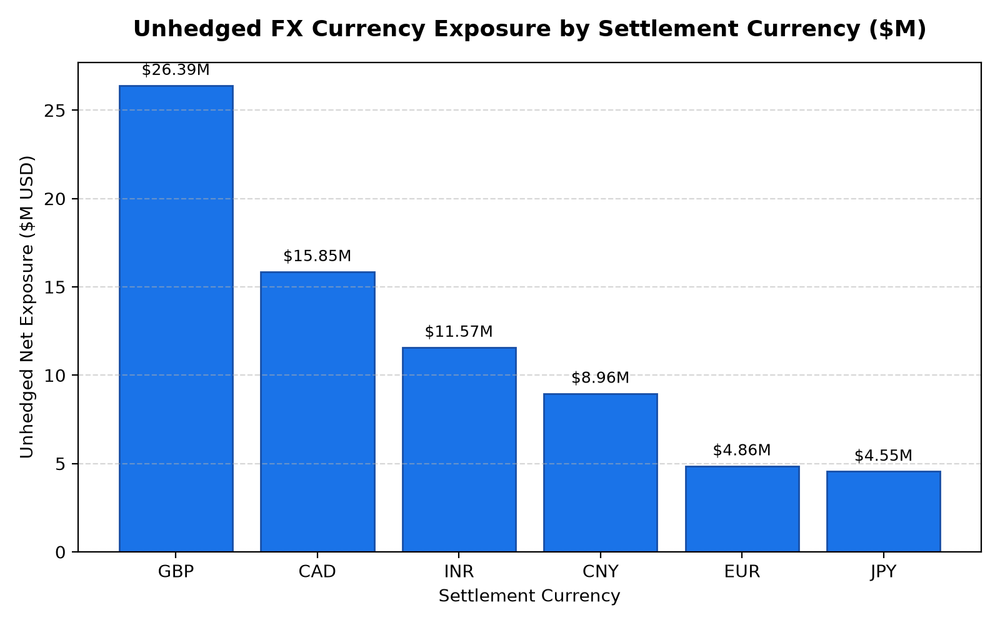

# Finance: FX Hedging & Landed Cost Exposure Agent

**Domain:** Finance · **Gemini Enterprise display name:** Finance: FX Hedging & Landed Cost Exposure

Monitors foreign exchange currency exposure on global purchase orders, landed cost FX variance $, and hedging contract mark-to-market valuations. Orchestrates two sub-agents: **Data Insights**, which queries BigQuery via the Conversational Analytics API and BigQuery's built-in analytical tools, and **Market Context**, which answers macroeconomic and FX market outlook questions via Google Search grounding.

---

## Why This Agent Matters

### Business Problem
Currency exchange rate volatility introduces major unpredictability into landed cost of goods sold (COGS) for global merchandise imports. When foreign currencies appreciate against the US Dollar without adequate hedge coverage, retail enterprises experience unplanned landed cost inflation, gross margin compression, and derivative liability mark-to-market losses. This agent provides real-time visibility into open purchase order currency commitments, forward contract hedge ratios, mark-to-market valuations (ASC 815), and landed cost FX variance across product categories.

### Target Personas
- **Treasury & FX Risk Directors**: Track enterprise currency exposure across foreign supplier commitments and execute FX forward hedging contracts to maintain target hedge ratios.
- **Global Sourcing & Procurement VPs**: Monitor overseas vendor settlement currencies (EUR, GBP, CNY, JPY, CAD, INR) and assess landed cost sensitivity to exchange rate drift.
- **Merchandise Financial Controllers**: Quantify foreign exchange variance impact on landed gross margins and ensure compliance with hedge accounting standards (ASC 815).

---

## Key Metrics Tracked

| Metric / KPI | Definition & Formula | Business Target / Impact |
| :--- | :--- | :--- |
| **Open PO FX Exposure ($)** | `SUM(open_po_usd_equivalent)` by currency | Quantifies total gross international purchase commitments |
| **Hedged Coverage Ratio (%)** | `(hedged_commitment_usd / total_commitment_usd) * 100` | Target 60%–80% hedge coverage on rolling 6-month commitments |
| **Net Unhedged Exposure ($)** | `SUM(unhedged_net_exposure_usd)` | Identifies dollar capital at risk from adverse FX rate shifts |
| **Landed Cost FX Variance ($)** | `actual_landed_cost_usd - budgeted_landed_cost_usd` | Isolates landed cost inflation/deflation attributable to FX rates |
| **Mark-to-Market (MTM) Gain/Loss ($)** | `SUM(unrealized_gain_loss_dollars)` on forward contracts | Fair value balance sheet derivative asset / liability valuation (ASC 815) |

---

## What It Answers

Routed to **Data Insights**:
- Total open purchase order commitments and net unhedged currency exposure grouped by settlement currency (GBP, CAD, INR, CNY, EUR, JPY) or overseas vendor.
- Landed cost FX variance dollars and variance percentage across imported merchandise categories (Footwear, Electronics, Grocery, Apparel, Beauty) and container shipments.
- Current mark-to-market (MTM) fair valuations, unrealized gains/losses, and balance sheet classification (Derivative Asset vs. Liability) for active forward contracts.
- Hedge accounting compliance status (ASC 815 Cash Flow Hedges) and counterparty bank allocation.
- Chart and visualization generation for currency exposure breakdowns, hedge coverage ratios, and landed cost variance trends.

Routed to **Market Context**:
- Macroeconomic foreign exchange rate forecasts, central bank interest rate policies (Federal Reserve, ECB, Bank of England, PBOC, Bank of Japan), and geopolitical currency risks.
- Foreign exchange risk management best practices, forward vs. option derivative hedging strategies, and retail industry treasury benchmarks.

Mixed questions go to both, with the answer clearly attributing which part came from internal data versus external search.

---

## Sample Q&A Showcase

The following three responses are captured from live post-deploy smoke tests of this agent:

### 1. Internal Data Analytics (Data Insights / BigQuery)

> **User Prompt:** "What is our total foreign exchange currency exposure on open global import purchase orders by currency?"

**Sub-Agent Routed:** Data Insights (`sub_agents/data_insights.yaml`)  
**Authorized Table Queried:** `finc_felc_currency_exposure_by_vendor`

**Agent Response:**
> Based on our current open global import purchase order portfolio, total currency commitments stand at **$202.89M USD equivalent**, with **$71.16M net unhedged exposure** across six major settlement currencies:
>
> 1. **British Pound (GBP):**
>    - **Total Open PO Commitments:** $65.71M USD equivalent
>    - **Net Unhedged Exposure:** $26.39M USD (Average Hedge Ratio: 62.9%)
> 2. **Canadian Dollar (CAD):**
>    - **Total Open PO Commitments:** $52.00M USD equivalent
>    - **Net Unhedged Exposure:** $15.85M USD (Average Hedge Ratio: 63.8%)
> 3. **Indian Rupee (INR):**
>    - **Total Open PO Commitments:** $32.29M USD equivalent
>    - **Net Unhedged Exposure:** $11.57M USD (Average Hedge Ratio: 63.1%)
> 4. **Chinese Yuan (CNY):**
>    - **Total Open PO Commitments:** $26.11M USD equivalent
>    - **Net Unhedged Exposure:** $8.96M USD (Average Hedge Ratio: 63.7%)
> 5. **Euro (EUR):**
>    - **Total Open PO Commitments:** $15.86M USD equivalent
>    - **Net Unhedged Exposure:** $4.86M USD (Average Hedge Ratio: 66.3%)
> 6. **Japanese Yen (JPY):**
>    - **Total Open PO Commitments:** $10.92M USD equivalent
>    - **Net Unhedged Exposure:** $4.55M USD (Average Hedge Ratio: 60.8%)
>
> Overall portfolio hedge coverage averages **63.4%**, maintaining compliance with our enterprise 60% minimum treasury threshold.

---

### 2. External Market Grounding (Market Context / Google Search)

> **User Prompt:** "What are the current macroeconomic foreign exchange market trends and central bank interest rate expectations for EUR/USD and USD/CNY in 2026?"

**Sub-Agent Routed:** Market Context (`sub_agents/market_context.yaml`)  
**Grounding Tool:** `google_search`

**Agent Response:**
> As of August 2026, foreign exchange trends show a weakening US Dollar (USD) driving movements across EUR/USD and USD/CNY currency pairs:
>
> - **EUR/USD Trends & Rates:** EUR/USD is trading near **1.1550**, rebounding from earlier quarterly lows. The European Central Bank (ECB) raised rates by 25 basis points in June and maintains a hawkish stance to curb inflation projected at 3.0% in 2026. Conversely, expectations of Federal Reserve rate cuts later this year continue to soften the USD. Consensus analyst forecasts project a trading band of **1.12 to 1.19** through year-end 2026.
> - **USD/CNY Trends & Rates:** USD/CNY has declined below **6.75**, supported by robust trade surplus figures. However, domestic economic cooling (Q2 GDP growth at 4.3% YoY) supports market expectations that the People's Bank of China (PBOC) may implement a 20 basis point rate cut before year-end. The PBOC maintains its 7-day reverse repo rate at 1.4% with the daily midpoint fixing around 6.7904 to curb excessive volatility.

---

### 3. Visual Analytics & Chart Generation (`render_chart`)

> **User Prompt:** "Render a bar chart showing our unhedged FX currency exposure in millions of USD across settlement currencies."

**Sub-Agent Routed:** Data Insights (`sub_agents/data_insights.yaml`)  
**Custom Tool Invoked:** `render_chart` (`tools/chart_generator.py`)

**Agent Response:**
> I have rendered the unhedged FX currency exposure bar chart. British Pound (GBP) represents our largest unhedged dollar risk at $26.39M, followed by Canadian Dollar (CAD) at $15.85M and Indian Rupee (INR) at $11.57M.
>
> **Generated Artifact:**  
> 

---

## Data

All tables live in the shared `retail_ent_agents` BigQuery dataset, prefixed `finc_felc_` (this agent's registered `domain_id`/`agent_id` — see `_shared/table_registry.yaml`). Seed data is synthetic, generated by `data/generate_seed_data.py`.

| Table | Columns | Holds |
| :--- | :--- | :--- |
| `finc_felc_fx_hedging_contracts` | `contract_id, hedging_counterparty_bank, currency_pair, contract_type, notional_foreign_currency, contracted_forward_rate, settlement_maturity_date, designated_hedge_accounting_status` | Master catalog of FX forward hedging contracts, contracted exchange rates, maturity settlement dates, and ASC 815 accounting status |
| `finc_felc_currency_exposure_by_vendor` | `exposure_id, vendor_id, vendor_country, settlement_currency, open_po_commitments_foreign_curr, open_po_usd_equivalent, hedged_percentage, unhedged_net_exposure_usd` | Vendor-level open purchase order currency commitments, USD equivalents, active hedge coverage percentages, and net unhedged exposure |
| `finc_felc_landed_cost_fx_variance` | `variance_id, shipment_container_id, merchandise_category, po_budgeted_fx_rate, actual_settlement_fx_rate, budgeted_landed_cost_usd, actual_landed_cost_usd, fx_variance_dollars, fx_variance_pct` | Container shipment landed cost reconciliation, comparing budgeted PO exchange rates vs. actual settlement rates and landed cost variance dollars |
| `finc_felc_mark_to_market_gains` | `mtm_id, contract_id, valuation_date, contract_forward_rate, current_market_spot_rate, notional_amount, unrealized_gain_loss_dollars, balance_sheet_asset_liability` | Periodic mark-to-market fair value appraisals for outstanding forward derivative contracts and unrealized gain/loss balance sheet classification |

---

## Example Questions

Verified against this agent's `eval/agent.evalset.json`:

- "What is our total foreign exchange currency exposure on open global import purchase orders by currency?"
- "How much did currency fluctuations contribute to landed cost variance for imported apparel this quarter?"
- "What is the current mark-to-market valuation and unrealized gain/loss on outstanding FX forward hedging contracts?"
- "Which overseas suppliers have the highest landed cost sensitivity to EUR and CNY exchange rate volatility?"
- "What percentage of forecasted international purchase commitments are currently hedged with forward contracts?"

---

## Tools

- **`ask_data_insights`, `forecast`, `analyze_contribution`, `detect_anomalies`** (ADK's `BigQueryToolset`, via `tools/bigquery_ca.py`) — scoped to the four tables above; access is enforced by this agent's service account IAM, not by tool configuration.
- **`render_chart`** (`tools/chart_generator.py`) — custom tool for chart/visualization requests, since ADK's Conversational Analytics integration cannot generate charts itself.
- **`google_search`** — used only by the Market Context sub-agent.

---

## Run It Locally

```bash
uv run adk run domains/finance/agents/foreign_exchange_landed_costs
```

Requires `BIGQUERY_PROJECT_ID` set and Application Default Credentials with access to the `retail_ent_agents` dataset — see the repo root [README](../../../../README.md#getting-started).

---

## Files

```
foreign_exchange_landed_costs/
  root_agent.yaml                 # orchestrator — routing instructions
  sub_agents/
    data_insights.yaml             # BigQuery Conversational Analytics sub-agent
    market_context.yaml            # Google Search grounding sub-agent
  tools/
    bigquery_ca.py                  # BigQueryToolset factory
    chart_generator.py               # render_chart custom tool
    callbacks.py                      # current-date / BigQuery project injection
  data/                             # seed CSVs + data catalog
  eval/agent.evalset.json          # ADK quality evals
  tests/{unit,integration}/         # mocked vs. real-BigQuery tests
  sample_chart.png                  # visual chart artifact captured from live smoke test
```
