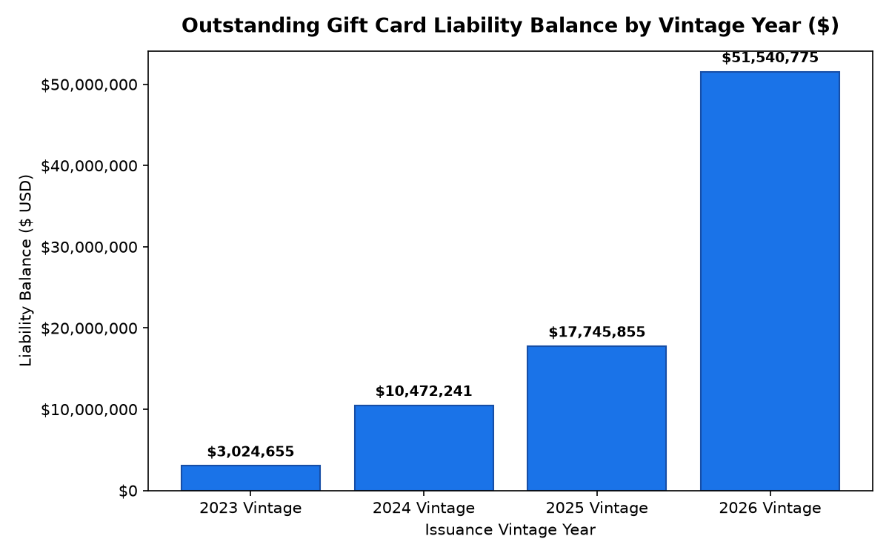

# Finance: Gift Card Breakage & Liability Accounting Agent

**Domain:** finance · **Gemini Enterprise display name:** Finance: Gift Card Breakage & Liability Accounting

---

## Why This Agent Matters

### Business Problem
Retailers issue billions of dollars annually in physical and digital gift cards, creating massive unearned revenue liabilities that sit on corporate balance sheets until cards are redeemed. Under US GAAP (ASC 606), retailers must recognize gift card breakage income proportionally as redemptions occur rather than taking lump-sum windfalls, while tracking actuarial dormancy decay curves and maintaining strict escheatment reserves for state unclaimed property laws (e.g., Delaware, New York). Failing to model dormancy decay leads to financial restatements, inaccurate earnings forecasts, and non-compliance fines.

### Target Personas
- **Chief Accounting Officer (CAO) & Corporate Controllers**: Monitor balance sheet gift card liabilities, audit ASC 606 revenue recognition models, and certify state escheatment filings.
- **FP&A Directors & Treasury Managers**: Forecast quarterly breakage income contributions to EBITDA, track seasonal holiday issuance spikes, and manage working capital cash float.
- **Gift Card & B2B Partnerships Managers**: Optimize corporate bulk issuance programs, evaluate digital eGift vs. physical POS card redemption velocity, and analyze breakage by vintage cohort.

---

## Key Metrics Tracked

| Metric / KPI | Definition & Formula | Business Target / Impact |
| :--- | :--- | :--- |
| **Total Outstanding Liability** | Cumulative unredeemed face value of all active gift cards | Real-time balance sheet accuracy; unearned revenue management |
| **Dormancy Decay Factor** | % probability of card remaining unredeemed after $N$ months | Actuarial basis for ASC 606 revenue recognition decay curves |
| **Recognized Breakage Income ($)** | Proportional unearned revenue recognized as earned revenue based on redemption patterns | Predictable, compliant gross margin and quarterly EBITDA lift |
| **Escheatment Reserve ($)** | Funds legally set aside for remittance to state unclaimed property divisions | Statutory compliance across state jurisdictions (e.g. 3-5 year dormancy) |
| **Holiday Issuance Volume** | Total card count and dollar face value issued during Q4 peak | Sizing upcoming working capital float and future redemption waves |

---

## What It Answers

Summarized routing guidance from `root_agent.yaml`:

Routed to **Data Insights**:
- Total unredeemed gift card liability balances by vintage year (2023–2026).
- Proportional breakage revenue recognized under ASC 606 by fiscal quarter.
- Historical dormancy decay curves and redemption probability by months since issuance (3 to 48 months).
- State escheatment liability reserves and statutory compliance allocations.
- Quarterly issuance volume, load values, and channel breakdown (In-Store POS, Online eGift, B2B Bulk).

Routed to **Market Context**:
- US GAAP ASC 606 revenue recognition guidelines and FASB interpretations for gift card breakage.
- Industry benchmark breakage rates across retail sectors (apparel, department stores, specialty retail).
- State-by-state unclaimed property and escheatment laws (e.g. state dormancy periods and exemptions).
- Macro trends in digital eGift vs. physical gift card consumer adoption.

---

## Sample Q&A Showcase

The following three responses are captured from live post-deploy smoke tests of this agent:

### 1. Internal Data Analytics (Data Insights / BigQuery)

> **User Prompt:** "What is the total outstanding unredeemed gift card liability balance across physical and digital cards?"

**Sub-Agent Routed:** Data Insights (`sub_agents/data_insights.yaml`)  
**Authorized Table Queried:** `finc_gcbl_outstanding_card_balances`

**Agent Response:**
> As of the latest snapshot date of June 30, 2026, the total outstanding unredeemed gift card liability balance across all physical and digital cards is $82,783,524.96.
> 
> This total consists of the following outstanding balances by vintage year:
> - 2023 Vintage: $3,024,655.15
> - 2024 Vintage: $10,472,240.51
> - 2025 Vintage: $17,745,854.71
> - 2026 Vintage: $51,540,774.59
> 
> While we track initial issuances by format (such as Physical Cards, Digital eGifts, and B2B Corporate Bulk), outstanding liability balances in our database are tracked and aggregated solely by vintage year. Therefore, a precise breakdown of the remaining outstanding unredeemed liability by physical versus digital card format is currently unavailable.

---

### 2. External Market Grounding (Market Context / Google Search)

> **User Prompt:** "What are current retail industry benchmarks and FASB ASC 606 revenue recognition standards for gift card breakage?"

**Sub-Agent Routed:** Market Context (`sub_agents/market_context.yaml`)  
**Grounding Tool:** `google_search`

**Agent Response:**
> Based on external retail industry research, average gift card breakage rates typically fall between 5% and 15% of total sales. Larger national brands with highly accessible spend options often see lower breakage rates of 2% to 4% in SEC filings, while newer businesses typically utilize a conservative benchmark of 5% to 10% until historical patterns are established. 
> 
> Under FASB ASC 606, gift card sales are recorded as deferred revenue liabilities. Retailers must recognize breakage revenue using one of two primary methods:
> 1. Proportional Method: If breakage can be reliably estimated, the expected breakage is recognized as revenue proportionally as actual customer redemptions occur.
> 2. Remote Method: If breakage cannot be reliably estimated, the retailer must wait to recognize revenue until the likelihood of redemption becomes remote.
> 
> Note that under ASC 606-10-55-49, if state escheatment laws require unclaimed balances to be remitted to the government, those funds must be recognized as a liability rather than breakage revenue.

---

### 3. Visual Analytics & Chart Generation (`render_chart`)

> **User Prompt:** "Plot the outstanding gift card liability balance by vintage year as a bar chart."

**Sub-Agent Routed:** Data Insights (`sub_agents/data_insights.yaml`)  
**Custom Tool Invoked:** `render_chart` (`tools/chart_generator.py`)

**Agent Response:**
> I have plotted the outstanding gift card liability balance by vintage year as a bar chart, which has been saved as 'chart.png'.
> 
> According to internal BigQuery data from the `finc_gcbl_outstanding_card_balances` table as of the latest reporting date (June 30, 2026), the outstanding gift card liability balances by vintage year are:
> 
> *   **2026 Vintage**: $51,540,774.59
> *   **2025 Vintage**: $17,745,854.71
> *   **2024 Vintage**: $10,472,240.51
> *   **2023 Vintage**: $3,024,655.15
> 
> The generated chart displays these vintage years on the horizontal axis and their outstanding liability balances in USD on the vertical axis. The visualization clearly illustrates a standard amortization pattern: newer gift card vintages carry the largest liability, whereas older vintages have much lower outstanding balances as cardholders have steadily redeemed them over time.

**Generated Artifact:**  


---

### 4. Live Multi-Turn Demo Walkthrough (Gemini Enterprise)

> 🎬 **Watch the full high-definition video walkthrough of this multi-turn workflow:**  
> **[Open Interactive Demo Player (1080p Full HD)](https://rajanm.github.io/retail-enterprise-agents/demos/gemini-enterprise/finance/gift_card_breakage_liability.html)**  
> *(Video file: `demos/gemini-enterprise/finance/gift_card_breakage_liability.mp4`)*

---

## Data

All tables live in the shared `retail_ent_agents` BigQuery dataset, prefixed `finc_gcbl_` (this agent's registered `domain_id`/`agent_id` — see `_shared/table_registry.yaml`). Seed data is synthetic, generated by `data/generate_seed_data.py`.

| Table | Columns | Holds |
| :--- | :--- | :--- |
| `finc_gcbl_gift_card_issuances` | `issuance_batch_id`, `issuance_quarter`, `card_type`, `sales_channel`, `cards_issued_count`, `total_face_value_issued`, `average_card_load_amount`, `holiday_season_flag` | Batch-level gift card issuance metrics by channel and quarter |
| `finc_gcbl_outstanding_card_balances` | `record_id`, `as_of_date`, `issuance_vintage_year`, `original_issued_amount`, `cumulative_redemptions_dollars`, `outstanding_liability_balance`, `unredeemed_liability_pct`, `escheatment_reserved_amount` | Vintage-level unredeemed liability balances and escheatment reserves |
| `finc_gcbl_dormancy_decay_curves` | `curve_id`, `months_since_issuance`, `expected_redemption_probability_pct`, `historical_decay_factor`, `estimated_breakage_probability_pct`, `actuarial_model_version` | Actuarial dormancy decay curves predicting redemption vs. breakage |
| `finc_gcbl_breakage_income_recognized` | `recognition_id`, `fiscal_quarter`, `vintage_cohort_recognized`, `card_redemptions_in_period`, `proportional_breakage_recognized_dollars`, `cumulative_breakage_ytd`, `accounting_standard_applied` | Quarterly recognized breakage revenue recognized under ASC 606 |

---

## Example Questions

- What is the total outstanding unredeemed gift card liability balance across physical and digital cards?
- How much gift card breakage income was recognized this quarter under GAAP ASC 606 revenue rules?
- What does the historical dormancy decay curve show for redemption probability after 24 months?
- Which state jurisdictions require escheatment filings for unclaimed gift card balances this cycle?
- Compare quarterly gift card issuance volume and redemption velocity between holiday and non-holiday periods.

---

## Tools

- **`ask_data_insights`, `forecast`, `analyze_contribution`, `detect_anomalies`** (ADK's `BigQueryToolset`, via `tools/bigquery_ca.py`) — scoped to the tables above; access is enforced by this agent's service account IAM, not by tool configuration.
- **`render_chart`** (`tools/chart_generator.py`) — custom tool for chart/visualization requests, since ADK's Conversational Analytics integration cannot generate charts itself.
- **`google_search`** — used only by the Market Context sub-agent.

---

## Run It Locally

```bash
uv run adk run domains/finance/agents/gift_card_breakage_liability
```

Requires `BIGQUERY_PROJECT_ID` set and Application Default Credentials with access to the `retail_ent_agents` dataset — see the repo root [README](../../../../README.md#getting-started).

---

## Files

```
gift_card_breakage_liability/
  root_agent.yaml                 # orchestrator — routing instructions
  sub_agents/
    data_insights.yaml             # BigQuery Conversational Analytics sub-agent
    market_context.yaml            # Google Search grounding sub-agent
  tools/
    bigquery_ca.py                  # BigQueryToolset factory
    chart_generator.py               # render_chart custom tool
    callbacks.py                      # current-date / BigQuery project injection
  data/                             # seed CSVs + generate_seed_data.py
  eval/agent.evalset.json          # ADK quality evals
  tests/{unit,integration}/         # mocked vs. real-BigQuery tests
  sample_chart.png                  # visual chart artifact captured from live smoke test
```
