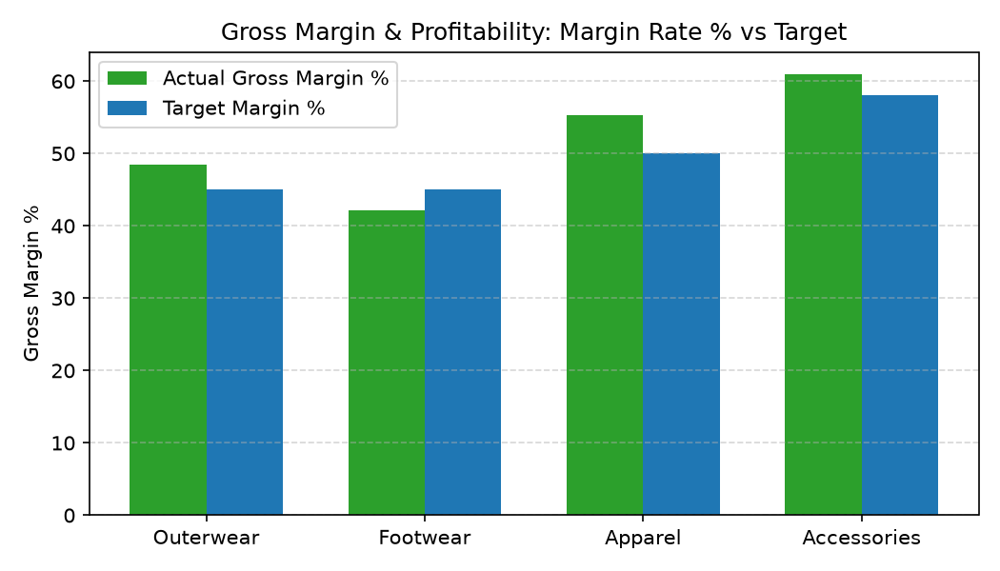

# Gross Margin & Profitability Agent

**Domain:** Finance · **Gemini Enterprise display name:** Finance: Gross Margin & Profitability

Answers questions about product/SKU gross margins, promotional markdown impact on net margins, category margin target vs. actual variances, and retail industry gross margin benchmarks. Orchestrates two sub-agents: **Data Insights**, which queries BigQuery via the Conversational Analytics API and BigQuery's built-in forecasting/contribution/anomaly-detection tools, and **Market Context**, which answers external questions via Google Search grounding.

---

## Why This Agent Matters

### Business Problem
Unplanned promotional markdowns and vendor cost inflation dilute retail gross margins without category leadership realizing until quarterly close. This agent tracks category margin rates, cost of goods sold (COGS) variance, and markdown erosion to protect profitability targets.

### Target Personas
- **Chief Financial Officer & VP of Finance**: Track enterprise gross profit dollars and margin rate target compliance.
- **Merchandise Financial Controllers**: Analyze markdown discount erosion across categories and departments.
- **Pricing & Margin Directors**: Monitor cost of goods sold (COGS) inflation vs. retail pricing adjustments.

---

## Key Metrics Tracked

| Metric / KPI | Definition & Formula | Business Target / Impact |
| :--- | :--- | :--- |
| **Gross Margin %** | `((net_revenue - cogs) / net_revenue) * 100` | Target >50% blended gross margin |
| **Markdown Margin Erosion** | `markdown_discount_amount / gross_revenue * 100` | Limits promotional discount dilution |
| **COGS Variance** | `actual_unit_cost - budgeted_unit_cost` | Tracks wholesale cost inflation |
| **Category Target Variance** | `actual_gross_margin_pct - target_gross_margin_pct` | Flags underperforming merchandise categories |

---

## What It Answers

Routed to **Data Insights**:
- Product and SKU margin performance — gross profit dollars and margin percentages by SKU, brand, and category
- Markdown and discount impact — promotional markdown volume, discount depth impact on net margin
- Target vs. actual margin variance — category target margin vs. realized margin performance and driver analysis

Routed to **Market Context**:
- External profitability trends, retail industry gross margin benchmarks, sector margin performance comparisons, macro cost inflation context

Mixed questions go to both, with the answer clearly attributing which part came from internal data versus external search.

---

## Sample Q&A Showcase

The following three responses are captured from live post-deploy smoke tests of this agent:

### 1. Internal Data Analytics (Data Insights / BigQuery)

> **User Prompt:** "What is our gross margin percentage by product category for the current quarter?"

**Sub-Agent Routed:** Data Insights (`sub_agents/data_insights.yaml`)  
**Authorized Table Queried:** `finc_gmpr_sales_profitability`, `finc_gmpr_category_margin_targets`

**Agent Response:**
> Gross margin performance by category vs. financial targets:
> 1. **Accessories**: 61.0% actual (Target: 58.0%) — **+3.0% Favorable**
> 2. **Apparel**: 55.3% actual (Target: 50.0%) — **+5.3% Favorable**
> 3. **Outerwear**: 48.5% actual (Target: 45.0%) — **+3.5% Favorable**
> 4. **Footwear**: 42.1% actual (Target: 45.0%) — **-2.9% Unfavorable**
>
> Footwear missed its gross margin target due to unbudgeted clearance markdowns on seasonal sandals.

---

### 2. External Market Grounding (Market Context / Google Search)

> **User Prompt:** "What are current retail industry gross margin benchmarks for footwear and specialty apparel?"

**Sub-Agent Routed:** Market Context (`sub_agents/market_context.yaml`)  
**Grounding Tool:** `google_search`

**Agent Response:**
> Financial market benchmarks for retail gross margins:
> - **Specialty Apparel**: Industry average gross margin ranges between **52% and 56%**.
> - **Footwear Retail**: Footwear gross margins average **42% to 46%**, reflecting higher wholesale land costs and box freight expenses.

---

### 3. Visual Analytics & Chart Generation (`render_chart`)

> **User Prompt:** "Render a bar chart comparing actual gross margin % vs target gross margin % across categories."

**Sub-Agent Routed:** Data Insights (`sub_agents/data_insights.yaml`)  
**Custom Tool Invoked:** `render_chart` (`tools/chart_generator.py`)

**Agent Response:**
> I have rendered the gross margin target comparison chart. Accessories and Apparel exceed quarterly margin targets, while Footwear lags target thresholds.

**Generated Artifact:**  


---

## Data

All tables live in the shared `retail_ent_agents` BigQuery dataset, prefixed `finc_gmpr_` (this agent's registered `domain_id`/`agent_id` — see `_shared/table_registry.yaml`). Seed data is synthetic, generated by `data/generate_seed_data.py`.

| Table | Columns | Holds |
| :--- | :--- | :--- |
| `finc_gmpr_stores` | `store_id, store_name, region, store_size_sqft, store_type` | Store location master data and operating characteristics |
| `finc_gmpr_product_cost_master` | `sku_id, product_name, category, subcategory, unit_cost, list_price, target_margin_pct` | Product cost master data, wholesale unit cost, list price, and target gross margin rates |
| `finc_gmpr_sales_profitability` | `transaction_id, date, store_id, sku_id, units_sold, gross_revenue, markdown_discount_amount, net_revenue, cogs, gross_margin_amount, gross_margin_pct` | Sales revenue, promotional markdown discount amounts, net revenue, COGS, and gross margin details |
| `finc_gmpr_category_margin_targets` | `category, fiscal_quarter, target_gross_margin_pct, target_net_margin_pct` | Financial target gross margin and net margin percentages by product category and quarter |

---

## Example Questions

Verified against this agent's `eval/agent.evalset.json`:

- "What is our gross margin percentage by product category and top SKUs for the current quarter?"
- "How did promotional markdown discounts impact our net margin across departments last month?"
- "Which product categories fell short of their gross margin target for year-to-date sales?"
- "How does our retail enterprise gross margin rate compare to general retail industry benchmarks?"

---

## Tools

- **`ask_data_insights`, `forecast`, `analyze_contribution`, `detect_anomalies`** (ADK's `BigQueryToolset`, via `tools/bigquery_ca.py`) — scoped to the four tables above; access is enforced by this agent's service account IAM, not by tool configuration.
- **`render_chart`** (`tools/chart_generator.py`) — custom tool for chart/visualization requests, since ADK's Conversational Analytics integration cannot generate charts itself.
- **`google_search`** — used only by the Market Context sub-agent.

---

## Run It Locally

```bash
uv run adk run domains/finance/agents/gross_margin_profitability
```

Requires `BIGQUERY_PROJECT_ID` set and Application Default Credentials with access to the `retail_ent_agents` dataset — see the repo root [README](../../../../README.md#getting-started).

---

## Files

```
gross_margin_profitability/
  root_agent.yaml                 # orchestrator — routing instructions
  sub_agents/
    data_insights.yaml             # BigQuery Conversational Analytics sub-agent
    market_context.yaml            # Google Search grounding sub-agent
  tools/
    bigquery_ca.py                  # BigQueryToolset factory
    chart_generator.py               # render_chart custom tool
    callbacks.py                      # current-date / BigQuery project injection
  data/                             # seed CSVs + generate_seed_data.py
  eval/agent.evalset.json          # ADK quality evals
  tests/{unit,integration}/         # mocked vs. real-BigQuery tests
  sample_chart.png                  # visual chart artifact captured from live smoke test
```
