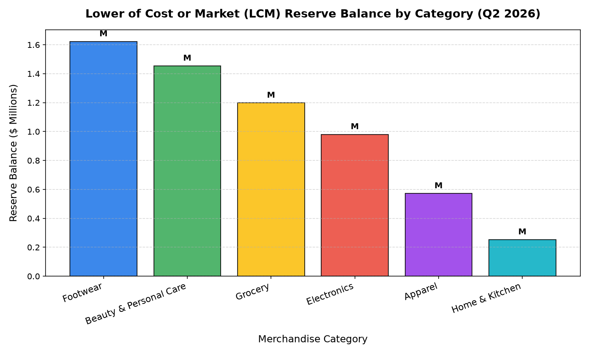

# Finance: Inventory Valuation & LCM Provisions Agent

**Domain:** finance · **Gemini Enterprise display name:** Finance: Inventory Valuation & LCM Provisions

---

## Why This Agent Matters

### Business Problem
Retail enterprise inventory carrying values must accurately reflect Net Realizable Value (NRV) under US GAAP (ASC 330) and IFRS (IAS 2). Without granular visibility into Lower of Cost or Market (LCM) reserves, slow-moving aging stock, unrecorded shrink exposure, and cost layer variances, retailers risk sudden balance sheet write-downs, audit compliance penalties, and distorted gross margins. This agent automates inventory reserve calculations, monitors aged write-down schedules, reconciles book-to-physical shrink accruals, and tracks FIFO cost layers against current market replacement costs.

### Target Personas
- **Corporate Controller & VP of Accounting:** Establishes LCM reserve policies, reviews quarterly write-down schedules, and ensures compliance with ASC 330 / IAS 2 reporting guidelines.
- **Director of Inventory Accounting:** Tracks physical cycle count variances vs. book accruals, manages true-up entries, and oversees cost layer reconciliations.
- **VP of Financial Planning & Analysis (FP&A):** Incorporates reserve adjustments and scrap/salvage recovery forecasts into quarterly earnings projections and working capital models.
- **Merchandise Finance Director:** Partners with category merchandising teams to trigger clearance actions before aged inventory escalates into 100% write-off buckets.

---

## Key Metrics Tracked

| Metric / KPI | Definition & Formula | Business Target / Impact |
| :--- | :--- | :--- |
| **LCM Valuation Reserve Balance ($)** | Total valuation allowance required when net realizable value falls below cost basis: `Cost Basis - NRV (where Cost > NRV)`. | Keep reserve < 8.0% of total inventory asset value; minimize quarterly reserve buildup. |
| **Inventory Write-Down Provision ($)** | Cumulative income statement charge for obsolete, damaged, or aged inventory: `Gross Cost * Write-Down % - Salvage Recovery`. | Minimize P&L impact; accelerate clearance prior to 270+ day aging brackets. |
| **Financial Shrink Accrual Rate (%)** | Estimated percentage of net sales accrued monthly/quarterly to anticipate loss: `Shrink Accrual / Net Sales Basis`. | Maintain within ±10 bps of physical cycle count reality; prevent large year-end true-up surprises. |
| **Physical Count Variance True-Up ($)** | Reconciliation delta between accrued shrink and actual audited physical inventory counts. | Target near-zero variance; < ,000 per store location per cycle. |
| **FIFO vs. Replacement Cost Variance ($)** | Differential between balance sheet FIFO valuation and current wholesale replacement pricing. | Early warning indicator for impending market deflation and LCM impairment triggers. |

---

## What It Answers

Routed to **Data Insights**:
- Total LCM valuation reserve balances, quarterly reserve movements, and impairment requirements by merchandise category.
- Aging write-down schedules and net P&L impacts across 0-90, 91-180, 181-270, 271-360, and 360+ day brackets.
- Store-level financial shrink accruals, sales basis exposure, and post-audit physical count true-up adjustments.
- Granular FIFO cost layers, unit cost comparisons against weighted average and replacement cost, and extended SKU valuations.

Routed to **Market Context**:
- US GAAP (ASC 330) and IFRS (IAS 2) accounting standards, LCNRV vs. LCM frameworks, and impairment irreversibility rules.
- Retail industry benchmark reserve percentages, salvage value liquidation recovery rates, and wholesale replacement cost trends.
- Macroeconomic commodity price deflation and supply chain impacts on inventory carrying costs.

Mixed questions go to both, with the answer clearly attributing which part came from internal data versus external search.

---

## Sample Q&A Showcase

The following three responses are captured from live post-deploy smoke tests of this agent:

### 1. Internal Data Analytics (Data Insights / BigQuery)

> **User Prompt:** "What is our total Lower of Cost or Market (LCM) valuation reserve balance by merchandise category in Q2 2026?"

**Sub-Agent Routed:** Data Insights (`sub_agents/data_insights.yaml`)  
**Authorized Table Queried:** `finc_ivpr_lcm_valuation_reserves`

**Agent Response:**
> Our total Lower of Cost or Market (LCM) valuation reserve balance in Q2 2026 is ,079,006.96.
>
> The breakdown of this total reserve balance by merchandise category is:
> - **Footwear:** ,622,499.83 (representing 11.40% of category inventory value)
> - **Beauty & Personal Care:** ,454,161.58 (10.43% of category inventory value)
> - **Grocery:** ,197,977.28 (7.30% of category inventory value)
> - **Electronics:** 80,485.94 (11.19% of category inventory value)
> - **Apparel:** 71,873.08 (6.11% of category inventory value)
> - **Home & Kitchen:** 53,009.25 (4.37% of category inventory value)
>
> From a risk perspective, Footwear represents our largest reserve balance and experienced the most significant worsening in health with a 79,735.56 reserve increase versus the prior quarter. Conversely, Grocery saw a positive trend with a reserve release of 64,055.87. All figures are retrieved from internal financial records.

---

### 2. External Market Grounding (Market Context / Google Search)

> **User Prompt:** "What are the key US GAAP ASC 330 accounting standards and industry best practices for evaluating Lower of Cost or Market (LCM) and Net Realizable Value (NRV) inventory write-down reserves in retail?"

**Sub-Agent Routed:** Market Context (`sub_agents/market_context.yaml`)  
**Grounding Tool:** `google_search`

**Agent Response:**
> Based on external web search results, under US GAAP ASC 330, inventory valuation requirements depend on the costing method used:
>
> - **FIFO or Average Cost:** Valued at Lower of Cost and Net Realizable Value (LCNRV). NRV is the estimated selling price in the ordinary course of business, less predictable completion, disposal, and transportation costs.
> - **LIFO or Retail Inventory Method (RIM):** Evaluated under the Lower of Cost or Market (LCM) framework. "Market" represents replacement cost, bounded by a ceiling (NRV) and a floor (NRV minus normal profit margin).
>
> **Key Standards & Best Practices:**
> - **Irreversibility:** Under US GAAP, a write-down at fiscal year-end establishes a permanent new cost basis and cannot be reversed if market value recovers.
> - **Unit of Account:** Retailers should evaluate impairment item-by-item or by logical product groupings, rather than using arbitrary aggregations that hide individual impairments.
> - **Data Integration:** Best practices dictate reconciling physical inventory counts to address book drift (shrinkage or damage), while incorporating historical sell-through rates and seasonal markdown schedules to estimate realistic selling prices.

---

### 3. Visual Analytics & Chart Generation (`render_chart`)

> **User Prompt:** "Render a bar chart of the Lower of Cost or Market (LCM) reserve balance across merchandise categories for Q2 2026."

**Sub-Agent Routed:** Data Insights (`sub_agents/data_insights.yaml`)  
**Custom Tool Invoked:** `render_chart` (`tools/chart_generator.py`)

**Agent Response:**
> I have rendered a bar chart displaying the Lower of Cost or Market (LCM) reserve balances across merchandise categories for Q2 2026, saved as 'chart.png'.
>
> According to internal BigQuery data, the total LCM reserve balance across all six categories in Q2 2026 stands at ,079,006.96. The chart illustrates that Footwear (.62M) and Beauty & Personal Care (.45M) are the leading drivers of inventory write-down exposure, collectively representing more than half of the total reserve balance.

**Generated Artifact:**  


---

## Data

All tables live in the shared `retail_ent_agents` BigQuery dataset, prefixed `finc_ivpr_` (this agent's registered `domain_id`/`agent_id` — see `_shared/table_registry.yaml`). Seed data is synthetic, generated by `data/generate_seed_data.py`.

| Table | Columns | Holds |
| :--- | :--- | :--- |
| `finc_ivpr_inventory_cost_layers` | `layer_id`, `sku_id`, `product_name`, `merchandise_category`, `inventory_receipt_date`, `layer_units_on_hand`, `fifo_unit_cost`, `weighted_avg_cost`, `current_replacement_cost`, `extended_fifo_value` | SKU-level receipt batches, cost layers, units on hand, FIFO vs weighted average cost, and market replacement cost differentials. |
| `finc_ivpr_lcm_valuation_reserves` | `reserve_id`, `merchandise_category`, `fiscal_quarter`, `cost_basis_inventory_value`, `net_realizable_value_nrv`, `lcm_impairment_required`, `lcm_reserve_balance`, `reserve_change_vs_prior_qtr`, `reserve_pct_of_inventory` | Category-level quarterly Lower of Cost or Market reserve balances, net realizable values, impairment requirements, and QoQ reserve rollforwards. |
| `finc_ivpr_shrink_financial_accruals` | `accrual_id`, `store_id`, `fiscal_year`, `fiscal_quarter`, `estimated_shrink_rate_pct`, `net_sales_basis`, `shrink_accrual_amount`, `physical_count_variance_adj`, `true_up_reconciliation_amount` | Store-level shrink rate accruals against sales bases, cycle count audit variances, and physical inventory true-up entries. |
| `finc_ivpr_write_down_schedules` | `schedule_id`, `merchandise_category`, `aging_bucket`, `gross_inventory_cost`, `write_down_percentage`, `write_down_amount`, `salvage_recovery_rate_pct`, `net_pnl_impact` | Policy-driven write-down provision percentages, aged inventory brackets (0-90 to 360+ days), salvage recoveries, and net P&L impact. |

---

## Example Questions

- "What is our total Lower of Cost or Market (LCM) valuation reserve balance by product department?"
- "How much inventory write-down provision was recognized this quarter for aging seasonal categories?"
- "What are our current financial shrink accruals compared to physical inventory count adjustments?"
- "Analyze FIFO cost layers versus current net realizable value (NRV) for slow-moving electronics SKUs."
- "Which merchandise categories have the highest write-down schedules over the past four quarters?"

---

## Tools

- **`ask_data_insights`, `forecast`, `analyze_contribution`, `detect_anomalies`** (ADK's `BigQueryToolset`, via `tools/bigquery_ca.py`) — scoped to the tables above; access is enforced by this agent's service account IAM, not by tool configuration.
- **`render_chart`** (`tools/chart_generator.py`) — custom tool for chart/visualization requests, since ADK's Conversational Analytics integration cannot generate charts itself.
- **`google_search`** — used only by the Market Context sub-agent.

---

## Run It Locally

```bash
uv run adk run domains/finance/agents/inventory_valuation_provisions
```

Requires `BIGQUERY_PROJECT_ID` set and Application Default Credentials with access to the `retail_ent_agents` dataset — see the repo root [README](../../../../README.md#getting-started).

---

## Files

```
inventory_valuation_provisions/
  root_agent.yaml                 # orchestrator — routing instructions
  sub_agents/
    data_insights.yaml             # BigQuery Conversational Analytics sub-agent
    market_context.yaml            # Google Search grounding sub-agent
  tools/
    bigquery_ca.py                  # BigQueryToolset factory
    chart_generator.py               # render_chart custom tool
    callbacks.py                      # current-date / BigQuery project injection
  data/                             # seed CSVs + generate_seed_data.py
  eval/agent.evalset.json          # ADK quality evals
  tests/{unit,integration}/         # mocked vs. real-BigQuery tests
  sample_chart.png                  # visual chart artifact captured from live smoke test
```
