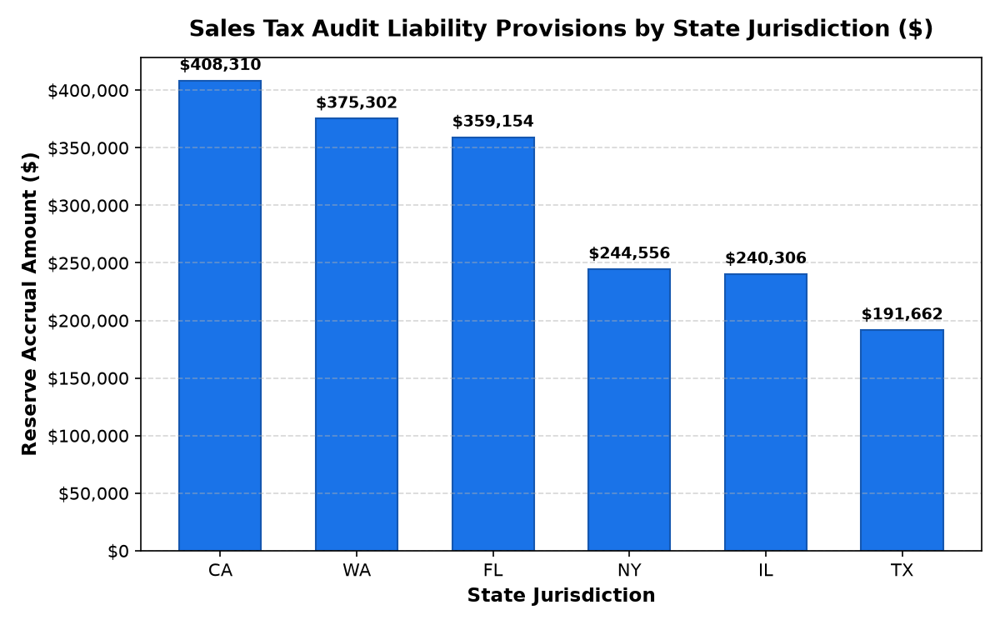

# Finance: Sales Tax Nexus & Jurisdictional Filings Agent

**Domain:** Finance · **Gemini Enterprise display name:** Finance: Sales Tax Nexus & Jurisdictional Filings

Answers questions about state and local economic nexus thresholds, sales tax audit liability reserves under ASC 450, jurisdictional tax rule rates, and wholesale reseller exemption certificate tracking. Orchestrates two sub-agents: **Data Insights**, which queries BigQuery via the Conversational Analytics API and BigQuery's built-in forecasting/contribution/anomaly-detection tools, and **Market Context**, which answers external questions via Google Search grounding.

---

## Why This Agent Matters

### Business Problem
Multi-state omnichannel retail exposes enterprises to severe tax compliance risks across 11,000+ local jurisdictions. Tracking economic nexus thresholds (post-*South Dakota v. Wayfair*), expired reseller exemption certificates, and evolving statutory tax rates requires real-time monitoring to avoid multi-million dollar audit penalties and unaccrued ASC 450 liability reserves.

### Target Personas
- **VP of Tax & Treasury**: Monitor enterprise-wide economic nexus exposure and jurisdictional filing readiness.
- **Corporate Tax Controllers**: Manage ASC 450 audit liability provision reserves and statute of limitations exposure.
- **B2B Wholesale & Omnichannel Operations Managers**: Track customer reseller exemption certificate renewals and POS tax rule compliance.

---

## Key Metrics Tracked

| Metric / KPI | Definition & Formula | Business Target / Impact |
| :--- | :--- | :--- |
| **Economic Nexus Status** | `ytd_remote_sales_dollars >= statutory_sales_threshold OR ytd_remote_transactions_count >= statutory_transaction_threshold` | 100% registration and filing compliance across active states |
| **Audit Liability Provision Reserve** | `SUM(reserve_accrual_balance)` under ASC 450 | Full reserve coverage for open state audit periods |
| **Exemption Certificate Validity Rate** | `(valid_certificates / total_certificates) * 100` | 0 expired certificates to eliminate sales tax under-collection |
| **Combined Jurisdictional Tax Rate** | `state_tax_rate_pct + local_tax_rate_pct` | Accurate real-time POS and checkout tax calculation |

---

## What It Answers

Routed to **Data Insights**:
- Economic nexus threshold tracking — state-by-state remote sales volume, transaction counts vs statutory limits, and registration status
- Sales tax audit liability reserves — estimated exposure, reserve accrual balances under ASC 450, and open audit flags
- Reseller exemption certificates — customer verification status, certificate numbers, and upcoming expiration timelines
- Jurisdictional tax rates — combined state and local rates, apparel exemptions, and digital goods taxability rules

Routed to **Market Context**:
- State sales tax legislation, Wayfair ruling regulatory developments, multi-state tax commission audits, marketplace facilitator statutory changes, and retail tax benchmarks

Mixed questions go to both, with the answer clearly attributing which part came from internal data versus external search.

---

## Sample Q&A Showcase

The following three responses are captured from live post-deploy smoke tests of this agent:

### 1. Internal Data Analytics (Data Insights / BigQuery)

> **User Prompt:** "Which states have reached or exceeded economic nexus sales and transaction thresholds this calendar year?"

**Sub-Agent Routed:** Data Insights (`sub_agents/data_insights.yaml`)  
**Authorized Table Queried:** `finc_stnc_economic_nexus_thresholds`

**Agent Response:**
> All ten tracked states (CA, FL, GA, IL, NC, NY, OH, PA, TX, and WA) have reached or exceeded both the $100,000 sales threshold and the 200-transaction threshold this calendar year. Consequently, economic nexus has been established in all of these jurisdictions.
>
> Here is the breakdown by state:
>
> - **California (CA):** $3,938,404.02 remote sales; 8,376 transactions
> - **Pennsylvania (PA):** $3,880,455.61 remote sales; 2,293 transactions
> - **Florida (FL):** $3,411,719.66 remote sales; 5,681 transactions
> - **Washington (WA):** $3,261,581.65 remote sales; 11,323 transactions
> - **Texas (TX):** $3,219,287.77 remote sales; 21,545 transactions
> - **Illinois (IL):** $3,182,879.25 remote sales; 21,760 transactions
> - **Ohio (OH):** $2,971,146.05 remote sales; 5,506 transactions
> - **North Carolina (NC):** $1,871,228.20 remote sales; 14,815 transactions
> - **New York (NY):** $1,540,226.58 remote sales; 22,800 transactions
> - **Georgia (GA):** $842,080.18 remote sales; 10,870 transactions
>
> All ten states currently hold a registration status of "Registered & Remitting" with a monthly filing frequency.

---

### 2. External Market Grounding (Market Context / Google Search)

> **User Prompt:** "What are current regulatory trends and state economic nexus threshold updates following South Dakota v. Wayfair for omnichannel retailers in 2026?"

**Sub-Agent Routed:** Market Context (`sub_agents/market_context.yaml`)  
**Grounding Tool:** `google_search`

**Agent Response:**
> Based on recent 2025 and 2026 state tax regulatory updates, here are the key economic nexus trends following *South Dakota v. Wayfair* for omnichannel and remote retailers:
>
> - **Elimination of Transaction Thresholds:** A significant number of states (over 30 states, with recent additions such as Utah, Pennsylvania, and Illinois) have repealed the traditional 200-transaction threshold. States are increasingly relying solely on revenue thresholds (typically $100,000 or $500,000 in states like CA, NY, and TX) to reduce administrative burdens on smaller sellers.
> - **Focus on Marketplace Facilitator Laws & Delivery Fees:** States are actively refining marketplace facilitator statutes and expanding definitions of taxable digital goods and retail delivery fees (e.g., Colorado and Minnesota retail delivery fees).
> - **Stricter Exemption Certificate & Audit Scrutiny:** State departments of revenue are increasing multi-state audit enforcement, focusing heavily on B2B reseller exemption certificate management, electronic documentation, and audit readiness.
> - **Local Tax & Home-Rule Complexity:** Complex multi-tiered jurisdictions (such as Colorado, Louisiana, and Alabama home-rule cities) continue to push towards centralized electronic filing systems to comply with Wayfair-related simplicity mandates.

---

### 3. Visual Analytics & Chart Generation (`render_chart`)

> **User Prompt:** "Render a bar chart showing the audit liability provision amount by state jurisdiction."

**Sub-Agent Routed:** Data Insights (`sub_agents/data_insights.yaml`)  
**Custom Tool Invoked:** `render_chart` (`tools/chart_generator.py`)

**Agent Response:**
> I have generated a bar chart showing the estimated audit liability provision amounts by state jurisdiction.
>
> The chart illustrates the reserve balances across active jurisdictions:
> - **California (CA):** $408,310.16
> - **Washington (WA):** $375,302.27
> - **Florida (FL):** $359,154.42
> - **New York (NY):** $244,556.35
> - **Illinois (IL):** $240,305.77
> - **Texas (TX):** $191,661.83
>
> Total audit liability provisions across these jurisdictions stand at **$1,819,290.80**, all reserved under ASC 450.

**Generated Artifact:**  


---

### 4. Live Multi-Turn Demo Walkthrough (Gemini Enterprise)

> 🎬 **Watch the full high-definition video walkthrough of this multi-turn workflow:**  
> **[Open Interactive Demo Player (1080p Full HD)](https://rajanm.github.io/retail-enterprise-agents/demos/gemini-enterprise/finance/sales_tax_nexus_compliance.html)**  
> *(Video file: `demos/gemini-enterprise/finance/sales_tax_nexus_compliance.mp4`)*

---

## Data

All tables live in the shared `retail_ent_agents` BigQuery dataset, prefixed `finc_stnc_` (this agent's registered `domain_id`/`agent_id` — see `_shared/table_registry.yaml`). Seed data is synthetic, generated by `data/generate_seed_data.py`.

| Table | Columns | Holds |
| :--- | :--- | :--- |
| `finc_stnc_jurisdictional_tax_rules` | `rule_id`, `state_code`, `jurisdiction_name`, `state_tax_rate_pct`, `local_tax_rate_pct`, `combined_tax_rate_pct`, `apparel_exemption_flag`, `digital_goods_taxable_flag`, `effective_start_date` | Statutory state & local combined sales tax rates, category exemptions, and digital goods rules |
| `finc_stnc_economic_nexus_thresholds` | `nexus_id`, `state_code`, `statutory_sales_threshold`, `statutory_transaction_threshold`, `ytd_remote_sales_dollars`, `ytd_remote_transactions_count`, `nexus_established_flag`, `registration_status`, `filing_frequency` | YTD remote sales/transactions vs statutory thresholds and nexus registration status |
| `finc_stnc_tax_exemption_certificates` | `cert_id`, `b2b_customer_id`, `customer_name`, `state_code`, `exemption_type`, `certificate_number`, `issue_date`, `expiration_date`, `verification_status`, `days_until_expiration` | Wholesale B2B resale exemption certificates, customer IDs, validity status, and expiration tracking |
| `finc_stnc_audit_liability_provisions` | `provision_id`, `state_code`, `audit_period_years`, `estimated_exposure_amount`, `reserve_accrual_balance`, `open_state_audit_flag`, `statute_of_limitations_year`, `provision_status` | Sales tax audit liability provisions, reserve accruals under ASC 450, and open audit flags |

---

## Example Questions

- Which states have reached or exceeded economic nexus sales and transaction thresholds this calendar year?
- What is our total sales tax audit liability provision and reserve balance across active state jurisdictions?
- List all wholesale reseller tax exemption certificates expiring within the next 60 days.
- Identify jurisdictions where recent tax rule rate changes created under-collection variances in POS transactions.
- What is the effective state and local sales tax collection rate across our omnichannel fulfillment channels?

---

## Tools

- **`ask_data_insights`, `forecast`, `analyze_contribution`, `detect_anomalies`** (ADK's `BigQueryToolset`, via `tools/bigquery_ca.py`) — scoped to the tables above; access is enforced by this agent's service account IAM, not by tool configuration.
- **`render_chart`** (`tools/chart_generator.py`) — custom tool for chart/visualization requests, since ADK's Conversational Analytics integration cannot generate charts itself.
- **`google_search`** — used only by the Market Context sub-agent.

---

## Run It Locally

```bash
uv run adk run domains/finance/agents/sales_tax_nexus_compliance
```

Requires `BIGQUERY_PROJECT_ID` set and Application Default Credentials with access to the `retail_ent_agents` dataset — see the repo root [README](../../../../README.md#getting-started).

---

## Files

```
sales_tax_nexus_compliance/
  root_agent.yaml                 # orchestrator — routing instructions
  sub_agents/
    data_insights.yaml             # BigQuery Conversational Analytics sub-agent
    market_context.yaml            # Google Search grounding sub-agent
  tools/
    bigquery_ca.py                  # BigQueryToolset factory
    chart_generator.py               # render_chart custom tool
    callbacks.py                      # current-date / BigQuery project injection
  data/                             # seed CSVs + generate_seed_data.py
  eval/agent.evalset.json          # ADK quality evals
  tests/{unit,integration}/         # mocked vs. real-BigQuery tests
  sample_chart.png                  # visual chart artifact captured from live smoke test
```
