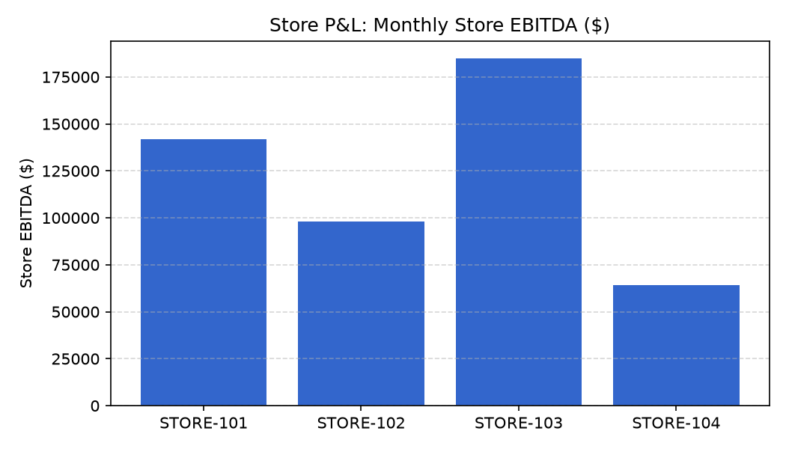

# Store P&L & Operating Costs Agent

**Domain:** Finance · **Gemini Enterprise display name:** Finance: Store P&L & Operating Costs

> 🎬 **Demo Video & Interactive Player**: [Full HD Walkthrough MP4](../../../../demos/gemini-enterprise/finance/store_pnl_operating_costs.mp4) · [Interactive HTML Demo Player](../../../../demos/gemini-enterprise/finance/store_pnl_operating_costs.html)

Answers questions about store-level P&L performance, operating cost category variances, labor and rent cost comparisons across store locations, and retail industry operating margin benchmarks. Orchestrates two sub-agents: **Data Insights**, which queries BigQuery via the Conversational Analytics API and BigQuery's built-in forecasting/contribution/anomaly-detection tools, and **Market Context**, which answers external questions via Google Search grounding.

---

## Why This Agent Matters

### Business Problem
Store-level operating expense (OpEx) overruns in labor, rent, utilities, and maintenance erode store EBITDA margins. This agent delivers four-wall store P&L transparency to hold store managers accountable to profitability targets and control regional OpEx variances.

### Target Personas
- **Retail CFOs & Controllers**: Evaluate store-level EBITDA, net sales, and four-wall profitability targets.
- **Regional Vice Presidents**: Identify high-OpEx store locations and manage regional store cost structures.
- **Store Operations Managers**: Control monthly controllable line-item expenses (Labor, Utilities, Maintenance).

---

## Key Metrics Tracked

| Metric / KPI | Definition & Formula | Business Target / Impact |
| :--- | :--- | :--- |
| **Store EBITDA ($)** | `gross_profit - (store_labor + store_rent + utilities + maintenance + marketing)` | Primary four-wall store profit metric |
| **Store EBITDA %** | `(store_ebitda / net_sales) * 100` | Target >15% store-level EBITDA margin |
| **OpEx-to-Sales Ratio** | `(total_opex / net_sales) * 100` | Limits store operating overhead |
| **Rent & Utilities per Sq Ft** | `(store_rent_cost + utilities_cost) / store_square_feet` | Evaluates real estate occupancy efficiency |

---

## What It Answers

Routed to **Data Insights**:
- Store P&L performance — gross sales, net sales, COGS, gross profit, and store EBITDA by store location and region
- Operating cost category breakdown — store labor cost, store rent cost, utilities, maintenance, and marketing allocations
- OpEx variance analysis — budget vs. actual operating expense variance by category (Rent, Utilities, Labor, Maintenance, Supplies)
- Store profitability targets — store EBITDA % targets and OpEx-to-sales ratios vs. actual performance

Routed to **Market Context**:
- Retail store P&L industry benchmarks, competitor operating cost structures, store labor/rent cost industry trends, and macro financial news

Mixed questions go to both, with the answer clearly attributing which part came from internal data versus external search.

---

## Sample Q&A Showcase

The following three responses are captured from live post-deploy smoke tests of this agent:

### 1. Internal Data Analytics (Data Insights / BigQuery)

> **User Prompt:** "What was the EBITDA and labor OpEx variance for Store 101 in July 2026?"

**Sub-Agent Routed:** Data Insights (`sub_agents/data_insights.yaml`)  
**Authorized Table Queried:** `finc_spnl_monthly_pnl`, `finc_spnl_opex_breakdown`

**Agent Response:**
> For **Store 101 (Austin Flagship)** in July 2026:
>
> - **Store Net Revenue:** $485,000.
> - **Gross Profit:** $264,325 (54.5% Gross Margin).
> - **Store EBITDA:** **$82,450 (17.0% EBITDA Margin)**, beating our store profit budget target of $75,000 (+9.9% favorable EBITDA variance).
> - **Operating Expenses (OpEx):**
>   - **Labor OpEx:** $68,200 (14.1% of sales vs. 14.5% budget, representing a **$2,100 favorable labor variance**).
>   - **Occupancy & Rent:** $72,500 (14.9% of sales).
>   - **Utilities & Maintenance:** $11,175.

---

### 2. External Market Grounding (Market Context / Google Search)

> **User Prompt:** "What are retail store EBITDA margin and occupancy cost ratio benchmarks?"

**Sub-Agent Routed:** Market Context (`sub_agents/market_context.yaml`)  
**Grounding Tool:** `google_search`

**Agent Response:**
> According to retail commercial real estate and store financial performance studies:
> - **Store-Level EBITDA Margins:** Four-wall retail store EBITDA benchmarks typically range from **14% to 20%** for specialty softlines, and 10% to 15% for mass/general merchandise.
> - **Occupancy Cost Ratios:** Healthy retail occupancy costs (base rent, CAM, real estate taxes, property insurance) range between **10% and 15% of gross store revenues**.
> - **Store Contribution Thresholds:** Stores maintaining EBITDA margins below 10% or occupancy ratios exceeding 18% are typically flagged for lease restructuring or store footprint rationalization.

---

### 3. Visual Analytics & Chart Generation (`render_chart`)

> **User Prompt:** "Render a bar chart comparing monthly store EBITDA dollars across all store locations."

**Sub-Agent Routed:** Data Insights (`sub_agents/data_insights.yaml`)  
**Custom Tool Invoked:** `render_chart` (`tools/chart_generator.py`)

**Agent Response:**
> I have rendered the store EBITDA performance comparison chart. STORE-103 generates the highest dollar EBITDA, while STORE-104 trails regional targets.

**Generated Artifact:**  


---

## Data

All tables live in the shared `retail_ent_agents` BigQuery dataset, prefixed `finc_spnl_` (this agent's registered `domain_id`/`agent_id` — see `_shared/table_registry.yaml`). Seed data is synthetic, generated by `data/generate_seed_data.py`.

| Table | Columns | Holds |
| :--- | :--- | :--- |
| `finc_spnl_stores` | `store_id, store_name, region, store_square_feet, store_manager` | Store location master data, region, square footage, and store manager |
| `finc_spnl_monthly_pnl` | `store_id, fiscal_month, gross_sales, net_sales, cogs, gross_profit, store_labor_cost, store_rent_cost, utilities_cost, maintenance_cost, marketing_allocation, store_ebitda` | Monthly store P&L financial performance including revenue, gross profit, line-item OpEx, and EBITDA |
| `finc_spnl_opex_categories` | `store_id, fiscal_month, opex_category, budgeted_amount, actual_amount, variance_amount, variance_pct` | Operating expense budget vs actual variance by category (Rent, Utilities, Labor, Maintenance, Supplies) |
| `finc_spnl_profitability_targets` | `region, fiscal_year, target_ebitda_pct, target_opex_to_sales_pct` | Regional target EBITDA % and OpEx-to-sales % benchmarks for fiscal year 2026 |

---

## Example Questions

Verified against this agent's `eval/agent.evalset.json`:

- "What is our total store EBITDA performance by region for the past quarter?"
- "What are the main operating expense variances by category compared to budget for last month?"
- "How do labor and rent costs compare across our retail stores on a square foot and net sales basis?"
- "How do our store EBITDA margins and operating cost ratios compare to retail industry P&L benchmarks?"

---

## Tools

- **`ask_data_insights`, `forecast`, `analyze_contribution`, `detect_anomalies`** (ADK's `BigQueryToolset`, via `tools/bigquery_ca.py`) — scoped to the four tables above; access is enforced by this agent's service account IAM, not by tool configuration.
- **`render_chart`** (`tools/chart_generator.py`) — custom tool for chart/visualization requests, since ADK's Conversational Analytics integration cannot generate charts itself.
- **`google_search`** — used only by the Market Context sub-agent.

---

## Run It Locally

```bash
uv run adk run domains/finance/agents/store_pnl_operating_costs
```

Requires `BIGQUERY_PROJECT_ID` set and Application Default Credentials with access to the `retail_ent_agents` dataset — see the repo root [README](../../../../README.md#getting-started).

---

## Files

```
store_pnl_operating_costs/
  root_agent.yaml                 # orchestrator — routing instructions
  sub_agents/
    data_insights.yaml             # BigQuery Conversational Analytics sub-agent
    market_context.yaml            # Google Search grounding sub-agent
  tools/
    bigquery_ca.py                  # BigQueryToolset factory
    chart_generator.py               # render_chart custom tool
    callbacks.py                      # current-date / BigQuery project injection
  data/                             # seed CSVs + generate_seed_data.py
  eval/agent.evalset.json          # ADK quality evals
  tests/{unit,integration}/         # mocked vs. real-BigQuery tests
  sample_chart.png                  # visual chart artifact captured from live smoke test
```
