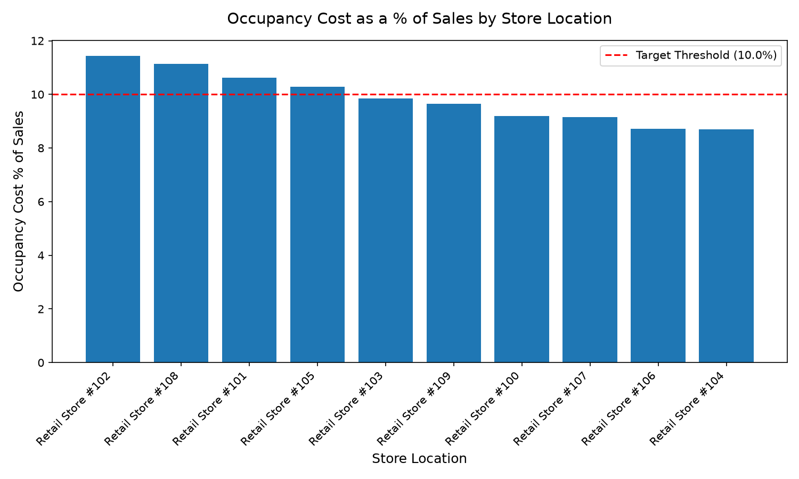

# Finance: Store Real Estate & Lease Management Agent

**Domain:** Finance · **Gemini Enterprise display name:** Finance: Store Real Estate & Lease Management

Evaluates store lease terms, occupancy cost ratios (% of sales), percentage rent overage thresholds, and co-tenancy clause triggers. Orchestrates two sub-agents: **Data Insights**, which queries BigQuery via the Conversational Analytics API and BigQuery's built-in forecasting/contribution/anomaly-detection tools, and **Market Context**, which answers external questions via Google Search grounding.

---

## Why This Agent Matters

### Business Problem
Fixed store lease liabilities, escalation clauses, and Common Area Maintenance (CAM) expenses represent one of the largest ongoing cash outflows for brick-and-mortar retail enterprises. When store sales decline or mall anchor tenants vacate, rigid base rent terms can drive occupancy cost burdens above sustainable thresholds (10-15% of sales). This agent empowers real estate and finance teams to track occupancy cost ratios, identify percentage rent overage obligations, proactively manage upcoming lease renewal windows, and enforce co-tenancy rent abatement remedies.

### Target Personas
- **VP of Real Estate & Store Development**: Oversee store lease portfolio commitments, site renewals, terminations, and expansion strategy.
- **Lease Administration & Real Estate Accounting Directors**: Track CAM reconciliations, triple-net (NNN) charges, base rent schedules, and percentage rent breakpoint calculations.
- **Corporate Retail FP&A & Portfolio Financial Analysts**: Monitor store-level occupancy cost % of sales ratios and model real estate cash flow commitments.

---

## Key Metrics Tracked

| Metric / KPI | Definition & Formula | Business Target / Impact |
| :--- | :--- | :--- |
| **Occupancy Cost % of Sales (OCR)** | `(total_occupancy_cost / store_monthly_sales) * 100` | Target <10% for specialty retail (<12% blended) |
| **Total Occupancy Cost** | `base_rent + cam_charges + property_taxes + property_insurance + percentage_rent` | Controls overall physical store operating burden |
| **Percentage Rent Overage** | `(actual_quarter_sales - sales_breakpoint) * overage_rate_pct` | Accurately calculates variable turnover rent liabilities |
| **Co-Tenancy Occupancy %** | `current_center_occupancy_pct vs co_tenancy_threshold_pct` | Triggers 50% rent reductions or termination rights on anchor departures |

---

## What It Answers

Routed to **Data Insights**:
- Store lease terms, base rent rates ($/sq.ft), lease expiration dates, and upcoming renewal option terms.
- Monthly occupancy costs (base rent, CAM fees, taxes, insurance) and occupancy cost as a percentage of sales across store locations.
- Percentage rent overage calculations and breakpoint threshold triggers across fiscal quarters.
- Co-tenancy clause tracking, anchor tenant occupancy status, and rent reduction/abatement remedies.

Routed to **Market Context**:
- Commercial retail real estate benchmarks, market lease rate trends ($/sq.ft), shopping center foot-traffic macro shifts, and landlord/tenant industry news.

Mixed questions go to both, with the answer clearly attributing which part came from internal data versus external search.

---

## Sample Q&A Showcase

The following three responses are captured from live post-deploy smoke tests of this agent:

### 1. Internal Data Analytics (Data Insights / BigQuery)

> **User Prompt:** "What are our total monthly occupancy costs and occupancy cost as a percentage of sales across store locations?"

**Sub-Agent Routed:** Data Insights (`sub_agents/data_insights.yaml`)  
**Authorized Table Queried:** `finc_srel_occupancy_costs`

**Agent Response:**
> Across our 10 store locations (based on data from January to June 2026), our total occupancy cost across the portfolio is ,890,571.74, averaging 48,428.62 monthly. Overall occupancy cost as a percentage of sales is 9.82% on total sales of 9,638,057.03.
>
> Below is the total occupancy cost and its percentage of sales for each store location, ordered from the highest percentage burden to the lowest:
>
> - **STR_102:** 89,266.85 (11.44% of sales)
> - **STR_108:** 72,818.17 (11.14% of sales)
> - **STR_101:** 73,868.96 (10.62% of sales)
> - **STR_105:** 66,944.95 (10.29% of sales)
> - **STR_103:** 81,410.56 (9.85% of sales)
> - **STR_109:** 59,164.38 (9.64% of sales)
> - **STR_100:** 73,367.87 (9.20% of sales)
> - **STR_107:** 77,252.49 (9.15% of sales)
> - **STR_106:** 07,050.08 (8.71% of sales)
> - **STR_104:** 89,427.43 (8.70% of sales)
>
> STR_102 currently represents our highest occupancy cost and sales-drag ratio, while STR_104 and STR_106 remain our most efficient locations relative to sales volume. All values are sourced from our internal lease and occupancy cost records.

---

### 2. External Market Grounding (Market Context / Google Search)

> **User Prompt:** "What are current commercial real estate lease term benchmarks and occupancy cost ratios for retail stores in 2026?"

**Sub-Agent Routed:** Market Context (`sub_agents/market_context.yaml`)  
**Grounding Tool:** `google_search`

**Agent Response:**
> Based on external web search results, retail commercial real estate lease terms in 2026 typically run between 5 and 15 years. These are frequently structured as Triple Net (NNN) leases where tenants cover property taxes, insurance, and maintenance, with operating expenses routinely adding 30% to 100% on top of the base rent rate.
>
> According to International Council of Shopping Centers (ICSC) benchmarks, healthy occupancy cost ratios (OCR)—total occupancy cost divided by gross tenant sales—range between 8% and 15%. This benchmark varies significantly by category:
>
> - **Food & Beverage:** Healthy under 10% (margins tighten rapidly above 15%).
> - **Specialty Apparel:** Generally perform well in the 10% to 14% range (renewals become difficult above 18%).
> - **Jewelry & Accessories:** High product margins allow operators to sustain 15% to 20%.
> - **Services (Salons, Medical, Fitness):** Typically under 12%.
>
> Please note that internal BigQuery database analysis was not used for this response, as competitive market context benchmarks are sourced entirely from external industry reports.

---

### 3. Visual Analytics & Chart Generation (`render_chart`)

> **User Prompt:** "Render a bar chart comparing occupancy cost as a percentage of sales across store locations."

**Sub-Agent Routed:** Data Insights (`sub_agents/data_insights.yaml`)  
**Custom Tool Invoked:** `render_chart` (`tools/chart_generator.py`)

**Agent Response:**
> I have rendered a bar chart comparing occupancy cost as a percentage of sales across store locations, saved as `chart.png`. 
>
> The chart shows that **Retail Store #102** has the highest occupancy cost burden at **11.44%** of sales, followed by **Retail Store #108** at **11.14%** and **Retail Store #101** at **10.62%**. Conversely, **Retail Store #104** is the most efficient location, with occupancy costs representing only **8.70%** of sales, followed closely by **Retail Store #106** at **8.71%**. 
>
> Here is the full breakdown of occupancy cost as a percentage of sales for each location:
> - Retail Store #102: 11.44%
> - Retail Store #108: 11.14%
> - Retail Store #101: 10.62%
> - Retail Store #105: 10.29%
> - Retail Store #103: 9.85%
> - Retail Store #109: 9.64%
> - Retail Store #100: 9.20%
> - Retail Store #107: 9.15%
> - Retail Store #106: 8.71%
> - Retail Store #104: 8.70%
>
> These percentages are calculated by dividing the total occupancy costs (base rent, CAM charges, taxes, and insurance) by total store sales across the dataset.

**Generated Artifact:**  


---

### 4. Live Multi-Turn Demo Walkthrough (Gemini Enterprise)

> 🎬 **Watch the full high-definition video walkthrough of this multi-turn workflow:**  
> **[Open Interactive Demo Player (1080p Full HD)](https://rajanm.github.io/retail-enterprise-agents/demos/gemini-enterprise/finance/store_real_estate_lease_mgmt.html)**  
> *(Video file: `demos/gemini-enterprise/finance/store_real_estate_lease_mgmt.mp4`)*

---

## Data

All tables live in the shared `retail_ent_agents` BigQuery dataset, prefixed `finc_srel_` (this agent's registered `domain_id`/`agent_id` — see `_shared/table_registry.yaml`). Seed data is synthetic, generated by `data/generate_seed_data.py`.

| Table | Columns | Holds |
| :--- | :--- | :--- |
| `finc_srel_store_leases` | `lease_id, store_id, store_name, landlord_name, lease_type, gross_leasable_sqft, monthly_base_rent, lease_start_date, lease_end_date, renewal_options_count, lease_status` | Master store lease agreement records, square footage, monthly base rent rates, expiration dates, and renewal options |
| `finc_srel_occupancy_costs` | `record_id, store_id, fiscal_year, fiscal_month, base_rent_expensed, cam_charges, property_taxes, property_insurance, total_occupancy_cost, store_monthly_sales, occupancy_cost_pct_of_sales` | Monthly store occupancy cost ledger including CAM charges, property taxes, insurance, total monthly sales, and OCR ratios |
| `finc_srel_percentage_rent_overages` | `overage_id, store_id, fiscal_year, quarter, annual_sales_breakpoint, actual_quarter_sales, overage_rate_pct, percentage_rent_owed, overage_status` | Quarterly turnover percentage rent calculations, annual sales breakpoints, overage percentages, and liabilities |
| `finc_srel_co_tenancy_clauses` | `clause_id, store_id, mall_center_name, required_anchor_tenant, anchor_occupancy_status, co_tenancy_threshold_pct, current_center_occupancy_pct, remedy_invoked, rent_reduction_pct, clause_trigger_date` | Co-tenancy contract terms, required shopping center anchor tenants, occupancy thresholds, and rent abatement remedies |

---

## Example Questions

Verified against this agent's `eval/agent.evalset.json`:

- "What are our total monthly occupancy costs and occupancy cost as a percentage of sales across store locations?"
- "Which stores have triggered percentage rent overage thresholds this fiscal quarter?"
- "Identify stores where co-tenancy clause violations have occurred due to anchor tenant departures."
- "List all upcoming store lease renewal and expiration dates in the next 12 months with current base rent rates."
- "Compare occupancy cost ratios between flagship mall locations and standalone suburban strip centers."

---

## Tools

- **`ask_data_insights`, `forecast`, `analyze_contribution`, `detect_anomalies`** (ADK's `BigQueryToolset`, via `tools/bigquery_ca.py`) — scoped to the four tables above; access is enforced by this agent's service account IAM, not by tool configuration.
- **`render_chart`** (`tools/chart_generator.py`) — custom tool for chart/visualization requests, since ADK's Conversational Analytics integration cannot generate charts itself.
- **`google_search`** — used only by the Market Context sub-agent.

---

## Run It Locally

```bash
uv run adk run domains/finance/agents/store_real_estate_lease_mgmt
```

Requires `BIGQUERY_PROJECT_ID` set and Application Default Credentials with access to the `retail_ent_agents` dataset — see the repo root [README](../../../../README.md#getting-started).

---

## Files

```
store_real_estate_lease_mgmt/
  root_agent.yaml                 # orchestrator — routing instructions
  sub_agents/
    data_insights.yaml             # BigQuery Conversational Analytics sub-agent
    market_context.yaml            # Google Search grounding sub-agent
  tools/
    bigquery_ca.py                  # BigQueryToolset factory
    chart_generator.py               # render_chart custom tool
    callbacks.py                      # current-date / BigQuery project injection
  data/                             # seed CSVs + generate_seed_data.py
  eval/agent.evalset.json          # ADK quality evals
  tests/{unit,integration}/         # mocked vs. real-BigQuery tests
  sample_chart.png                  # visual chart artifact captured from live smoke test
```
