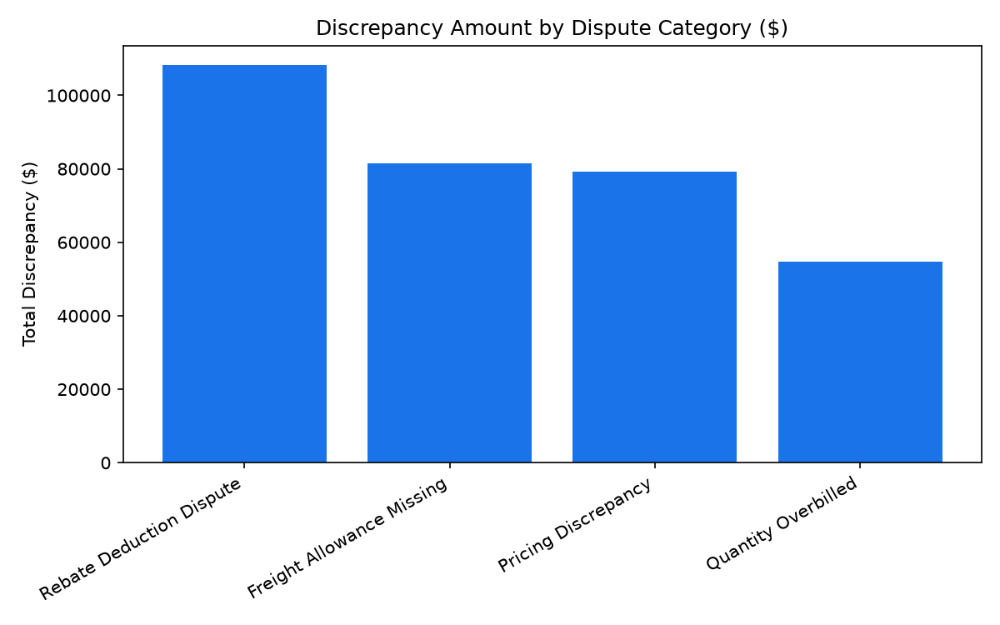

# Finance: Vendor Recovery Audit & Overpayments Agent

**Domain:** Finance · **Gemini Enterprise display name:** Finance: Vendor Recovery Audit & Overpayments

Answers questions about duplicate invoice payments, vendor compliance chargeback fines, post-audit pricing discrepancies, missed early payment discounts, and retail recovery audit industry benchmarks. Orchestrates two sub-agents: **Data Insights**, which queries BigQuery via the Conversational Analytics API and BigQuery's built-in forecasting/contribution/anomaly-detection tools, and **Market Context**, which answers external questions via Google Search grounding.

---

## Why This Agent Matters

### Business Problem
In complex multi-channel retail operations managing thousands of suppliers and millions of accounts payable transactions, billing discrepancies, duplicate disbursements, unearned prompt-payment discount losses, and uncollected supply chain compliance fines quietly erode net operating profit. Post-audit recovery teams frequently discover leakage quarters after cash disbursements have settled. This agent continuously audits invoice line items, identifies duplicate payment matches, monitors compliance chargebacks, and quantifies unearned discount losses to protect working capital and cash recovery.

### Target Personas
- **VP of Accounts Payable & Disbursements**: Oversee invoice audit accuracy, prevent duplicate disbursements, and maximize cash discount capture.
- **Director of Internal Audit & Vendor Recovery**: Investigate post-audit billing discrepancies, track recovery claim status, and audit contract pricing terms.
- **Supply Chain Vendor Compliance Manager**: Monitor and enforce vendor compliance fines across distribution centers for packaging, ASN, and routing guide infractions.

---

## Key Metrics Tracked

| Metric / KPI | Definition & Formula | Business Target / Impact |
| :--- | :--- | :--- |
| **Duplicate Payment Exposure** | `SUM(duplicate_amount)` | Flag & halt duplicate invoice disbursements prior to settlement |
| **Audit Discrepancy Amount** | `SUM(variance_discrepancy_amount)` | Track pricing, rebate, and quantity variances between billed & contract terms |
| **Net Compliance Fines Collected** | `SUM(net_collected_amount)` | Measure net recovered chargebacks from supplier routing & EDI violations |
| **Unearned Cash Discount Loss** | `SUM(unearned_discount_loss_dollars)` | Minimize lost 1-2% early payment discounts caused by AP approval cycle lags |

---

## What It Answers

Routed to **Data Insights**:
- Duplicate payment detection — flagged duplicate invoice pairs, payment dates, match confidence scores, and recovery status
- Invoice audit disputes — post-audit pricing variances, rebate deduction disputes, freight allowance omissions, and overbilling
- Vendor compliance fines — routing guide, packaging, ASN, and labeling penalties assessed and net collected across DCs
- Cash discount analysis — payment term lags (e.g. 2/10 net 30) vs. discount windows and unearned discount dollar losses

Routed to **Market Context**:
- External retail recovery audit benchmarks, typical AP overpayment yield percentages (0.1%-0.15% of spend), supplier deduction win rates, and third-party audit contingency fee models

Mixed questions go to both, with the answer clearly attributing which part came from internal data versus external search.

---

## Sample Q&A Showcase

The following three responses are captured from live post-deploy smoke tests of this agent:

### 1. Internal Data Analytics (Data Insights / BigQuery)

> **User Prompt:** "How many potential duplicate invoice payments were flagged and what is the total dollar exposure?"

**Sub-Agent Routed:** Data Insights (`sub_agents/data_insights.yaml`)  
**Authorized Table Queried:** `finc_vrac_duplicate_payment_scans`

**Agent Response:**
> Based on our internal BigQuery database (specifically the `finc_vrac_duplicate_payment_scans` table in the `retail_ent_agents` dataset), a total of 12 potential duplicate invoice payments were flagged. The total dollar exposure associated with these flagged payments is $617,977.22.

---

### 2. External Market Grounding (Market Context / Google Search)

> **User Prompt:** "What are typical recovery audit industry benchmarks and percentage yield rates for retail post-audit overpayment identification in 2026?"

**Sub-Agent Routed:** Market Context (`sub_agents/market_context.yaml`)  
**Grounding Tool:** `google_search`

**Agent Response:**
> Based on external industry benchmarks, typical yield rates for retail post-audit overpayment identification hover around 0.1% to 0.15% of annual accounts payable (AP) spend, which translates to roughly $1 million recovered for every $1 billion in supplier spend. In complex retail scenarios—such as ERP system transitions or logistics contract compliance—recovery yields can reach as high as 0.4% to 0.5% of audited spend.
>
> Key industry operational benchmarks for these audits include:
>
> *   **Contingency Fee Rates:** Most recovery audit partners operate on a performance-based contingency model, charging a commission fee of 20% to 30% of actual recovered funds.
> *   **The Cost of Delay:** Delaying an audit significantly degrades its yield. Postponing a recovery audit by just one year reduces statement and duplicate recoveries by an average of 23%.
> *   **Supplier Dispute Win Rates:** For suppliers disputing retailer deductions (e.g., at Walmart, Target, or Amazon), win rates typically range from 89% to 97% when supported by comprehensive, automated documentation.

---

### 3. Visual Analytics & Chart Generation (`render_chart`)

> **User Prompt:** "Render a bar chart showing total variance discrepancy amount by dispute category."

**Sub-Agent Routed:** Data Insights (`sub_agents/data_insights.yaml`)  
**Custom Tool Invoked:** `render_chart` (`tools/chart_generator.py`)

**Agent Response:**
> The bar chart showing the total variance discrepancy amount by dispute category has been rendered and saved as an image artifact (`chart.png`).
>
> The chart illustrates the financial breakdown of our total $323,714.77 in invoice discrepancies identified through our vendor recovery audits. It highlights that 'Rebate Deduction Dispute' is our single largest source of leakage.
>
> Based on our internal BigQuery data, the precise breakdown of these discrepancies is:
> - **Rebate Deduction Dispute**: $108,190.16 (33.4%)
> - **Freight Allowance Missing**: $81,398.55 (25.1%)
> - **Pricing Discrepancy**: $79,335.15 (24.5%)
> - **Quantity Overbilled**: $54,790.91 (16.9%)
>
> Rebate disputes and missing freight allowances collectively account for nearly 60% of our total variance. This suggests that targeting alignment on rebate terms and logistics auditing processes would yield the most substantial recovery returns and future prevention.

**Generated Artifact:**  


---

## Data

All tables live in the shared `retail_ent_agents` BigQuery dataset, prefixed `finc_vrac_` (this agent's registered `domain_id`/`agent_id` — see `_shared/table_registry.yaml`). Seed data is synthetic, generated by `data/generate_seed_data.py`.

| Table | Columns | Holds |
| :--- | :--- | :--- |
| `finc_vrac_disputed_invoices` | `dispute_id, vendor_id, vendor_name, invoice_number, dispute_category, invoice_billed_amount, audit_calculated_amount, variance_discrepancy_amount, dispute_status, recovery_action_taken` | Post-audit vendor invoice billing discrepancies, calculating audit variance between billed vs calculated amounts and dispute recovery action. |
| `finc_vrac_duplicate_payment_scans` | `scan_id, vendor_id, primary_invoice_num, duplicate_invoice_num, duplicate_amount, payment_date_1, payment_date_2, match_confidence_score, recovery_status` | AP duplicate payment scan records matching invoice numbers, payment dates, and confidence scores to prevent overpayment leakage. |
| `finc_vrac_vendor_compliance_fines` | `fine_id, vendor_id, violation_type, po_number, dc_location, fine_amount, fine_assessment_date, dispute_filed_by_vendor, net_collected_amount` | Vendor compliance chargebacks and routing guide fines assessing DC routing, labeling, and EDI ASN delivery non-compliance. |
| `finc_vrac_unearned_cash_discounts` | `record_id, vendor_id, payment_terms, gross_invoice_amount, discount_available_pct, discount_window_days, actual_payment_lag_days, discount_taken_dollars, unearned_discount_loss_dollars` | Vendor payment terms analysis tracking missed early payment cash discount windows, payment lags, and unearned discount dollar losses. |

---

## Example Questions

Verified against this agent's `eval/agent.evalset.json`:

- "How many potential duplicate invoice payments were flagged in the last 90 days and what is the total dollar exposure?"
- "What is the total recovery amount from vendor compliance chargeback fines for packaging and labeling violations?"
- "Identify disputed invoices with post-audit pricing discrepancies exceeding $10,000."
- "What was the financial loss from missed or unearned 2/10 net 30 cash discounts across top tier vendors?"
- "Which suppliers have the highest frequency of invoice audit discrepancies and deduction disputes?"

---

## Tools

- **`ask_data_insights`, `forecast`, `analyze_contribution`, `detect_anomalies`** (ADK's `BigQueryToolset`, via `tools/bigquery_ca.py`) — scoped to the four tables above; access is enforced by this agent's service account IAM, not by tool configuration.
- **`render_chart`** (`tools/chart_generator.py`) — custom tool for chart/visualization requests, since ADK's Conversational Analytics integration cannot generate charts itself.
- **`google_search`** — used only by the Market Context sub-agent.

---

## Run It Locally

```bash
uv run adk run domains/finance/agents/vendor_recovery_audit_compliance
```

Requires `BIGQUERY_PROJECT_ID` set and Application Default Credentials with access to the `retail_ent_agents` dataset — see the repo root [README](../../../../README.md#getting-started).

---

## Files

```
vendor_recovery_audit_compliance/
  root_agent.yaml                 # orchestrator — routing instructions
  sub_agents/
    data_insights.yaml             # BigQuery Conversational Analytics sub-agent
    market_context.yaml            # Google Search grounding sub-agent
  tools/
    bigquery_ca.py                  # BigQueryToolset factory
    chart_generator.py               # render_chart custom tool
    callbacks.py                      # current-date / BigQuery project injection
  data/                             # seed CSVs + generate_seed_data.py
  eval/agent.evalset.json          # ADK quality evals
  tests/{unit,integration}/         # mocked vs. real-BigQuery tests
  sample_chart.png                  # visual chart artifact captured from live smoke test
```
