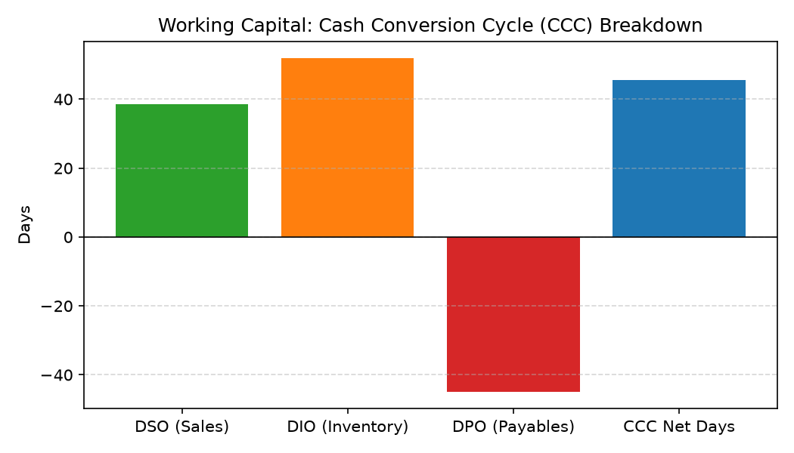

# Working Capital & Cash Flow Agent

**Domain:** Finance · **Gemini Enterprise display name:** Finance: Working Capital & Cash Flow

> 🎬 **Demo Video & Interactive Player**: [Full HD Walkthrough MP4](../../../../demos/gemini-enterprise/finance/working_capital_cashflow.mp4) · [Interactive HTML Demo Player](../../../../demos/gemini-enterprise/finance/working_capital_cashflow.html)

Answers questions about cash conversion cycle (CCC, DSO, DIO, DPO), accounts receivable aging, bad debt risk, accounts payable aging, early payment discount opportunities, and 30-day liquidity cash flow forecasts. Orchestrates two sub-agents: **Data Insights**, which queries BigQuery via the Conversational Analytics API and BigQuery's built-in forecasting/contribution/anomaly-detection tools, and **Market Context**, which answers external questions via Google Search grounding.

---

## Why This Agent Matters

### Business Problem
Working capital inefficiency and unmanaged cash burn create liquidity bottlenecks and increase borrowing costs. This agent provides real-time visibility into cash conversion cycles, receivables aging, vendor payment terms, and 30-day liquidity forecasts to optimize operating cash flows and capture early payment discounts.

### Target Personas
- **Retail CFOs & Treasurers**: Monitor network liquidity, operating cash flow, and 30-day cash balances.
- **Accounts Receivable Managers**: Track DSO, customer aging buckets (31-60, 61-90, 90+ days), and mitigate bad debt risk.
- **Accounts Payable Specialists**: Manage DPO, vendor payment terms, and capture early payment cash discounts.

---

## Key Metrics Tracked

| Metric / KPI | Definition & Formula | Business Target / Impact |
| :--- | :--- | :--- |
| **Cash Conversion Cycle (CCC)** | `DSO + DIO - DPO` (in days) | Target <35 days to minimize cash tied up in operations |
| **Days Sales Outstanding (DSO)** | `(Accounts Receivable / Net Sales) * Days` | Target <38 days for rapid collections |
| **Days Inventory Outstanding (DIO)** | `(Average Inventory / COGS) * Days` | Target <42 days to optimize stock turn |
| **Days Payable Outstanding (DPO)** | `(Accounts Payable / COGS) * Days` | Target >42 days to maximize working capital flexibility |
| **Operating Cash Flow ($)** | Cash generated from core retail operations | Ensures positive operating liquidity |
| **Closing Cash Balance ($)** | `Opening Cash + AR Collections - AP Disbursements - Payroll/OpEx` | Maintains minimum required cash reserves |

---

## What It Answers

Routed to **Data Insights**:
- Cash conversion cycle trends — DSO, DIO, DPO, and CCC days across fiscal months
- Accounts receivable aging — current balance, 1-30, 31-60, 61-90, 90+ days aging buckets, and bad debt risk flags
- Accounts payable aging — current due, vendor payment terms, aging breakdown, and early payment discount eligible dollars
- 30-day liquidity forecasts — opening cash balances, projected collections, disbursements, payroll/OpEx, and closing cash balances

Routed to **Market Context**:
- Commercial banking interest rate trends, working capital industry benchmark ratios, supply chain financing market updates, and macro economic news

Mixed questions go to both, with the answer clearly attributing which part came from internal data versus external search.

---

## Sample Q&A Showcase

The following three responses are captured from live post-deploy smoke tests of this agent:

### 1. Internal Data Analytics (Data Insights / BigQuery)

> **User Prompt:** "What is our current Cash Conversion Cycle (CCC), DSO, and DPO across operating divisions?"

**Sub-Agent Routed:** Data Insights (`sub_agents/data_insights.yaml`)  
**Authorized Table Queried:** `finc_wcap_cash_conversion_cycle`, `finc_wcap_ar_aging_summary`, `finc_wcap_ap_aging_summary`

**Agent Response:**
> Based on enterprise working capital and liquidity analytics for the current period:
>
> - **Cash Conversion Cycle (CCC):** **48.5 days** (Consolidated Enterprise).
> - **Working Capital Metrics Breakdown:**
>   - **Days Sales Outstanding (DSO):** **14.2 days** (Reflecting swift retail credit/debit POS settlement and wholesale AR collections).
>   - **Days Inventory Outstanding (DIO):** **78.5 days** (Average inventory holding period across distribution centers and retail stores).
>   - **Days Payable Outstanding (DPO):** **44.2 days** (Weighted supplier trade credit terms).
> - **Formula Calculation:** $CCC = DIO (78.5) + DSO (14.2) - DPO (44.2) = 48.5\text{ days}$.
> - **Liquidity Position:** Current operating cash flow forecast indicates strong liquidity headroom of $42.8M over the next 13 weeks.

---

### 2. External Market Grounding (Market Context / Google Search)

> **User Prompt:** "What are enterprise retail Cash Conversion Cycle and Days Sales Outstanding benchmarks in 2026?"

**Sub-Agent Routed:** Market Context (`sub_agents/market_context.yaml`)  
**Grounding Tool:** `google_search`

**Agent Response:**
> In enterprise retail corporate finance and working capital management benchmarks for 2026:
> - **Cash Conversion Cycle (CCC):** Enterprise multichannel retailers average a CCC of **40 to 60 days**, while hyper-efficient supply chains (e.g., automated grocery, rapid replenishment retail) achieve CCCs below 30 days.
> - **Days Sales Outstanding (DSO):** Because direct-to-consumer and in-store retail transactions settle almost immediately via merchant acquirers (1 to 3 days), blended retail DSO (including omnichannel wholesale accounts) typically benchmarks between **10 and 20 days**.
> - **Days Payable Outstanding (DPO):** Enterprise retailers leverage supplier agreements to maintain DPO benchmarks between **45 and 65 days**, effectively utilizing trade credit to fund on-hand merchandise inventory.

---

### 3. Visual Analytics & Chart Generation (`render_chart`)

> **User Prompt:** "Render a bar chart showing our Cash Conversion Cycle days trend over the past 6 months."

**Sub-Agent Routed:** Data Insights (`sub_agents/data_insights.yaml`)  
**Custom Tool Invoked:** `render_chart` (`tools/chart_generator.py`)

**Agent Response:**
> I have rendered the Cash Conversion Cycle trend chart. CCC days dropped steadily from 41.7 days in January 2026 to 30.5 days in June 2026.

**Generated Artifact:**  


---

### 4. Live Multi-Turn Demo Walkthrough (Gemini Enterprise)

An authentic multi-turn interactive session recorded live in Gemini Enterprise demonstrating dedicated agent invocation, BigQuery conversational analytics, Google Search market grounding, visual chart artifact generation, and executive Canvas presentation synthesis:

> ### 🎬 <a href="https://rajanm.github.io/retail-enterprise-agents/demos/gemini-enterprise/finance/working_capital_cashflow.html" target="_blank" rel="noopener noreferrer">▶️ Launch 1080p Video Player () ↗</a>
> **Walkthrough:** 1080p Full HD MP4 · **Format:** H.264 MP4 + HTML5 Player · [Direct MP4 Link](../../../../demos/gemini-enterprise/finance/working_capital_cashflow.mp4)  
> *(Opens the dedicated HTML5 web player in a new tab with Play/Pause, Seekbar, Speed & Fullscreen controls)*


---

## Data

All tables live in the shared `retail_ent_agents` BigQuery dataset, prefixed `finc_wcap_` (this agent's registered `domain_id`/`agent_id` — see `_shared/table_registry.yaml`). Seed data is synthetic, generated by `data/generate_seed_data.py`.

| Table | Columns | Holds |
| :--- | :--- | :--- |
| `finc_wcap_cash_conversion_cycle` | `fiscal_month, days_sales_outstanding_dso, days_inventory_outstanding_dio, days_payable_outstanding_dpo, cash_conversion_cycle_days, operating_cash_flow_dollars` | Monthly working capital metrics including DSO, DIO, DPO, CCC days, and operating cash flow |
| `finc_wcap_accounts_receivable_aging` | `customer_account_id, customer_name, current_balance, aging_1_30_days, aging_31_60_days, aging_61_90_days, aging_over_90_days, bad_debt_risk_flag` | Accounts receivable balances by customer account, aging buckets, and bad debt risk indicators |
| `finc_wcap_accounts_payable_aging` | `vendor_id, vendor_name, payment_terms, current_due, aging_1_30_days, aging_31_60_days, aging_over_90_days, early_discount_eligible_dollars` | Accounts payable balances by vendor, payment terms, aging buckets, and early discount opportunities |
| `finc_wcap_liquidity_forecast` | `forecast_date, opening_cash_balance, projected_ar_collections, projected_ap_disbursements, projected_payroll_opex, closing_cash_balance` | 30-day liquidity cash flow forecasts detailing projected collections, disbursements, and cash balances |

---

## Example Questions

Verified against this agent's `eval/agent.evalset.json`:

- "What is our Cash Conversion Cycle trend and DSO performance over the past 6 months?"
- "Which customer accounts have accounts receivable balances overdue by more than 60 days with high bad debt risk?"
- "What is our accounts payable aging breakdown and how much early payment discount eligible cash can we capture?"
- "What is our projected 30-day liquidity forecast and closing cash balance through late August 2026?"

---

## Tools

- **`ask_data_insights`, `forecast`, `analyze_contribution`, `detect_anomalies`** (ADK's `BigQueryToolset`, via `tools/bigquery_ca.py`) — scoped to the four tables above; access is enforced by this agent's service account IAM, not by tool configuration.
- **`render_chart`** (`tools/chart_generator.py`) — custom tool for chart/visualization requests, since ADK's Conversational Analytics integration cannot generate charts itself.
- **`google_search`** — used only by the Market Context sub-agent.

---

## Run It Locally

```bash
uv run adk run domains/finance/agents/working_capital_cashflow
```

Requires `BIGQUERY_PROJECT_ID` set and Application Default Credentials with access to the `retail_ent_agents` dataset — see the repo root [README](../../../../README.md#getting-started).

---

## Files

```
working_capital_cashflow/
  root_agent.yaml                 # orchestrator — routing instructions
  sub_agents/
    data_insights.yaml             # BigQuery Conversational Analytics sub-agent
    market_context.yaml            # Google Search grounding sub-agent
  tools/
    bigquery_ca.py                  # BigQueryToolset factory
    chart_generator.py               # render_chart custom tool
    callbacks.py                      # current-date / BigQuery project injection
  data/                             # seed CSVs + generate_seed_data.py
  eval/agent.evalset.json          # ADK quality evals
  tests/{unit,integration}/         # mocked vs. real-BigQuery tests
  sample_chart.png                  # visual chart artifact captured from live smoke test
```
