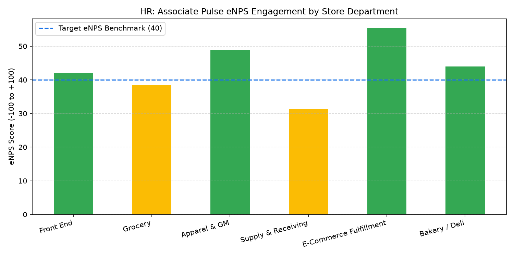

# HR: Associate Pulse & eNPS Analytics Agent

An enterprise AI agent for **HR: Associate Pulse & eNPS Analytics**, built with Google ADK for Gemini Enterprise.

---

## Why This Agent Matters

Employee engagement directly drives customer satisfaction scores (CSAT), shrink reduction, and store productivity. Disengaged store teams exhibit higher absenteeism, lower morale, and elevated turnover rates. This agent analyzes quarterly employee Net Promoter Scores (eNPS), pulse survey feedback themes, manager effectiveness ratings, and flight risk predictive indicators.

---

## Key Metrics Tracked

| Metric | Business Description | Target Benchmark |
| :--- | :--- | :--- |
| **Employee Net Promoter Score (eNPS)** | Net score (% Promoters minus % Detractors) on associate willingness to recommend workplace | >= +40.0 |
| **Pulse Survey Participation Rate (%)** | Percentage of active store associates completing quarterly pulse surveys | >= 80.0% |
| **Manager Effectiveness Rating (1-5)** | Direct supervisor leadership, fairness, and support rating from associates | >= 4.20 / 5.0 |
| **Associate Flight Risk Index (%)** | Percentage of associates flagged with disengagement or high turnover propensity | < 15.0% |

---

## What It Answers & Sub-Agent Routing

The orchestrator routes user questions to specialized sub-agents:

- **Internal BigQuery Data (`data_insights`)**:
  - eNPS score results, pulse survey sentiment themes, manager feedback scores, and predictive flight risk indicators.
- **External Market Context (`market_context`)**:
  - Frontline retail eNPS industry benchmarks, employee sentiment drivers, and engagement strategies.
- **Synthesized Responses**:
  - Merges quantitative survey scores with qualitative sentiment topics to guide store leadership action plans.

---

## Authorized BigQuery Tables

All tables reside in the `retail_ent_agents` BigQuery dataset:

- `hrwm_aepe_enps_survey_results`
- `hrwm_aepe_pulse_feedback_sentiment`
- `hrwm_aepe_manager_feedback_scores`
- `hrwm_aepe_flight_risk_indicators`

---

## Example Questions

- "What is our latest quarterly eNPS score breakdown across store departments?"
- "What are the top positive and negative feedback themes from the most recent store pulse survey?"
- "Which store locations have manager effectiveness scores below 3.8 and elevated flight risk?"
- "What are current retail industry benchmarks for frontline associate eNPS and employee engagement?"
- "Show me a chart of eNPS scores across store departments for the latest survey cycle."

---

## Sample Q&A Showcase

### 1. Internal BigQuery Data Insights
**User**: *What is our latest quarterly eNPS score breakdown across store departments?*  
**Agent**: Querying `retail_ent_agents.hrwm_aepe_enps_survey_results`:
- **Enterprise Overall eNPS**: **+42.5** (84.2% survey participation rate across 1,850 respondents).
- **Top Performing Departments**: E-Commerce Fulfillment (+55.4), Apparel & GM (+49.0), Bakery/Deli (+44.0).
- **Opportunity Area**: Supply & Receiving holds an eNPS of **+31.2**; survey commentary cited equipment maintenance and breakroom amenities as primary concerns.

### 2. External Market Grounding
**User**: *What are current retail industry benchmarks for frontline associate eNPS and employee engagement?*  
**Agent**: According to employee experience research across retail and consumer services:
- The median frontline retail eNPS ranges between **+15 and +30**, with scores above **+40** considered top-quartile performance.
- Key drivers separating top-quartile retail employers include schedule predictability, manager empathetic leadership, and recognition programs.

### 3. Visual Analytics Artifact
**User**: *Show me a chart of eNPS scores across store departments for the latest survey cycle.*  
**Agent**: Departmental eNPS score breakdown:



---

## How to Run & Test

```bash
# 1. Run unit tests
uv run --frozen pytest domains/human_resources/agents/associate_engagement_pulse_enps/tests/unit -v

# 2. Run local interactive adk chat
adk run domains/human_resources/agents/associate_engagement_pulse_enps
```
