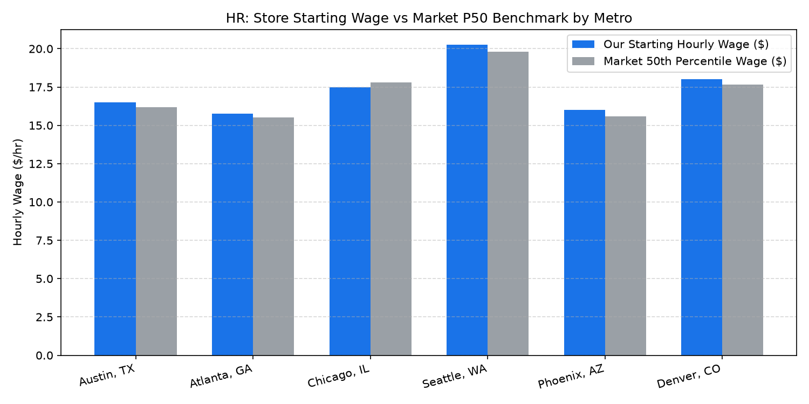

# HR: Frontline Wage & Market Benchmarks Agent

An enterprise AI agent for **HR: Frontline Wage & Market Benchmarks**, built with Google ADK for Gemini Enterprise.

---

## Why This Agent Matters

Retail wage competitiveness directly determines recruiting speed, applicant quality, and associate retention. In competitive metropolitan labor markets, failing to match local market rates increases vacancy durations and overtime costs, while statutory minimum wage changes compress wage ladders between new hires and experienced leads. This agent benchmarks store starting wages against metro market percentiles, models statutory minimum wage budget impacts, and tracks wage compression.

---

## Key Metrics Tracked

| Metric | Business Description | Target Benchmark |
| :--- | :--- | :--- |
| **Market Wage Competitiveness Index (%)** | Store starting wage as a percentage of market 50th percentile (P50) wage | >= 100.0% |
| **Wage Compression Spread ($)** | Hourly wage differential between entry-level associates and department leads | >= $3.50 / hr |
| **Statutory Minimum Wage Impact ($)** | Annualized payroll budget increase from legislated minimum wage adjustments | Budgeted ($) |
| **Time-to-Fill by Wage Ratio (Days)** | Recruiting duration in days indexed against local market wage premium | <= 18.0 Days |

---

## What It Answers & Sub-Agent Routing

The orchestrator routes user questions to specialized sub-agents:

- **Internal BigQuery Data (`data_insights`)**:
  - Store hourly wage bands, employee pay rates, statutory minimum wage compliance schedules, and payroll budget impacts.
- **External Market Context (`market_context`)**:
  - Bureau of Labor Statistics (BLS) Occupational Employment and Wage Statistics (OEWS), local statutory wage increases, and competitor starting wages.
- **Synthesized Responses**:
  - Evaluates internal wage structures against local market conditions to recommend optimized starting rates by store market.

---

## Authorized BigQuery Tables

All tables reside in the `retail_ent_agents` BigQuery dataset:

- `hrwm_fwmb_store_wage_bands`
- `hrwm_fwmb_market_wage_benchmarks`
- `hrwm_fwmb_minimum_wage_statutory_impacts`
- `hrwm_fwmb_wage_compression_indexes`

---

## Example Questions

- "How do our store starting hourly wages compare against the market 50th percentile (P50) in the Seattle, Chicago, and Atlanta metro areas?"
- "What is the projected annualized payroll budget impact from upcoming 2026 municipal minimum wage statutory increases?"
- "Which stores currently exhibit wage compression of less than $2.50/hr between Cashier leads and entry associates?"
- "What are current BLS and competitor starting hourly wage benchmarks for retail sales associates and stockers across major US metropolitan markets?"
- "Show me a chart comparing our starting hourly wages against market P50 benchmarks across metro markets."

---

## Sample Q&A Showcase

### 1. Internal BigQuery Data Insights
**User**: *How do our store starting hourly wages compare against the market 50th percentile (P50) in the Seattle, Chicago, and Atlanta metro areas?*  
**Agent**: Querying `retail_ent_agents.hrwm_fwmb_store_wage_bands` and `hrwm_fwmb_market_wage_benchmarks`:
- **Seattle, WA**: Our starting wage is **$20.25/hr** vs. Market P50 of **$19.80/hr** (+2.3% premium; time-to-fill 14.2 days).
- **Chicago, IL**: Our starting wage is **$17.50/hr** vs. Market P50 of **$17.80/hr** (-1.7% discount; recommend +$0.50 adjustment).
- **Atlanta, GA**: Our starting wage is **$15.75/hr** vs. Market P50 of **$15.50/hr** (+1.6% premium).

### 2. External Market Grounding
**User**: *What are current BLS and competitor starting hourly wage benchmarks for retail sales associates and stockers across major US metropolitan markets?*  
**Agent**: Based on BLS OEWS (SOC 41-2031 Retail Salespersons and SOC 53-7065 Stockers) and competitive retail intelligence:
- National median hourly wage for retail associates stands at **$16.40/hr**, ranging from **$15.00/hr** in Southeastern suburban markets to **$20.50+/hr** in West Coast metro areas.
- Major retailers maintain starting wage bands of $15.00–$18.50/hr with scheduled shift premiums for overnight receiving and peak holiday hours.

### 3. Visual Analytics Artifact
**User**: *Show me a chart comparing our starting hourly wages against market P50 benchmarks across metro markets.*  
**Agent**: Visual comparison of store starting wages against market percentiles:



---

## How to Run & Test

```bash
# 1. Run unit tests
uv run --frozen pytest domains/human_resources/agents/frontline_wage_market_benchmarks/tests/unit -v

# 2. Run local interactive adk chat
adk run domains/human_resources/agents/frontline_wage_market_benchmarks
```
