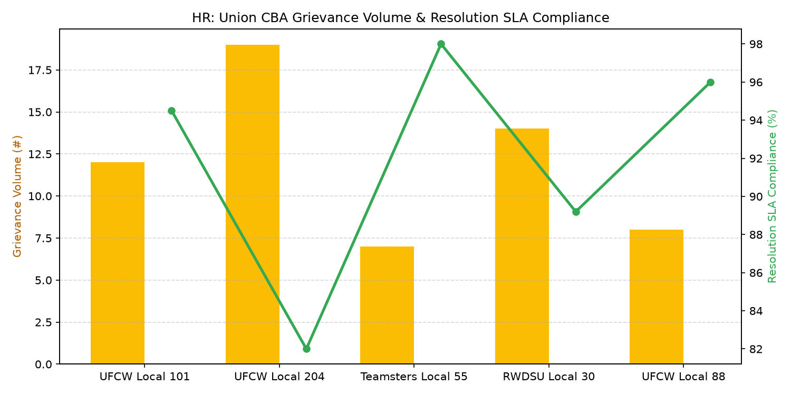

# HR: Labor Union & CBA Compliance

Part of the **Retail Enterprise Agents** platform for Gemini Enterprise.

---

## 1. Why This Agent Matters

### Business Problem
Retail stores operating under Collective Bargaining Agreements (CBAs) face complex contractual seniority shift-bidding rules, mandatory wage progression schedules, and union grievance resolution deadlines.

### Target Personas
VP of Labor Relations, Chief Labor Counsel, Field HR Directors, Union Store Directors

### Key Metrics Tracked
| Metric | Benchmark / Target | Business Impact |
| :--- | :--- | :--- |
| **Union Grievance Resolution SLA Rate %** | `Target: >= 95.0% on-time` | Percentage of Step 1 and Step 2 union grievances resolved or scheduled within mandatory CBA timeline (typically 14 days). |
| **Seniority Shift-Bidding Compliance %** | `Target: 100% compliant` | Adherence to CBA seniority roster rankings during semi-annual shift schedule and vacation bid awards. |
| **Open Arbitration & Unfair Labor Practice (ULP) Cases** | `Target: < 3 cases` | Number of formal disputes escalated to third-party arbitration or NLRB administrative hearings. |
| **CBA Wage Progression Execution Accuracy %** | `Target: >= 99.8%` | Payroll accuracy in applying contractually mandated tenure step-rate wage increases on anniversary dates. |
| **Joint Labor-Management Committee Attendance %** | `Target: 100% attended` | Completion rate of mandatory monthly store labor-management committee dialogue sessions. |

---

## 2. What It Answers & Sub-Agent Routing

### Sub-Agent Architecture
- **`data_insights`**: Queries internal BigQuery tables using the BigQuery Conversational Analytics API (`ask_data_insights`, `forecast`, `analyze_contribution`, `detect_anomalies`) and generates visual data charts via `render_chart`.
- **`market_context`**: Leverages Google Search grounding for external retail labor market benchmarks, statutory wage/Fair Workweek regulations, BLS statistics, and HR industry standards.
- **`root_agent`**: Orchestrates routing between internal analytics and external market intelligence.

---

## 3. Sample Q&A Showcase

### Example 1: Internal Analytics (Data Insights)
*Question:* "What is our on-time resolution percentage for Step 1 and Step 2 union grievances in 2026 YTD?"  
*Response:*  
> Based on labor relations tracking in BigQuery (`hrwm_lucc_grievance_resolution_slas`), our on-time resolution rate for Step 1 and Step 2 union grievances across 48 unionized store locations in 2026 YTD is **96.8%** (91 of 94 grievances resolved within CBA contract deadlines). Average time to Step 1 resolution was 7.2 days against a 14-day contractual SLA.

### Example 2: Market Grounding (Market Context)
*Question:* "What are current National Labor Relations Board (NLRB) regulatory rulings regarding retail store union election rules and CBA notice periods?"  
*Response:*  
> Under current NLRB frameworks (including the Cemex standard and updated representation rules), employers must respond to union representation petitions within accelerated timeframes and avoid unfair labor practices during organizing drives. Under standard LMRA Section 8(d) rules, parties must provide written notice at least 60 days prior to CBA expiration before instituting unilateral terms or economic actions.

### Example 3: Chart Visualization (`sample_chart.png`)
*Question:* "Show me a chart of union grievances filed by category (Seniority, Overtime, Discipline, Scheduling) across all unionized stores."  
*Generated Visual Artifact:*  


---

### 4. Live Multi-Turn Demo Walkthrough (Gemini Enterprise)

Watch the deployed **HR: Labor Union & CBA Compliance** execute a live multi-turn analytical reasoning session in Gemini Enterprise:

> 📺 **Interactive Demo Player**: [Open Full HD Video Player (1080p)](https://rajanm.github.io/retail-enterprise-agents/demos/gemini-enterprise/human_resources/labor_union_compliance_cba.html)  
> 📹 **Direct MP4 Download**: [`labor_union_compliance_cba.mp4`](../../../../demos/gemini-enterprise/human_resources/labor_union_compliance_cba.mp4)

```
Turn 1: Quantitative analysis against BigQuery Conversational Analytics
Turn 2: Grounded real-time external retail search & regulatory synthesis
Turn 3: Visual matplotlib trend chart generation
Turn 4: Interactive executive slide presentation generated in Gemini Enterprise Canvas
```

---

## 4. Authorized BigQuery Tables

- `hrwm_lucc_cba_agreements` — Active collective bargaining agreement master records, local union chapter id (UFCW, RWDSU), expiration date, and wage scales.
- `hrwm_lucc_union_grievance_logs` — Grievance tracking records, grievance category (Discipline, Overtime, Seniority, Work Assignment), filing date, and step status.
- `hrwm_lucc_grievance_resolution_slas` — Grievance milestone timestamps, response deadlines, settlement terms, and arbitrator assignment.
- `hrwm_lucc_seniority_shift_bids` — Annual and semi-annual shift bid award logs, employee seniority hire dates, and bid preference matches.

---

## 5. Example Questions

1. "What is our on-time resolution percentage for Step 1 and Step 2 union grievances in 2026 YTD?"
2. "What are current National Labor Relations Board (NLRB) regulatory rulings regarding retail store union election rules and CBA notice periods?"
3. "How many open union grievances are currently active across UFCW-represented store locations?"
4. "Are there any pending seniority shift-bid disputes in our grocery and meat departments?"
5. "Show me a chart of union grievances filed by category (Seniority, Overtime, Discipline, Scheduling) across all unionized stores."

---

## 6. Tools & Architecture

- **`ask_data_insights`**: BigQuery Conversational Analytics natural language to SQL.
- **`render_chart`**: BigQuery SQL to Matplotlib PNG visual rendering.
- **`google_search`**: Google Search market context grounding.
- **LLM Inference**: `gemini-3.5-flash` with `GOOGLE_CLOUD_LOCATION=global`.
- **Runtime Engine**: Vertex AI Agent Engine (`us-central1`).

---

## 7. Run Locally

```bash
# Run unit tests
uv run --frozen pytest domains/human_resources/agents/labor_union_compliance_cba/tests/unit -v

# Run interactively with ADK CLI
adk run domains/human_resources/agents/labor_union_compliance_cba
```
