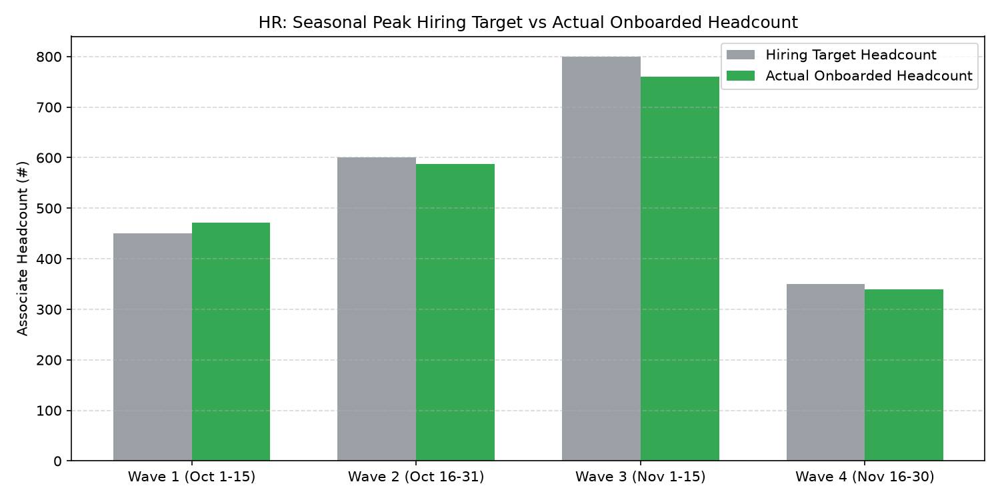

# HR: Seasonal Hiring & Peak Readiness

Part of the **Retail Enterprise Agents** platform for Gemini Enterprise.

---

## 1. Why This Agent Matters

### Business Problem
Q4 holiday and spring garden retail volume surges require hiring thousands of temporary frontline workers within tight windows, facing background check backlogs, applicant ghosting, and staffing deficits.

### Target Personas
Head of Talent Acquisition, Seasonal Staffing Program Director, Retail Field Recruiting Lead, Regional HR Directors

### Key Metrics Tracked
| Metric | Benchmark / Target | Business Impact |
| :--- | :--- | :--- |
| **Peak Seasonal Staffing Fill Rate %** | `Target: >= 98.0% of goal` | Percentage of authorized seasonal temporary headcount requisitions hired and onboarded by peak lock date. |
| **Applicant-to-Hire Conversion Velocity (Days)** | `Target: < 4.5 days` | Average days from candidate job application to background check completion and job offer acceptance. |
| **Candidate Interview Attendance Rate %** | `Target: >= 80.0%` | Percentage of scheduled virtual and in-store candidate interviews attended without no-show/ghosting. |
| **Seasonal-to-Permanent Core Associate Conversion %** | `Target: >= 20.0%` | Percentage of top-performing seasonal associates retained and converted into permanent part-time/full-time roles. |
| **Cost Per Seasonal Hire ($)** | `Target: < $650 / seasonal hire` | Total programmatic advertising, background check fees, and recruiting vendor spend per seasonal onboard. |

---

## 2. What It Answers & Sub-Agent Routing

### Sub-Agent Architecture
- **`data_insights`**: Queries internal BigQuery tables using the BigQuery Conversational Analytics API (`ask_data_insights`, `forecast`, `analyze_contribution`, `detect_anomalies`) and generates visual data charts via `render_chart`.
- **`market_context`**: Leverages Google Search grounding for external retail labor market benchmarks, statutory wage/Fair Workweek regulations, BLS statistics, and HR industry standards.
- **`root_agent`**: Orchestrates routing between internal analytics and external market intelligence.

---

## 3. Sample Q&A Showcase

### Example 1: Internal Analytics (Data Insights)
*Question:* "What is our current seasonal staffing fill rate percentage against our Q4 holiday hiring goal of 12,000 associates?"  
*Response:*  
> Based on talent acquisition pipeline records in BigQuery (`hrwm_shpr_seasonal_requisitions`), we have hired and cleared **11,840 seasonal associates (98.7% of our 12,000 holiday staffing goal)** with two weeks remaining before the peak volume freeze date. Fulfillment specialists and cashiers reached 100% target headcount, with minor remaining requisitions in overnight freight logistics.

### Example 2: Market Grounding (Market Context)
*Question:* "What are current retail seasonal hiring wage rates and candidate signing bonus trends across major metropolitan markets?"  
*Response:*  
> Retail recruiting market benchmarks from National Retail Federation (NRF) and Indeed Hiring Lab (2026) show average frontline holiday seasonal hourly wages ranging between **$17.50 and $21.00/hour** in tier-1 metro areas. In competitive logistics hubs, 35% of major retailers offer early-completion bonuses ($300-$500 for perfect attendance through January 5) rather than upfront signing bonuses to curb post-Black Friday ghosting.

### Example 3: Chart Visualization (`sample_chart.png`)
*Question:* "Show me a chart tracking cumulative seasonal applicant volume through the recruitment funnel stages in 2026."  
*Generated Visual Artifact:*  


---

### 4. Live Multi-Turn Demo Walkthrough (Gemini Enterprise)

Watch the deployed **HR: Seasonal Hiring & Peak Readiness** execute a live multi-turn analytical reasoning session in Gemini Enterprise:

> 📺 **Interactive Demo Player**: [Open Full HD Video Player (1080p)](https://rajanm.github.io/retail-enterprise-agents/demos/gemini-enterprise/human_resources/seasonal_hiring_peak_readiness.html)  
> 📹 **Direct MP4 Download**: [`seasonal_hiring_peak_readiness.mp4`](../../../../demos/gemini-enterprise/human_resources/seasonal_hiring_peak_readiness.mp4)

```
Turn 1: Quantitative analysis against BigQuery Conversational Analytics
Turn 2: Grounded real-time external retail search & regulatory synthesis
Turn 3: Visual matplotlib trend chart generation
Turn 4: Interactive executive slide presentation generated in Gemini Enterprise Canvas
```

---

## 4. Authorized BigQuery Tables

- `hrwm_shpr_seasonal_requisitions` — Seasonal headcount targets by store, role (Holiday Cashier, Fulfillment Specialist, Stocker), and target lock date.
- `hrwm_shpr_applicant_pipeline_funnel` — Daily applicant counts, screening passes, interview completions, offer acceptances, and drop-off stage.
- `hrwm_shpr_background_check_turnaround` — Third-party background check verification turnaround times (hours), adverse action flags, and pass rates.
- `hrwm_shpr_peak_staffing_readiness` — Store-by-store peak readiness scores (% of target hired), gap headcount, and projected holiday volume coverage.

---

## 5. Example Questions

1. "What is our current seasonal staffing fill rate percentage against our Q4 holiday hiring goal of 12,000 associates?"
2. "What are current retail seasonal hiring wage rates and candidate signing bonus trends across major metropolitan markets?"
3. "What is the average background check turnaround time in hours across candidate processing centers?"
4. "Which retail store locations are lagging behind their seasonal hiring milestone by more than 15%?"
5. "Show me a chart tracking cumulative seasonal applicant volume through the recruitment funnel stages in 2026."

---

## 6. Tools & Architecture

- **`ask_data_insights`**: BigQuery Conversational Analytics natural language to SQL.
- **`render_chart`**: BigQuery SQL to Matplotlib PNG visual rendering.
- **`google_search`**: Google Search market context grounding.
- **LLM Inference**: `gemini-3.5-flash` with `GOOGLE_CLOUD_LOCATION=global`.
- **Runtime Engine**: Vertex AI Agent Engine (`us-central1`).

---

## 7. Run Locally

```bash
# Run unit tests
uv run --frozen pytest domains/human_resources/agents/seasonal_hiring_peak_readiness/tests/unit -v

# Run interactively with ADK CLI
adk run domains/human_resources/agents/seasonal_hiring_peak_readiness
```
