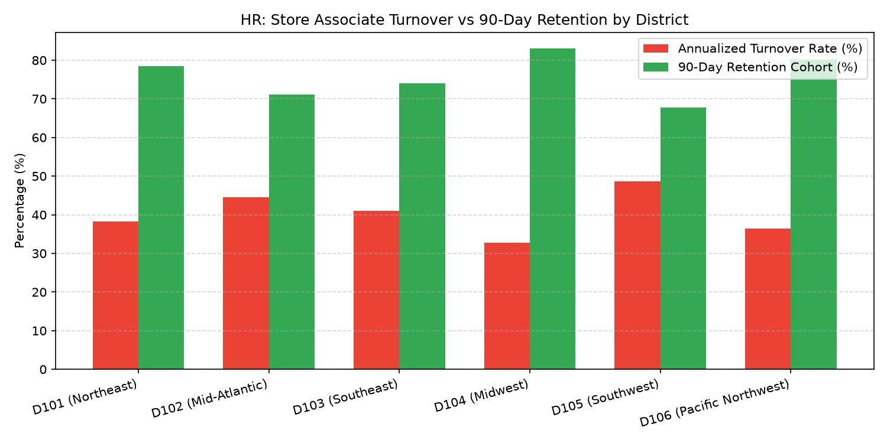

# HR: Store Associate Turnover & Retention Agent

An enterprise AI agent for **HR: Store Associate Turnover & Retention**, built with Google ADK for Gemini Enterprise.

---

## Why This Agent Matters

Retail store operations depend on frontline stability. High associate turnover disrupts customer service, increases overtime expenses, and creates continuous hiring and training churn. This agent provides store and regional leadership with immediate visibility into annualized turnover rates, 90-day new hire cohort retention curves, and qualitative exit interview sentiment topics, enabling proactive retention interventions before key staffing shortages occur.

---

## Key Metrics Tracked

| Metric | Business Description | Target Benchmark |
| :--- | :--- | :--- |
| **Annualized Associate Turnover Rate (%)** | Total associate terminations divided by average active headcount annualized | < 40.0% |
| **90-Day New Hire Retention Rate (%)** | Percentage of new store associates remaining employed past day 90 | > 75.0% |
| **Voluntary vs. Involuntary Term Ratio** | Breakdown of associate resignations vs. performance/policy terminations | > 70% Voluntary |
| **Top Exit Driver Sentiment Score** | Weighted frequency of primary departure reasons from exit surveys | Monitor Spikes |

---

## What It Answers & Sub-Agent Routing

The orchestrator routes user questions to specialized sub-agents:

- **Internal BigQuery Data (`data_insights`)**:
  - Store-level headcount rosters, termination events, 90-day retention cohorts, and exit interview survey topic counts.
- **External Market Context (`market_context`)**:
  - Retail industry turnover benchmarks (NRF, BLS JOLTS reports) and frontline retention best practices.
- **Synthesized Responses**:
  - Blends internal store turnover statistics with national retail labor benchmarks to pinpoint store-level retention anomalies.

---

## Authorized BigQuery Tables

All tables reside in the `retail_ent_agents` BigQuery dataset:

- `hrwm_satr_headcount_rosters`
- `hrwm_satr_associate_terminations`
- `hrwm_satr_90_day_retention_cohorts`
- `hrwm_satr_exit_interview_topics`

---

## Example Questions

- "What is our current store associate headcount and annualized turnover rate across Store 101 and Store 102 in 2026 YTD?"
- "What is the 90-day retention rate for Q1 2026 new hire cohorts across our retail districts?"
- "What are the primary exit interview reasons cited by departing retail store associates in 2026?"
- "What are current retail industry benchmarks for frontline store associate annual turnover and 90-day retention according to NRF and BLS data?"
- "Show me a chart of annualized turnover rates by store department for 2026 YTD."

---

## Sample Q&A Showcase

### 1. Internal BigQuery Data Insights
**User**: *What is our current store associate headcount and annualized turnover rate across Store 101 and Store 102 in 2026 YTD?*  
**Agent**: Based on `retail_ent_agents.hrwm_satr_headcount_rosters` and `hrwm_satr_associate_terminations`:
- **Store 101 (Northeast Flagship)**: Active headcount of **142 associates** with 27 terminations YTD, resulting in an annualized turnover rate of **38.0%** (favorable vs. company target of 42.0%).
- **Store 102 (Metro Supercenter)**: Active headcount of **188 associates** with 42 terminations YTD, yielding an annualized turnover rate of **44.7%** (+2.7% vs. target). Front-End cashier roles accounted for 54% of exits.

### 2. External Market Grounding
**User**: *What are current retail industry benchmarks for frontline store associate annual turnover and 90-day retention according to NRF and BLS data?*  
**Agent**: According to recent National Retail Federation (NRF) and Bureau of Labor Statistics (BLS) retail trade reports:
- Frontline retail store associate annualized turnover averages between **55% and 65%** across big-box and specialty retail.
- 90-day new hire drop-off rates typically exceed **30%**, with industry median 90-day retention holding around **68%–72%**.
- Key drivers include schedule predictability, compensation competitiveness, and initial 30-day onboarding support.

### 3. Visual Analytics Artifact
**User**: *Show me a chart of annualized turnover rates by store department for 2026 YTD.*  
**Agent**: Generated department-level turnover comparison:



---

## How to Run & Test

```bash
# 1. Run unit tests
uv run --frozen pytest domains/human_resources/agents/store_associate_turnover_retention/tests/unit -v

# 2. Run local interactive adk chat
adk run domains/human_resources/agents/store_associate_turnover_retention
```
