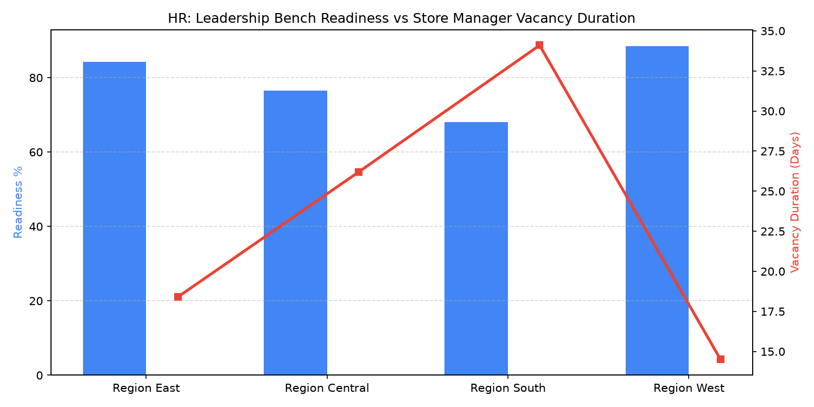

# HR: Store Leadership Bench & Succession

Part of the **Retail Enterprise Agents** platform for Gemini Enterprise.

---

## 1. Why This Agent Matters

### Business Problem
Unplanned store manager vacancies and weak assistant manager promotion benches cause store operational disruptions, declining customer service scores, and high executive search expenditures.

### Target Personas
VP of Talent Management, Retail Succession Planning Director, Regional VPs, District Operations Managers

### Key Metrics Tracked
| Metric | Benchmark / Target | Business Impact |
| :--- | :--- | :--- |
| **Store Manager Vacancy Fill Time (Days)** | `Target: < 21.0 days` | Average days required to identify, promote, or hire a qualified store general manager replacement. |
| **Internal Store Manager Promotion Rate %** | `Target: >= 75.0%` | Percentage of store manager vacancies filled via internal bench promotion vs external recruiting. |
| **Bench Readiness Ratio (Ready Now/Ready 1Yr)** | `Target: >= 2.0 candidates/store` | Number of qualified assistant managers and department leads assessed as 'Ready Now' for GM roles. |
| **First-Year Promoted Manager Retention %** | `Target: >= 88.0%` | Retention and performance rating sustainability of newly promoted store managers after 12 months. |
| **High-Potential Leadership Development Enrollment** | `Target: > 350 leaders` | Number of active frontline assistant managers enrolled in retail leadership development pathways. |

---

## 2. What It Answers & Sub-Agent Routing

### Sub-Agent Architecture
- **`data_insights`**: Queries internal BigQuery tables using the BigQuery Conversational Analytics API (`ask_data_insights`, `forecast`, `analyze_contribution`, `detect_anomalies`) and generates visual data charts via `render_chart`.
- **`market_context`**: Leverages Google Search grounding for external retail labor market benchmarks, statutory wage/Fair Workweek regulations, BLS statistics, and HR industry standards.
- **`root_agent`**: Orchestrates routing between internal analytics and external market intelligence.

---

## 3. Sample Q&A Showcase

### Example 1: Internal Analytics (Data Insights)
*Question:* "What is our average store manager vacancy fill time in days and internal promotion percentage in 2026?"  
*Response:*  
> According to BigQuery talent management records (`hrwm_smbs_store_manager_vacancy_days`), our average store manager vacancy fill time in 2026 YTD is **16.4 days**, well within our 21-day target. Furthermore, **78.2% of store manager vacancies were filled through internal bench promotion**, saving an estimated $420,000 in executive agency recruiting fees.

### Example 2: Market Grounding (Market Context)
*Question:* "What are current executive talent management benchmarks for retail leadership bench strength and 9-box succession readiness?"  
*Response:*  
> According to the Retail Industry Leaders Association (RILA) and Gartner HR Talent Research (2026), best-in-class multi-unit retailers target a **2.0x bench ratio** (at least two 'Ready Now' or 'Ready in 1 Year' successor candidates per store leadership role). Top-quartile organizations achieve **70% to 80% internal promotion rates** for general managers and demonstrate 24% higher first-year store EBITDA stability compared to retailers reliant on external hiring.

### Example 3: Chart Visualization (`sample_chart.png`)
*Question:* "Can you render a chart showing the store manager talent bench readiness distribution (Ready Now, 1 Year, 2 Years) by region?"  
*Generated Visual Artifact:*  


---

### 4. Live Multi-Turn Demo Walkthrough (Gemini Enterprise)

Watch the deployed **HR: Store Leadership Bench & Succession** execute a live multi-turn analytical reasoning session in Gemini Enterprise:

> 📺 **Interactive Demo Player**: [Open Full HD Video Player (1080p)](https://rajanm.github.io/retail-enterprise-agents/demos/gemini-enterprise/human_resources/store_manager_bench_succession.html)  
> 📹 **Direct MP4 Download**: [`store_manager_bench_succession.mp4`](../../../../demos/gemini-enterprise/human_resources/store_manager_bench_succession.mp4)

```
Turn 1: Quantitative analysis against BigQuery Conversational Analytics
Turn 2: Grounded real-time external retail search & regulatory synthesis
Turn 3: Visual matplotlib trend chart generation
Turn 4: Interactive executive slide presentation generated in Gemini Enterprise Canvas
```

---

## 4. Authorized BigQuery Tables

- `hrwm_smbs_manager_performance_ratings` — Annual store manager performance appraisal scores, 9-box talent grid placements, and store EBITDA metrics.
- `hrwm_smbs_bench_readiness_pipeline` — Assistant manager bench assessments, readiness horizon (Ready Now, Ready 1-2 Yrs), and mentor assignments.
- `hrwm_smbs_internal_promotion_rates` — Historical store leadership promotion records, prior role, promotion date, store tier, and retention.
- `hrwm_smbs_store_manager_vacancy_days` — Open GM requisition timestamps, vacancy duration, interim manager assignments, and recruiting source.

---

## 5. Example Questions

1. "What is our average store manager vacancy fill time in days and internal promotion percentage in 2026?"
2. "What are current executive talent management benchmarks for retail leadership bench strength and 9-box succession readiness?"
3. "How many assistant managers are currently designated as 'Ready Now' for Store General Manager promotion in the West Region?"
4. "What is the 12-month retention rate for newly promoted internal store managers compared to external hires?"
5. "Can you render a chart showing the store manager talent bench readiness distribution (Ready Now, 1 Year, 2 Years) by region?"

---

## 6. Tools & Architecture

- **`ask_data_insights`**: BigQuery Conversational Analytics natural language to SQL.
- **`render_chart`**: BigQuery SQL to Matplotlib PNG visual rendering.
- **`google_search`**: Google Search market context grounding.
- **LLM Inference**: `gemini-3.5-flash` with `GOOGLE_CLOUD_LOCATION=global`.
- **Runtime Engine**: Vertex AI Agent Engine (`us-central1`).

---

## 7. Run Locally

```bash
# Run unit tests
uv run --frozen pytest domains/human_resources/agents/store_manager_bench_succession/tests/unit -v

# Run interactively with ADK CLI
adk run domains/human_resources/agents/store_manager_bench_succession
```
