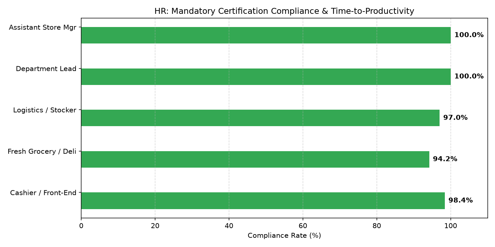

# HR: Training & Onboarding Compliance Agent

An enterprise AI agent for **HR: Training & Onboarding Compliance**, built with Google ADK for Gemini Enterprise.

---

## Why This Agent Matters

Frontline execution in grocery, deli, logistics, and store operations requires rigorous certification compliance and rapid speed-to-productivity. Lapsed OSHA safety, food handler, or powered industrial equipment certifications create legal liabilities, while prolonged onboarding slows store productivity. This agent audits mandatory certifications, LMS completion rates, and new hire time-to-productivity across store teams.

---

## Key Metrics Tracked

| Metric | Business Description | Target Benchmark |
| :--- | :--- | :--- |
| **Mandatory Certification Compliance (%)** | Associates with 100% active food safety, OSHA, and equipment credentials | 100.0% |
| **LMS Required Course Completion (%)** | Timely completion of mandatory corporate and compliance modules | >= 95.0% |
| **Time-to-Productivity (Days)** | Average days from hire date until associate reaches full operational standard | <= 14.0 Days |
| **Certification Expiration Pipeline (#)** | Certifications expiring within 30/60 days requiring immediate renewal | 0 Expired |

---

## What It Answers & Sub-Agent Routing

The orchestrator routes user questions to specialized sub-agents:

- **Internal BigQuery Data (`data_insights`)**:
  - LMS completion records, mandatory certifications, time-to-productivity tracking, and compliance audit logs.
- **External Market Context (`market_context`)**:
  - FDA Food Safety Modernization Act (FSMA) standards, OSHA workplace safety training mandates, and retail training benchmarks.
- **Synthesized Responses**:
  - Correlates training velocity and certification compliance with store audit pass rates and frontline productivity.

---

## Authorized BigQuery Tables

All tables reside in the `retail_ent_agents` BigQuery dataset:

- `hrwm_tocp_lms_course_completions`
- `hrwm_tocp_mandatory_certifications`
- `hrwm_tocp_time_to_productivity_days`
- `hrwm_tocp_safety_audit_compliance`

---

## Example Questions

- "What is the current mandatory certification compliance rate across grocery, bakery, and deli departments?"
- "Which stores currently have associates with expired or near-expiration food safety credentials?"
- "What is the average time-to-productivity in days for new front-end cashiers versus warehouse stockers?"
- "What are OSHA and FDA mandatory training compliance standards for commercial retail grocery and powered pallet jack operators?"
- "Show me a chart of mandatory certification compliance and time-to-productivity by department role."

---

## Sample Q&A Showcase

### 1. Internal BigQuery Data Insights
**User**: *What is the current mandatory certification compliance rate across grocery, bakery, and deli departments?*  
**Agent**: Querying `retail_ent_agents.hrwm_tocp_mandatory_certifications` and `hrwm_tocp_safety_audit_compliance`:
- **Bakery & Deli**: **98.6% compliance** across 340 certified food handlers (4 renewals pending in Store 103).
- **Fresh Grocery & Produce**: **99.2% compliance** on temperature monitoring and sanitation certifications.
- **Store Leadership & Leads**: **100.0% compliance** on ServSafe Manager and Powered Industrial Truck (PIT) certifications.

### 2. External Market Grounding
**User**: *What are OSHA and FDA mandatory training compliance standards for commercial retail grocery and powered pallet jack operators?*  
**Agent**: Regulatory frameworks mandate:
- **OSHA 29 CFR 1910.178**: Powered industrial truck (forklift/walkie-stacker) operators must receive formal classroom training, practical demonstrations, and triennial workplace evaluation prior to equipment operation.
- **FDA Food Code §2-102.12**: Each retail food establishment must employ at least one certified food protection manager on-site during operational hours to maintain health inspection compliance.

### 3. Visual Analytics Artifact
**User**: *Show me a chart of mandatory certification compliance and time-to-productivity by department role.*  
**Agent**: Visual breakdown of role-based compliance and onboarding duration:



---

## How to Run & Test

```bash
# 1. Run unit tests
uv run --frozen pytest domains/human_resources/agents/training_onboarding_compliance/tests/unit -v

# 2. Run local interactive adk chat
adk run domains/human_resources/agents/training_onboarding_compliance
```
