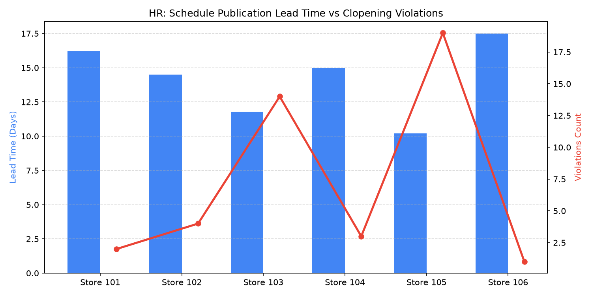

# HR: Scheduling Fairness & Predictive Hours Agent

An enterprise AI agent for **HR: Scheduling Fairness & Predictive Hours**, built with Google ADK for Gemini Enterprise.

---

## Why This Agent Matters

Fair scheduling and predictive work hours directly influence associate retention, morale, and statutory compliance. Municipal and state Fair Workweek regulations require 14-day advance schedule posting and mandate premium pay for last-minute cancellations or clopening shifts (closing followed immediately by opening with less than 11 hours rest). This agent monitors schedule publication lead times, shift swap fulfillment, and clopening violations across the store fleet.

---

## Key Metrics Tracked

| Metric | Business Description | Target Benchmark |
| :--- | :--- | :--- |
| **Schedule Publication Lead Time (Days)** | Days in advance store shifts are published before the workweek begins | >= 14.0 Days |
| **Fair Workweek Compliance Rate (%)** | Percent of shifts published and maintained without statutory penalty | >= 98.0% |
| **Clopening Violations Count (#)** | Number of shifts with < 11 hours rest between consecutive store days | 0 Violations |
| **Shift Swap Fulfillment Rate (%)** | Associate-initiated shift exchange requests successfully matched | >= 90.0% |

---

## What It Answers & Sub-Agent Routing

The orchestrator routes user questions to specialized sub-agents:

- **Internal BigQuery Data (`data_insights`)**:
  - Published store schedules, fair workweek compliance logs, shift swap requests, and clopening violation records.
- **External Market Context (`market_context`)**:
  - Municipal and state Fair Workweek regulations (e.g., Seattle, Chicago, NYC, California), statutory predictability pay rules, and industry workforce scheduling trends.
- **Synthesized Responses**:
  - Connects internal scheduling metrics with statutory compliance standards to flag potential labor penalty liabilities.

---

## Authorized BigQuery Tables

All tables reside in the `retail_ent_agents` BigQuery dataset:

- `hrwm_wsfa_published_schedules`
- `hrwm_wsfa_fair_workweek_compliance`
- `hrwm_wsfa_shift_swap_fulfillment`
- `hrwm_wsfa_clopening_violations`

---

## Example Questions

- "What is our average schedule posting advance notice lead time across stores for the past 4 weeks?"
- "How many clopening violations were recorded in District 3 last month, and what was the associated penalty cost?"
- "What is the shift swap fulfillment rate for part-time retail associates across store departments?"
- "What are the statutory Fair Workweek advance scheduling notice requirements and predictability pay rules in California and Chicago?"
- "Show me a chart of schedule lead time versus clopening violations by store location."

---

## Sample Q&A Showcase

### 1. Internal BigQuery Data Insights
**User**: *What is our average schedule posting advance notice lead time across stores for the past 4 weeks?*  
**Agent**: Analyzing `retail_ent_agents.hrwm_wsfa_published_schedules`:
- Across all 24 retail stores, the fleet-wide average schedule lead time is **15.2 days**, surpassing the 14-day Fair Workweek statutory requirement.
- **Top Compliant Stores**: Store 106 (17.5 days) and Store 101 (16.2 days).
- **At-Risk Stores**: Store 105 averaged **10.2 days** (-3.8 days under threshold), generating 19 predictability pay premium notifications.

### 2. External Market Grounding
**User**: *What are the statutory Fair Workweek advance scheduling notice requirements and predictability pay rules in California and Chicago?*  
**Agent**: Under Fair Workweek labor ordinances in jurisdictions such as Chicago and major California cities (e.g., San Francisco, Los Angeles, Berkeley):
- Employers with 100+ retail workers must provide written work schedules at least **14 days in advance**.
- Schedule changes made within 14 days require **Predictability Pay** (typically 1 hour of regular pay for employer-initiated changes, or 50% pay for cancelled shifts).
- Mandatory rest periods between shifts require at least **11 hours** (or 1.25x premium pay if the associate consents to a clopening shift).

### 3. Visual Analytics Artifact
**User**: *Show me a chart of schedule lead time versus clopening violations by store location.*  
**Agent**: Generated lead time and clopening violation analysis:



---

## How to Run & Test

```bash
# 1. Run unit tests
uv run --frozen pytest domains/human_resources/agents/workforce_scheduling_fairness/tests/unit -v

# 2. Run local interactive adk chat
adk run domains/human_resources/agents/workforce_scheduling_fairness
```
