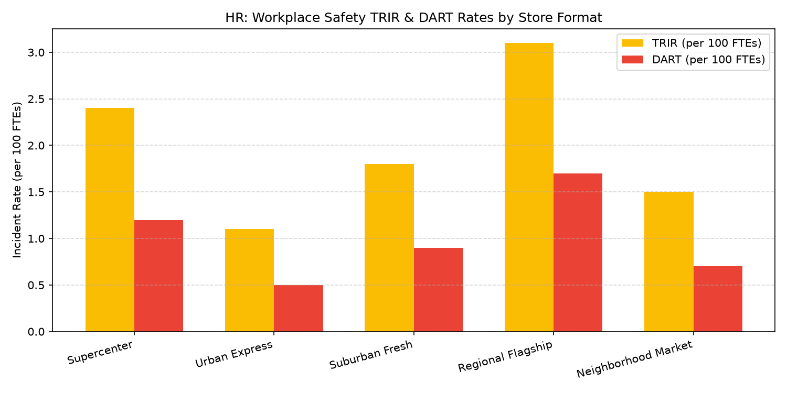

# HR: Workplace Safety & Workers' Comp Agent

An enterprise AI agent for **HR: Workplace Safety & Workers' Comp**, built with Google ADK for Gemini Enterprise.

---

## Why This Agent Matters

Maintaining frontline safety protects associates and prevents escalating workers' compensation claims and OSHA penalties. Slips, trips, repetitive motion strains, and material handling injuries directly inflate insurance reserves and lower store productivity. This agent provides EHS leadership and store managers with automated tracking of Total Recordable Incident Rate (TRIR), DART rates, workers' comp claims $, and store safety audit scores.

---

## Key Metrics Tracked

| Metric | Business Description | Target Benchmark |
| :--- | :--- | :--- |
| **Total Recordable Incident Rate (TRIR)** | Total OSHA-recordable injuries per 100 full-time equivalent (FTE) workers | < 2.50 per 100 FTEs |
| **Days Away, Restricted, or Transferred (DART)** | Rate of lost-time or modified-duty injury cases per 100 FTEs | < 1.20 per 100 FTEs |
| **Total Workers' Comp Claims Cost ($)** | Incurred and reserved financial cost of store injury claims | Under Budget ($) |
| **Store Safety Audit Compliance (%)** | Monthly safety walkthrough and hazard inspection score | >= 95.0% |

---

## What It Answers & Sub-Agent Routing

The orchestrator routes user questions to specialized sub-agents:

- **Internal BigQuery Data (`data_insights`)**:
  - Store incident logs, OSHA 300 logs, workers' compensation claims dollars, and facility safety inspection audits.
- **External Market Context (`market_context`)**:
  - BLS Survey of Occupational Injuries and Illnesses (SOII) retail benchmarks, OSHA reporting standards, and ergonomics guidelines.
- **Synthesized Responses**:
  - Identifies elevated store risk profiles and recommends targeted ergonomics and material handling interventions.

---

## Authorized BigQuery Tables

All tables reside in the `retail_ent_agents` BigQuery dataset:

- `hrwm_wswc_workplace_incidents`
- `hrwm_wswc_osha_300_logs`
- `hrwm_wswc_workers_comp_claims`
- `hrwm_wswc_safety_audit_scores`

---

## Example Questions

- "What is our enterprise TRIR and DART rate across store formats for 2026 YTD?"
- "What were the total workers' comp claims costs and average cost per claim by injury cause in Q1?"
- "Which stores have safety audit scores below 90% and open corrective action items?"
- "What are current BLS retail sector benchmarks for TRIR and DART in supermarkets and general merchandise stores?"
- "Show me a chart comparing TRIR and DART rates across store formats for 2026 YTD."

---

## Sample Q&A Showcase

### 1. Internal BigQuery Data Insights
**User**: *What is our enterprise TRIR and DART rate across store formats for 2026 YTD?*  
**Agent**: Querying `retail_ent_agents.hrwm_wswc_osha_300_logs` and `hrwm_wswc_workplace_incidents`:
- **Enterprise Fleet Average**: **TRIR of 1.98** and **DART of 0.96** per 100 FTEs (favorable vs. company threshold of 2.50).
- **Supercenter Format**: TRIR 2.40 / DART 1.20 (material handling and backroom lifting strains accounted for 62% of incidents).
- **Urban Express Format**: TRIR 1.10 / DART 0.50.

### 2. External Market Grounding
**User**: *What are current BLS retail sector benchmarks for TRIR and DART in supermarkets and general merchandise stores?*  
**Agent**: According to the latest U.S. Bureau of Labor Statistics (BLS) Occupational Injuries and Illnesses report for NAICS 452 (General Merchandise) and NAICS 445 (Food and Beverage Stores):
- Supermarket / Grocery Store average TRIR is **3.8 cases per 100 FTEs**, with an average DART rate of **2.4**.
- General Merchandise stores average a TRIR of **3.1** and DART of **1.9**.
- Top incident causes remain overexertion in lifting/lowering and same-level slips/falls.

### 3. Visual Analytics Artifact
**User**: *Show me a chart comparing TRIR and DART rates across store formats for 2026 YTD.*  
**Agent**: Visual comparison of incident rates across store archetypes:



---

## How to Run & Test

```bash
# 1. Run unit tests
uv run --frozen pytest domains/human_resources/agents/workplace_safety_workers_comp/tests/unit -v

# 2. Run local interactive adk chat
adk run domains/human_resources/agents/workplace_safety_workers_comp
```
