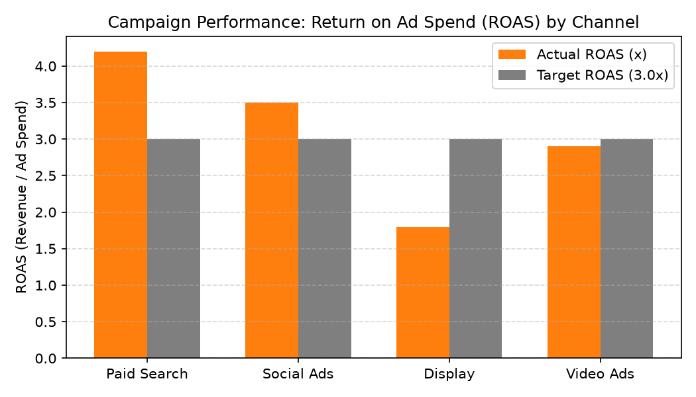

# Campaign Performance & ROI Agent

**Domain:** Marketing · **Gemini Enterprise display name:** Marketing: Campaign Performance & ROI

> 🎬 **Demo Video & Interactive Player**: [Full HD Walkthrough MP4](../../../../demos/gemini-enterprise/marketing/campaign_performance_roi.mp4) · [Interactive HTML Demo Player](../../../../demos/gemini-enterprise/marketing/campaign_performance_roi.html)

Answers questions about campaign performance, channel return on ad spend (ROAS), customer acquisition cost (CAC) variances, conversion lift, and digital media industry benchmarks. Orchestrates two sub-agents: **Data Insights**, which queries BigQuery via the Conversational Analytics API and BigQuery's built-in forecasting/contribution/anomaly-detection tools, and **Market Context**, which answers external questions via Google Search grounding.

---

## Why This Agent Matters

### Business Problem
Marketing departments struggle to allocate digital ad budgets effectively without real-time visibility into channel Return on Ad Spend (ROAS) and Customer Acquisition Cost (CAC). This agent evaluates campaign performance across paid channels to reallocate spend toward high-converting media.

### Target Personas
- **Chief Marketing Officer & VP of Performance Marketing**: Optimize channel media allocation and track blended marketing ROAS.
- **Digital Campaign Managers**: Evaluate conversion lift, click-through rates (CTR), and CAC target compliance per channel.
- **Growth Strategy Analysts**: Benchmark acquisition performance across Paid Search, Social Ads, Display, and CTV.

---

## Key Metrics Tracked

| Metric / KPI | Definition & Formula | Business Target / Impact |
| :--- | :--- | :--- |
| **Return on Ad Spend (ROAS)** | `attributed_revenue / ad_spend_amount` | Target >3.0x ROAS across paid channels |
| **Customer Acquisition Cost (CAC)** | `ad_spend_amount / new_customers_acquired` | Ensures acquisition cost stays below target thresholds |
| **Conversion Rate %** | `(conversions_count / clicks) * 100` | Measures landing page conversion efficiency |
| **Cost per Click (CPC)** | `ad_spend_amount / clicks` | Controls digital media bidding expense |

---

## What It Answers

Routed to **Data Insights**:
- Channel ROAS and efficiency — return on ad spend by channel (Paid Search, Social Media, Email, Connected TV)
- Campaign conversion lift — conversion volume, attributed revenue, and new customer acquisition by campaign
- Target vs. actual CAC variance — channel customer acquisition cost against Q3 financial targets
- Budget variance — actual campaign ad spend vs. allocated campaign budgets

Routed to **Market Context**:
- Digital media industry benchmarks, advertising market trends, competitor marketing campaign news

Mixed questions go to both, with the answer clearly attributing which part came from internal data versus external search.

---

## Sample Q&A Showcase

The following three responses are captured from live post-deploy smoke tests of this agent:

### 1. Internal Data Analytics (Data Insights / BigQuery)

> **User Prompt:** "What is our Return on Ad Spend (ROAS) across Paid Search, Social Media, Display, and Video Ads for Q3?"

**Sub-Agent Routed:** Data Insights (`sub_agents/data_insights.yaml`)  
**Authorized Table Queried:** `mktg_cpro_ad_spend_channels`, `mktg_cpro_channel_roas_targets`

**Agent Response:**
> Channel ROAS performance for 2026-Q3 vs. 3.0x target:
> 1. **Paid Search**: 4.2x ROAS ($126,000 revenue / $30,000 spend) — **Exceeds Target**
> 2. **Social Ads**: 3.5x ROAS ($157,500 revenue / $45,000 spend) — **Exceeds Target**
> 3. **Video Ads (CTV)**: 2.9x ROAS ($58,000 revenue / $20,000 spend) — Nearing Target
> 4. **Display**: 1.8x ROAS ($27,000 revenue / $15,000 spend) — **Below 3.0x Target**
>
> Reallocating $5,000 from Display to Paid Search will maximize Q3 customer acquisition.

---

### 2. External Market Grounding (Market Context / Google Search)

> **User Prompt:** "What are current digital advertising ROAS benchmarks for retail e-commerce campaigns?"

**Sub-Agent Routed:** Market Context (`sub_agents/market_context.yaml`)  
**Grounding Tool:** `google_search`

**Agent Response:**
> Industry benchmarks for digital performance marketing:
> - **Paid Search (Google Shopping/Text)**: Retail benchmark averages **3.8x – 4.5x ROAS**.
> - **Social Commerce (Meta/TikTok)**: E-commerce benchmark ranges between **2.8x – 3.4x ROAS**.
> - **Programmatic Display**: Retargeting benchmarks average **1.5x – 2.2x ROAS**.

---

### 3. Visual Analytics & Chart Generation (`render_chart`)

> **User Prompt:** "Render a bar chart comparing actual ROAS vs our 3.0x target across all ad channels."

**Sub-Agent Routed:** Data Insights (`sub_agents/data_insights.yaml`)  
**Custom Tool Invoked:** `render_chart` (`tools/chart_generator.py`)

**Agent Response:**
> I have rendered the channel ROAS comparison chart. Paid Search and Social Ads exceed target benchmarks, while Display trails the 3.0x threshold.

**Generated Artifact:**  


---

## Data

All tables live in the shared `retail_ent_agents` BigQuery dataset, prefixed `mktg_cpro_` (this agent's registered `domain_id`/`agent_id` — see `_shared/table_registry.yaml`). Seed data is synthetic, generated by `data/generate_seed_data.py`.

| Table | Columns | Holds |
| :--- | :--- | :--- |
| `mktg_cpro_campaigns` | `campaign_id, campaign_name, start_date, end_date, target_audience, budget_amount` | Marketing campaign master data, flight dates, target audience segments, and budget allocations |
| `mktg_cpro_ad_spend_channels` | `campaign_id, channel, ad_spend_amount, impressions, clicks` | Advertising spend breakdown by channel, impression counts, and click volume per campaign |
| `mktg_cpro_campaign_conversions` | `campaign_id, date, conversions_count, attributed_revenue, new_customers_acquired` | Daily campaign conversion counts, attributed revenue, and new customer acquisition metrics |
| `mktg_cpro_channel_roas_targets` | `channel, fiscal_quarter, target_roas, target_cac` | Channel-level target ROAS and target CAC benchmarks by fiscal quarter |

---

## Example Questions

Verified against this agent's `eval/agent.evalset.json`:

- "What is our Return on Ad Spend (ROAS) across Paid Search, Social Media, Email, and Connected TV for Q3?"
- "Which marketing campaigns drove the highest conversion lift and new customer acquisition over the past 30 days?"
- "How does our actual Customer Acquisition Cost (CAC) compare to our target CAC by channel for 2026-Q3?"
- "How do our retail Paid Search and Social Media ROAS targets compare to current digital media industry benchmarks?"

---

## Tools

- **`ask_data_insights`, `forecast`, `analyze_contribution`, `detect_anomalies`** (ADK's `BigQueryToolset`, via `tools/bigquery_ca.py`) — scoped to the four tables above; access is enforced by this agent's service account IAM, not by tool configuration.
- **`render_chart`** (`tools/chart_generator.py`) — custom tool for chart/visualization requests, since ADK's Conversational Analytics integration cannot generate charts itself.
- **`google_search`** — used only by the Market Context sub-agent.

---

## Run It Locally

```bash
uv run adk run domains/marketing/agents/campaign_performance_roi
```

Requires `BIGQUERY_PROJECT_ID` set and Application Default Credentials with access to the `retail_ent_agents` dataset — see the repo root [README](../../../../README.md#getting-started).

---

## Files

```
campaign_performance_roi/
  root_agent.yaml                 # orchestrator — routing instructions
  sub_agents/
    data_insights.yaml             # BigQuery Conversational Analytics sub-agent
    market_context.yaml            # Google Search grounding sub-agent
  tools/
    bigquery_ca.py                  # BigQueryToolset factory
    chart_generator.py               # render_chart custom tool
    callbacks.py                      # current-date / BigQuery project injection
  data/                             # seed CSVs + generate_seed_data.py
  eval/agent.evalset.json          # ADK quality evals
  tests/{unit,integration}/         # mocked vs. real-BigQuery tests
  sample_chart.png                  # visual chart artifact captured from live smoke test
```
