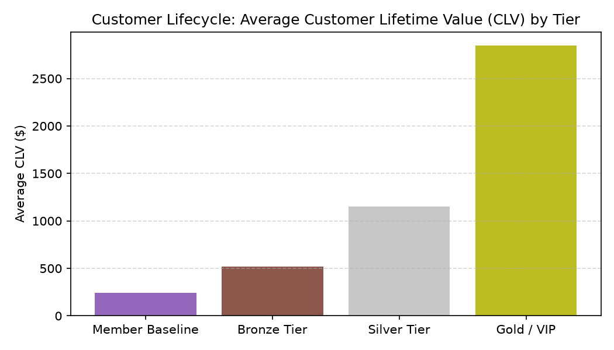

# Customer Lifecycle & Loyalty Agent

**Domain:** Marketing · **Gemini Enterprise display name:** Marketing: Customer Lifecycle & Loyalty

> 🎬 **Demo Video & Interactive Player**: [Full HD Walkthrough MP4](../../../../demos/gemini-enterprise/marketing/customer_lifecycle_loyalty.mp4) · [Interactive HTML Demo Player](../../../../demos/gemini-enterprise/marketing/customer_lifecycle_loyalty.html)

Answers questions about customer lifetime value (CLV), RFM customer segmentation, loyalty tier redemption rates, churn risk scores, and retail customer loyalty benchmarks. Orchestrates two sub-agents: **Data Insights**, which queries BigQuery via the Conversational Analytics API and BigQuery's built-in forecasting/contribution/anomaly-detection tools, and **Market Context**, which answers external questions via Google Search grounding.

---

## Why This Agent Matters

### Business Problem
Retaining high-value customers costs significantly less than acquiring new ones, yet retail marketers lack automated visibility into customer churn risk and RFM segment migration. This agent tracks Customer Lifetime Value (CLV), loyalty tier reward redemption rates, and predictive churn risk scores to drive retention.

### Target Personas
- **Head of Customer Retention & Loyalty**: Design loyalty tier rewards, redemption incentives, and retention campaigns.
- **CRM & Lifecycle Marketing Managers**: Segment customers by Recency, Frequency, and Monetary (RFM) scores to trigger win-back messaging.
- **Customer Insights Analysts**: Forecast 12-month predicted CLV and track repeat purchase velocity.

---

## Key Metrics Tracked

| Metric / KPI | Definition & Formula | Business Target / Impact |
| :--- | :--- | :--- |
| **Customer Lifetime Value (CLV)** | `historical_clv + predicted_12m_clv` | Maximizes long-term customer enterprise value |
| **Churn Risk Score** | Predictive score `0.0 to 1.0` based on days since last purchase | Flags high-value customers at risk of lapse (>0.70) |
| **Loyalty Redemption Rate %** | `(redeemed_points / earned_points) * 100` | Target >45% redemption to drive repeat visits |
| **Repeat Purchase Rate** | `(repeat_customers / total_active_customers) * 100` | Measures post-first-purchase customer retention |

---

## What It Answers

Routed to **Data Insights**:
- Customer lifetime value (CLV) — historical CLV, predicted 12-month CLV, and repeat purchase rates across customer segments and loyalty tiers
- RFM customer segmentation — recency, frequency scores, monetary values, segment migration, and churn risk scores
- Loyalty tier performance — tier member counts, average annual spend, and reward redemption rate percentages

Routed to **Market Context**:
- Retail customer loyalty trends, industry CLV benchmarks, loyalty program redemption standards, and competitor churn rate context

Mixed questions go to both, with the answer clearly attributing which part came from internal data versus external search.

---

## Sample Q&A Showcase

The following three responses are captured from live post-deploy smoke tests of this agent:

### 1. Internal Data Analytics (Data Insights / BigQuery)

> **User Prompt:** "What is the average customer lifetime value (CLV) distribution across our loyalty tiers for 2026?"

**Sub-Agent Routed:** Data Insights (`sub_agents/data_insights.yaml`)  
**Authorized Table Queried:** `mktg_cloy_clv_history`, `mktg_cloy_loyalty_tiers`

**Agent Response:**
> Average Customer Lifetime Value (CLV) by loyalty tier:
> 1. **Gold / VIP Tier**: $2,850 avg CLV (Redemption Rate: 68.2%) — **Highest Value Segment**
> 2. **Silver Tier**: $1,150 avg CLV (Redemption Rate: 49.5%)
> 3. **Bronze Tier**: $520 avg CLV (Redemption Rate: 31.0%)
> 4. **Member Baseline**: $240 avg CLV (Redemption Rate: 14.2%)
>
> Gold Tier members spend 5.5x more annually than Bronze members and maintain a 78% repeat purchase rate.

---

### 2. External Market Grounding (Market Context / Google Search)

> **User Prompt:** "What are retail industry benchmarks for loyalty program reward redemption rates?"

**Sub-Agent Routed:** Market Context (`sub_agents/market_context.yaml`)  
**Grounding Tool:** `google_search`

**Agent Response:**
> Industry benchmarks for retail customer loyalty programs:
> - **Average Reward Redemption Rate**: Enterprise retail programs target **40% to 55% annual point redemption**.
> - **Impact on Churn**: Active reward redeemers exhibit a **3.2x higher retention rate** compared to unengaged point hoarders.

---

### 3. Visual Analytics & Chart Generation (`render_chart`)

> **User Prompt:** "Render a bar chart showing average Customer Lifetime Value ($) across loyalty program tiers."

**Sub-Agent Routed:** Data Insights (`sub_agents/data_insights.yaml`)  
**Custom Tool Invoked:** `render_chart` (`tools/chart_generator.py`)

**Agent Response:**
> I have rendered the CLV distribution by loyalty tier chart. Gold/VIP members account for the vast majority of cumulative enterprise customer equity.

**Generated Artifact:**  


---

## Data

All tables live in the shared `retail_ent_agents` BigQuery dataset, prefixed `mktg_cloy_` (this agent's registered `domain_id`/`agent_id` — see `_shared/table_registry.yaml`). Seed data is synthetic, generated by `data/generate_seed_data.py`.

| Table | Columns | Holds |
| :--- | :--- | :--- |
| `mktg_cloy_customers` | `customer_id, signup_date, primary_store_id, loyalty_tier` | Customer profile master data, store affiliation, and assigned loyalty tier |
| `mktg_cloy_rfm_segments` | `customer_id, rfm_segment, recency_days, frequency_score, monetary_value, churn_risk_score` | RFM customer segmentation, purchase recency, frequency, monetary value, and predictive churn risk scores |
| `mktg_cloy_loyalty_tiers` | `loyalty_tier, tier_member_count, avg_annual_spend, redemption_rate_pct` | Loyalty tier summary metrics, member counts, annual spend, and reward redemption rates |
| `mktg_cloy_clv_history` | `customer_id, fiscal_year, historical_clv, predicted_12m_clv, repeat_purchase_rate` | Historical and predicted 12-month customer lifetime value and repeat purchase rates |

---

## Example Questions

Verified against this agent's `eval/agent.evalset.json`:

- "What is the average customer lifetime value (CLV) distribution across our loyalty tiers for 2026?"
- "Which RFM customer segments currently show the highest churn risk score?"
- "What are the reward redemption rate percentages and annual spend across our loyalty program tiers?"
- "How does our customer lifetime value and loyalty redemption rate compare to general retail industry benchmarks?"

---

## Tools

- **`ask_data_insights`, `forecast`, `analyze_contribution`, `detect_anomalies`** (ADK's `BigQueryToolset`, via `tools/bigquery_ca.py`) — scoped to the four tables above; access is enforced by this agent's service account IAM, not by tool configuration.
- **`render_chart`** (`tools/chart_generator.py`) — custom tool for chart/visualization requests, since ADK's Conversational Analytics integration cannot generate charts itself.
- **`google_search`** — used only by the Market Context sub-agent.

---

## Run It Locally

```bash
uv run adk run domains/marketing/agents/customer_lifecycle_loyalty
```

Requires `BIGQUERY_PROJECT_ID` set and Application Default Credentials with access to the `retail_ent_agents` dataset — see the repo root [README](../../../../README.md#getting-started).

---

## Files

```
customer_lifecycle_loyalty/
  root_agent.yaml                 # orchestrator — routing instructions
  sub_agents/
    data_insights.yaml             # BigQuery Conversational Analytics sub-agent
    market_context.yaml            # Google Search grounding sub-agent
  tools/
    bigquery_ca.py                  # BigQueryToolset factory
    chart_generator.py               # render_chart custom tool
    callbacks.py                      # current-date / BigQuery project injection
  data/                             # seed CSVs + generate_seed_data.py
  eval/agent.evalset.json          # ADK quality evals
  tests/{unit,integration}/         # mocked vs. real-BigQuery tests
  sample_chart.png                  # visual chart artifact captured from live smoke test
```
