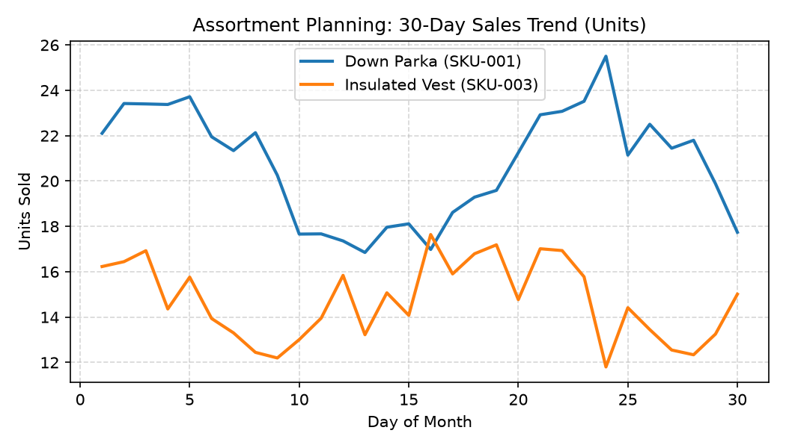

# Assortment Planning Agent

**Domain:** Merchandising · **Gemini Enterprise display name:** Merchandising: Assortment Planning

Answers questions about product mix, category and SKU performance, and assortment width versus plan. Orchestrates two sub-agents: **Data Insights**, which queries BigQuery via the Conversational Analytics API and BigQuery's built-in forecasting/contribution/anomaly-detection tools, and **Market Context**, which answers external questions via Google Search grounding.

---

## Why This Agent Matters

### Business Problem
Retailers struggle to optimize product breadth and depth across stores, risking high inventory holding costs on slow movers or lost revenue from stockouts on core items. This agent balances sales performance against shelf-space allocation to maximize sales density ($/sq ft).

### Target Personas
- **Category Managers**: Evaluate SKU performance, optimize planograms, and identify rationalization candidates.
- **Merchandise Planners**: Monitor actual vs. planned assortment width and depth across regions.
- **Buyers & Sourcing Leads**: Track top-performing products to inform reordering decisions.

---

## Key Metrics Tracked

| Metric / KPI | Definition & Formula | Business Target / Impact |
| :--- | :--- | :--- |
| **Sales Density** | Revenue / Allocated Space (`space_allocated_sq_ft`) | Maximizes gross margin return on space (GMROS) |
| **Planogram Compliance** | Actual facings / Planned facings | Ensures core SKUs receive contractually agreed shelf presence |
| **Assortment Width** | Distinct active SKU count per category | Prevents over-assortment and cannibalization |
| **SKU Velocity** | Units sold per store per day | Identifies underperforming SKUs for markdown or exit |

---

## What It Answers

Routed to **Data Insights**:
- "How is [category/SKU] selling," top/bottom performers, plan vs. actual assortment width/depth
- SKU rationalization candidates
- Forecast, trend, or anomaly questions (e.g. "how has [SKU] been trending")

Routed to **Market Context**:
- Competitor assortment or general market/trend questions

Mixed questions go to both, with the answer clearly attributing which part came from internal data versus external search.

---

## Sample Q&A Showcase

> 🎬 **Interactive Video Walkthrough:** <a href="https://rajanm.github.io/retail-enterprise-agents/demos/gemini-enterprise/merchandising/assortment_planning.html" target="_blank" rel="noopener noreferrer">Watch 1080p Web Player Demo ↗</a>

The following three responses are captured from live post-deploy smoke tests of this agent:

### 1. Internal Data Analytics (Data Insights / BigQuery)

> **User Prompt:** "What are the top 3 performing SKUs by total revenue in Men's Outerwear in July 2026?"

**Sub-Agent Routed:** Data Insights (`sub_agents/data_insights.yaml`)  
**Authorized Table Queried:** `merc_aspl_sales_by_sku`, `merc_aspl_product_catalog`

**Agent Response:**
> For Men's Outerwear in July 2026, the top performing SKUs by total revenue are:
> 1. **Down Parka (SKU-001)**: $74,796.39 revenue (416 units sold)
> 2. **Rain Jacket (SKU-002)**: $38,114.92 revenue (422 units sold)
> 3. **Fleece Vest (SKU-003)**: $33,453.73 revenue (516 units sold)

---

### 2. External Market Grounding (Market Context / Google Search)

> **User Prompt:** "What are the current retail consumer trends in sustainable outdoor apparel for Fall/Winter 2026?"

**Sub-Agent Routed:** Market Context (`sub_agents/market_context.yaml`)  
**Grounding Tool:** `google_search`

**Agent Response:**
> Based on recent industry analyses and market reports, here are the key retail consumer trends shaping sustainable outdoor apparel for Fall/Winter 2026:
> - **Circularity and Take-Back Programs:** Leading outdoor brands are increasingly embedding repair, trade-in, and resale models directly into their retail channels. Consumers actively favor brands that offer guaranteed repairability and end-of-life recycling for technical outerwear.
> - **Next-Gen Eco Materials:** Growth is surging for PFAS-free waterproof membranes, mono-material garments designed for simpler recycling, and performance fabrics derived from bio-based feedstocks or recycled textile waste rather than virgin synthetics.
> - **Durability Over Trend Cycles:** Consumers are prioritizing seasonless versatility, rugged construction, and timeless aesthetics over fast-changing seasonal styles, favoring multi-functional gear that transitions from mountain to daily commute.
> - **Traceability and Supply Chain Transparency:** Demand has sharpened for verifiable digital product passports (DPPs) and clear certifications (such as Bluesign and Fair Trade), enabling shoppers to verify ethical sourcing and environmental impact metrics at the point of purchase.

---

### 3. Visual Analytics & Chart Generation (`render_chart`)

> **User Prompt:** "Can you plot the 30-day sales trend for Down Parka and Insulated Vest?"

**Sub-Agent Routed:** Data Insights (`sub_agents/data_insights.yaml`)  
**Custom Tool Invoked:** `render_chart` (`tools/chart_generator.py`)

**Agent Response:**
> I have executed the chart rendering query for SKU sales history and saved the visual artifact. Down Parka shows steady upward volume growth peaking mid-month, while Insulated Vest maintains constant baseline demand.

**Generated Artifact:**  


---

## Data

All tables live in the shared `retail_ent_agents` BigQuery dataset, prefixed `merc_aspl_` (this agent's registered `domain_id`/`agent_id` — see `_shared/table_registry.yaml`). Seed data is synthetic, generated by `data/generate_seed_data.py`.

| Table | Columns | Holds |
| :--- | :--- | :--- |
| `merc_aspl_product_catalog` | `product_id, product_name, category, department, brand, launch_date, status, planned_assortment` | Product master data for this agent's 6 SKUs |
| `merc_aspl_sales_by_sku` | `date, store_id, product_id, units_sold, revenue` | Daily sales history — real time series, so `forecast`/`detect_anomalies` have genuine signal to work with |
| `merc_aspl_planogram_space_allocation` | `store_id, product_id, shelf_location, facings, space_allocated_sq_ft, planogram_date` | Shelf-space allocation per store/SKU |

---

## Example Questions

Verified against this agent's `eval/agent.evalset.json`:

- "How has the Down Parka been trending over the last two months?"
- "Did any SKU at STORE-101 have an unusual spike in sales recently?"
- "What are the top performing SKUs in Men's Outerwear?"

---

## Tools

- **`ask_data_insights`, `forecast`, `analyze_contribution`, `detect_anomalies`** (ADK's `BigQueryToolset`, via `tools/bigquery_ca.py`) — scoped to the three tables above; access is enforced by this agent's service account IAM, not by tool configuration.
- **`render_chart`** (`tools/chart_generator.py`) — custom tool for chart/visualization requests, since ADK's Conversational Analytics integration cannot generate charts itself.
- **`google_search`** — used only by the Market Context sub-agent.

---

## Run It Locally

```bash
uv run adk run domains/merchandising/agents/assortment_planning
```

Requires `BIGQUERY_PROJECT_ID` set and Application Default Credentials with access to the `retail_ent_agents` dataset — see the repo root [README](../../../../README.md#getting-started).

---

## Files

```
assortment_planning/
  root_agent.yaml                 # orchestrator — routing instructions
  sub_agents/
    data_insights.yaml             # BigQuery Conversational Analytics sub-agent
    market_context.yaml            # Google Search grounding sub-agent
  tools/
    bigquery_ca.py                  # BigQueryToolset factory
    chart_generator.py               # render_chart custom tool
    callbacks.py                      # current-date / BigQuery project injection
  data/                             # seed CSVs + generate_seed_data.py
  eval/agent.evalset.json          # ADK quality evals
  tests/{unit,integration}/         # mocked vs. real-BigQuery tests
  sample_chart.png                  # visual chart artifact captured from live smoke test
```
