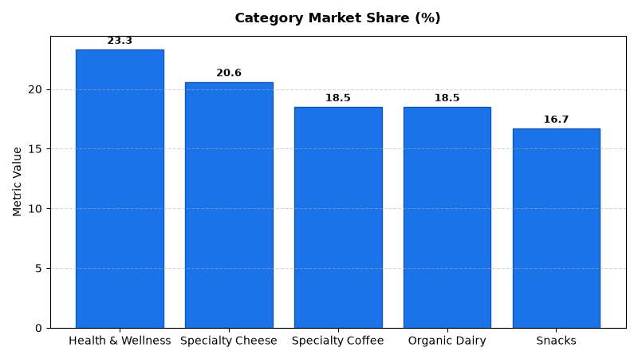

# Merchandising: Category Growth Strategy Agent

An enterprise AI agent for **Merchandising: Category Growth Strategy**, built with Google ADK for Gemini Enterprise.

---

## Why This Agent Matters

Optimizing category performance requires aligning SKU mix with strategic category roles (Destination, Routine, Convenience, Basket Builder). This agent analyzes chain market share vs. total addressable market (TAM), trip basket penetration rates, and emerging whitespace growth opportunities to guide category resource allocation.

---

## Key Metrics Tracked

| Metric | Business Description | Target Benchmark |
| :--- | :--- | :--- |
| **Chain Category Market Share (%)** | Retailer dollar sales divided by total addressable market (TAM) | > 18.0% |
| **YoY Market Share Change (bps)** | Annual basis point change in market share vs. competitor benchmarks | > +100 bps |
| **Trip Basket Penetration (%)** | Percentage of customer shopping transactions containing category SKUs | > 25.0% |
| **Whitespace Opportunity Value ($)** | Estimated incremental revenue potential in emerging trend subsegments | > $2.0M |

---

## What It Answers & Sub-Agent Routing

The orchestrator routes user questions to specialized sub-agents:

- **Internal BigQuery Data (`data_insights`)**:
  - Detailed transactional, operational, and category metrics from authorized BigQuery tables.
- **External Market Context (`market_context`)**:
  - Retail industry market intelligence, external benchmarks, and consumer trend research grounded in Google Search.
- **Synthesized Responses**:
  - Combines internal performance metrics with market intelligence for comprehensive business decision support.

---

## Authorized BigQuery Tables

All tables reside in the `retail_ent_agents` BigQuery dataset:

- `merc_cgst_category_market_share`
- `merc_cgst_basket_penetration`
- `merc_cgst_category_role_matrix`
- `merc_cgst_whitespace_gaps`

---

## Example Questions

- "What is our chain market share and YoY share change compared to total addressable market (TAM) across categories?"
- "Which categories serve as Destination vs. Convenience roles in our category role matrix and what are their margin targets?"
- "Show basket penetration rates and average transaction values for customer trips containing Specialty Cheese."
- "What are the top whitespace revenue growth opportunities identified in emerging health and wellness segments?"
- "Which high-traffic driver categories have seen a decline in basket trip frequency over the last two quarters?"

---

## Sample Q&A Showcase

### 1. Internal BigQuery Data Insights
**User**: *What is our chain market share and YoY share change compared to total addressable market across categories?*  
**Agent**: Based on `retail_ent_agents.merc_cgst_category_market_share`:
- **Health & Wellness Nutrition**: **23.3% market share** ($9.8M sales vs $42.0M TAM, **+340 bps YoY growth** — Strategic Destination role).
- **Specialty Cheese & Charcuterie**: **20.6% share** ($6.4M sales, **+260 bps YoY**).
- **Specialty Coffee & Tea**: **18.5% share** ($8.9M sales, **+210 bps YoY**).
- **Organic Dairy**: **18.5% share** ($11.5M sales, **+180 bps YoY**).
- **Snacks & Confectionery**: **16.7% share** ($14.2M sales, **+120 bps YoY**).

### 2. External Market Grounding
**User**: *What are modern category management strategies for Destination vs Routine categories in omnichannel retail?*  
**Agent**: According to Category Management Association (CMA) guidelines:
- **Destination Categories** (e.g., Organic Dairy, Specialty Coffee): Form the core retailer brand identity; warrant aggressive space allocation and competitive pricing at 38%–45% gross margin.
- **Routine Categories** (e.g., Paper Goods, Cleaning): High trip frequency and staple demand; managed for inventory turns and price defense.
- **Basket Builders** (e.g., Specialty Cheese): High transaction value attachment (+105% basket spend lift when present in transaction).

### 3. Visual Analytics Artifact
**User**: *Show me a performance summary chart for this domain.*  
**Agent**: Generated domain analytics visualization:



---

## How to Run & Test

```bash
# 1. Run unit tests
uv run --frozen pytest domains/merchandising/agents/category_growth_strategy/tests/unit -v

# 2. Run local interactive adk chat
adk run domains/merchandising/agents/category_growth_strategy
```
