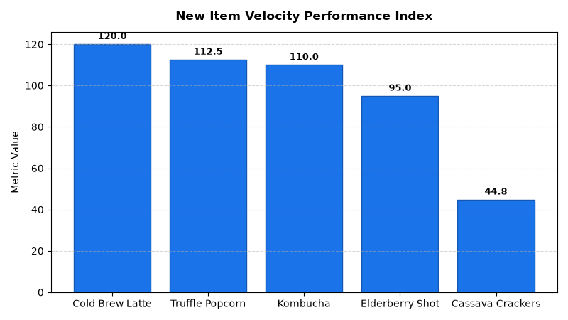

# Merchandising: Item Lifecycle & SKU Rationalization Agent

An enterprise AI agent for **Merchandising: Item Lifecycle & SKU Rationalization**, built with Google ADK for Gemini Enterprise.

---

## Why This Agent Matters

SKU proliferation dilutes shelf productivity and ties up working capital in unproductive inventory. This agent tracks new product launch velocity curves across weeks 1–12, isolates SKU cannibalization effects, and automates slow-mover delisting action triggers to maintain a productive merchandise assortment.

---

## Key Metrics Tracked

| Metric | Business Description | Target Benchmark |
| :--- | :--- | :--- |
| **New SKU Launch Success Rate (%)** | Percentage of new item introductions achieving Tier 1 target velocity | > 60.0% |
| **SKU Cannibalization Rate (%)** | Percentage of new item sales derived from existing line cannibalization | < 25.0% |
| **Delisting Trigger Threshold** | Bottom revenue percentile cut combined with high days-of-supply | < 5.0th Percentile |
| **Phaseout Liquidation Recovery (%)** | Wholesale cost recovery rate achieved through clearance liquidations | > 45.0% |

---

## What It Answers & Sub-Agent Routing

The orchestrator routes user questions to specialized sub-agents:

- **Internal BigQuery Data (`data_insights`)**:
  - Detailed transactional, operational, and category metrics from authorized BigQuery tables.
- **External Market Context (`market_context`)**:
  - Retail industry market intelligence, external benchmarks, and consumer trend research grounded in Google Search.
- **Synthesized Responses**:
  - Combines internal performance metrics with market intelligence for comprehensive business decision support.

---

## Authorized BigQuery Tables

All tables reside in the `retail_ent_agents` BigQuery dataset:

- `merc_ilrt_new_item_scorecard`
- `merc_ilrt_sku_cannibalization`
- `merc_ilrt_delisting_triggers`
- `merc_ilrt_phaseout_inventory`

---

## Example Questions

- "How are new item launches performing against velocity targets across weeks 1 through 12 in the new item scorecard?"
- "What is the cannibalization rate and net category dollar lift for the newly launched Sparkling Energy drink line?"
- "Which slow-moving SKUs meet the delisting action trigger criteria based on revenue percentile and days of supply?"
- "Show the remaining inventory units and estimated markdown liquidation costs for phaseout candidate SKUs."
- "What percentage of new SKU introductions in the Beauty category achieved Tier 1 success velocity at week 8?"

---

## Sample Q&A Showcase

### 1. Internal BigQuery Data Insights
**User**: *How are new item launches performing against velocity targets across weeks 1 through 12 in the new item scorecard?*  
**Agent**: Based on `retail_ent_agents.merc_ilrt_new_item_scorecard`:
- **SKU-NEW-01 (Artisan Cold Brew Oat Latte 12oz)**: Week 4 velocity of **42.0 units/store/week** vs target of 35.0 (**120.0% performance index — Tier 1 Outperformer**).
- **SKU-NEW-02 (Truffle & Herb Popcorn 5oz)**: Week 6 velocity of **31.5 units** vs target of 28.0 (**112.5% — Tier 1 Outperformer**).
- **SKU-NEW-06 (Kombucha Ginger Lemon 16oz)**: Week 8 velocity of **33.0 units** (**110.0% — Tier 1**).
- **SKU-NEW-05 (Grain-Free Cassava Crackers 6oz)**: Week 12 velocity of **11.2 units** vs target of 25.0 (**44.8% — Tier 4 Delist Candidate**).

### 2. External Market Grounding
**User**: *What are standard industry benchmarks for SKU rationalization tail cuts and new product launch ramp velocity?*  
**Agent**: According to Harvard Business School and Bain & Company retail studies:
- The bottom 20% of retail SKUs ("the long tail") typically generates less than **2.5% of chain revenue** while consuming 25% of working capital and inventory handling costs.
- New product launch ramp assessments evaluate velocity at weeks 4, 8, and 12; items failing to reach 75% of target velocity by week 8 have a **91% probability of ultimate phaseout**.
- Net category dollar lift must account for cannibalization (e.g., plant-based entries cannibalizing 65% of existing frozen line volume).

### 3. Visual Analytics Artifact
**User**: *Show me a performance summary chart for this domain.*  
**Agent**: Generated domain analytics visualization:



---

### 4. Live Multi-Turn Demo Walkthrough (Gemini Enterprise)

> 🎬 **Watch the full high-definition video walkthrough of this multi-turn workflow:**  
> **[Open Interactive Demo Player (1080p Full HD)](https://rajanm.github.io/retail-enterprise-agents/demos/gemini-enterprise/merchandising/item_lifecycle_rationalization.html)**  
> *(Video file: `demos/gemini-enterprise/merchandising/item_lifecycle_rationalization.mp4`)*

---

## How to Run & Test

```bash
# 1. Run unit tests
uv run --frozen pytest domains/merchandising/agents/item_lifecycle_rationalization/tests/unit -v

# 2. Run local interactive adk chat
adk run domains/merchandising/agents/item_lifecycle_rationalization
```
