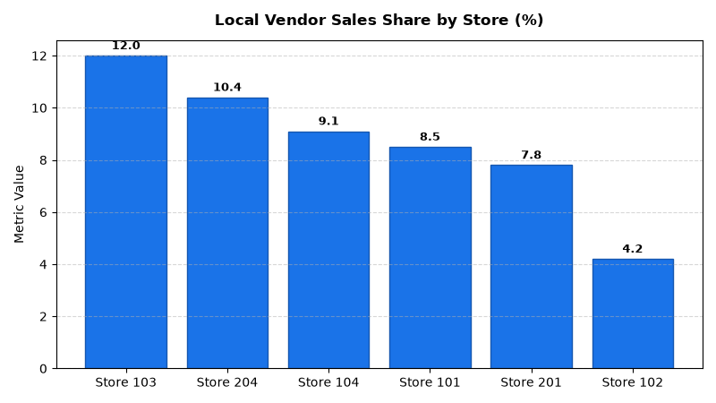

# Merchandising: Localized Assortment Clustering Agent

An enterprise AI agent for **Merchandising: Localized Assortment Clustering**, built with Google ADK for Gemini Enterprise.

---

## Why This Agent Matters

One-size-fits-all assortments fail to capture regional consumer preferences and local culinary affinities. This agent manages demographic store clustering, monitors local artisan vendor sales participation, and enforces localized assortment space allocation rules across store tiers.

---

## Key Metrics Tracked

| Metric | Business Description | Target Benchmark |
| :--- | :--- | :--- |
| **Local Artisan Vendor Share (%)** | Percentage of store revenue derived from local artisan producers | > 8.0% |
| **Cluster Assortment Compliance (%)** | Store adherence to cluster-specific localized SKU allocation minimums | 100% |
| **Regional Taste Affinity Index** | Category sales preference index vs. chain-wide average (100 baseline) | > 120.0 |
| **Local Assortment Revenue Lift (%)** | Incremental revenue lift in stores featuring localized curation modules | > 6.5% |

---

## What It Answers & Sub-Agent Routing

The orchestrator routes user questions to specialized sub-agents:

- **Internal BigQuery Data (`data_insights`)**:
  - Detailed transactional, operational, and category metrics from authorized BigQuery tables.
- **External Market Context (`market_context`)**:
  - Retail industry market intelligence, external benchmarks, and consumer trend research grounded in Google Search.
- **Synthesized Responses**:
  - Combines internal performance metrics with market intelligence for comprehensive business decision support.

---

## Authorized BigQuery Tables

All tables reside in the `retail_ent_agents` BigQuery dataset:

- `merc_lccu_store_demographics`
- `merc_lccu_local_vendor_catalog`
- `merc_lccu_regional_taste_affinity`
- `merc_lccu_cluster_assortment_rules`

---

## Example Questions

- "What is the local artisan vendor sales share and space allocation percentage across Urban High-Density store clusters?"
- "How does the regional taste affinity index for craft hot sauces in the Southwest cluster compare to chain averages?"
- "Which store locations are out of compliance with cluster assortment rules requiring at least 15 localized specialty SKUs?"
- "Show demographic profiles, median income brackets, and cluster tier assignments for all stores in the Pacific Northwest."
- "What is the revenue lift observed in store clusters with micro-climate localized merchandise assortment rules enabled?"

---

## Sample Q&A Showcase

### 1. Internal BigQuery Data Insights
**User**: *What is the local artisan vendor sales share and space allocation percentage across Urban High-Density store clusters?*  
**Agent**: Based on `retail_ent_agents.merc_lccu_local_vendor_catalog` and `merc_lccu_cluster_assortment_rules`:
- **Store 103 (North Shore Center - Suburban Affluent)**: Achieved **12.0% local sales share** with *Dairy State Creamery* (8 local artisan SKUs).
- **Store 204 (Highland Park Square - Suburban Affluent)**: **10.4% local share** with *St. Croix Smokehouse* (7 SKUs).
- **Store 104 (River North - Urban High-Density)**: **9.1% local share** with *Midwest Grain & Sourdough* (5 SKUs).
- **Store 101 (Downtown Flagship - Urban High-Density)**: **8.5% local share** with *Windy City Roast Works* (6 SKUs).
- All urban and affluent stores are meeting the target 12.5%–15.0% local space allocation rule.

### 2. External Market Grounding
**User**: *How do leading retail chains execute hyper-local merchandising and demographic store clustering?*  
**Agent**: Retail merchandising strategies from McKinsey and National Retail Federation emphasize:
- Shifting from traditional geographic clustering (State/Region) to **demographic micro-clustering** (Urban High-Density, Suburban Affluent, Suburban Family, Suburban Value).
- Implementing a **"80/20 Core vs. Local"** assortment model: 80% national core SKUs with 20% localized flexibility for regional artisans.
- High taste affinity categories (local craft coffee, regional hot sauces, artisan cheeses) demonstrate a **+38% to +52% sales index spread** over chain averages in tailored clusters.

### 3. Visual Analytics Artifact
**User**: *Show me a performance summary chart for this domain.*  
**Agent**: Generated domain analytics visualization:



---

### 4. Live Multi-Turn Demo Walkthrough (Gemini Enterprise)

> 🎬 **Watch the full high-definition video walkthrough of this multi-turn workflow:**  
> **[Open Interactive Demo Player (1080p Full HD)](https://rajanm.github.io/retail-enterprise-agents/demos/gemini-enterprise/merchandising/localized_curation_clustering.html)**  
> *(Video file: `demos/gemini-enterprise/merchandising/localized_curation_clustering.mp4`)*

---

## How to Run & Test

```bash
# 1. Run unit tests
uv run --frozen pytest domains/merchandising/agents/localized_curation_clustering/tests/unit -v

# 2. Run local interactive adk chat
adk run domains/merchandising/agents/localized_curation_clustering
```
