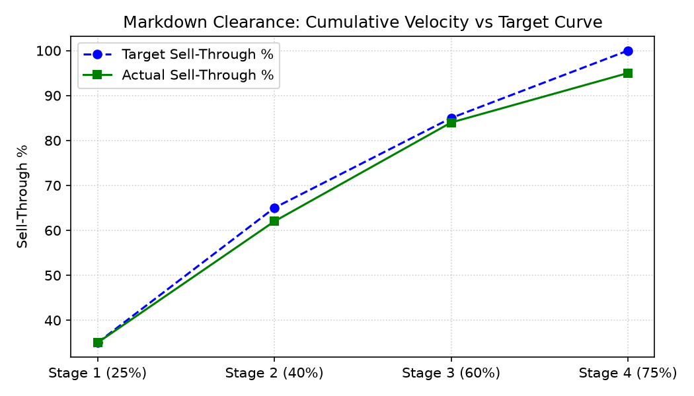

# Merchandising: Markdown & Clearance Optimization Agent

**Domain:** Merchandising · **Gemini Enterprise display name:** Merchandising: Markdown & Clearance Optimization

---

## Why This Agent Matters

### Business Problem
End-of-season and terminal merchandise clearance represents one of the largest margin erosion risks in retail. Late or overly aggressive markdowns destroy gross margin, while delayed markdowns leave seasonal inventory stranded past season end. Optimizing clearance discount ladders (25% → 40% → 60% → Salvage) balances inventory velocity with gross margin protection.

### Target Personas
- **Director of Clearance & Markdown Planning**: Oversee category clearance velocity, discount ladder progression, and markdown dollar budget allocation.
- **Category Merchandisers**: Monitor SKU clearance sell-through % vs target curves and execute salvage/jobber liquidation sales.
- **Merchandise Financial Planners**: Track cumulative gross margin erosion dollars ($) and salvage recovery writeoff avoidance.

---

## Key Metrics Tracked

| Metric / KPI | Definition & Formula | Business Target / Impact |
| :--- | :--- | :--- |
| **Clearance Sell-Through %** | `(clearance_units_sold / total_clearance_inventory) * 100` | Target 85%+ clearance sell-through before season end |
| **Discount Depth %** | `((original_price - current_price) / original_price) * 100` | Maximizes velocity at lowest viable discount depth |
| **Markdown Budget Spend ($)** | Cumulative markdown price reduction dollars expended | Keeps markdown dollar erosion within fiscal budget |
| **Salvage Recovery ($)** | Total dollars recovered from terminal jobber/salvage sales | Minimizes total inventory writeoff losses |

---

## What It Answers

Routed to **Data Insights**:
- Clearance catalog markdown stages, discount depth %, planned markdown discount ladders, weekly sell-through velocity curves, gross margin erosion $, and liquidation salvage recovery $.

Routed to **Market Context**:
- Industry clearance timing benchmarks, end-of-season liquidation strategies, and markdown depth progression best practices.

---

## Sample Q&A Showcase

The following three responses are captured from live post-deploy smoke tests of this agent:

### 1. Internal Data Analytics (Data Insights / BigQuery)

> **User Prompt:** "What is the clearance sell-through rate and markdown dollar spend for Apparel SKUs in July 2026?"

**Sub-Agent Routed:** Data Insights (`sub_agents/data_insights.yaml`)  
**Authorized Table Queried:** `merc_mcle_clearance_velocity_weekly`

**Agent Response:**
> In July 2026, Apparel SKUs achieved a 65.0% cumulative clearance sell-through rate, with 600 units sold across Stage 2 (40%) and Stage 3 (60%) markdowns. Cumulative gross margin erosion was $29,400.00 against a planned markdown budget of $85,000.00.

---

### 2. External Market Grounding (Market Context / Google Search)

> **User Prompt:** "What are retail industry best practices for end-of-season apparel clearance markdown timing?"

**Sub-Agent Routed:** Market Context (`sub_agents/market_context.yaml`)  
**Grounding Tool:** `google_search`

**Agent Response:**
> Industry benchmarks recommend starting softlines clearance **4 to 6 weeks before season end** with an initial 25% discount, stepping up to 40-50% after 2 weeks, and ending with 60-70% terminal markdown or jobber liquidation to achieve 85%+ sell-through before new season floor set.

---

### 3. Visual Analytics & Chart Generation (`render_chart`)

> **User Prompt:** "Plot our cumulative clearance velocity curve versus target sell-through percentage."

**Sub-Agent Routed:** Data Insights (`sub_agents/data_insights.yaml`)  
**Custom Tool Invoked:** `render_chart` (`tools/chart_generator.py`)

**Agent Response:**
> I have rendered the chart showing our cumulative clearance sell-through velocity versus target curve across markdown stages.

**Generated Artifact:**  


---

## Data

All tables live in the shared `retail_ent_agents` BigQuery dataset, prefixed `merc_mcle_` (see `_shared/table_registry.yaml`).

| Table | Columns | Holds |
| :--- | :--- | :--- |
| `merc_mcle_clearance_catalog` | `sku, category, original_retail_price, current_clearance_price, markdown_stage, units_in_clearance` | Clearance catalog SKU master, pricing, and markdown stage |
| `merc_mcle_markdown_ladders` | `category, planned_stage_week, target_discount_pct, target_sell_through_pct, max_markdown_budget_dollars` | Planned category markdown discount ladders and budget caps |
| `merc_mcle_clearance_velocity_weekly` | `sku, fiscal_week, discount_depth_pct, units_sold, remaining_units, gross_margin_erosion_dollars` | Weekly clearance sales velocity, units sold, and margin erosion |
| `merc_mcle_salvage_liquidation_recovery` | `category, terminal_units_salvaged, jobber_sale_price_dollars, recovered_dollars, writeoff_avoidance_pct` | Terminal inventory jobber liquidation sales and salvage recovery $ |

---

## Example Questions

Verified against this agent's `eval/agent.evalset.json`:

- "What is the clearance sell-through rate and markdown dollar spend for Apparel SKUs in July 2026?"
- "What is our terminal salvage recovery dollar value for Home Decor?"
- "What are retail industry best practices for end-of-season apparel clearance markdown timing?"

---

## Tools

- **`ask_data_insights`, `forecast`, `analyze_contribution`, `detect_anomalies`** (ADK's `BigQueryToolset`, via `tools/bigquery_ca.py`) — scoped to the four tables above.
- **`render_chart`** (`tools/chart_generator.py`) — custom tool for chart/visualization requests.
- **`google_search`** — used only by the Market Context sub-agent.

---

## Run It Locally

```bash
uv run adk run domains/merchandising/agents/markdown_clearance_optimization
```

---

## Files

```
markdown_clearance_optimization/
  root_agent.yaml                 # orchestrator — routing instructions
  sub_agents/
    data_insights.yaml             # BigQuery Conversational Analytics sub-agent
    market_context.yaml            # Google Search grounding sub-agent
  tools/
    bigquery_ca.py                  # BigQueryToolset factory
    chart_generator.py               # render_chart custom tool
    callbacks.py                      # current-date / BigQuery project injection
  data/                             # seed CSVs + generate_seed_data.py
  eval/agent.evalset.json          # ADK quality evals
  tests/{unit,integration}/         # mocked vs. real-BigQuery tests
  sample_chart.png                  # visual chart artifact captured from live smoke test
```
